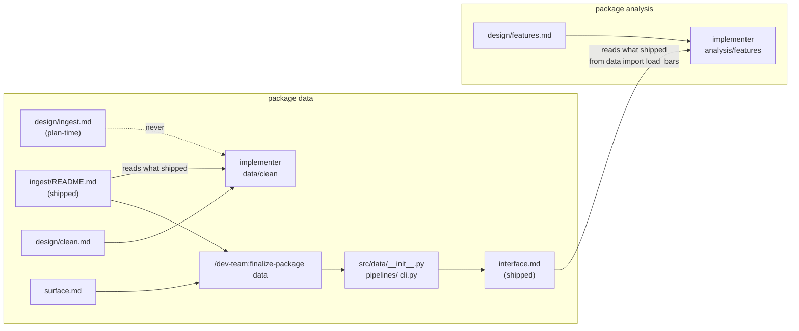
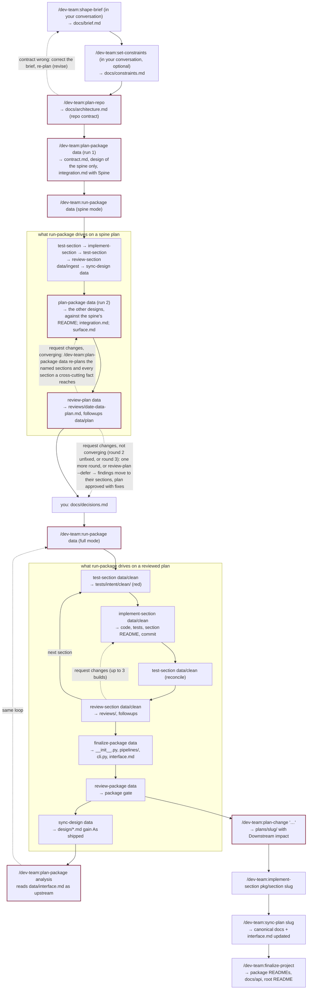
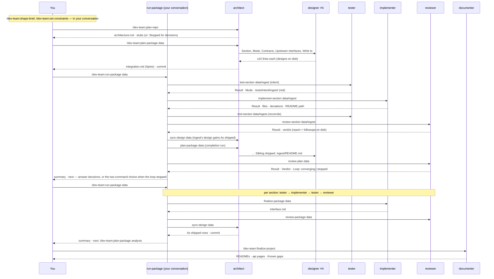

# The flow

The interactive version of this page (click a skill, see what it reads and writes) is the
artifact titled **dev_team v4 Flow** in your Claude gallery — a name, not a version of this
plugin; see `CHANGELOG.md`. This page is the same content as
static diagrams so it lives with the bundle.

## Where truth comes from

An implementer builds from its own design but consumes other work from what actually shipped.
Inside a package a dependency is a section, so it reads that section's README. Across packages
a dependency is a package, so it reads that package's `interface.md` and imports only from the
package's top level. Plan-time documents about a provider lose to the shipped document every
time.

## The week-by-week loop

Nodes with the dark-red border can **stop**. The architect stops with questions in
`docs/decisions.md`, `review-plan` with plan CRITICALs, and `run-package` on any gate or
`blocked` return. Re-running the same command continues. Every node inside the two boxes is
also a command you can type by hand, `/dev-team:` prefixed, and does exactly the same thing.
A package of one or two sections, or `--all`, skips the spine: one `plan-package` run designs
everything, then `/dev-team:review-plan`, decisions, and `run-package` in full mode.

## Hand-offs

Every arrow into an agent is one run, and every run ends in one commit with a
`Dev-Team-Run:` trailer.

## Order of authority

**For what a section builds** (tie-break, highest first): `docs/constraints.md` (for the checks
it names only) → `decisions.md` (decided, in scope) → the integration doc for this run →
`contract-delta.md` (change work) → the package contract → the repo contract → the section's
design, read together with its **As shipped** section when one exists. The implementer builds
by this list and the reviewer carries it verbatim. A design line that a higher document
overrides is not a spec gap. A deviation recorded in the section README is at most a WARNING
unless it breaks a contract, a decided `D<n>`, a shipped interface or an intent test.

**For what a section consumes**: the provider's shipped document — a sibling's README, an
upstream package's `interface.md` — wins over every plan-time document about that provider.

## The `docs/` map

| Path | Kind | Written by | Read by |
|---|---|---|---|
| `docs/brief.md` | canonical | shape-brief, you; plan-repo appends | plan-repo, map-project, curator; plan-package (only its `covers` rows) |
| `docs/history/` | archive | plan-repo, shape-brief | plan-repo (`brief-contracted.md`) |
| `docs/legacy/inventory.md` | survey | curator (extract-legacy); you mark `keep` | curator, researchers in extract mode; probe-source (the `Extracted skill:` row) |
| `docs/sources/<source>.md` + `.sample.json`/`.probe.py` (api) or `.stats.json`/`.profile.py` (dataset) | **probed** — the external system as it answered, or the dataset as it reads, on the date probed. Repo-wide: one document per source, however many packages consume it | researcher in probe mode, spawned by plan-package, by plan-repo for a dataset, or run as probe-source | designers, implementer, reviewer |
| `docs/constraints.md` | canonical — the quality bar: Floor, Enforced, Guarded rows, each a command | set-constraints, you | reviewer (all modes, axis 0), implementer, tester, `status.py --gate` |
| `docs/architecture.md` | **repo contract** | plan-repo; map-project, sync-plan | everyone |
| `docs/decisions.md` | ledger | architect stubs · you · implementer `Applied:` | every agent |
| `docs/followups.md` | queue; reserved targets `<pkg>/surface`, `<pkg>/plan` and `<pkg>/<section>/intent`; entries ending `— tester <date>` are failing intent tests | implementer, reviewer, review-plan, tester (reconcile), sync-plan | implementer (step 6; blocks on an open `<pkg>/plan`, skips `/intent`), tester (reconcile, clears `/intent`), architect on a re-plan, documenter, `status.py` |
| `docs/assessment.md` | survey | map-project, plan-repo (extend, revise) | re-runs |
| `docs/api/<pkg>.md` | site | finalize-package; finalize-project fills gaps | mkdocs |
| `docs/packages/<pkg>/assessment.md` | survey | plan-package | designers |
| `docs/packages/<pkg>/contract.md` | **package contract** | plan-package; sync-plan | designers, implementer, reviewer, plan-change (Consumes) |
| `docs/packages/<pkg>/design/<section>.md` | plan-time; **As shipped** sections appended once built | designer; sync-plan; sync-design (append-only) | implementer, reviewer, plan-change (the latest As shipped) |
| `docs/packages/<pkg>/integration.md` | plan-time; item 0 **Spine** (`Status: spine only` or `complete`) | architect; sync-plan | plan-package run 2, run-package, implementer, reviewer, finalize-package, `status.py` |
| `docs/packages/<pkg>/surface.md` | plan-time | architect at unify; sync-plan; sync-design (As shipped) | finalize-package, review-package, implementer |
| `docs/packages/<pkg>/interface.md` | **shipped** | finalize-package; sync-plan | plan-package and every consumer |
| `packages/<pkg>/tests/intent/<section>/` | shipped tests — written from the design, never from the code; a finding here is addressed to `<pkg>/<section>/intent` | tester only | implementer (runs, never edits), reviewer, `status.py` intent column |
| `packages/<pkg>/src/<pkg>/<section>/README.md` | **shipped** | implementer | dependents, finalize-package, reviewer, documenter |
| `docs/reviews/<date>-<pkg>-<section>.md` | report; second line `Commit: <sha>` | review-section | implementer; the next review (diffs from `Commit:`); `status.py` and finalize-package (reviewed = `Commit:` is the newest commit touching the section) |
| `docs/reviews/<date>-<pkg>-package.md` | report | review-package | finalize-package on a re-run |
| `docs/reviews/<date>-<pkg>-plan.md` | report | review-plan | plan-package on a re-plan; `status.py --plan-gate` |
| `docs/plans/<slug>/…` | proposal | plan-change, designers | implementer, sync-plan |
| `docs/plans/synced.md` | ledger | sync-plan | sync-plan, finalize-project |
