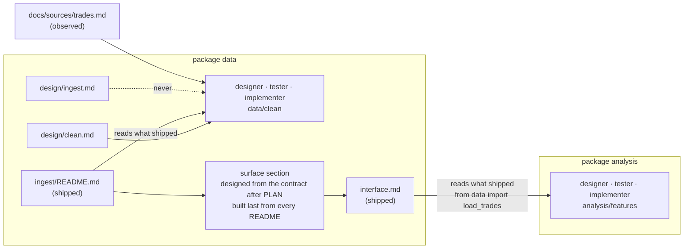
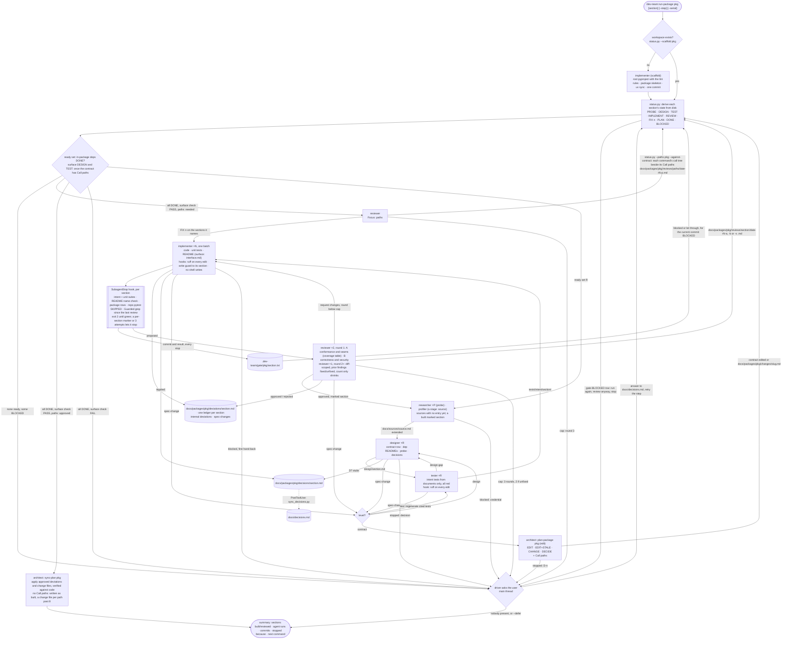
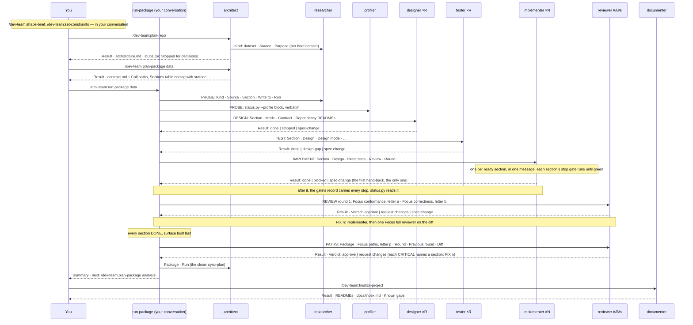

# The flow

How the pieces hand work to each other: where each agent gets its facts, the loop the driver
runs, who talks to whom, which document wins a disagreement, and what lives under `docs/`.

## Where truth comes from

A section is built from its own design but consumes other work from what actually shipped.
Three rules, each the same rule: the document written from the thing beats the document
written about it before it existed.

- **A README over a design.** Inside a package a dependency is a section; a DONE section has a
  README written by the implementer from the code, and the designer, tester and implementer of
  every section that depends on it read that README, never the dependency's design. The
  `surface` section is designed and tested before its dependencies are DONE, right after PLAN:
  its designer and tester read the contract's **Section interfaces** and **Call paths** in
  place of the READMEs that do not exist yet, and its implementer, which runs last, reads the
  READMEs; where one differs from the contract, the README wins and the difference is a
  deviation.
- **`interface.md` over a contract.** Across packages a dependency is a package; once its
  `surface` section is DONE it has an `interface.md`, and a consumer imports only the names it
  lists, only from the package's top level. Before then, the upstream `contract.md` is read and
  every consumed name is marked provisional.
- **A probe doc over an assumption.** An external source is what `docs/sources/<source>.md`
  observed on the date probed, not what the vendor documents or the designer expected.

```mermaid
flowchart LR
  subgraph data["package data"]
    direction LR
    ingD["design/ingest.md"]
    ingR["ingest/README.md<br/>(shipped)"]
    clnD["design/clean.md"]
    cln["designer · tester · implementer<br/>data/clean"]
    surf["surface section<br/>designed from the contract after PLAN<br/>built last from every README"]
    iface["interface.md<br/>(shipped)"]
    clnD --> cln
    ingR -- "reads what shipped" --> cln
    ingD -. "never" .-> cln
    ingR --> surf --> iface
  end
  src["docs/sources/trades.md<br/>(observed)"] --> cln
  subgraph analysis["package analysis"]
    feat["designer · tester · implementer<br/>analysis/features"]
  end
  iface -- "reads what shipped<br/>from data import load_trades" --> feat
```

## The loop

`/dev-team:run-package <pkg>` first builds the package's workspace when it has none, so every
test is written and run inside it under the repo's own lint rules; then it derives every
section's state from disk, runs the ready set, and loops until every section is DONE; then,
once the package's surface check passes, it sends one reviewer (`Focus: paths`) down each
command, comparing the built frames to the contract's **Call paths**, re-opens as FIX n every section that review names, and closes the
package once a paths report approves. Every ready row's step goes
out in one message — designers, testers, implementers and reviewers together, the architect
alone at PLAN — so the chart's stages run side by side for different sections;
`--serial` runs one kind of step per batch and one implementer at a time.

```mermaid
flowchart TB
  CMD(["/dev-team:run-package pkg [section] [--step] [--serial]"]) --> SCAF{"workspace exists?<br/>status.py --scaffold pkg"}
  SCAF -->|"no"| SCAFFOLD["implementer (scaffold)<br/>root pyproject with the lint rules · package skeleton · uv sync · one commit"]
  SCAFFOLD --> STATE
  SCAF -->|"yes"| STATE["status.py: derive each section's state from disk<br/>PROBE · DESIGN · TEST · IMPLEMENT · REVIEW · FIX n · PLAN · DONE · BLOCKED"]
  STATE --> READY{"ready set: in-package deps DONE?<br/>surface DESIGN and TEST: once the contract has Call paths"}
  READY -->|"none ready, some BLOCKED"| ASK
  READY -->|"all DONE, surface check PASS, paths: needed"| PATHS["reviewer<br/>Focus: paths"]
  PATHS -->|"status.py --paths pkg --against-contract: each command's call tree beside its Call paths<br/>docs/packages/pkg/reviews/paths/date-rN-p.md"| STATE
  PATHS -->|"FIX n on the sections it names"| IMPL
  PATHS -->|"cap: round 3"| ASK
  READY -->|"all DONE, surface check PASS, paths: approved"| SYNC["architect: sync-plan pkg<br/>apply approved deviations and change files, verified against code<br/>no Call paths: written as built, a change file per path past 8"]
  READY -->|"all DONE, surface check FAIL"| ASK
  READY -->|"ready set R"| PROBE["researcher ×P (probe) · profiler (a stage: source)<br/>sources with no entry yet; a built marked section"]
  PROBE -->|"docs/sources/source.md extended"| DESIGN["designer ×R<br/>contract row · dep READMEs · probe · decisions"]
  DESIGN -->|"design/section.md"| TEST["tester ×R<br/>intent tests from documents only, all red<br/>hook: ruff on every edit"]
  TEST -->|"design-gap"| DESIGN
  TEST -->|"tests/intent/section/"| IMPL["implementer ×N, one batch<br/>code · unit tests · README (surface: interface.md)<br/>hooks: ruff on every edit · write guard to its section · no shell writes"]
  IMPL --> GATE[["SubagentStop hook, per section<br/>intent + unit suites · README name check · package rows · repo pytest SKIPPED · Guarded grep since the last review<br/>exit 2 until green; a per-section marker or 3 attempts lets it stop"]]
  GATE -->|"commit and result, every stop"| REC[(".dev-team/gate/pkg/section.txt")]
  REC -->|"blocked or let through, for the current commit: BLOCKED"| STATE
  GATE --> REVIEW["reviewer ×2, round 1: A conformance and seams (coverage table) · B correctness and security<br/>reviewer ×1, round 2+: diff-scoped, prior findings fixed/unfixed, count only shrinks"]
  REVIEW -->|"docs/packages/pkg/reviews/section/date-rN-a, -b or -s .md"| STATE
  REVIEW -->|"request changes, round below cap"| IMPL
  REVIEW -->|"approved, marked section"| PROBE
  IMPL -->|"proposed"| DEV[("docs/packages/pkg/deviations/section.md · one ledger per section<br/>internal deviations · spec-changes")]
  REVIEW -->|"approved / rejected"| DEV
  DESIGN -->|"D? stubs"| INBOX[("docs/packages/pkg/decisions/section.md")]
  IMPL -->|"Applied:"| INBOX
  INBOX -.->|"PostToolUse: sync_decisions.py"| DEC[("docs/decisions.md")]
  DESIGN -->|"spec-change"| LEVEL
  TEST -->|"spec-change: design"| LEVEL
  IMPL -->|"spec-change"| LEVEL
  REVIEW -->|"spec-change"| LEVEL{"level?"}
  LEVEL -->|"test: regenerate cited tests"| TEST
  LEVEL -->|"design"| DESIGN
  LEVEL -->|"contract"| ARCH["architect: plan-package pkg (edit)<br/>EDIT · EDIT+STALE · CHANGE · DECIDE<br/>+ Call paths"]
  ARCH -->|"contract edited or docs/packages/pkg/changes/slug.md"| STATE
  ARCH -->|"stopped: D-n"| ASK{"driver asks the user<br/>main thread"}
  PROBE -->|"blocked: credential"| ASK
  DESIGN -->|"stopped: decision"| ASK
  IMPL -->|"blocked, first hand-back"| ASK
  STATE -->|"gate-BLOCKED row: run again, review anyway, stop"| ASK
  REVIEW -->|"cap: 3 rounds, 2 if unfixed"| ASK
  ASK -->|"answer to docs/decisions.md, retry the step"| STATE
  ASK -->|"nobody present, or --defer"| SUM(["summary: sections built/reviewed · agent runs · commits · stopped because · next command"])
  SYNC --> SUM
```

The driver branches on each return's first line only. It relays a whole return in two cases:
a tester's `design-gap` goes to the designer, and a `blocked` or `stopped` return is the
question it asks. An implementer hands back once, before its stop gate runs; what happens
after — a retry, a block, a third red attempt — reaches the driver through the gate's record,
which `status.py` reads: a section whose implementer blocked or was let through for its current
commit is BLOCKED, and the driver asks *run the implementer again*, *review anyway* or *stop
here*. When every section is DONE and the surface check fails, it quotes the check's `FAIL`
lines and asks *fixed, retry* or *stop here*; the close waits. When the paths review still
requests changes at round 3, it asks *one more round* or *defer*; the close waits for
`paths: approved`. A free-text answer ends the run
with the Summary. A `spec-change` is never relayed: its entry is on disk in
`docs/packages/<pkg>/deviations/<section>.md`, and the next `status.py` re-opens the step its
level names. Every state
the driver acts on is derived, so a re-run after a crash, a hand edit or a week away behaves
exactly as the uninterrupted run would have.

## Hand-offs

```mermaid
sequenceDiagram
  participant You
  participant Drv as run-package (your conversation)
  participant Arch as architect
  participant Res as researcher
  participant Pro as profiler
  participant Des as designer ×R
  participant Tst as tester ×R
  participant Impl as implementer ×N
  participant Rev as reviewer A/B/s
  participant Doc as documenter
  Note over You: /dev-team:shape-brief, /dev-team:set-constraints — in your conversation
  You->>Arch: /dev-team:plan-repo
  Arch->>Res: Kind: dataset · Source · Purpose (per brief dataset)
  Arch-->>You: Result · architecture.md · stubs (or: Stopped for decisions)
  You->>Arch: /dev-team:plan-package data
  Arch-->>You: Result · contract.md + Call paths, Sections table ending with surface
  You->>Drv: /dev-team:run-package data
  Drv->>Res: PROBE: Kind · Source · Section · Write to · Run
  Drv->>Pro: PROBE: status.py --profile block, verbatim
  Drv->>Des: DESIGN: Section · Mode · Contract · Dependency READMEs · …
  Des-->>Drv: Result: done | stopped | spec-change
  Drv->>Tst: TEST: Section · Design · Design mode · …
  Tst-->>Drv: Result: done | design-gap | spec-change
  Drv->>Impl: IMPLEMENT: Section · Design · Intent tests · Review · Round · …
  Note over Impl: one per ready section, in one message, each section's stop gate runs until green
  Impl-->>Drv: Result: done | blocked | spec-change (the first hand-back, the only one)
  Note over Impl,Drv: after it, the gate's record carries every stop, status.py reads it
  Drv->>Rev: REVIEW round 1: Focus conformance, letter a · Focus correctness, letter b
  Rev-->>Drv: Result · Verdict: approve | request changes | spec-change
  Note over Drv,Rev: FIX n: implementer, then one Focus full reviewer on the diff
  Note over Drv: every section DONE, surface built last
  Drv->>Rev: PATHS: Package · Focus paths, letter p · Round · Previous round · Diff
  Rev-->>Drv: Result · Verdict: approve | request changes (each CRITICAL names a section: FIX n)
  Drv->>Arch: Package · Run (the close: sync-plan)
  Drv-->>You: summary · next: /dev-team:plan-package analysis
  You->>Doc: /dev-team:finalize-project
  Doc-->>You: Result · READMEs · docs/index.md · Known gaps
```

Every arrow into an agent is one run with one block of `Field: value` lines, the agent's own
**Inputs**, and every run ends in one commit with a `Dev-Team-Run:` trailer.

## Order of authority

**For the checks a section must pass**, `docs/constraints.md` alone: its **Floor** and
**Enforced** rows are the stop gate's bar. It binds how every section is verified, never what
it builds.

**For what a section builds**, five documents, highest first — a tie-break order, not a reading
order:

1. `docs/decisions.md` — `decided` entries whose `Scope:` binds the section.
2. An open `docs/packages/<pkg>/changes/<slug>.md` naming the section (change work only) — newer than the
   canonical contracts by construction; for anything it names, it wins.
3. `docs/packages/<pkg>/contract.md` — the package contract.
4. `docs/architecture.md` — the repo contract.
5. The section's design — everything else; an `approved` deviation entry stands in for the
   design clause it names.

The implementer builds by this list and the reviewer carries it verbatim. A design line a
higher document overrides is not a spec gap. When a higher document is itself wrong, that is a
`spec-change`, not a quiet workaround.

**For what a section consumes**, the provider's shipped document — a sibling's README, an
upstream `interface.md`, a probe doc — wins over every plan-time document about that provider.

## The `docs/` map

| File | Written by | Read by | Stale when |
|---|---|---|---|
| `docs/architecture.md` | architect (plan-repo, map-repo phase 3, sync-plan) | every agent; `status.py` (Packages table) | the brief differs from `docs/history/brief-contracted.md`; a repo-level change file is open |
| `docs/packages/<pkg>/contract.md` | architect (plan-package, map-repo phase 2, sync-plan) | `status.py` (Sections table, Call paths), designer, tester, implementer, reviewer, documenter | `docs/architecture.md` changed after it; an open `spec-change:contract` or change file names it |
| `docs/packages/<pkg>/design/<section>.md` | designer | tester, implementer, reviewer A, `status.py` | its contract row changed; a cited probe doc is newer; an open change file or `spec-change:design` names it |
| `docs/sources/<source>.md` (+ sample or stats, probe or profile script) | researcher; the shared body only grows, and a line is rewritten only when the observation changed | designer, implementer, reviewer, architect, `status.py` | a new consuming section has no entry yet (it needs PROBE); for a consumer's design, when a line the design was written against is gone or reworded (added lines re-open nothing) |
| `docs/sources/<token>.md` (+ `.profile.py`, `.sample.json`), the data profile of a `stage:` source | profiler; append-only once round 0 closes | designer, tester, implementer, reviewers, `status.py`, later profiler rounds | the section's code is newer than the newest round line's commit; never because a dependency's code changed (re-profile by hand with `--step PROBE`) |
| `tests/intent/<section>/` | tester | implementer, reviewer, the stop gate, `status.py` | the design is newer than the tree |
| section `README.md`; the `surface` section's is `docs/packages/<pkg>/interface.md` | implementer; `pair` at wrap-up | dependents' designer, tester and implementer, reviewer, documenter, architect, `status.py` | the code is newer than it |
| `docs/packages/<pkg>/reviews/<section>/<date>-r<n>-<a, b or s>.md` (2.0: `docs/reviews/…`, still read) | reviewer | `status.py`, the fix-round implementer, the next reviewer | the code is newer than its `Commit:` |
| `docs/packages/<pkg>/reviews/paths/<date>-r<n>-p.md` | reviewer (`Focus: paths`) | `status.py`, the FIX implementer, the next paths review | a section's code changed after its `Commit:` |
| `docs/packages/<pkg>/deviations/<section>.md` (one per section; the 2.0 `docs/deviations/…` still read) | implementer, designer, tester, reviewer, architect; `pair` at wrap-up | reviewer, tester, architect, `status.py`, the stop gate | never; an entry speaks while its `Status:` is `open` |
| `docs/packages/<pkg>/changes/<slug>.md` (one per affected package; the 2.0 `docs/changes/…` still read) | architect (a CHANGE outcome) | `status.py`, designer (delta), implementer, reviewer, architect (sync-plan) | its sections are DONE and `sync-plan` has not run |
| `docs/decisions.md` | `sync_decisions.py` from the inboxes; architect (stubs); you, the driver or `pair` (`Decision:`, `Status:`) | every agent; `status.py`; documenter | never; retired by `superseded` |
| `docs/packages/<pkg>/decisions/<section>.md` (the inbox) | designer (`D?` stubs), implementer (`Applied:`) | `sync_decisions.py`; `status.py --run-gate` | an entry not yet in `docs/decisions.md` (`sync_decisions.py --all` repairs) |
| `docs/constraints.md` | `set-constraints`, you | the stop gate, `status.py --run-gate`, CI, reviewer (Measured, Exceptions), tester (coverage) | you change the bar |
| `docs/followups.md` | reviewer (out-of-diff WARNINGs, `ELSEWHERE` lines, defer), architect (map-repo defects) | the fix-round implementer (entries for its section), documenter, you | never counted, never a gate |
| `docs/history/<date>-<name>.md` | architect, before every contract edit | you | never |
| `docs/index.md`, `packages/*/README.md`, root `README.md` | documenter | you | a shipped document changed after it |
| `.dev-team/gate/<pkg>/<section>.txt` | the stop gate, on every implementer stop; `gate_on_stop.py --report` (`pair` at wrap-up) | `status.py` (holds a blocked or let-through section BLOCKED), the reviewer (its evidence), the driver (quotes it when it asks about a gate-BLOCKED row) | its `commit:` is not the section's current commit, or it has none (written before 2.4) |
| `.dev-team/stop/<pkg>/<section>` | implementer (`blocked` or `spec-change`) | the stop gate, for that section only | deleted by the gate |
