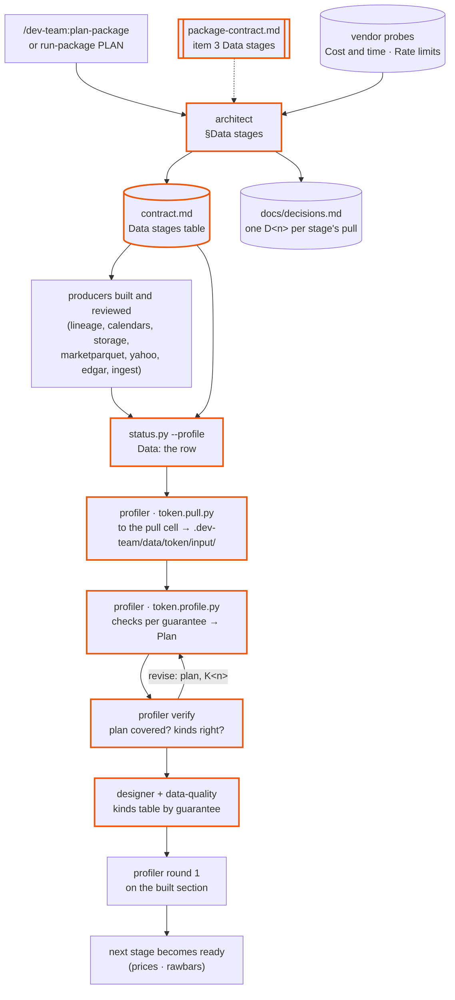

# dev-team 2.11-data-stages — design

Approved 2026-10-08, from the discussion of the ca48b249 profiler hand-off
(`evals/workspace/audit/ca48b249/profiler-handoff.md`). Mode: change. Branch
`dev-team-data-stages`, done in one chat with no phase notes: the files table below is the
whole change, and this note is its record. Line numbers cite `main` at `29a66fa` (dev-team
2.10.0).

## The idea

After 2.11 the cleaning of a data package is planned before it is profiled. The architect
writes, at PLAN, a **Data stages** table in the package contract: one row per stage, in the
order the stages are profiled and cleaned, the first row the population every later stage is
judged against. Each row says what question the stage answers, what the data is and which
sections produce it, which section cleans it, what clean means as numbered guarantees, what
standards it is judged against, and how much to pull — whole or a sample, over what window,
what that scope cannot judge, and what it costs at the vendor's documented rate. The profiler
starts from that row: every check it writes serves one of the row's guarantees, and the
profile's new **Plan** heading says which, so a reader of the profile sees what each check is
for and which guarantee a kind threatens. The verify run rejects a plan that leaves a
guarantee untested the way it rejects a kind whose check is wrong.

## What was wrong

2.7 defined the profiler as a row-sorter — checks, kinds, treatments — and gave the contract
one **Package conventions** line per stage to carry everything about it. In the `quant`
repo's `data` package (session ca48b249, dev-team 2.9.0) that produced a correct profile
nobody could read as a plan:

- The contract said `stage:rawmeta` in identity's `source` cell and one conventions line
  naming the Yahoo and EDGAR payloads and a cap of 500 instruments. Nothing said identity is
  the cleaner, what it guarantees, or what order the five stages run in; the order existed
  only implicitly in the sections' `depends on`.
- The profile's **Checks** table had 24 rows, each a rule and what it judges against, with no
  grouping into goals: that C1, C2, C17 and C21 ask "is this line still listed", C3–C5 "do
  futures roots collide with tickers", C9, C11 and C20 "is the spelling the same across
  providers" had to be inferred.
- The first thing the cleaning should settle — which (symbol, asset type) pairs in the vendor
  files are instruments — appeared as a Provenance gap line ("identity is not built, so
  registered instruments are stood in for by vendor-file symbols"), not as a stage.
- The pull was 500 of about 12,000 instruments and three vendor sessions, fixed by a cap the
  architect stubbed and followed open (D3). Three sessions cannot show a delisting, which is
  exactly why the verify run rejected K2. "All the data as queries" (2.7's decision) became a
  4% sample by construction, and no document said what that sample could not judge.
- identity's `depends on` did not include `marketparquet`, yet the population came from the
  vendor files and the profile called the marketparquet clients to get them.
- The architect's own file had no words about stages (2.7's zero-line budget for existing
  agents), so the one instruction it had was the template paragraph, which it half-followed:
  the `judged against` clause and the guarantee clause were added after the contract was
  written, and nothing enforced either — the run gate checked only an empty `depends on`.

## The flow after 2.11

1. **PLAN.** The architect writes **Data stages** before **Section interfaces**: a cleaning
   section's signatures follow from what clean means. For a data package the rows are the
   population, then metadata, bars, facts, and the audit stages, in the order the cleaning
   sections' `depends on` gives. Each row's `pull` cell is costed from the vendor probes'
   **Cost and time of a full pull** and **Rate limits and quotas**, and asked through one
   `D<n>` per stage with an assumption. The run gate fails a marked row with no plan row, an
   empty cell, a `cleaned by` that is another section, or a producer the cleaning section
   does not depend on — which is how the identity → marketparquet edge gets added.
2. **Build the producers.** Unchanged: the sections that download and store are designed,
   tested, built and reviewed as today.
3. **PROBE.** Once every section in the cleaning section's `depends on` is DONE, `status.py
   --profile` prints the profiler's block with `Data:` the plan row as one line. The profiler
   reads the row, pulls to its `pull` cell with `docs/sources/<token>.pull.py` (the shipped
   entry points, into `.dev-team/data/<token>/input/`, laid out as the sections lay out
   `var/raw/`, gitignored, surviving branch switches), writes `<token>.profile.py` with one
   check group per guarantee, and writes the profile with **Plan** first after
   **Provenance**. The verify run reads **Plan** against the row before it judges a kind: a
   guarantee with neither checks nor a `not checkable` line, or a pull short of the cell with
   no reason, is `revise: plan`.
4. **Decide, design, build.** As today; the design's kinds table is grouped by guarantee and
   its **Purpose and scope** states the stage's question and guarantees.
5. **Round 1** on the built section, over the same stored input. `clean` closes it.
6. **The next stage** becomes ready once the cleaning section is DONE, and follows the same
   path, so the stages run in the plan's order.

Nothing is stored anywhere new: the profiler never writes `var/raw/` or the working file, and
the real build pulls again into `var/raw/`. Three files are committed per stage — the profile,
the checks program, the pull program — plus the example rows under 200 KB.

## Files

| Path | Change |
|---|---|
| `skills/planning-templates/references/package-contract.md` | item 3 **Data stages**: the table, its eight cells, the run-gate rule, the older conventions line still read; items 3–9 renumbered 4–10; the `source` paragraph points at the row and drops the guarantee clause from `responsibility` |
| `agents/architect.md` | `## Data stages` after `## Call paths`: when and how the table is written, the population row, the pull costed from the probes, one `D<n>` per stage, the missing heading as a change-list item; the interview rule and **Edits** name it; `item 5` → `item 6` for Call paths |
| `skills/plan-package/SKILL.md` | step 4 WRITE names **Data stages**; the change list gains the missing heading |
| `skills/planning-templates/references/data-profile.md` | item 3 **Plan**; items renumbered; **Checks** rows and **Quirks** lines grouped by guarantee; `plan` as a `revise:` name; `<token>.pull.py` |
| `agents/profiler.md` | the goal paragraph; `.pull.py` among the written files and the run commands; `Data:` is the row; profile steps 1–3, 5, 6 read the row, pull to its cell, group checks by guarantee and write **Plan**; verify step 1 judges the plan; thirteen headings |
| `skills/data-quality/SKILL.md` | **Plan** under Reading a profile; the kinds table grouped by guarantee |
| `skills/status/scripts/status.py` | `_stage_row`, `_cell`, `STAGE_CELLS`; `_stage_line` reads the row first, the conventions line second; `_stage_plan_fails` in the run gate; docstring |
| `skills/status/SKILL.md` | the `--run-gate` reasons and the `Data:` field |
| `contracts.yml` | **Data stages** and **Package conventions** cited by the architect, profiler, profile template and `status.py`; **Plan** by the profiler and `data-quality` |
| `evals/fixtures/state-cases/build.py`, five new cases, `profile-block-round0`, `README.md` | `stage: true` writes the table; `conventions`, `no-plan`, `empty-cell`, `producer`, `wrong-cleaner` variants |
| `README.md`, `site/flow.md`, `site/workflows/add-package.md`, `site/workflows/new-repo.md` | the plan described where the data loop is |

No hook changes: `docs/sources/**` already covers `<token>.pull.py` for the profiler, and the
size guard reads `.sample.json` only.

## Pull planning guidance, from the `quant` probes

What the architect writes into the `pull` cell comes from the probes' two headings. For the
`data` package of `quant` (probes at `docs/sources/{marketparquet,yahooquery,edgar}.md`):

| Vendor | Limit | Full pull, extrapolated by the probe |
|---|---|---|
| marketparquet paid | 600 req/min per IP, burst 100; downloads unlimited | ≈18,300 files, 1.7 GB; 74 manifest calls plus storage GETs, ≈6 min with 8 workers |
| marketparquet free | 60 req/min per key | ≈750 files, 180 MB |
| Yahoo quoteSummary | none published; 150 requests in 19 s with no 429; sustained volume unverified | ≈10,000 requests, order of 5–10 min |
| EDGAR | 10 req/s per user, 10-minute lockout | tickers 2 requests; submissions ≈8,000 requests, 17 min; Company Facts ≈8,000 requests, 17 min, ≈10 GB decoded |

A draft of the table that contract would carry, as the worked example this note was designed
against (the user decides each `pull` through its `D<n>`):

| stage | question | data | cleaned by | clean means | judged against | pull | decision |
|---|---|---|---|---|---|---|---|
| `stage:population` | which (symbol, asset type) pairs in the vendor files are instruments, and which are one instrument under two spellings? | the symbol lists of the vendor daily files; produced by `marketparquet`; lands at `var/raw/marketparquet/` | `identity` | 1. every pair is one instrument with one ID 2. a `-DELISTED` line and its base are one instrument 3. a symbol is never a key without its asset type | brief §4.1; `price_cleaning`; `marketparquet.md` | whole: one file per month for two years plus the last 30 sessions, all three asset types (≈160 files; downloads unlimited); three sessions cannot show a delisting | D<n> |
| `stage:rawmeta` | which issuer, type, sector and listing status does each instrument have? | Yahoo profiles, EDGAR tickers, submissions and SIC; produced by `yahoo`, `edgar`; lands at `var/raw/yahoo/profiles/`, `var/raw/edgar/` | `identity` | 1. no two unrelated securities share an ID 2. a failed lookup never removes a delisted instrument 3. type and sector are set or flagged, never guessed | brief §4.1; `sector_mapping`; `yahooquery.md`, `edgar.md` | whole population: ≈12,000 Yahoo requests (no quota, ≈10 min, sustained throttling unverified), tickers and SIC 3 requests, ≈8,000 submissions (17 min at 8 req/s) | D<n> |
| `stage:rawbars` | which bars are real trading sessions of a known instrument? | vendor daily files and Yahoo backup bars; produced by `marketparquet`, `yahoo`, `identity`; lands at `var/raw/marketparquet/`, `var/raw/yahoo/bars/` | `prices` | … | brief §4.1; `price_cleaning` | all instruments over the same two-year window (≈1,500 files, under 200 MB) | D<n> |
| `stage:rawfacts` | which Company Facts rows are one issuer's statements, in which period and unit? | EDGAR Company Facts; produced by `edgar`, `identity`; lands at `var/raw/edgar/companyfacts/` | `financials` | … | brief §4.2; `edgar.md` | sample 500 issuers, stratified by SIC division and market cap; whole is ≈10 GB decoded | D<n> |
| `stage:bars`, `stage:statements` | … | the working file's tables; produced by `prices`, `technicals` / `financials`, `fundamentals` | `priceaudit` / `finaudit` | … | `data_validation` | whole: no vendor cost | D<n> |

The 2.7 caps — 500 instruments, 120 sessions, 200 issuers under one open D3 — decided the
evidence for every cleaning rule; a plan carries one decision per stage, each saying what its
scope can and cannot judge.

## Decisions taken

| Decision | Chosen | Alternatives | Why |
|---|---|---|---|
| Where the plan lives | a **Data stages** heading in the package contract, item 3 | a separate `docs/packages/<pkg>/data-plan.md`; richer **Package conventions** lines | the contract is what every agent reads and `status.py` parses; the conventions line was already trying to be this and had no room |
| Its shape | one ordered table, eight cells | a `### <token>` block of fields per stage | a table reads as a flow, parses like the Sections table, and `Data:` stays one line |
| Where the goal shows in the profile | a **Plan** heading after **Provenance**, checks and kinds grouped by guarantee | a `question` column in **Checks** only | one place to start reading; the grouping follows from it |
| How the plan is enforced | the run gate (row exists, cells filled, cleaner matches, producers depended on) and the verify run (`revise: plan`) | an instruction only | the ca48b249 contract shows an instruction alone is half-followed |
| The pull as its own program | `docs/sources/<token>.pull.py`, recording `pull.json` | `pull()` inside the profile program | the sample spec becomes a reviewable file, the verify run can read it against the cell, and later rounds never risk re-pulling |
| Older contracts | the conventions line is still read by the gate and the profiler; adding the heading is an EDIT item of the change list | fail the gate | a contract planned under 2.7–2.10 keeps running; its next `plan-package` adds the table |
| The guarantee clause on `responsibility` (2.8) | moved into the row's `clean means` cell; `responsibility` names the stage it cleans | keep both | one place for the guarantee, and a numbered list the checks can cite |
| The architect's file | gains a `## Data stages` section | keep the 2.7 zero-line budget | the budget is why the plan never existed; the template paragraph alone was half-followed |
| Version | 2.11.0, minor | — | a new contract heading, a new profile heading and a new file per stage; nothing breaks a contract with no `stage:` row |

## What must not break

- **A package with no `stage:` row.** No **Data stages** heading is written, `status.py`
  derives the 2.10 states, and the run gate adds no reason.
- **A contract planned under 2.7–2.10.** Its **Package conventions** `stage:` line is read
  for `Data:` and satisfies the gate; `run-gate-stage-conventions-line` pins it.
- **Headings other files parse.** **Quirks**, **Observed schema**, **Sections served** and the
  round-line grammar keep their spelling; `revise:` gains `plan` as a name, which
  `profile_due` passes through unparsed.
- **The profiler's `Inputs` fields.** `Data:` keeps its name, so the `--profile` claim in
  `contracts.yml` holds.

## Non-goals

- Re-planning `quant`'s `data` contract from here: that is `/dev-team:plan-package data` in
  the project repo, which now adds the heading as a change-list item.
- A cross-stage dependency notation: the order is the table's order, which must agree with
  the cleaning sections' `depends on`; nothing new is parsed.
- Changing the researcher's probes or the `dataset` kind.

## Evals

| ID | Kind | Target | Pass bar |
|---|---|---|---|
| 11.1 | mechanical | `status.py` | `python3 evals/fixtures/state-cases/check.py` exits 0, the five new cases and `profile-block-round0` included |
| 11.2 | mechanical | `contracts.yml` | `check-contracts` prints no FAIL |
| 11.3 | mechanical | the site | `build-site` renders the new heading and note |
| 11.4 | behavioral | `architect`, `profiler` | not run in this chat: the architect and profiler eval sets need re-authoring for the table and **Plan** before a comparison means anything; logged as open in the eval log |
