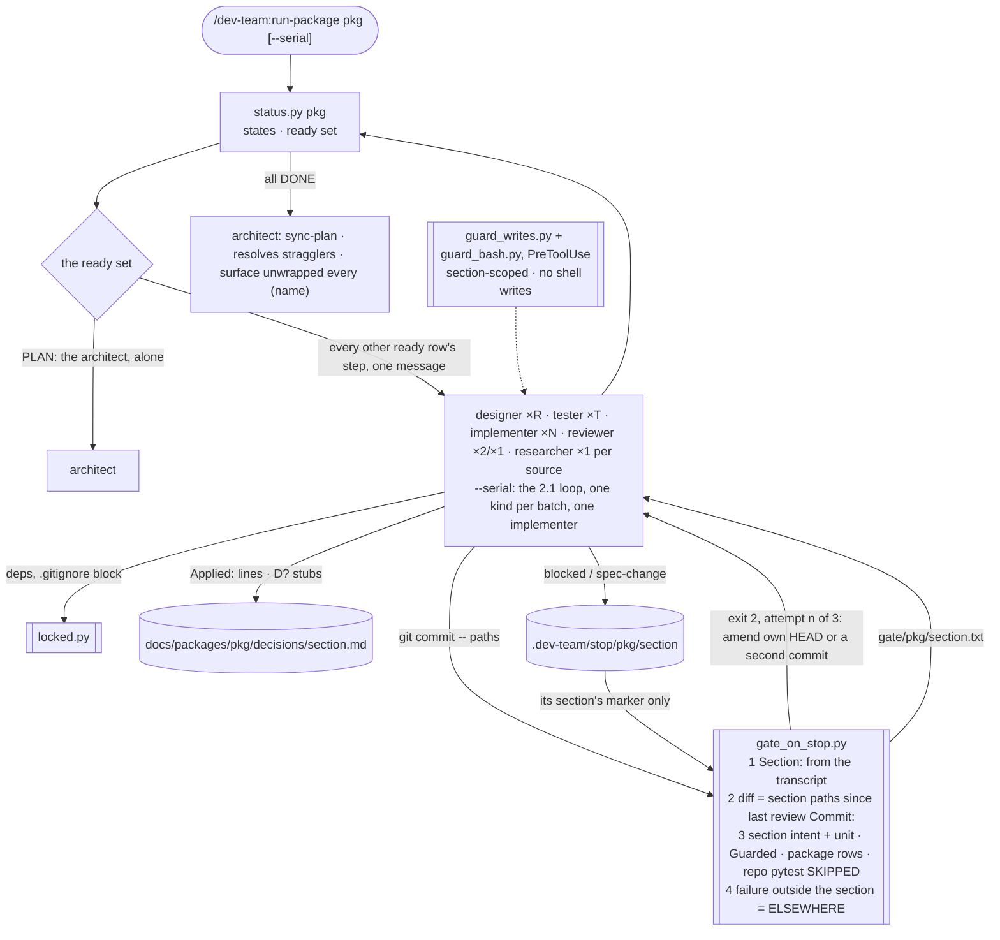
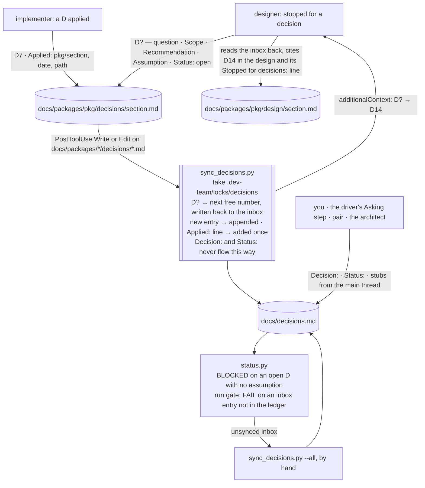
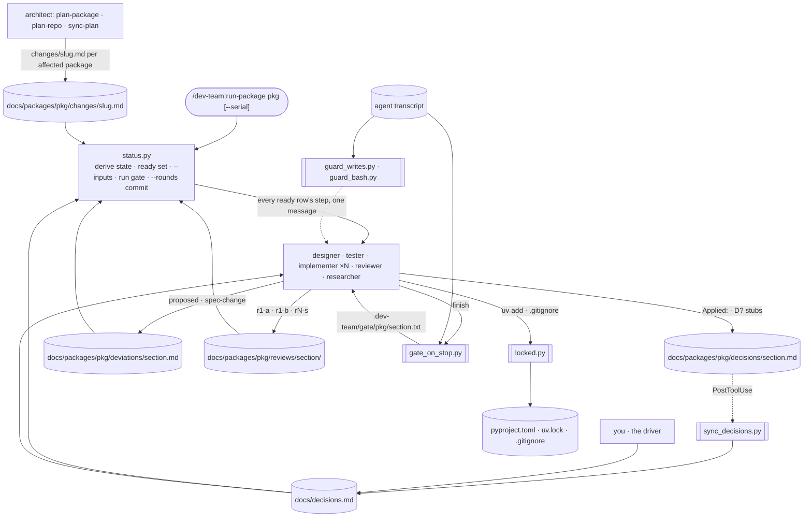

# dev-team 2.2 — design

Approved 2026-09-29. Mode: change. Branch `claude/zen-heisenberg-53upx4` (the session's designated
branch; the worktree is `../cott-plugins-worktrees/dev-team_claude-zen-heisenberg-53upx4`).

Written by `design-plugin` from the discussion, and approved in two gates: the charts, then
this writeup. `plan-phases` reads it, in a chat that has seen nothing else, to write the phase
notes and their evals. `run-phase` reads it for the why. Anything decided in the discussion and
not written here is lost.

Three things are in this design, in this order of weight: implementers run in parallel; the
per-section documents move under their package, with reviews split by section; and the
definition faults the audit of run f1c390a1 found (`evals/2026-09-29-audit-run-package-f1c390a1.md`)
are fixed. The audit's handoff is quoted where a fix needs its evidence.

## The idea

Today `run-package` spawns designers, testers and reviewers in parallel but implementers one
at a time, because two implementers share four files: `docs/decisions.md` (their `Applied:`
lines), the one `.dev-team/stop` marker, the package `pyproject.toml` with `uv.lock`, and the
root `.gitignore`. The stop gate also assumes it is the only implementer running: it finds
"the run" as `HEAD~1..HEAD` plus the working tree, and its retry protocol amends `HEAD`.
Designers already race on `docs/decisions.md` when two stop for decisions in one batch, each
picking "the next free `D<n>`".

After this change, every ready IMPLEMENT and FIX row runs in one message, like the other
roles, and `--serial` restores the 2.1 loop. Nothing an implementer or designer writes is a
file another one could be writing: decisions get a per-section inbox,
`docs/packages/<pkg>/decisions/<section>.md`, that a new `PostToolUse` hook folds into the one
central `docs/decisions.md` under a lock, assigning `D<n>` numbers as it goes; the stop marker
becomes per section; the two unavoidable shared edits (`uv add`, the `.gitignore` append) run
through a small lock script; and the import-linter unwrap moves to the `surface` section, which
always runs alone. The stop gate reads its own implementer's spawn prompt from the subagent
transcript the hook event names, so it knows its section, scopes its diff to that section's
paths since the last review, reads that section's marker, marks a failure in a file outside
the section as `ELSEWHERE`, and no longer runs repo-scope pytest rows that never finish. A gate
retry amends only when `HEAD` is the implementer's own commit, else it makes a second commit.
The write guard confines an implementer to its own section, and a new Bash guard closes the
shell-write bypass the audit found. Once implementers are parallel, the driver's "first kind of
step only" rule is the last needless serialization, so a batch holds every ready row's step;
PLAN stays alone.

`docs/` stops sprouting top-level directories per document kind: `changes/`, `deviations/` and
`reviews/` move under `docs/packages/<pkg>/`, beside `contract.md`, `design/` and
`interface.md`, and reviews, until now one flat directory named by file, get one directory per
section. `status.py` keeps reading the old locations, so a repo built under 2.0 or 2.1 needs no
migration.

From the audit: reviewers contradicted the designer on §10 contract-row deviations (E1), so
one rule now says which the conformance reviewer may approve; agents invented return fields
and blew their caps (E2); delta and fix runs skipped the reads step 1 requires (E3); two
implementers wrote everything through the shell and never met a hook (E4); agents were pointed
at paths outside the repo (E5); testers executed the code under test (E6); a design defect
that is not a gap had no route and shipped (W1); nobody resolved `spec-change:design|test`
entries (W2); deviation tags matched on the first word and churned (W3); `Mode: delta` was
undefined for testers (W4); a reviewer's `Commit:` was `HEAD` at write time, a sibling's commit
in a batch (F12); same-day ledger headings collided (F13); the deviation tag pushed docstrings
past 88 characters (F14); the driver relayed return bodies and grepped the status table (E7,
E8); and four agent faults get sharper wording (E9 to E12).

## Workflows

### run-package

`/dev-team:run-package <pkg> [<section>] [--step …] [--defer] [--serial]` → every ready
section walked to DONE, the `surface` section last, then `sync-plan`; a summary block ending in
one exact next command.

- **Unit:** one agent run on one section, as today: an implementer builds one section from
  `status.py --inputs`, writes its code, unit tests, README, its deviations ledger and its
  decisions inbox, and one commit by pathspec. What changes is that N of them run at once.
- **Strengthened by:** the gate, now section-aware, so every check is attributed to the
  section it ran for: a sibling's half-built file is `ELSEWHERE`, a sibling's marker is not
  yours, and the Guarded grep sees only your lines since your last review. The retry rule is
  deterministic (amend when `git log -1 --format=%s` starts with your scope, else a second
  commit with the same trailer). Two `PreToolUse` guards make "never outside your section" and
  "never through the shell" hooks rather than instructions. The two round-1 reviewers and the
  path-scoped round-2 diff stay as they are; `Commit:` now names the section's last commit, not
  `HEAD`. Reviewer `a` has one rule for designer-raised contract deviations (E1). Return forms
  are closed lists with a rule for where everything else goes (E2). A design defect the tester
  finds has a route, `spec-change:design` (W1).

| Input | Supplied by |
|---|---|
| Which sections run, and which step each is at | file: `status.py`'s ready set |
| An agent's own section | file: the spawn prompt's `Section:` line, read from the subagent transcript by the hooks (see Platform facts) |
| The gate's diff base | file: the newest review round's `Commit:` for the section from `status.py`, else the empty tree |
| Which pytest rows the gate runs | file: `docs/constraints.md` `scope` column: `package` rows run, `repo` pytest rows are SKIPPED |
| Batch width and shape | the user: `--serial` (argument); default every ready row |
| What a gate retry commits | file: `git log -1 --format=%s` (own scope → amend; else a second commit) |
| Which contract deviations reviewer `a` may approve | file: the entry's `Raised by:` and `Clause:`, judged by the E1 rule in `reviewer.md` |

### the decisions ledger

A designer that stops for a decision, or an implementer that applies one → the entry lands in
`docs/decisions.md` with its number, and no two agents ever write that file.

- **Unit:** one inbox write. The hook reads the whole inbox and merges it into the central
  ledger: an entry headed `## D?` gets the next free number, is appended whole, and its inbox
  heading is rewritten to the number; an entry headed `## D<n>` that exists centrally
  contributes only the `Applied:` lines the central entry lacks (exact-line match). Idempotent:
  a second run merges nothing.
- **Strengthened by:** a mkdir lock, so two hooks firing together serialize; one direction of
  flow, so a stale copy of `Decision:` in an inbox can never overwrite an answer; the run gate,
  which fails on an inbox holding anything the ledger does not, so a session without the hook
  (an interactive `claude --agent`, a harness that dropped it) cannot silently lose a stub; and
  `status.py` reading only the central ledger, as today, so BLOCKED and the driver's questions
  are unchanged.

| Input | Supplied by |
|---|---|
| The next free number | file: `docs/decisions.md` |
| Which inbox | the writer's own `Section:`; the path follows the deviations ledger's rule |
| Answers | the user, or the driver relaying the user, in `docs/decisions.md` |
| Stubs from the main thread or a lone agent | `pair` and the architect keep writing `docs/decisions.md` directly: main thread, or alone. `map-repo`'s layer-2 architects already return questions to the one architect that writes them |

## How they fit together

| File | Written by | Read by | Fields read | Stale when |
|---|---|---|---|---|
| `docs/decisions.md` | `sync_decisions.py`; the user; the driver (Asking); `pair`; the architect | every agent; `status.py`; the driver | `## D<n>`, `Scope:`, `Status:`, `Assumption if unanswered:`, `Applied:` | never regenerated; an inbox not yet merged is the run gate's FAIL |
| `docs/packages/<pkg>/decisions/<section>.md` | the section's designer (stubs) and implementer (`Applied:`) | `sync_decisions.py`; `status.py --run-gate` | `## D?` / `## D<n>` headings, `Applied:` lines | when its entries are not in the central ledger |
| `docs/packages/<pkg>/deviations/<section>.md` | implementer, designer, tester, reviewer (status), sync-plan (`synced`, `resolved` sweep) | reviewer, tester, `status.py`, the gate, sync-plan | heading `<pkg>/<section> — <date> — <kind> — <k>`, `Clause`, `Status`, `Resolved by` | as today |
| `docs/packages/<pkg>/reviews/<section>/<date>-r<n>-<letter>.md` | reviewer | `status.py`, the next reviewer, the fix-round implementer | `Commit:`, `Verdict:`, `Convergence:`, **Spec-change** | as today |
| `docs/packages/<pkg>/changes/<slug>.md` | architect (plan-package; plan-repo writes one per affected package) | `status.py`, designer (delta), implementer, reviewer, sync-plan | `Status:`, **Affected sections**, **Contract changes** | synced by that package's close |
| `.dev-team/gate/<pkg>/<section>.txt` | the gate (attempt or `--report`) | reviewer | every line; `SKIPPED (repo scope)` rows are informational | the next gate run for the section |
| `.dev-team/stop/<pkg>/<section>` | implementer | the gate (its section only) | line 1 `blocked` or `spec-change` | deleted by the gate |
| the subagent transcript (`agent_transcript_path`) | Claude Code | the gate; both guards | the first user record's `Section:` line (`Scaffold:` means no section) | never; read-only |

## Components

| Name | Kind | Role | Reads | Writes | Used by | Origin |
|---|---|---|---|---|---|---|
| `skills/run-package` | workflow skill | every ready row's step in one message (PLAN alone; round-1 pairs and one researcher per source kept); `--serial` is the 2.1 loop; step 5 reads first lines only and step 6 prints changed rows without grep (E7, E8) | `status.py` rows | `docs/decisions.md` (Asking) | run-package | asked |
| `agents/implementer.md` | agent | `Applied:` to the inbox; marker at `.dev-team/stop/<pkg>/<section>`; shared edits through `locked.py`; retry rule; no shell writes; tool results read with Read, scratch under `.dev-team/tmp/`; delta and fix runs restate step 1's reads; unit tree in the gate; the contract-3 unwrap moves to the surface build list; E10 and E11 sharpened | as today, at the new paths | inbox; ledger at the new path | run-package, pair | composed |
| `agents/designer.md` | agent | stubs to the inbox as `## D?`, read back for numbers; §10 items classified by the E1 test: additive → `deviation`, else `spec-change:contract`; no shell writes; delta restates step 1's reads; sets `resolved` on the `spec-change:design` entries its rewrite answers | as today | inbox; ledger | run-package | composed |
| `agents/tester.md` | agent | may append `spec-change:design` on any run and return `Result: spec-change` (W1); `Design mode:` field replaces `Adopted code:` and defines delta (W4); tag match on the full item name and tag `(deviation <date>-<k>)` (W3, F13); summary line kept under 88 with the tag (F14); Python only through the test command, memory contradicting Hard rules corrected (E6); closed return form with `Suite:` and `Ledger:` lines (E2); sets `resolved` on the `spec-change:test` entries it regenerates (W2); no test past an Interfaces row with no signature (E9) | as today | ledger; `tests/intent/` | run-package | composed |
| `agents/reviewer.md` | agent | the E1 rule for `Raised by: designer` entries with a contract-row Clause; `Commit:` from `status.py --rounds`; report path per section; closed return form (E2); shell paths rule (E5); E12 wording | as today | report at the new path; ledger status | run-package | composed |
| `agents/architect.md`, `skills/plan-package`, `skills/plan-repo`, `skills/sync-plan`, `skills/map-repo` | agent and skills | change files under the package, one per affected package for a repo-level change; sync-plan sets `resolved` on any answered `spec-change:design|test` still `open` at the close (W2 sweep); all path references moved | as today | `docs/packages/<pkg>/changes/<slug>.md` | plan-package, plan-repo, sync-plan | asked |
| `hooks/gate_on_stop.py` | hook (SubagentStop) | section from `agent_transcript_path`; diff = the section's paths since its newest review `Commit:`, else the empty tree; per-section marker; section intent and unit suites always; `package` rows within budget; `repo` pytest rows `SKIPPED`; ELSEWHERE for any located failure outside the section the run did not touch; retry message names the commit rule; `--report --base` unchanged | transcript; status.py parsers; the section's marker | `.dev-team/gate/<pkg>/<section>.txt` | run-package, pair | composed |
| `hooks/sync_decisions.py` | hook (PostToolUse Write|Edit) | fires on `docs/packages/*/decisions/*.md` in a dev-team repo, any role or the main thread; merges one way under `.dev-team/locks/decisions`; numbers `D?`; returns the numbering as `additionalContext`; `--all` by hand | every inbox; `docs/decisions.md` | `docs/decisions.md`; the inbox heading | run-package; any hand run | asked |
| `hooks/guard_writes.py` | hook (PreToolUse Write|Edit) | an implementer with a `Section:` is confined to its section's paths (code, `tests/unit/<section>`, README), `**/tests/fixtures/**`, its own ledger and inbox, and for `surface` also `interface.md`, `docs/api/<pkg>.md`, the root `pyproject.toml` and `mkdocs.yml`; a scaffold run or an unreadable transcript falls back to today's role-wide rule; every role's globs updated to the new paths, old paths kept writable for status edits | transcript; `status.py` | — | every guarded role | accepted suggestion |
| `hooks/guard_bash.py` | hook (PreToolUse Bash) | refuses a dev-team agent's command that writes a repo file by redirect (`>` or `>>` except to `/dev/null`; `2>&1` is not a write), `sed -i`, `tee`, or `python -c` with `open(…, 'w'|'a')`; allowed when the program is `locked.py`; fail-open on a parse it cannot make, with the rule on stderr | the command | — | every dev-team role | asked (E4) |
| `skills/status/scripts/locked.py` | script | `locked.py <name> -- <cmd>`: holds `.dev-team/locks/<name>/` (mkdir; stale after 10 min) while the command runs; the one way an implementer touches `pyproject.toml`, `uv.lock` or `.gitignore` | — | `.dev-team/locks/` | implementer | composed |
| `skills/status/scripts/status.py` | script | the new paths with the old as read fallback; `section_from_transcript(path)` for the hooks; the run gate fails on an unsynced inbox; `--rounds` prints `commit: <sha>`, the section's last commit; `clause_key` matches the full item name; heading sequence parsed, optional; change files per package; docstring updated | + inboxes, a transcript | — | every hook, the driver, pair, status | composed |
| `hooks/hooks.json` | config | registers `sync_decisions.py` (PostToolUse) and `guard_bash.py` (PreToolUse, matcher `Bash`) | — | — | every session | composed |
| `skills/git-workflow-and-versioning` §Project convention | knowledge skill | the retry commit rule; the inbox joins the files an agent stages; ledger and review paths | — | — | every agent that commits | composed |
| `skills/planning-templates/references/decisions-inbox.md` | reference | the inbox's shape and what never goes in it | — | — | designer, implementer, sync hook, contracts.yml | composed |
| `skills/planning-templates/references/deviations-entry.md`, `change.md`, `review-report.md` | references | heading `— <k>`; `resolved` owners; per-package change path; report path and `Commit:` source | — | — | their readers | composed |
| `skills/pair` | workflow skill | paths updated; `gate_on_stop.py --report` unchanged; keeps writing `docs/decisions.md` directly | — | — | pair | composed |
| `skills/set-constraints/references/constraints-template.md` | reference | one sentence: a `repo` pytest row is CI's; the gate skips it | — | — | set-constraints, gate | composed |
| `README.md`, `site/workflows/*.md`, `CHANGELOG.md`, `contracts.yml`, `evals/fixtures/hook-events`, `evals/fixtures/state-cases` | docs, config, fixtures | every path and rule above; new claims for the inbox path, marker path, review path and `--serial`; hook-events cases for the four hooks; state cases for the new and old layouts | — | — | readers, check-contracts, the mechanical evals | composed |
| researcher, documenter, curator, `extract-legacy`, `probe-source`, `finalize-project`, `shape-brief`, `set-constraints` | agents and skills | unchanged except path spellings | | | | — |

## Outputs

### `docs/decisions.md`

- Sections: `## D<n> — <question>` entries with `Scope:`, `Raised by:`, `Recommendation:`,
  `Assumption if unanswered:`, `Decision:`, `Status:`, `Applied:` lines. Unchanged shape.
- Cites: every `Applied:` line names `<pkg>/<section>`, a date and a path.
- Never claims: a number that is not unique; a `Decision:` or `Status:` written by an agent
  under the driver. Only the hook, the user, the driver, `pair` and the architect write it.
- Stale when: never regenerated. An inbox entry missing from it is a run-gate FAIL.

### `docs/packages/<pkg>/decisions/<section>.md`

- Sections: title `# Decisions — <pkg>/<section>`; then entries, each either a stub
  `## D? — <question>` with `Scope:`, `Raised by:`, `Recommendation:`, `Assumption if
  unanswered:`, `Status: open` (a stub is renumbered by the hook to `## D<n> — <question>`), or
  an applied entry `## D<n>` followed by one or more `Applied:` lines.
- Cites: `Raised by:` names the design's `OQ-<pkg>-<section>-<k>` or the implementer run.
- Never claims: `Decision:`; `Status:` other than `open`; a numbered stub the agent numbered
  itself. Written only with the Write and Edit tools, by the section's own designer or
  implementer.
- Stale when: any entry is not in `docs/decisions.md` (`sync_decisions.py --all` repairs).

### `docs/packages/<pkg>/deviations/<section>.md`

- Sections: as today, with the heading `## <pkg>/<section> — <date> — <kind> — <k>`, `<k>`
  the entry's 1-based sequence in the file. Readers accept a heading without `— <k>` (a 2.x
  ledger) and treat it as `k` absent.
- Cites: as today. A `spec-change:design` the tester appends cites the two design items that
  contradict each other under `Found:` (W1).
- Never claims: `resolved` without `Resolved by:` — the designer sets it on the
  `spec-change:design` entries its rewrite answers, the tester on the `spec-change:test` entries
  it regenerates, each in its own commit with `Resolved by: <sha>`; sync-plan sets it on any
  entry `status.py` already counts as answered at the close (W2).
- Stale when: as today. The old location `docs/deviations/<pkg>/<section>.md` and the pre-2.0
  `docs/deviations.md` are still read; an entry is edited in the file that holds it.

### `docs/packages/<pkg>/reviews/<section>/<date>-r<n>-<a|b|s>.md`

- Sections: the template's header lines and seven headings, unchanged. `Commit:` is the
  section's last commit as `status.py --rounds` prints it (`git log -1 --format=%h --
  <section paths>`), never `HEAD` (F12).
- Cites: as today.
- Never claims: a finding the round's Focus does not own; a contract-row deviation approved
  outside the E1 rule.
- Stale when: as today. `docs/reviews/<date>-<pkg>-<section>-r<n>-<letter>.md` is still read
  as round `n` of that section.

### `docs/packages/<pkg>/changes/<slug>.md`

- Sections: the change template, unchanged; **Contract changes** holds only this package's
  groups plus the **Repo contract** group when the change touches it.
- Cites: as today.
- Never claims: another package's sections under **Affected sections**: a repo-level change
  writes one file per affected package with the same slug.
- Stale when: synced at that package's close. `docs/changes/<slug>.md` is still read as naming
  every package its Affected sections name.

### `.dev-team/gate/<pkg>/<section>.txt`

- Sections: header `dev-team gate — attempt n | report — <stamp> — section <pkg>/<section>`;
  one line per check: `PASS`, `FAIL`, `ELSEWHERE`, `TIMEOUT`, `MEASURED`, `TOLERATED`, and new
  `SKIPPED <row>: repo-scope pytest is CI's`; the outcome line.
- Cites: every `FAIL` and `ELSEWHERE` names the paths the check's output located.
- Never claims: `FAIL` for a located failure that lies wholly outside the section's paths and
  the run's diff (that is `ELSEWHERE`); a section other than the one the transcript names.
- Stale when: the section's next gate run.

### Return messages (E2)

- The tester's form gains `Suite: <pass>/<fail>/<total>` and `Ledger: <entry headings> |
  none`; the implementer's and reviewer's forms are unchanged. Every form is a closed list: a
  fact with no line in the form goes to the ledger (a design defect: `spec-change:design`), the
  report, `docs/followups.md`, or the README's Implementation notes, and never to the return.
  The caps stay (20, 25, 30 lines).
- The tester's `Adopted code:` input becomes `Design mode: new | document | delta`, the design's
  first line, sent by the driver (W4): in `delta` mode a test for an item the change file or
  the spec-change names may pass on the shipped code and is kept; a test for an untouched item
  is not rewritten; "deleted for passing" applies in `new` mode only.

## Cost

| Workflow | Cold run reads | Warm run reads | Horizon |
|---|---|---|---|
| run-package, k independent sections at IMPLEMENT | unchanged per agent; k implementer runs in 1 batch instead of k batches; k gates run at once, each: section suites + package rows, no repo pytest | a re-run derives the same ready set and spawns nothing that is DONE, as today | one package |
| run-package, sections at different steps | one batch per ready set instead of one per kind; a section at REVIEW no longer waits for a sibling's IMPLEMENT | same | one package |
| the decisions ledger | one hook run per inbox write: read every inbox of the repo and the central ledger, write two files, milliseconds | same | the repo |
| the guards | one `status.py` import and one transcript read per implementer Write, Edit or Bash call; the transcript is read once and its `Section:` cached under `${CLAUDE_PLUGIN_DATA}/section/<agent_id>` | same | one agent run |

## Decisions taken

| Decision | Chosen | Alternatives | Why | Origin |
|---|---|---|---|---|
| Isolation | one working tree; per-section files; `locked.py` for the two shared edits | a git worktree per implementer | one venv, no merges, the driver still runs no git that writes, hooks and `status.py` derive from one tree | asked |
| Decisions split | per-section inbox under the package, synced one way by a hook that numbers `D?` stubs | inbox for `Applied:` only; regenerate the ledger from inboxes; rely on the Edit tool's staleness check | the user's answers live in the central ledger and must never be overwritten; numbering in the hook removes the designers' race | asked |
| Batch width | every ready implementer; `--serial` opts out | `--parallel N` cap; opt-in flag | matches how the other roles already run | asked |
| Batch shape | every ready row's step in one message; PLAN alone | one kind per batch (today) | with implementers parallel this is the last needless wait; the ready-set rule keeps sections off each other's files; the architect edits what designers read | accepted suggestion |
| Section-scoped write guard | yes, from the transcript; role-wide rule as the fallback | instruction only | under parallelism a write into a sibling's section is the failure that corrupts a run; routing rule 1 | accepted suggestion |
| Bash guard | yes, `guard_bash.py`; `locked.py` commands exempt | prose ban only | two implementers in the audit wrote everything by shell and met no hook | asked (E4) |
| Gate retry commit | amend when `HEAD` is the run's own commit (scope prefix), else a second commit with the same trailer | always a second commit; always amend | amend keeps history tidy in the serial case; the check is one `git log -1` | routine |
| Gate diff base | the section's newest review `Commit:`, else the empty tree; paths = the section's | `HEAD~1` (today); the run's start commit | needs no commit ordering; "added since the last review" is what Guarded means | routine |
| Gate pytest scope | section intent and unit always; `package` rows within budget; `repo` pytest rows SKIPPED | rewrite rows to touched paths; raise the budget | repo-wide pytest never finished in any audited record, so ELSEWHERE never fired; CI runs the same row | asked |
| ELSEWHERE | any located failure outside the section's paths that the run did not touch | intent tests only (today) | the implementer may not edit those files either | routine |
| `(name)` unwrap | the `surface` section unwraps every section's `(name)` | keep wrapped forever; a PREPARE step | surface runs alone; a typo is still caught before the package ships | routine |
| Lock mechanism | mkdir lock under `.dev-team/locks/`, stale after 10 min | `fcntl.flock`; `flock(1)` | portable, no platform fact, no dependency | routine |
| docs layout | `changes/`, `deviations/`, `reviews/<section>/` and the new `decisions/` under `docs/packages/<pkg>/`; old locations read, never written | migration script; keep flat directories | the user's ask; read fallback is how the 2.0 ledger split was done | asked |
| Repo-level change files | one file per affected package, same slug | keep `docs/changes/` for repo-level | one place per package to read; each file closes with its package | asked |
| E1 rule | additive and compatible → `deviation` (approvable); anything a consumer must change for → `spec-change:contract`; the designer applies the same test at §10 | every contract item a spec-change; approve any with a Why | three approved §10 entries in the audit changed public shapes others consume | asked |
| W1 route | the tester (and implementer) append `spec-change:design` with the contradiction as `Found:` and return `Result: spec-change`; `status.py` re-opens DESIGN | widen `design-gap` | on disk and derivable; no relay | routine |
| W2 owners | designer for `:design`, tester for `:test`, in the commit that answers it; sync-plan sweeps | sync-plan only | the answering commit is when the fact is known | routine |
| W3 tag match | the full item name, normalized, in `status.py`, the gate and the tester | the entry names its tests | one parser already; the first-word match is what churned | routine |
| F13 headings | `— <k>` sequence per file, optional on read; tag `(deviation <date>-<k>)` | a slug | parsers already read the heading; a number needs no naming | routine |
| F12 `Commit:` | `status.py --rounds` prints the section's last commit; the reviewer copies it | `git log -1 -- <paths>` by the reviewer | the reviewer already runs `--rounds` once and runs no other command | routine |
| E2 forms | closed lists; tester gains `Suite:` and `Ledger:`; W4 adds `Design mode:` | free-form fields | the driver reads first lines; a fact needs a file | routine |
| E7 to E12 | wording sharpened in the driver, tester and implementer; no new mechanism | hooks | the audit shows prose faults, and the two guards cover the mechanical ones | routine |
| Branch | the session's designated branch, in a worktree | `dev-team-2.2` | the session's instructions name it | routine |

## Platform facts

| Fact | Status | Source or expected answer |
|---|---|---|
| `SubagentStop` input carries `agent_transcript_path` and `agent_id` | verified | code.claude.com/docs/en/hooks.md, read 2026-09-29; write back to `plugin-anatomy` `references/hooks.md`, which lists neither |
| `PreToolUse` and `PostToolUse` inside a subagent carry `agent_id` and `agent_type` | verified | same page; `references/hooks.md` has it |
| A subagent's transcript is `~/.claude/projects/{project}/{sessionId}/subagents/agent-{agentId}.jsonl`, and a tool event's `transcript_path` is the parent session's `…/{sessionId}.jsonl`, so the guards derive the path | assumed | sub-agents.md documents the layout; the derivation from `transcript_path` is the phase-0 eval: record a real `PreToolUse` event from an implementer and check the derived file exists |
| The subagent transcript's first `user` record holds the spawn prompt verbatim, so `Section: <pkg>/<section>` is its first line | assumed | phase-0 eval: a recorded transcript, added to `evals/fixtures/hook-events`; expected yes |
| `PostToolUse` hooks run before the model continues and may return `hookSpecificOutput.additionalContext` | verified | hooks.md; the design does not depend on it (the designer reads the inbox back) |
| Several Agent calls in one assistant message run concurrently, up to 20 | verified | sub-agents.md; the driver already relies on it |
| Two `SubagentStop` hooks for two subagents run concurrently | assumed | expected yes; only CPU depends on it |
| `git commit -m … -- <paths>` commits the working-tree content of those paths, whatever the index holds | verified | git docs; already the §Project convention's reason for the pathspec form |
| import-linter enforces a layer written `(name)` when the module exists and skips it only when missing | assumed | import-linter docs were unreachable from this session; phase-0 eval: a two-layer contract with the upper layer in parentheses and a violating import fails `lint-imports` |
| A `PreToolUse` hook with matcher `Bash` receives `tool_input.command` | verified | hooks.md |

## Build order

Bottom-up. Each numbered item depends on the ones before it.

0. Phase-0 evals for the three assumed facts: the derived transcript path, the first user
   record, the optional layer. Write results back to `plugin-anatomy`.
1. `status.py`: the four new locations with the old as fallback (`ledger_files`, `_reports`,
   `change_files`, plus `inbox_path`); `section_from_transcript`; the heading `— <k>`; the full
   item name in `clause_key`; `--rounds` prints `commit:`; the run gate's inbox check; the
   docstring. `evals/fixtures/state-cases` for old and new layouts.
2. `locked.py`; `sync_decisions.py` with `--all`; `hooks.json`. `evals/fixtures/hook-events`
   cases for the sync hook (numbering, dedupe, idempotence, two inboxes, a stale `Decision:` in
   an inbox).
3. `gate_on_stop.py`: section from the transcript, diff base and paths, per-section marker,
   unit suite, SKIPPED repo pytest, ELSEWHERE, the retry message, `--report` unchanged.
   `guard_writes.py`: new paths, section scope, fallback. `guard_bash.py`. Hook-events cases
   for each path, including the fallbacks.
4. Templates: `decisions-inbox.md` (new), `deviations-entry.md`, `change.md`,
   `review-report.md`, `constraints-template.md`.
5. Agents: implementer, designer, tester, reviewer, architect; `git-workflow-and-versioning`
   §Project convention. Every audit fix lands here, each citing its E/W/F item in the commit.
6. Skills: `run-package` (batch shape, `--serial`, E7, E8), `pair`, `sync-plan`,
   `plan-package`, `plan-repo`, `map-repo`, `status`, `finalize-project` (paths only).
7. `README.md`, `site/workflows/*.md`, `CHANGELOG.md`, `contracts.yml` claims; `build-site`;
   `check-contracts`; `log-eval`. Then propose MINOR, 2.2.0, and wait.

The smallest slice that works end to end: item 1's `section_from_transcript` and inbox path,
item 2's sync hook, item 3's gate, the implementer's inbox and marker changes, and the driver's
batch rule, run on a two-section package with no shared dependency: two implementers finish in
one batch, both gates pass on their own sections, both `Applied:` lines reach
`docs/decisions.md`, and `status.py` shows both at REVIEW.

## What must not break

- **Headings other files parse.** Every `contracts.yml` heading claim still holds: the
  section README, `interface.md`, the design template, the review report, the change file, the
  ledger fields, the constraints rows and the state names are unchanged in name. The ledger
  heading gains an optional `— <k>`; the review report's header lines are unchanged in name.
- **Commands users type.** Every typed skill keeps its name and arguments; `run-package` adds
  `--serial` only. `status.py`'s flags are unchanged; `--rounds` prints one more line.
- **Defaults that change behavior.** Implementers run in parallel by default and batches are
  mixed by default; `--serial` is the 2.1 loop. The gate no longer runs `repo` pytest rows;
  the record says so on a `SKIPPED` line and CI still runs them.
- **Repos built under 2.0 or 2.1.** `docs/deviations/`, `docs/deviations.md`, `docs/reviews/`
  and `docs/changes/` are read exactly as before; a ledger entry is edited where it is; new
  entries, reports and change files go to the new locations. The write guard keeps the old
  locations writable for status edits. Review headings without `— <k>` and docstring tags
  `(deviation <date>)` still match.
- **The driver's contract with the agents.** Spawn blocks are unchanged except the tester's
  `Design mode:` replacing `Adopted code:`; return first lines are unchanged; the tester gains
  `Result: spec-change`, which the driver already routes for the other roles.
- **`gate_on_stop.py --report --base <rev>`** keeps its arguments and output for `pair`.
- **The `Dev-Team-Run:` trailer**, the one commit per run (plus one per gate retry when `HEAD`
  is not the run's own), and staging by explicit path.
- **Hooks outside a dev-team repo** still exit 0 on every event, the two new ones included.
- **Every implementer prompt still comes from `status.py --inputs`**, unchanged.

## Non-goals

- A worktree per implementer: considered and declined; one tree with per-section files is
  enough and keeps the driver free of git writes.
- Regenerating `docs/decisions.md` from the inboxes, or any flow from an inbox's `Decision:`
  or `Status:` into the ledger: the central ledger is the user's, and the hook only appends.
- A migration script for old `docs/` layouts: `status.py` reads both, and a repo may move its
  files by hand at any time.
- A cap on parallelism (`--parallel N`): declined; `--serial` is the only knob. The
  20-subagent limit is the platform's.
- Inboxes for `pair`, the architect or the driver: they run in the main thread or alone and
  keep writing `docs/decisions.md`.
- Running `repo`-scope pytest in the gate under a bigger budget: declined; CI's job.
- Turning E7 to E12 into hooks: declined; they are prose faults and the two new guards cover
  the mechanical half (E4). Cleaning quant's contradictory reviewer memory file is the user's,
  in that repo; this plugin only tells reviewers that memory contradicting an agent's Hard
  rules is corrected, not followed.
- A `PREPARE` step that pre-installs every batch section's dependencies: declined in favor
  of `locked.py` around `uv add`.
