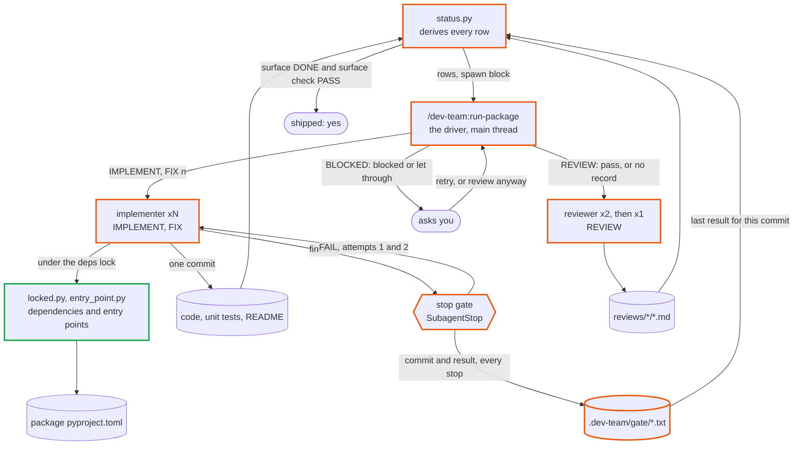
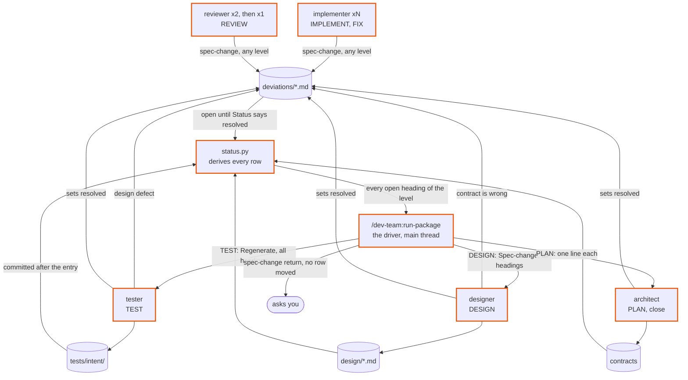
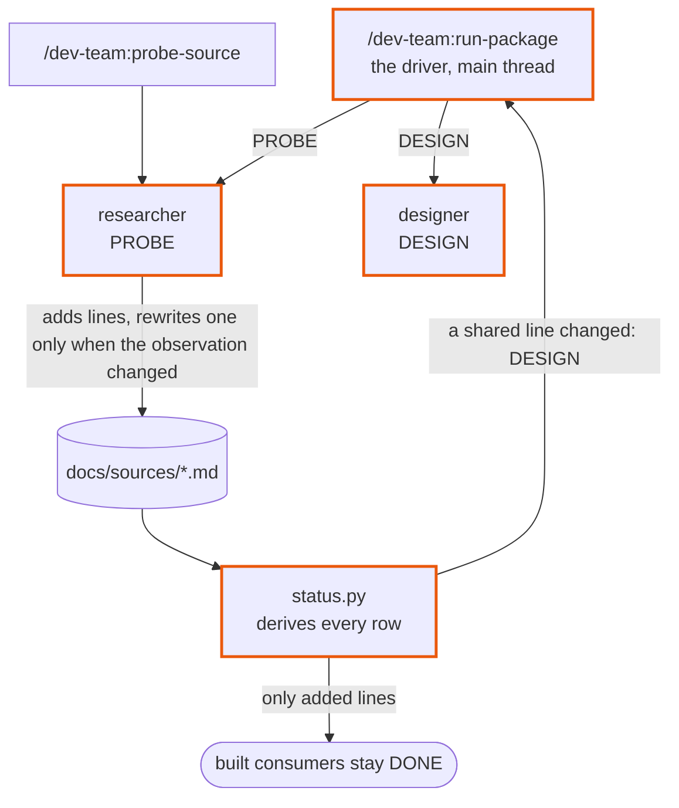
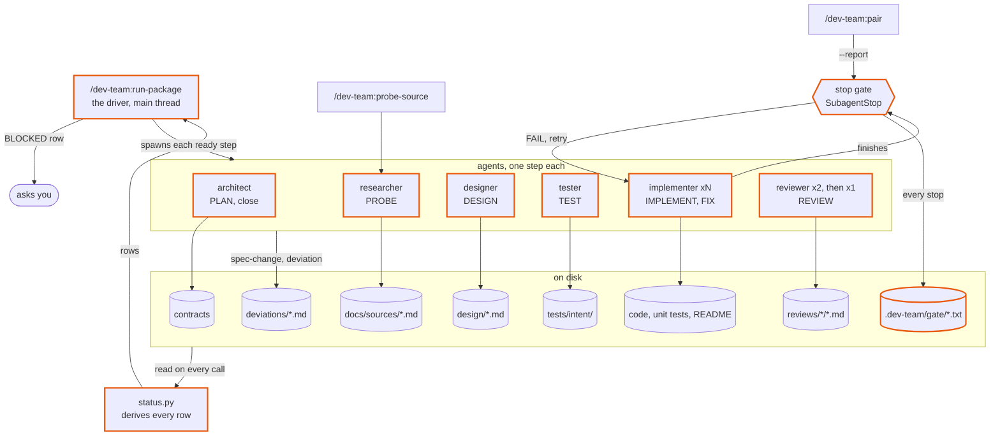

# dev-team 2.4 — design

Approved 2026-10-01. Mode: change. Branch `dev-team-2.4`.

Written by `design-plugin` from the discussion, and approved in two gates: the charts, then
this writeup. `plan-phases` reads it, in a chat that has seen nothing else, to write the phase
notes and their evals. `run-phase` reads it for the why. Anything decided in the discussion and
not written here is lost.

The sources are `site/notes/open_items.md` (items 1 to 20, cited below as *item N*) and the
"Notes for the next chat" column of `site/notes/2.2-progress.md` (cited as *ledger, phase N*),
checked against `main` at `b965418`. Line numbers in `open_items.md` were written against
`2a155b8`; `agents/tester.md`, `agents/implementer.md` and `skills/run-package/SKILL.md` have
not changed since.

## The idea

A run stops where the files say it should. Today a section can be reviewed, approved and
shipped while its stop gate is red; an open spec-change can drop out of the state table while
its ledger entry still says `open`; a section whose design needs an entry point cannot be
built until the user edits `pyproject.toml` by hand; a second probe of a shared source re-opens
sections nothing changed for; and returns carry check results no command printed.

The evidence is three real runs audited on 2026-10-01 and written up in `open_items.md`:
`run-package core` in `pt` (item 1), `run-package lm` in `slm` (session `9ecf4176`, items 2 to
12, record `evals/2026-10-01-audit-run-package-9ecf4176.md`) and `run-package engine` in
`wild-ones` (session `b05b2879`, items 13 to 20, record
`evals/2026-10-01-audit-run-package-b05b2879.md`). In `wild-ones` the package closed
`shipped: yes` with two blocked implementers and one let through, none of which the driver
saw. Commit `1e81553` already edited five files for the first audit, and no agent has been run
against those edits (item 3).

After 2.4:

- The gate's verdict is on disk and `status.py` reads it. A blocked or let-through section is
  BLOCKED and the user is asked. A package is shipped only when its surface check passes.
- A ledger entry stays open until the agent that answers it sets `resolved`, and every open
  entry of a level reaches that agent in one spawn.
- An implementer registers its own entry points under the dependency lock.
- A probe doc re-opens a built design only when a shared line changed.
- Returns carry no line that nothing computes.
- The rule gaps that made agents guess in the audited runs are closed, and so are the
  dev-team defects the 2.2 ledger left open.

## Workflows

All three are parts of what `/dev-team:run-package <pkg>` already does. No loop is added.
In the charts an orange border is a changed component and a green one is new.

### Build a section and gate it

A ready IMPLEMENT or FIX row → a reviewed section, or a question to the user. Items 1, 4, 14,
15, 16, 17, 18, 20.

- **Unit:** one implementer run on one section. It reads the documents its spawn block names
  and writes the section's code, unit tests and README in one commit, plus its entry-point
  lines through the lock. The gate then writes the record
  `.dev-team/gate/<pkg>/<section>.txt`: a header, a `commit:` line, one line per check, and a
  last `result:` line.
- **Strengthened by:** the stop gate, capped at three attempts, after which the row is BLOCKED
  and the user is asked instead of the section being reviewed; the gate's own per-section
  public-names check, so a README's author meets a bad row in its own run; two reviewers in
  round 1; a return with no check results in it, because the record holds them.

| Input | Supplied by |
|---|---|
| Which sections to build | file: `status.py`'s ready rows, derived from disk |
| What to build | file: the design (designer), the intent tests (tester), the contracts (architect), all named by `status.py --inputs` |
| What the gate holds the section to | the user: `docs/constraints.md`, else the repo contract's Toolchain |
| What a FIX round fixes | file: the newest round's review reports |
| Whether a built section may be reviewed | file: the gate record for the section's current commit (new) |

### Route a wrong document

An agent finds a contract, a design or an intent test that is wrong → the owner of that
document corrects it and the row moves again. Items 2, 5, 7, 8, 19.

- **Unit:** one ledger entry in `docs/packages/<pkg>/deviations/<section>.md`, heading
  `## <pkg>/<section> — <date> — spec-change:<level> — <k>`, with **Clause**, **Said**,
  **Found**, **Why**, **Status**, **Raised by** and **Resolved by**. The agent that met the
  wrong document raises it; the owner of that level answers it (tester for `test`, designer
  for `design`, architect for `contract`).
- **Strengthened by:** `Status:` is the record, so a row stays open until the answering agent
  sets `resolved`; every open entry of the level is handed over in one spawn; the kind table
  gains rows for the cases agents guessed at; a departure with no entry is CRITICAL even when
  the design contradicts itself.

| Input | Supplied by |
|---|---|
| Which entries an agent answers | file: `status.py`'s evidence (`open <h1>; <h2>`), copied by the driver into the spawn field |
| What the document should say | loop: the level's owner, from the entry's **Found** |
| Which kind an entry is | file: the kind table in `agents/implementer.md`, and `planning-templates`' `deviations-entry.md` |
| Which in-scope decisions bind the section | file: the design's **Open questions** (new line per decision) |
| What a finding is judged against | file: the order of authority the implementer and the reviewer share |

### Probe a shared source

A section needs a source another section already uses → the probe doc gains that section's
entry and built consumers stay built. Item 6.

- **Unit:** one researcher run for one source and one section. It calls or loads the source
  and writes `docs/sources/<token>.md`: the template's shared headings, and one
  `## <pkg>/<section>` entry per consumer.
- **Strengthened by:** a shared body that only grows, where a rewritten line means the
  observation changed and **Changes since last probe** says what; and `status.py`'s
  comparison, which ignores added lines, the title line and other sections' entries.

| Input | Supplied by |
|---|---|
| Which source, for which section | file: the Sections row's `source` cell, through the driver's fields |
| How to reach it | the user: the repo contract's Shared conventions (the env var or location) |
| What the result is judged against | the vendor's or publisher's documentation, against what the probe observed |

## How they fit together

The one new meeting point is the gate record: the stop gate has always written it and the
reviewer has always read it, and now `status.py` reads it too.

| File | Written by | Read by | Fields read | Stale when |
|---|---|---|---|---|
| `.dev-team/gate/<pkg>/<section>.txt` | `hooks/gate_on_stop.py`, on every implementer stop, and `--report` | `status.py` (new), the reviewer, the driver when it asks about a gate-BLOCKED row (new) | the header's attempt slot, the `commit:` line (new), every `FAIL` line, the last `result:` line | its `commit:` is not the section's current commit, or it has no `commit:` line (a pre-2.4 record). A stale record is treated as absent |
| `docs/packages/<pkg>/deviations/<section>.md` | implementer, tester, designer, reviewer, `pair` (entries); tester, designer, architect, reviewer, `sync-plan` (status lines) | `status.py`, the stop gate, every agent that answers an entry | the heading's kind and `— <k>`, `Status`, `Clause` | never; append-only, and an entry speaks while its `Status:` is `open` |
| `<section path>/README.md` | implementer | sibling designers and implementers, the reviewer, `status.py --surface`, the gate (new, per section), the documenter | **Entry points and interfaces**: one exported name per row, the `Public` cell | the section's code is newer (unchanged) |
| `docs/packages/<pkg>/design/<section>.md` | designer | tester, implementer, reviewer, `status.py` (first line `Mode:`, and new: the `Upstream packages:` line) | the eleven template headings; new lines listed under **Outputs** | a newer change file, a live `spec-change:design`, or a probe doc whose shared lines changed |
| `docs/sources/<token>.md` | researcher | designer, implementer, reviewer, architect, `status.py` | the template's headings; `## <pkg>/<section>` entries | never by itself; a consumer's design is stale when a line the design-time version held is gone |
| `<package root>/pyproject.toml` | the scaffold; `uv add` and (new) `entry_point.py`, both under `locked.py deps`; the `surface` implementer for `[project.scripts]` | `uv`, the gate's checks | `[project.entry-points."<group>"]` tables (new) | n/a |
| `.dev-team/stop/<pkg>/<section>` | implementer | the stop gate, which deletes it | line 1 `blocked` or `spec-change`; line 2 the blocker or the entry heading, which the gate now copies into the record | deleted at the stop that reads it |
| `docs/packages/<pkg>/reviews/<section>/*.md` | reviewer | `status.py`, the FIX implementer, the next reviewer | header lines, **CRITICAL**, **WARNING** | the section's code is newer than its `Commit:` (unchanged) |

## Components

| Name | Kind | Role | Reads | Writes | Used by | Origin |
|---|---|---|---|---|---|---|
| `run-package` (changed) | workflow skill | Branches on the first hand-back's first line, then on the next rows. Sends every open heading. Asks on a gate-BLOCKED row and on `shipped: no (surface check FAIL)`. A free-text answer ends the loop with the Summary. Passes only the upstream interfaces a design consumes. Its `uncommitted:` line follows git. | `status.py` rows, each return's first line, the gate record of a gate-BLOCKED row | answers in `docs/decisions.md` | all three workflows | asked: items 2, 9, 10, 14, 15; ledger, phase 9 |
| `skills/status/scripts/status.py` (changed) | script | Reads the gate record: blocked or let through is BLOCKED, not-done is IMPLEMENT. An entry is answered by its `Status:`. Evidence lists every open heading at all three levels. A probe diff that only adds lines re-opens nothing. `shipped: yes` needs the surface check. A per-section public-names check. `--fields` gains `upstream interfaces:`. | docs, code, git, gate records | nothing | all three | asked: items 1, 2, 6, 9, 14, 15 |
| `hooks/gate_on_stop.py` (changed) | hook, SubagentStop | Writes a `commit:` line, and a `result: blocked` record when it deletes a blocked marker. Counts asserts per file, so a rewrite is not a removal. Reads a wrapped `xfail(` call to its closing bracket. Runs the per-section public-names check. Keeps ruff 0.15's location lines. New retry text. | the diff, the marker, `docs/constraints.md` | the gate record | build and gate | asked: items 14, 15, 16, 18; ledger, phase 3 |
| `skills/status/scripts/entry_point.py` (new) | script | Adds or replaces one line under `[project.entry-points."<group>"]` in the package `pyproject.toml`, standard library only, then runs `uv sync --all-packages`. Refuses a target outside the package, or one whose module file does not exist. | the package `pyproject.toml` | the same file, `uv.lock` | build and gate | asked: item 1 |
| `skills/status/scripts/locked.py` (changed) | script | Behavior unchanged. Its docstring names the third shared edit. | — | the lock directory | build and gate | composed |
| `hooks/guard_bash.py` (changed) | hook, PreToolUse on Bash | Lets `entry_point.py` through when `locked.py` wraps it, and refuses it for a package that is not the caller's own. Acts from `docs/brief.md`. Lets a researcher redirect outside the repo. Its refusal names the target as outside `.dev-team/tmp/`. | the command, the spawn prompt | nothing | build and gate; probe | asked: item 1; suggested and accepted (4, 5); ledger, phases 9 and 12 |
| `hooks/guard_writes.py` (changed) | hook, PreToolUse on Write and Edit | A `surface` implementer's scope stops at sibling sections' paths. Refuses a suppression comment added under `tests/intent/`. Acts from `docs/brief.md`. | the path, the content, the spawn prompt | nothing | build and gate | composed: ledger, phase 4; suggested and accepted (1, 4) |
| `agents/implementer.md` (changed) | agent | Entry points through the lock. README: one exported name per row. After the first hand-back its only channel is the marker and the gate record. Return drops every check line. Markers for copied assumptions. New kind-table rows. A false gate FAIL in its own file is a block. A block after files were written commits them. | its spawn block | code, unit tests, README, ledger, inbox, marker | build and gate; wrong document | asked: items 1, 4, 5, 7, 8, 12, 14 to 17, 19; ledger, phase 12 |
| `agents/tester.md` (changed) | agent | Doubled sentences removed first. Documents only. A design case lint forbids is a `spec-change:design`. A decision the design assigns elsewhere is a `Not written:` line. `Tests:` is the bare count. A defect stop reads its prompt's documents only. `git rm` removes a test file. Short `xfail` reasons. Preloads `test-driven-development`. | its spawn block | intent tests, fixtures, ledger | wrong document | asked: items 3, 4, 5, 7, 8, 11, 12, 13, 18, 20; ledger, phase 7; suggested and accepted (2) |
| `agents/reviewer.md` (changed) | agent | A `blocked` record or a failing surface check is CRITICAL. A wrapped `xfail` is not a finding. A departure with no entry is CRITICAL when the design contradicts itself, with a `spec-change:design` naming both items. The return's `Commit:` is this run's own. | its spawn block, the gate record | one report, ledger statuses, the backlog | build and gate; wrong document | asked: items 4, 14, 15, 18, 19; ledger, phase 8 |
| `agents/designer.md` (changed) | agent | The design lists the upstream packages it consumes, which in-scope decisions bind it, and the entry points it owns. No test case needs a subprocess, a skip or an unreachable service without its substitute. Takes several `Spec-change:` headings and resolves each. Checks interface rows against error prose. | its spawn block | design, ledger, inbox | wrong document; probe | asked: items 1, 2, 5, 8, 9; suggested and accepted (3) |
| `agents/researcher.md` (changed) | agent | On a doc that exists, shared lines stay byte for byte unless the observation changed. | the source, its fields | `docs/sources/<token>.md`, the sample | probe | asked: item 6 |
| `agents/architect.md` (changed) | agent | Stages the paths this run wrote, from `git status --short`. Sets `resolved` on each contract entry it is handed. | its spawn block | contracts, change files, ledger statuses | wrong document | asked: items 2, 17 |
| `skills/planning-templates` (changed) | knowledge skill | `references/deviations-entry.md`: a test that fails before the code; the third form of **Resolved by**; who answers an entry. `references/source-probe.md`: the append rule. | — | — | wrong document; probe | asked: items 2, 6, 7; ledger, phase 5 |
| `skills/workspace-scaffold` (changed) | knowledge skill | §2: entry-point tables other than `[project.scripts]` come from the owning section through the lock. | — | — | build and gate | asked: item 1 |
| `contracts.yml` (changed) | config | Accepts `plugin-dev:` commands. Pins the gate record's lines and the evidence format against their readers. Stale comment fixed. | — | — | every phase | composed |
| `evals/fixtures/state-cases`, `evals/fixtures/hook-events`, `evals/sets/*.json` (changed) | config | A state case per new rule; hook-event cases for the gate and the guards; the stale `gate-fail-attempt-1` string; `documenter.json`'s API page path; new behavioral evals appended to the agent sets. | — | — | every phase | asked: proof bar |
| `README.md`, `CHANGELOG.md`, `site/flow.md`, `site/workflows/` (changed) | config | The states table, the hooks and locked-edit descriptions, the unreleased section, which also records `1e81553`. | — | — | last phase | composed |
| `probe-source`, `pair`, `sync-plan` and the other workflow skills | workflow skill | Unchanged. | — | — | — | — |

## Outputs

### `.dev-team/gate/<pkg>/<section>.txt`

- Sections: line 1 the header, `dev-team gate — attempt <n> — <stamp> — section
  <pkg>/<section>` (the attempt slot reads `blocked`, `spec-change` or `report` on those
  records); line 2 `commit: <short sha>` or `commit: none`; then one line per check (`PASS`,
  `FAIL`, `ELSEWHERE`, `TOLERATED`, `TIMEOUT`, `SKIPPED`, `MEASURED`); last a `result:` line.
- `commit:` is the newest commit touching what the implementer writes for the section: its
  code, `tests/unit/<section>` and its README (`interface.md` for `surface`). The intent tree
  is left out, so a tester's regeneration commit never makes a record stale.
- `result:` values: `pass` (with the existing note for `ELSEWHERE`, `TIMEOUT`, `SKIPPED`);
  `not done (attempt <n> of 3)`; `letting the run stop after 3 attempts with <k> failures`;
  new, `blocked`; new, `spec-change`; and `--report`'s `pass` and `fail (…)`.
- A marker stop is recorded instead of being silent. When the gate deletes a marker it appends
  to the record this run already wrote, or starts one: the header with `blocked` or
  `spec-change` in the attempt slot, the `commit:` line, one line `blocked: <the marker's
  second line>` or `spec-change: <the entry heading>`, and the `result:` line. The earlier
  attempt's `FAIL` lines stay above it, so the question the driver asks can quote them.
- Cites: every `FAIL` line names the check, its command and the located `path:line`s. Under
  ruff 0.15 a location is printed as ` --> path:line`; `_tail` keeps those lines.
- Never claims: a `pass` for a section whose checks did not run. A marker stop writes
  `blocked` or `spec-change`, never `pass`.
- Stale when: its `commit:` differs from the section's current commit, or the line is missing.

### `status.py`'s output

- State names are unchanged. Rule 1 (BLOCKED) gains: the section has a README, no review round
  covers its code, and the gate record for its current commit ends `result: blocked`
  (evidence `gate blocked: <the blocked: line>`) or `result: letting the run stop …`
  (evidence `gate let through after 3 attempts, <k> failures`). Rule 6 (IMPLEMENT) gains: the
  same conditions with `result: not done (attempt <n> of 3)` (evidence `gate not done (attempt
  <n> of 3)`), which is a run that died between attempts.
- A record whose header slot is `report` or `spec-change`, a stale record and a missing record
  change nothing: the row is derived as in 2.3.
- Once a review round's `Commit:` covers the code, the review speaks and the record is no
  longer read. That is what makes *review anyway* stick.
- `next:` for a gate-BLOCKED row is `/dev-team:run-package <pkg> <section> --step IMPLEMENT
  (run it again) or /dev-team:run-package <pkg> <section> --step REVIEW (review anyway)`.
- Evidence for PLAN, DESIGN and TEST rows opened by spec-changes is `open <h1>; <h2>; …`, every
  live entry of the winning level, ledger entries and report-raised ones alike. TEST already
  prints this since `1e81553`; PLAN and DESIGN follow.
- A ledger entry whose heading ends `— <k>` (written by 2.2 or later) is live while its
  `Status:` is `open` and is never closed by commit order. An entry without `— <k>`, and a
  report-raised spec-change, keep the 2.3 rule: answered when the level's document is
  committed after it.
- `shipped: yes` needs the `surface` row DONE and `surface_check` PASS; otherwise `shipped: no
  (surface check FAIL)` or, as now, `shipped: no (surface <STATE>)`.
- `--surface <pkg> --section <s>` (new) checks one section's README: every row of **Entry
  points and interfaces** has a name cell that is exactly one backticked Python identifier,
  and every `Public: yes` name is one the contract's **Public surface (intent)** names.
  It prints `surface names <pkg>/<s>: PASS` or `FAIL` with one reason per line, and exits 1 on
  FAIL. The package-wide `--surface <pkg>` reports a grouped or dotted cell as its own reason
  and no longer drops the names after the first.
- `--fields` prints a fifth line, `upstream interfaces: <paths> | none`: the `interface.md`
  (or `provisional:` contract) of each package on the design's `Upstream packages:` line; with
  no design or no such line, every upstream package, as today. `--inputs` resolves its
  **Upstream interfaces** line the same way.
- `_probe_newer` treats a probe doc as unchanged for a design when every line of the
  design-time version is still present, in order, in the current one, after removing the title
  line and other sections' `## <pkg>/<section>` entries from both.
- The module docstring's state rules, the **open spec-change** paragraph and the `--fields`
  list are rewritten to say all of this; `README.md`'s **The states** table follows.

### The section README, `<section path>/README.md`

- Sections: the seven template items, unchanged in name and order.
- Item 3, **Entry points and interfaces**: one row per exported name. The name cell is that
  identifier alone, in backticks, spelled as the code exports it. A method is described in its
  class's row and has no row of its own. No grouped names, no dotted names, no name from
  before a rename.
- Item 7, **Implementation notes**: a departure from the design is cited by its ledger
  heading and never described without one. Soft-limit notes, the security conclusion, and a
  line saying no API sample was copied go here, since the return no longer has a place for
  them.
- Never claims: a check called run or clean without its command; a dependency document listed
  as consumed that this run did not read in full.
- Stale when: the section's code is newer (unchanged).

### The design, `docs/packages/<pkg>/design/<section>.md`

- Sections: the eleven headings, unchanged in name, number and order, because tests cite
  `Design §<n>`.
- §2 **Inputs and outputs** gains one line, `Upstream packages: <pkg>, … | none`: the upstream
  packages whose `interface.md` this section consumes.
- §3's **Module plan** lists each entry point the section owns as `entry point: <group>
  <name> = <target>`, and says it is registered through `locked.py`, never by hand.
- §7 **Tests** names no case that needs a subprocess, a skip, or an unreachable service unless
  the case names its substitute.
- §11 **Open questions** gains one line per in-scope `D<n>` that is not `decided`: `D<n>
  binds this section: <the item it affects>`, or `D<n> binds <pkg>/<other section>, not this
  one`, or `D<n> binds this section (scope <scope>); no item affected`.
- Before committing, the designer checks that every error case in a §5 row names the exception
  type §6 gives it.
- Stale when: as today, with the probe rule above.

### The ledger entry

- Sections: unchanged, per `skills/planning-templates/references/deviations-entry.md`.
- A `spec-change:test` also covers an intent test that fails before it reaches the section's
  code (its own helper, fixture or import is broken): **Clause** is the test's docstring
  citation, **Found** the traceback line.
- **Resolved by** has three forms: `<role> — <Run:>`, the closing report or change-file path,
  and, for a synced deviation, the section's `approve @<sha>` (what `agents/architect.md`
  already writes).
- Never claims: `resolved` on an entry the agent was not handed or did not answer. An agent
  handed several headings sets `resolved` only on those its commit answers, and names the rest
  in its return.

### The probe doc, `docs/sources/<token>.md`

- Sections: unchanged.
- On a doc that exists, every line of the shared body stays byte for byte, except the title
  line's date and a line the new observation contradicts. Each rewritten line is listed under
  **Changes since last probe**. New facts are added as new lines.
- Stale when: unchanged for the doc itself; for a consumer's design, per `_probe_newer` above.

### The implementer's return

- The closed list keeps: `Result:`; the blocker line on `blocked`; files created or modified;
  `Deviations:` and `Spec-change:` headings; `D<n>` applied and markers resolved; markers left;
  review findings addressed and backlog lines taken; needed from elsewhere and names consumed
  as provisional; the README's path; `Commit:`.
- It loses: the test command and result, the `lint-imports` result, `Intent tests:`, `Gate:`,
  and any size, security or other-check line. The gate record is the one record of checks.
- The amendment block is removed. After a gate retry the implementer fixes, commits per
  §Project convention rule 4, and ends its turn with the one line `Result: done`. Nothing
  depends on that line being delivered.
- The scaffold's return is unchanged.

### The tester's return

- `Tests: <n> written` is the bare count, with no per-heading split.
- `Not written:` also carries a decision the design assigns to another section (`D<n>: binds
  <pkg>/<section> per the design`) and a fact no document gives.

### The driver's Summary

- Unchanged in shape. `uncommitted: docs/decisions.md` is printed when `git status --porcelain
  -- docs/decisions.md` prints a line, and that command joins the git the driver may run.
- A stop on a gate-BLOCKED row quotes the row as `stopped because`.

## Cost

| Workflow | Cold run reads | Warm run reads | Horizon |
|---|---|---|---|
| Build a section and gate it | Per implementer: its spawn block's documents, now only the upstream `interface.md` files its design consumes (item 9: one read fewer per unconsumed upstream package, for tester, implementer and reviewer). Per stop: one `status.py --surface <pkg> --section <s>`, well under a second. Per `status.py` call: one small file per section, and one `import <pkg>` subprocess per package whose `surface` is DONE. | A re-run after a block reads the same documents again; nothing is cached | The gate record of the section's current commit only |
| Route a wrong document | One answering run per level per section, however many entries are open. In `slm` two entries of one level cost a tester run, two implementer runs and a stop that needed the user | The same | Open entries only |
| Probe a shared source | One researcher run. No consumer is re-opened by an additive probe; in `slm` the re-open cost four agent runs and a review round | The same | The diff between the design-time doc and the current one |

Fixed prompt cost. `agents/tester.md` loses about 1,035 bytes of doubled sentences and gains
the preloaded `test-driven-development` skill (372 lines), which replaces a Read of the same
file on every run. Every agent file edited here gains rules. Each phase that edits
`agents/tester.md`, `agents/reviewer.md` or `agents/implementer.md` records the file's byte
size before and after in its eval log. No cap is set: `evals/sets/run-package.json` eval 4
expectation 6 already fails its bars at 2.3.0, and eval 4 is not run in this plan.

Proof cost. Every phase runs the state-case and hook-event suites, `check-contracts` and
`build-site`. A phase that changes an agent runs that agent's set in `evals/sets/` against the
baseline. A phase that changes `run-package` runs the driver evals that are not end to end
(evals 1, 2, 3, 5, 6 and any added here). `plan-phases` estimates tokens per phase.

## Decisions taken

| Decision | Chosen | Alternatives | Why | Origin |
|---|---|---|---|---|
| Scope | Items 1 to 20 of `open_items.md`, plus every real dev-team defect the 2.2 ledger left open | HIGH items only; scripts and hooks only | The items overlap (1 with 14, 2 with E1, 4 with 17 and 20), so half of them cannot be fixed cleanly | asked |
| Proof bar | Mechanical suites plus each changed agent's eval set. No headless end-to-end eval (run-package eval 4) in the last phase: the user runs real projects and audits them | Add eval 4; add a real re-run as the release bar; mechanical only | The user's answer | asked |
| Eval baseline | The tag `dev-team-v2.3.0` | `main` | `1e81553`'s edits were never run against an agent; a 2.3.0 baseline lets the same evals prove them (item 3) | suggested |
| Eval models | Every `run-evals` agent on Claude Sonnet 5.5, executors included; headless sessions with `--model claude-sonnet-5-5` | Opus executors, as `2.2-progress.md`'s Standing facts say | The user's standing instruction since 2.2 phase 8. The 2.4 ledger's Standing facts carry it; `site/notes/remake_2.0/CLAUDE.md` is not edited | asked (earlier) |
| How `status.py` uses the gate record | Hold on a bad record only: blocked, let through or not-done for the current commit. No record behaves as 2.3 | Require a pass record before REVIEW | A fresh clone, an adopted repo and a pre-2.4 section have no record and must not fall back to IMPLEMENT | asked |
| What the record is current for | Its `commit:` line: the newest commit touching the section's code, unit tests and README | The newest commit touching the intent tree too; a timestamp | A tester's regeneration must not release a hold, and commit order is how every other rule compares | suggested |
| A let-through section | BLOCKED, and the driver asks: run the implementer again, review anyway, or stop here | REVIEW with a forced `request changes`; as today | Two reviewer runs would restate what the gate printed; today's rule let `engine/combat` reach DONE | asked |
| A `--report` record | Never holds a row | Hold on `result: fail` | `pair`'s wrap-up output is the user's own, read on screen | suggested |
| The channel after the first hand-back | The stop marker and the gate record only. The amendment block is removed | Hand back a second time; keep the amendment as final text | Two audits disagree on whether a second hand-back is delivered, and final text reaches nobody (item 14). The disk does not depend on either | asked (item 14) |
| A block after files were written | The implementer commits what it built, as a spec-change stop does. A block before any file is written still commits nothing | Leave the tree dirty; have the driver report the run gate's FAIL | The next `/dev-team:run-package` fails its run gate on a dirty tree (ledger, phase 12) | suggested |
| A false gate FAIL in the implementer's own file | It blocks, with the gate line quoted in the marker | Retry three times and be let through | It reaches the user through the BLOCKED row instead of costing two attempts | asked (item 16) |
| Rewritten asserts | Net count per file: a test file fails only when the diff removes more `assert` lines than it adds, and the same, counted separately, for `pytest.raises` | Match within the hunk; net count plus a change-file pardon | A rewrite passes and a dropped assert fails; hunk matching fails a refactor that moves asserts | asked |
| A wrapped `xfail` | The gate reads an added `xfail(` call through to its closing bracket and looks for `D<n>` anywhere in it. The tester writes `reason="D<n> open"` and puts the assumption in the docstring | Require one line | `ruff format` wraps a long decorator and the tester cannot stop it (item 18) | asked (item 18) |
| Surface names in a README | One exported name per row; the per-section check FAILs a grouped or dotted cell in the author's own gate | Split comma-separated cells in the parser; warn only | Splitting hides the drift, and the author is the only agent allowed to fix its README | asked (item 15) |
| Where the per-section check runs | In every non-`surface` section's gate | Only at `surface` | By `surface` the README authors are finished and the agent that finds the fault may not edit them | asked (item 15) |
| `shipped: yes` | Needs `surface_check` PASS | Derived from the `surface` row alone | `engine` shipped with a failing check (item 15) | asked (item 15) |
| Entry points | A new script run under `locked.py deps`, standard library only, which also runs `uv sync --all-packages`. The entry-point line goes in the commit with the module it targets | Widen the write guard so any section may Edit the package `pyproject.toml`; add it in the scaffold; leave it to `surface` | Parallel implementers share that file and only the lock serializes them; a dangling entry breaks every pytest run; `surface` is last (item 1) | asked (item 1) |
| Who may add an entry point for a package | Only an implementer of that package: the script refuses a target outside `<pkg>`, and the Bash guard refuses a `<pkg>` that is not the caller's | Script check only | The script cannot know who called it | suggested and accepted (5) |
| When a ledger entry is answered | A `— <k>` entry: when its `Status:` is no longer `open`. An older entry and a report-raised one: commit order, as in 2.3 | Status and commit order together; Status for every entry | Since 2.2 the answering agents set `resolved`, so the line is accurate; before 2.2 nobody set it, and those repos must not re-open | suggested |
| How many headings an agent is handed | Every live entry of the level, `; `-separated in the evidence and one per line in the field | The first | Item 2 | asked (item 2) |
| The one-entry-per-stop rule from `1e81553` | Kept. Its stated reason is corrected: one stop, one marker | Remove it | Harmless, and one marker still names one heading | suggested |
| A changed probe doc | Re-opens a built design only when a design-time line is gone. The researcher adds lines and rewrites one only when the observation contradicts it | Never re-open a DONE section; a designer `confirm` mode | A changed fact must still re-open its consumers; a new mode adds a field, a commit summary and a rule to skip it | asked |
| What returns carry | The implementer's return drops every check result and count; the tester's `Tests:` is the bare count | Keep them, each copied from untruncated output | Nothing reads them, and the rule to back them was broken in 10 of 12 audited units | asked |
| What a tester may read | Its documents only. No upstream or sibling source, no `.venv`, and pytest runs with `--tb=line` so a traceback shows no source. A fact no document gives is not tested and is named under `Not written:`; one the fixtures cannot be built without is a `design-gap` | Third-party packages only; allowed with a note | The intent tests are the independent vantage point | asked |
| Where a consumer's schema facts live | In the provider's `interface.md`, **Shapes provided**: the column set or type with its fields, not only a pointer | Leave it to the tester to find | It gives the documents-only rule somewhere to send the gap (item 8) | suggested |
| A design case the repo's lint or the no-skip rule forbids | The tester stops with a `spec-change:design`; the designer rewrites the case with a substitute | Write the closest test and say so | The design and its tests must agree | asked |
| A signature the contract's **Section interfaces** states for a non-public name | A seam: changing how a caller calls it is `spec-change:contract`; an additive, compatible change is a `deviation` | Always a `deviation` | The reviewer already judges designer entries by the same additive-and-compatible test (item 12) | suggested |
| A decision the design assigns to another section | The design says so in **Open questions**; the tester writes a `Not written:` line, not an `xfail`; the implementer writes `no item affected` | Infer it from `Scope:` | Three agents handled `D12` three ways (item 5) | asked (item 5) |
| What takes a `TODO(decision D<n>)` marker | Any line that hard-codes an open decision's assumed value, including a fixture, a default and a constant | Code paths only | `lm/prompt` shipped the assumption in a default with no marker (item 5) | asked (item 5) |
| Upstream interfaces per section | The design names the packages it consumes; tester, implementer and reviewer get only those. The designer gets all | Send every upstream package to everyone | A field that is mostly irrelevant was skimmed by five units (item 9) | asked (item 9) |
| A free-text answer to an Ask | It ends the loop at the current state and prints the Summary. The driver does not diagnose the plugin | Treat it as a new instruction | Item 10 | asked (item 10) |
| How a tester removes a test file | `git rm` of a file under its own `tests/intent/<section>/` | `rm`; leave an empty file | Deleting a passing test is required in `new` mode and had no permitted route (ledger, phase 7) | suggested |
| Throwaway tools and servers | Under `.dev-team/tmp/`, a database's data directory included; a memory note naming another path is wrong | `var/` | Item 12 | asked (item 12) |
| Reading `docs/decisions.md` | The whole file with the Read tool, like every other input | Ranges plus a grep | Item 12 | asked (item 12) |
| One test file per **Interfaces** row | Kept as written, with no exception for two models in one module | Allow grouping | The rule was clear and was broken once; traceability is per row (item 12) | suggested |
| A `surface` implementer and sibling code | The write guard refuses a path that belongs to another section | Leave it to the prompt | The guard's own docstring says this and its code allows it (ledger, phase 4) | suggested |
| Suppression comments in intent tests | The write guard refuses a Write or Edit under `tests/intent/` that adds `# noqa`, `# type: ignore` or `# pragma: no cover` | Instruction only | A tester wrote one despite the rule (item 11) | suggested and accepted (1) |
| How the tester gets the TDD skill | Preloaded, in its `skills:` frontmatter; the step-2 Read is removed and the skill's description stays true | An unconditional Read (`1e81553`) | Three of five audited testers skipped the Read; the tokens are the same | suggested and accepted (2) |
| The designer's last check | Every error case in a §5 row names the exception type §6 gives it | None | The contradiction behind item 19 appeared twice in one run | suggested and accepted (3) |
| When the guards switch on | From `docs/brief.md` or `docs/architecture.md`, for `guard_writes.py` and `guard_bash.py` only. The Bash guard lets a `dev-team:researcher` redirect to a path outside the repo root | Only from `docs/architecture.md` | `plan-repo`'s researchers run unguarded today, and a researcher's scratch is outside the repo by its own rules (ledger, phases 9 and 12) | suggested and accepted (4) |
| The architect's commit | Stages the paths this run wrote, read from `git status --short` | The paths its return lists | Its return has no file list (item 17) | asked (item 17) |
| Driver evals' runner | The phase that runs `run-package` evals commits its runner and post-processor under `evals/` | Keep them in the session scratchpad | The 2.2 runner was never committed, so those evals cannot be repeated (ledger, phases 9 and 11) | suggested |
| `Skills to invoke:` with an empty `builds with` cell | The driver writes `none` | `—` | The one low-severity finding of the `b05b2879` audit that is a definition gap in a file already edited here | suggested |
| Release | MINOR, `2.4.0`, proposed in the last phase; `bump-version` decides on a yes | PATCH | New BLOCKED causes, a new script and changed evidence strings are behavior a user sees | suggested |
| The driver's question at `shipped: no (surface check FAIL)` | It quotes the FAIL lines of `status.py --surface <pkg>` and offers *fixed, retry* and *stop here*. The close does not run while the check fails, and `next:` reads `correct the README rows status.py --surface <pkg> names, then /dev-team:run-package <pkg>` | Also offer *close anyway*; also offer *run the surface implementer again* | The faulty rows are usually in sibling READMEs, which neither the close nor the `surface` implementer may edit | planning |

## Platform facts

| Fact | Status | Source or expected answer |
|---|---|---|
| With a `SubagentHandback` tool in its session, an agent's caller receives the hand-back's message, not the agent's last turn | verified | `plugin-anatomy` `references/agents.md`, **What reaches its caller** `[proven]`; again in `evals/2026-10-01-audit-run-package-b05b2879.md` |
| A `SubagentStop` hook that exits 2 keeps the agent running with its stderr; one that exits 0 ends the agent with no further turn | verified | `plugin-anatomy` `references/agents.md` and `references/hooks.md`; the Claude Code hooks page |
| A `SubagentStop` event carries `cwd`, `agent_id`, `agent_type` and `agent_transcript_path`, and the first `user` record of that transcript is the spawn prompt | verified | `evals/2026-09-29-2.2-platform-facts.md` (F1, F2) |
| A `PreToolUse` hook that exits 2 refuses the tool call and its stderr reaches the model | verified | `plugin-anatomy` `references/hooks.md`; the Claude Code hooks page |
| A plugin agent's `skills:` frontmatter preloads each named skill in full | verified | `plugin-anatomy` `references/agents.md` `[docs]`; the implementer already preloads `test-driven-development` |
| `${CLAUDE_PLUGIN_ROOT}` is substituted in an agent file's body and is not in the agent's Bash environment | verified | `plugin-anatomy` `references/agents.md` `[docs]`. The `entry_point.py` command is written with the path in the body, as the `locked.py` command is |
| A `PreToolUse` event for Write carries the new text as `tool_input.content`, and for Edit as `tool_input.new_string` | assumed | Expected: yes. `plugin-anatomy` does not state it and the hooks page read on 2026-10-01 gives only the Bash example. The suppression-comment guard depends on it. Phase-0 eval: record one Write and one Edit event from a real session; write the result back to `plugin-anatomy` `references/hooks.md` |

Not relied on: whether a second `SubagentHandback` call after a gate retry is delivered. The
2.3.0 changelog says the tool delivers one report; `plugin-anatomy` says the agent must hand
back again. The design reads the outcome from the gate record, so neither needs to be true.

## Build order

Bottom-up, by what depends on what:

1. **Repairs with no dependants.** The doubled sentences in `agents/tester.md` (item 13 says
   before anything else is edited there); the stale string in
   `evals/fixtures/hook-events/events/gate-fail-attempt-1.json`; `contracts.yml`'s
   `plugin-dev:` prefix and stale comment; `evals/sets/documenter.json`; the duplicate row in
   `evals/README.md`; the `(phase 12)` commit cell in `site/notes/2.2-progress.md` (`54efe7d`).
   After this the three suites are green, which every later phase needs as its baseline.
2. **The gate record, end to end.** The gate writes `commit:` and the marker records →
   `status.py` derives BLOCKED and IMPLEMENT from them → `run-package` asks and stops relying
   on a last hand-back → the implementer's amendment text and the gate's retry message change
   together → the reviewer's evidence rule. This is the smallest slice that works end to end,
   and it closes the highest-cost fault (item 14, and item 1's second symptom).
3. **The ledger rule.** `status.py`'s answered rule and evidence for all three levels →
   `run-package`'s Designer and Architect fields → `agents/designer.md` and
   `agents/architect.md` accept several headings → `deviations-entry.md`.
4. **Surface.** The README template rule → `status.py --surface --section` → the gate runs it
   → `shipped:` → `run-package`'s ask → the reviewer's CRITICAL. The write guard's `surface`
   scope goes with it.
5. **Entry points.** `entry_point.py` → `guard_bash.py` (with the owner check) →
   `agents/implementer.md`, `agents/designer.md`, `workspace-scaffold`.
6. **The gate's Guarded fixes.** Net-count asserts, the wrapped `xfail`, `_tail`. Independent
   of 3 to 5; after 2 because they share `gate_on_stop.py` and its fixtures.
7. **Probe.** `status.py`'s `_probe_newer`, `agents/researcher.md`, `source-probe.md`.
8. **Upstream interfaces.** The design's line → `status.py --fields` and `--inputs` →
   `run-package`'s tables.
9. **The agents' wording, one agent at a time,** after the mechanics they describe: the
   implementer (return, markers, kind table, notes), the tester (documents only, unwritable
   case, decisions, return, preload, `git rm`), the reviewer (item 19, return), the designer
   (decisions line, tests rule, closing check), the architect (commit).
10. **Guards.** The suppression-comment refusal (after the phase-0 fact), and switching on from
    `docs/brief.md` with the researcher's scratch allowance.
11. **The driver's remaining rules.** Free-text answers, the `uncommitted:` line, `none` for an
    empty `builds with`. Its evals' runner is committed here.
12. **Last.** `README.md` (the states table, hooks, locked edits, the tester's skills),
    `site/flow.md`, `site/workflows/`, `CHANGELOG.md`'s unreleased section (which also records
    `1e81553`), and the release proposal. No end-to-end eval.

Every step that changes `status.py` adds its state cases, every step that changes a hook adds
its hook-event cases, and every step that changes an agent runs that agent's set.

## What must not break

- **State names.** The nine names and their order are unchanged; `contracts.yml`'s "the
  driver's state names are the ones status.py derives" must still pass, and `README.md`'s
  **The states** table is rewritten in the same phase as the docstring.
- **Spawn field names.** Every field name the driver sends and `status.py --inputs` prints is
  unchanged (six `headings` claims in `contracts.yml`). **Regenerate** and **Spec-change** may
  now hold several headings, one per line.
- **`--fields`.** Its four lines keep their keys and order; `upstream interfaces:` is appended
  as a fifth.
- **Headings other files parse.** The section README's seven items, the design's eleven, the
  ledger entry's eight fields, the review report's seven headings and the probe doc's are
  unchanged in name and order. New content goes inside existing headings.
- **The gate record.** Line 1 is still the header and the last line is still `result:`. The
  `commit:` line is new on line 2; the reviewer reads check lines by their first word, so it
  is unaffected.
- **`hooks/hooks.json`.** The matchers, commands and timeouts are unchanged.
- **Commands.** No typed command gains or loses an argument.

Changes a user will notice, and what to do:

| Change | What to do |
|---|---|
| A section whose implementer blocked or was let through now shows BLOCKED with `gate …` evidence, and `/dev-team:run-package` asks about it | Answer the question, or type the `next:` line |
| A package shipped under 2.3 whose surface check fails prints `shipped: no (surface check FAIL)` | Run `status.py --surface <pkg>` and correct the README rows it names: one exported name per row. `wild-ones` at `42e5bd3` is in this state |
| A README with grouped or dotted name cells fails its section's next gate | The same correction, in that section |
| A 2.2-or-later ledger entry still `open` re-opens its step even though its document was committed since | Run `/dev-team:run-package <pkg>`: the answering agent is now handed it. If it was in fact answered, set its `Status:` to `resolved` by hand |
| A re-probe that only adds to a shared probe doc no longer sends built consumers back to DESIGN | Nothing |
| A repo with `docs/brief.md` and no `docs/architecture.md` now has the write and Bash guards on | Nothing; a refusal names the rule |
| An implementer's return no longer lists test or lint results | Read `.dev-team/gate/<pkg>/<section>.txt` |
| A tester stops with `spec-change:design` on a test case the repo's lint forbids, where it used to rewrite the case | Nothing; the designer rewrites the case in the next batch |

## Non-goals

- **plugin-dev's leftovers.** Four `run-evals` defects (baseline snapshot, readable assertions,
  shared scratchpad, `previous` resolving to HEAD) and the owed `plugin-anatomy` write-backs
  are a separate plugin-dev change.
- **The user's repos.** The plugin cannot edit them. Still to do by hand: delete the
  "CORRECTION (2026-09-30)" note in `slm/.claude/agent-memory/dev-team-tester/testing-patterns.md`
  (item 3, E6), and correct the README rows in `wild-ones` (item 15).
- **An end-to-end eval.** Run-package eval 4 is not run and its fixed-cost bars are not
  re-based. The user proves the whole loop on real projects and audits those runs.
- **A new state, or stored state.** The gate record already existed; nothing else is kept.
- **Requiring a pass record before REVIEW.** Considered and declined.
- **Sending a let-through section to REVIEW with a forced rejection.** Considered and declined.
- **A designer `confirm` mode, or never re-opening a DONE section on a probe change.** Both
  considered and declined.
- **Hunk matching, or a change-file pardon, for rewritten asserts.** Considered and declined.
- **Keeping check lines in returns,** and a hook that refuses a check command piped to `tail`:
  considered and declined; the lines are gone, so the hook has nothing to protect.
- **Letting a tester read third-party packages or upstream source.** Considered and declined.
- **Having the tester write the closest test for an unwritable case.** Considered and declined.
- **A separate evidence string for an open entry whose document was committed after it**
  (item 2's optional bullet). Under the Status rule the entry is simply open.
- **The other low-severity findings of the `b05b2879` audit** (item 13's list). They are agent
  slips against rules that already state them; a real run is the only test.
- **The untracked `.claude/agent-memory/` directory** after a run, **F4** (two gates of one
  batch overlapping) and **hooks eval 4's `with_skill` run**: left as the 2.2 ledger left them.
- **The scaffold's return** and **`site/notes/remake_2.0/CLAUDE.md`**: not edited.
