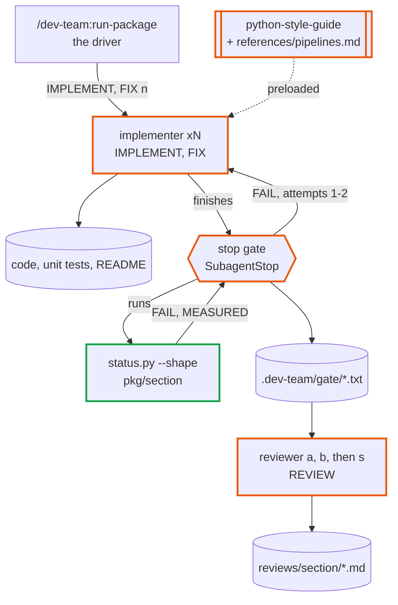
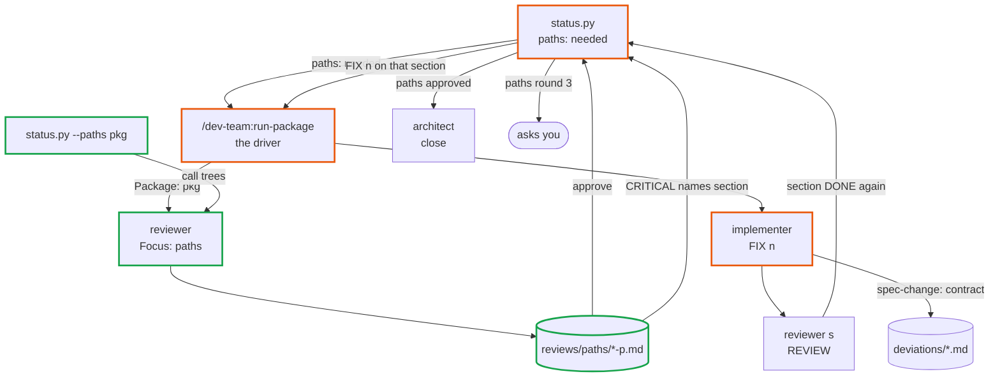
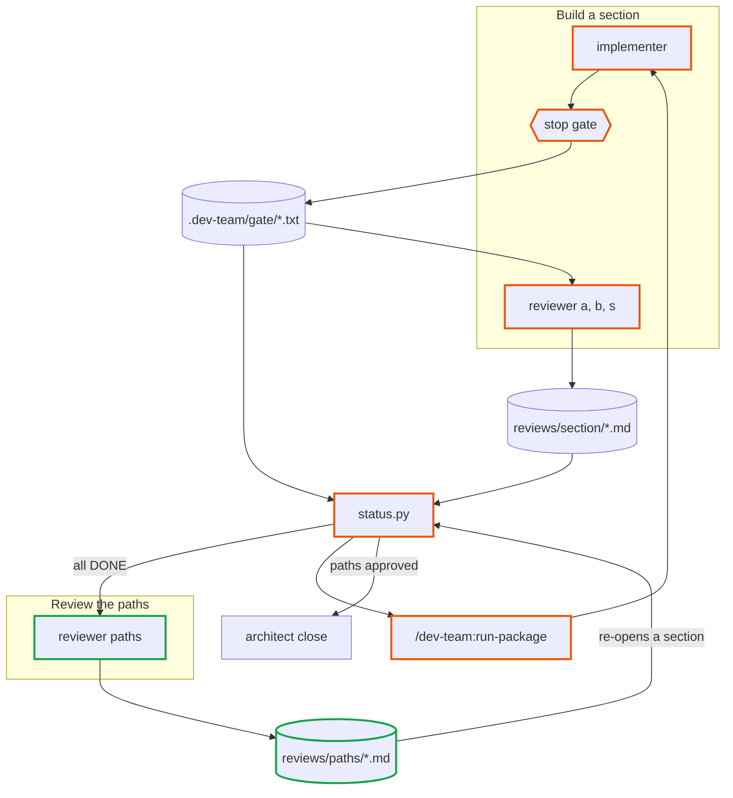

# dev-team 2.5-readability — design

Approved 2026-10-01. Mode: change. Branch `dev-team-2.5-readability`, cut from `main` at
`d6ec777` (dev-team 2.4.0).

Written from a discussion in the `quant` repo and approved there in one gate (the charts and the
writeup together) rather than through `design-plugin`'s two.
`plan-phases` reads it, in a chat that has seen nothing else, to write the phase notes and their
evals. `run-phase` reads it for the why. Anything decided in the discussion and not written here
is lost. Line numbers cite `main` at `d6ec777`, after the 2.4.0 merge.

## The idea

A package built by dev-team reads from its command down to its first external effect without
getting lost. Today it does not. The evidence is the `data` package in `quant`, built by
`run-package data` under 2.3.0 and shipped with every review approved:

- `data-build` reaches its first vendor download 17 frames down, across six modules:
  `cli.build → _main → action → run_build_pipeline → ingest_pipeline → guarded → lambda →
  _ingest_steps → _ingest → plan.ingest → run_build → _execute → _guarded → _RUNNERS[stage] →
  market_stage → load_account → _Loader.run → fetch → client.download`. Four of those frames are
  a closure, a lambda or a dict lookup that an IDE cannot jump through.
- 416 of its 691 private helpers (60%) are called from exactly one place; 66 of those have three
  statements or fewer. `python-style-guide` "Function shape" already forbids these.
- 49 signatures take `**options: Unpack[...]`, backed by 14 option `TypedDict`s, and
  `_Loader.open(conn, run_id, (account, asset_type), clients, options)` packs a tuple.
- `pipelines/flows.py` does not read as its steps, which `agents/implementer.md:623-627`
  requires of the surface section. Review `2026-09-30-data-surface-r2-s` approved it.

Three things in the plugin produce this, and none is a rule the agents broke on purpose:

1. **The gate pushes code apart and nothing pushes back.** The stop gate holds every section to
   ruff `PLR0915`, `C901` and `PLR0913` (`pyproject-lint-config.toml:18`, `:44`, `:47-48`) as hard
   failures. These are per-function measures, so splitting a function always passes them,
   whatever the split costs the reader. `PLR0913` also counts keyword-only parameters, though
   `project-structure` §2 labels the row "Positional parameters" (`SKILL.md:108`), so an
   implementer at five arguments can only pass a sixth through a `**kwargs` bag, which ruff
   does not count. "Extract only when the jump buys something" is a sentence in the style guide
   that nothing checks.
2. **Readability cannot block.** `reviewer.md:179-183` makes "a docstring, a name, a function's
   shape" WARNING or SUGGESTION, and from round 2 an out-of-diff finding goes to the backlog.
3. **Nobody sees the path.** Every agent, reviewers included, is scoped to one section. The
   17-frame path crosses five sections, and each can look reasonable alone.

After 2.5:

- Keyword-only parameters are free; the cap is on positional ones (`PLR0917`).
- The gate fails a section run that adds a trivial single-use helper or an options bag, and
  measures indirect calls and entry-point depth.
- The implementer answers a size failure with a seam that passes the style guide's test, never
  with a bag, a tuple or a trivial helper.
- `python-style-guide` gains a pipelines reference, docstrings written from the caller's side,
  and naming rules for `log` and for private classes.
- Once every section is DONE, one reviewer follows each command from `cli.py` to its external
  effects. A closed list of its findings can block, and each one re-opens the section that
  holds it. The package is not shipped until the paths review approves.

How the main paths are fixed before any code exists (call paths at PLAN, surface designed first)
is `2.6-spine`, a separate design that builds on this one.

## Workflows

Both are parts of what `/dev-team:run-package <pkg>` already does. In the charts an orange
border is a changed component and a green one is new.

### Build a section and gate it

A ready IMPLEMENT or FIX row → a gated section whose new code adds no trivial helper and no
options bag.

- **Unit:** one implementer run on one section, unchanged from 2.4. The gate now also runs
  `status.py --shape <pkg> --section <s>` and writes its lines into
  `.dev-team/gate/<pkg>/<section>.txt`: `FAIL shape: <file:line> <kind> <name>` per offending
  definition the run added, `MEASURED shape indirect: <n>` and
  `MEASURED shape depth <entry point>: <n>` per README entry point, then `PASS shape <pkg>/<s>`
  when nothing failed.
- **Strengthened by:** the check judges only definitions on lines the run added (the same
  added-lines reading the Guarded checks use, `gate_on_stop.py:143-148`), so adopted code is
  measured, never failed; the implementer's size rule names the only valid answer to a limit;
  the correctness reviewer's Function-shape line cites `references/pipelines.md`.

| Input | Supplied by |
|---|---|
| What the gate fails on | file: `status.py`'s `--shape` rules (this design, **Decisions taken**) |
| How a function may be split | file: `python-style-guide` "Function shape" and `references/pipelines.md` |
| Which entry points to measure | file: the section README's **Entry points and interfaces** |

### Review the paths

Every section row DONE (surface included) → a paths report that approves, or FIX rounds on the
sections it names; the package close waits for it.

- **Unit:** one reviewer run on one package, `Focus: paths`, `Letter: p`. It reads the package
  contract's **Pipelines** and **Public surface (intent)**, `interface.md` **Pipelines** and
  **CLI commands**, the package's `[project.scripts]`, and `status.py --paths <pkg>`; then the
  code along each path. It writes `docs/packages/<pkg>/reviews/paths/<date>-r<n>-p.md`: the review
  report's headings plus a **Paths** table, one row per command (command, frames to its first
  external effect, indirect frames, verdict, the `file:line` of each finding).
- **Strengthened by:** a closed CRITICAL list of its own (P1-P4, **Decisions taken**), so the
  review converges like the section reviews do; `--paths` hands the reviewer the call tree, so it
  judges paths rather than rediscovering them; from round 2 it is scoped to the diff since its
  previous report; round 3 asks the user (*one more round* or *defer*), as a section review cap
  does.

| Input | Supplied by |
|---|---|
| Which commands to follow | file: the package `pyproject.toml` `[project.scripts]` |
| The call tree of each command | script: `status.py --paths <pkg>` |
| What a pipeline should look like | file: `python-style-guide/references/pipelines.md` |
| The depth budget | file: `project-structure` §2, new row **Main-path depth** |
| What a finding may block on | file: `reviewer.md` **Focus: paths** (P1-P4) |

## How they fit together

| File | Written by | Read by | Fields read | Stale when |
|---|---|---|---|---|
| `.dev-team/gate/<pkg>/<section>.txt` | stop gate | `status.py`, section reviewer, paths reviewer | `FAIL shape`, `MEASURED shape …` lines (new), plus 2.4's lines | the section's commit moves |
| `docs/packages/<pkg>/reviews/paths/<date>-r<n>-p.md` | paths reviewer | `status.py`, the FIX implementer, the next paths review | header (`Verdict`, `Round`, `Commit`), **CRITICAL** lines tagged `<section>:`, **Paths** | any section's commit moves after the report's `Commit:` |
| `docs/packages/<pkg>/reviews/<section>/r<n>-<letter>.md` (a, b, s) | section reviewer | `status.py`, implementer | unchanged | unchanged |
| `docs/packages/<pkg>/deviations/<section>.md` | implementer, reviewers | architect, designer, tester | unchanged; a paths FIX may raise `spec-change: contract` | unchanged |

## Components

| Name | Kind | Role | Reads | Writes | Used by | Origin |
|---|---|---|---|---|---|---|
| `pyproject-lint-config.toml` | config | swap `PLR0913` for `PLR0917`, `max-positional-args = 5` | — | — | build | asked |
| `project-structure` | knowledge skill | §2: the positional row names `PLR0917`; new row **Main-path depth** soft 6 / hard 8, enforced by the paths review; "a limit is met with a seam" | — | — | build, paths | composed |
| `python-style-guide` | knowledge skill | Function shape: options bags and main-path indirection; Docstrings: written from the caller's side; Logging: `log` reserved; Naming: no same-named private classes in sections that call each other | — | — | build, paths | asked |
| `python-style-guide/references/pipelines.md` | knowledge skill reference | the shape of a pipeline and of a section orchestrator, with the reader's test | — | — | build, paths | asked |
| `python-style-guide/references/docstring_examples.md` | knowledge skill reference | examples of caller-side summaries | — | — | build | asked |
| `status.py --shape` | script | per-section shape check: FAIL on added trivial helpers and options bags, MEASURED indirect calls and entry-point depth | section code, README entry points, git diff | stdout | build | composed |
| `status.py --paths` | script | per-command static call tree to external effects, with frame counts | package code, `[project.scripts]` | stdout | paths | composed |
| `status.py` state | script | `paths:` package line, paths re-open rule, `shipped:` needs the paths review, `next:` | paths reports | stdout | paths | composed |
| `gate_on_stop.py` | hook | runs `--shape` for every section, beside `check_surface_names` (`gate_on_stop.py:609`, wired at `:655`) | — | gate record | build | composed |
| `reviewer` | agent | new **Focus: paths**; correctness focus cites `pipelines.md` | as above | paths report | paths, build | asked |
| `implementer` | agent | size rule; FIX from a paths report | paths report | code | build, paths | composed |
| `designer` | agent | §4 of a section that orchestrates (and of `surface`) follows `pipelines.md` | `pipelines.md` | design | build | composed |
| `run-package` | workflow skill | spawn block **Reviewer — PATHS**; paths cap ask | `status.py` | — | paths | composed |
| `planning-templates/references/review-report.md` | knowledge skill reference | **Paths** heading for `Focus: paths`; letter `p` | — | — | paths | composed |
| `contracts.yml` | config | Focus values, report headings, driver fields, states text | — | — | all | composed |

## Outputs

### `docs/packages/<pkg>/reviews/paths/<date>-r<n>-p.md`

- Sections: the review report's header (`Verdict:`, `Round:`, `Focus: paths`, `Commit:`,
  `Convergence:` from round 2), **Scope**, **Paths**, **CRITICAL**, **WARNING**, **SUGGESTION**,
  **Carried** (round 2+), **Deviations** `- none`, **Spec-change**.
- **Paths**: one row per `[project.scripts]` command: command, frames to first external effect,
  indirect frames on the path, verdict (`pass`/`fail`), findings by number.
- Cites: every CRITICAL starts `<section>: P<k>` and names the frame's `file:line`; every
  **Paths** count is the `--paths` output's, never the reviewer's own count.
- Never claims: a finding outside P1-P4 as CRITICAL; a check result it did not read from the
  gate record or `--paths`; anything about a section's conformance (that is the section
  reviewers').
- Stale when: any section's commit moves after the report's `Commit:`.

### Gate record shape lines

- `FAIL shape: <file>:<line> trivial-helper <name>` / `options-bag <name>`, one per offending
  definition on an added line.
- `MEASURED shape indirect: <n>` (lambdas or nested functions passed as arguments, and calls
  through a subscripted mapping, in the section's non-test code).
- `MEASURED shape depth <entry point>: <n>`, one per README entry point: the deepest static
  intra-package path from it to a call that leaves the package.
- `PASS shape <pkg>/<section>` when no FAIL line was written.
- Never claims: a FAIL on a definition the run did not add.

### `status.py --paths <pkg>` output

- One block per command: the command, then one line per frame, indented by depth, `name
  (file:line)`; a frame reached through a lambda, closure or mapping is marked `[indirect]`; a
  call that leaves the package is a leaf marked `[effect: <callee>]`.
- A footer per command: `depth to first effect: <n>`, `indirect frames: <k>`.
- Never claims: a resolved call it could not resolve; an unresolved call is a leaf marked
  `[unresolved]`.

### `status.py` package report

- New line after `scaffold:`: `paths: needed`, `paths: round <n> (<verdict>)`, or `paths: approved
  (<report>)`.
- `shipped: yes` needs surface DONE, the surface check PASS (`shipped_line`, `status.py:1272-1280`),
  and `paths: approved`; otherwise `shipped: no (paths needed)` or `shipped: no (paths round <n>)`.
- `next:` names `/dev-team:run-package <pkg>` while the paths review is needed or a section it re-opened
  is not DONE.

## Cost

| Workflow | Cold run reads | Warm run reads | Horizon |
|---|---|---|---|
| Build a section | unchanged; the gate adds one `status.py --shape` run (AST over the section, `git diff`) | same | every implementer stop |
| Review the paths | contract, `interface.md`, `[project.scripts]`, `--paths` output, then the modules on each path (about 10-20 for a package like `data`) | round 2+: the diff since the last paths report, plus re-opened sections' reports | once per package, at close; again after a change file ships |
| Paths FIX rounds | one implementer plus one `full` reviewer per re-opened section | — | first paths review of an adopted or pre-2.5 package: expect several; afterwards rare |

## Decisions taken

| Decision | Chosen | Alternatives | Why | Origin |
|---|---|---|---|---|
| The argument cap | `PLR0917` (positional only), `max-positional-args = 5`; drop `PLR0913` | keep `PLR0913`; raise `max-args` | keyword-only parameters document themselves at the call site; counting them is what forces options bags | asked |
| Keep the statement and complexity limits | yes, unchanged | relax them | they catch real problems; the defect is that splitting is free, which the shape check and the paths review now price | asked |
| What the gate fails on | two kinds: a **trivial single-use helper** (private `_name`, one call site in the package, ≤3 statements excluding the docstring) and an **options bag** (`**name: Unpack[...]`), each only on lines the run added | fail on whole-section counts; measure only | both are already forbidden by the style guide and unambiguous to detect; added-lines scope never blocks adopted code | suggested |
| What the gate only measures | indirect calls and entry-point depth (`MEASURED`) | fail on thresholds | both have legitimate uses (`key=` callbacks, a real dispatch) and the thresholds are untuned; the paths review judges them on the main path | suggested |
| Exemptions from the trivial-helper rule | dunders, `@property`, a function passed by name to a library as a callback, tests | none | these have one call site by construction | suggested |
| The paths review is a reviewer focus, not a new agent | `reviewer`, `Focus: paths`, `Letter: p`, a `Package:` field instead of `Section:` | a new agent | the reviewer already owns severity, reports and convergence; one more focus reuses all of it | suggested |
| When the paths review runs | after every section row is DONE, before the close | after the surface section only; at every REVIEW | the whole path exists only then; an earlier review would judge stubs | asked |
| The paths review's blocking list | P1 a command's depth to its first effect past the hard **Main-path depth** (8); P2 a lambda, closure or mapping dispatch on a main path whose target cannot be named from the call site; P3 a pipeline or orchestrator that fails the `pipelines.md` reader's test; P4 a trivial single-use helper or options bag on a main path (code the gate never saw) | open judgement | a closed list keeps the loop converging, the same reason `reviewer.md:159-183` closes the section list; item 1 (a break) still applies | asked |
| Where paths findings go | each CRITICAL names a section; `status.py` re-opens it as FIX n with the paths report as its previous round; a fix that moves a step across sections is `spec-change: contract` | a cross-section implementer; findings to the backlog only | sections stay the unit of building; the existing spec-change route handles a contract that put a step in the wrong place | asked |
| Paths review cap | round 3 asks the user: *one more round* or *defer* (to `docs/followups.md`) | no cap | same as the section review cap | suggested |
| Shipped | needs `paths: approved` | the paths review advisory | a review that cannot block repeats today's failure | asked |
| Depth budget | soft 6, hard 8 frames from the command function to the first external effect | no budget; per-package budget | `data-build` is 17; a command → pipeline → section entry → two or three internal frames → client fits in 8. Per-command budgets arrive with 2.6's call paths | suggested |
| Docstring rule | a summary says what changes outside the function (tables written, calls out, console output), including what it delegates; `log` names logging only | wording only | the `ingest` `_load` "log each date" meant ledger rows and read as console output | asked |
| Base | `main` at `d6ec777` (2.4.0) | — | 2.4 rewrote the gate record, `status.py`'s gate reading, `shipped:` and the reviewer's CRITICAL list, which this design extends | suggested |
| Name | the **paths review** (`Focus: paths`, letter `p`, `paths:` line) | the walk | `run-package` already calls a one-section run a "`<section>` walk" (`SKILL.md:58`, `:231`, `:299`) | composed |

## Platform facts

| Fact | Status | Source or expected answer |
|---|---|---|
| ruff `PLR0917` is stable (no `--preview`) and counts positional parameters only | verified | `ruff 0.16.9` in `quant`: `def f(a,b,c,d,e,f)` fails `PLR0917`; `def f(a,b,c,*,d,e,f,g)` passes; `ruff rule PLR0917` documents `lint.pylint.max-positional-args`, default 5 |
| A reviewer spawned with a `Package:` field and no `Section:` field runs with the same tools and memory | verified | spawn fields are prompt text (`run-package` **Reviewer — REVIEW**, `SKILL.md:180-209`); nothing in the platform reads them |
| No other platform behaviour is new | — | the gate already shells out to `status.py` (`check_surface`, `gate_on_stop.py:617`) |

## Build order

1. **Lint and limits.** `pyproject-lint-config.toml` (`PLR0917`), `project-structure` §2 rows.
   Independent of everything else.
2. **Style guide.** "Function shape" additions, docstring and naming rules,
   `references/pipelines.md`, `docstring_examples.md`. Independent.
3. **`status.py --shape`.** The AST rules and the added-lines reading, then the gate wiring
   beside `check_surface_names` in `run_checks` (`gate_on_stop.py:640-657`). Depends on 2 for the rules' wording.
4. **`status.py --paths`.** The static resolver (imports inside the package, `self.` methods,
   module attributes; everything else a leaf). `--shape`'s depth measure reuses it, so build it
   before finishing 3's depth line.
5. **The paths reviewer.** **Focus: paths** in `reviewer.md`, the report template's **Paths**,
   `contracts.yml` claims. Depends on 4.
6. **State and driver.** `status.py`'s `paths:` line, the re-open rule, `shipped:`, `next:`;
   `run-package`'s **Reviewer — PATHS** block and cap ask. Depends on 5.
7. **Agent text.** Implementer size rule and paths FIX input; designer §4 rule; correctness focus
   citing `pipelines.md`.

Smallest slice that works end to end: steps 1, 3 (trivial-helper rule only) and the gate
wiring, run on one section of `quant`'s `data` package; the gate record shows the new lines.

## What must not break

- The review report filename pattern `r<n>-<a|b|s>.md` under `reviews/<section>/`
  (`status.py:798`, `:800`, `:870`, `:1758`, letters `[abs]`): paths reports live under `reviews/paths/` with letter `p`,
  and the section regexes do not read that directory.
- The section states and their order (`status.py:9-40`, `contracts.yml:398-409`): the paths review is a
  package line, not a state. A re-opened section shows as `FIX n`, an existing state.
- `shipped:` changes meaning. A package shipped before 2.5 reads `shipped: no (paths needed)`
  after the upgrade. What to do: run `/dev-team:run-package <pkg>` once; the driver spawns the
  paths review. For `quant`'s `data`, expect P1-P4 findings and FIX rounds.
- Existing repos keep their root `pyproject.toml`: the lint block is merged only at scaffold
  (`implementer.md:257`). The CHANGELOG line tells the user to replace `PLR0913` with
  `PLR0917` and `max-args` with `max-positional-args` by hand; until they do, the old rule
  still runs and the shape check still catches the bags it causes.
- `contracts.yml`: the Focus-values forbid (`:133-138`) gains `paths`; the reviewer driver-fields claim
  (`:473-479`) spans `### Reviewer — REVIEW` to `### Architect — PLAN`, so the new
  `### Reviewer — PATHS` block goes between them and its fields are checked against the
  reviewer's Inputs; the gate-record claim (`:411`) needs no new line kind, since the shape lines
  use `PASS`, `FAIL` and `MEASURED`.
- `run-package` **Loop** step 7 (`SKILL.md:297-300`) closes when every row is DONE and the
  surface check passes; it gains the paths branch (spawn the review on `paths: needed`, ask on
  `paths round 3`) beside the surface-check branch in **Asking** (`:338`).

## Non-goals

- No automatic refactoring of existing code. The paths review names, the implementer fixes.
- No third reviewer in round 1 of every section (considered and declined: a section reviewer
  cannot see a path that crosses sections, and it would add an agent to every section).
- No change to the statement, complexity, module-size or class-size limits.
- No docstring linter beyond ruff's `D` rules; the caller-side rule is a reviewer WARNING.
- Fixing the main paths before code exists (call paths at PLAN, surface designed first) is
  `2.6-spine`.
