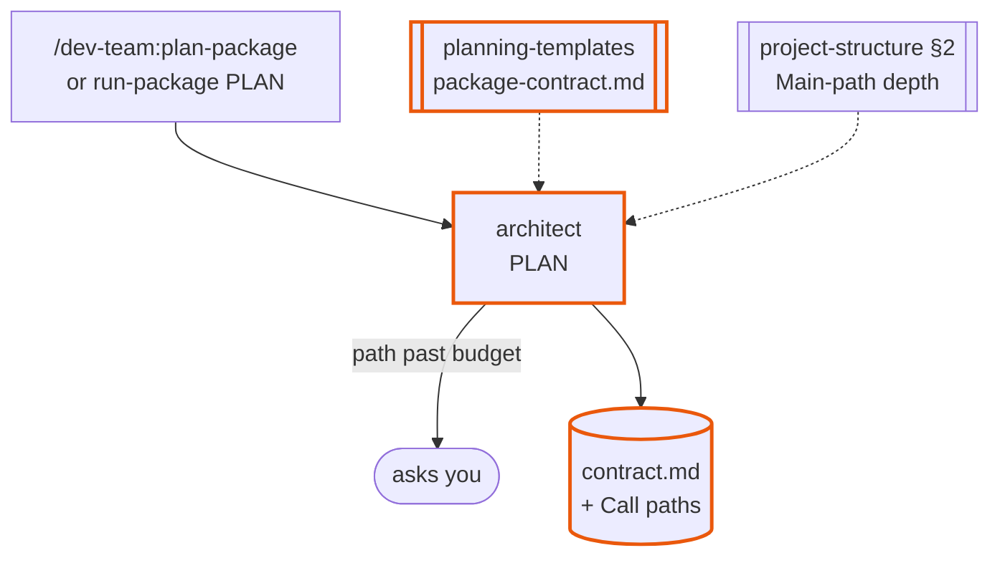
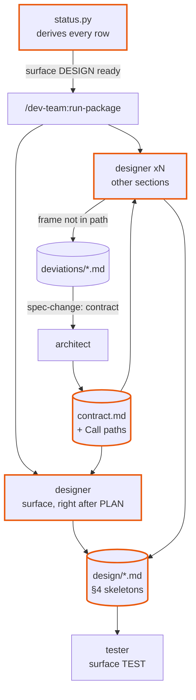
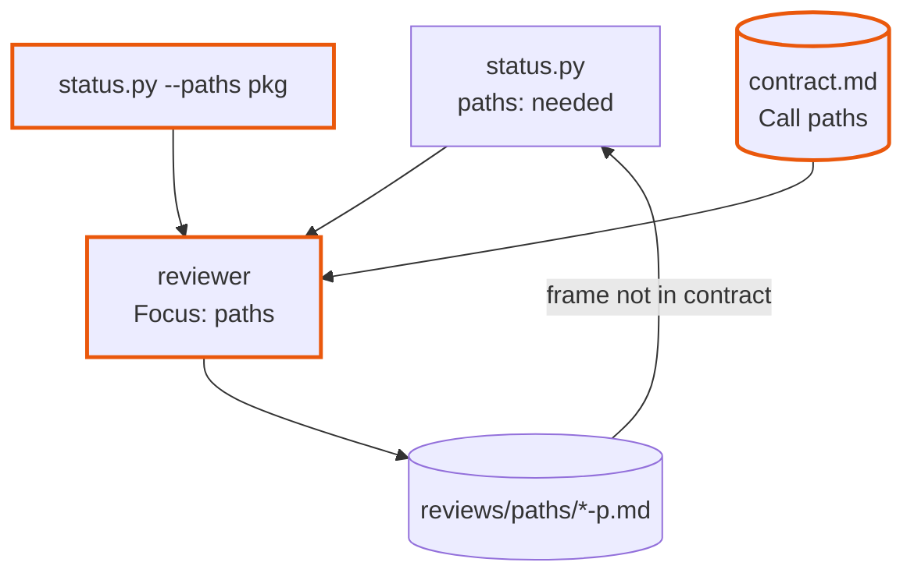
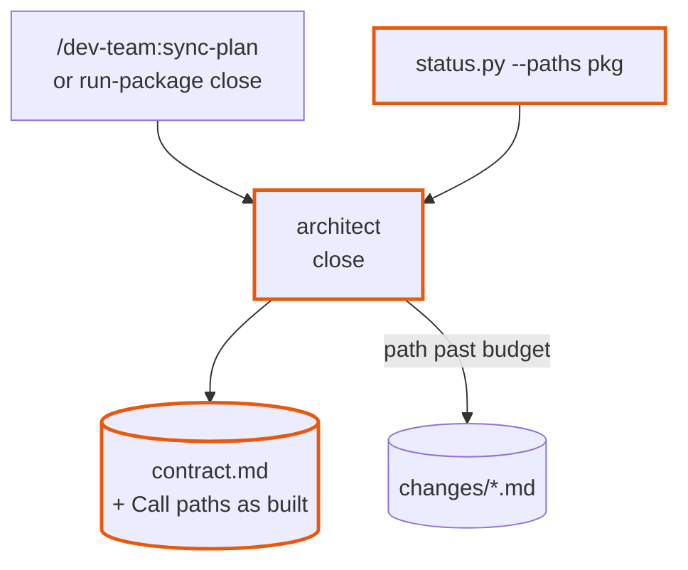
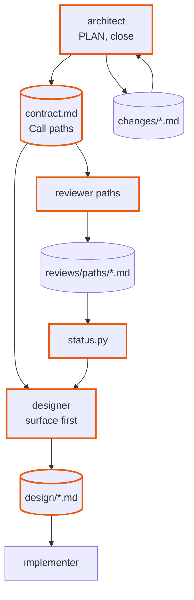

# dev-team 2.6-spine — design

Approved 2026-10-01. Mode: change. Branch `dev-team-2.6-spine`, cut from `main` at `d6ec777`
(dev-team 2.4.0) to hold this design; its build starts only after `dev-team-2.5-readability`
merges, and the branch takes that merge first.

Written from a discussion in the `quant` repo and approved there in one gate (the charts and the
writeup together) rather than through `design-plugin`'s two.
`plan-phases` reads it, in a chat that has seen nothing else, to write the phase notes and their
evals. `run-phase` reads it for the why. Anything decided in the discussion and not written here
is lost. Line numbers cite `main` at `d6ec777`, after the 2.4.0 merge. Terms defined in `2.5-readability-design.md`
(frame, external effect, Main-path depth, `--paths`, the paths review, P1-P4) are used here unchanged.

## The idea

A package's main paths are decided at PLAN and fixed in documents before any section is
designed, so every section is built to fit a path that already reads well. Today the path is
whatever the sections add up to. Each section is designed and built alone, and the `surface`
section, which writes the pipelines that chain them, is designed last, from the sections' shipped
READMEs (`package-contract.md:39-43`; `status.py:437-438` forces `surface` to depend on every
other section). By then every entry point it chains is fixed. In `quant`'s `data` package that
gave `data-build` 17 frames to its first download.

2.5's paths review catches this at the end and re-opens the sections it names. That works, but it is
the expensive way: a fix that moves a step between sections is a change file, a re-design, new
intent tests and a re-review across several sections, done by agents who were not there when the
code was written. This design moves the decision to the front, so the paths review mostly confirms.

After 2.6:

- The package contract carries **Call paths**: for each command, the frames from the command to
  each kind of external effect, every frame a pipeline or a **Section interfaces** entry, within
  the depth budget.
- The `surface` section is designed and tested right after PLAN, from the contract's **Section
  interfaces** and **Call paths**; its design §4 is the pipeline skeleton in `pipelines.md`'s
  shape. Only its IMPLEMENT still waits for every other section.
- Each section's design §4 includes the skeleton of every entry point a call path passes
  through, and adds no frame the path does not list. A path that needs another frame is a
  `spec-change: contract`, decided by the architect before the code exists.
- The paths review compares the code's `--paths` output to the contract's **Call paths**; a frame the
  contract does not list is a break (CRITICAL under `reviewer.md:164-167` already).
- A package planned before 2.6 gets its **Call paths** at the next `sync-plan`, written from the
  code as built, with any path past the budget raised as a change file.

## Workflows

All are parts of `/dev-team:plan-package`, `/dev-team:run-package` and `/dev-team:sync-plan`.
In the charts an orange border is a changed component and a green one is new.

### Plan the paths

`/dev-team:plan-package <pkg>` or run-package's PLAN → a package contract whose **Call paths**
fix every command's frames.

- **Unit:** one architect run on one package contract. For each command in **Public surface
  (intent)** it writes one **Call paths** entry: the command, a depth budget (default the hard
  **Main-path depth**, 8), and per kind of external effect (vendor call, database write, file
  write) the numbered frames down to it, each frame a pipeline name or a **Section interfaces**
  signature, the effect named last.
- **Strengthened by:** every frame must be a name the contract defines elsewhere, so a frame
  with no owner is visible at PLAN; a path that cannot fit its budget is a question to the user
  (raise the budget for that command, or move a responsibility), recorded in
  `docs/decisions.md`; the template's line budget (200, `package-contract.md:5`) gains a
  **Call paths** allowance.

| Input | Supplied by |
|---|---|
| Which commands exist | file: the contract's **Public surface (intent)** |
| Which section owns each step | file: the contract's **Sections** and **Pipelines** |
| The depth budget | file: `project-structure` §2 **Main-path depth**; the user, per command, when asked |

### Design against the paths

A planned package → section designs whose entry points are the contract's frames, with the
surface design first.

- **Unit:** one designer run on one section, as today. Two things change. The `surface`
  designer runs as soon as PLAN is done and reads the contract's **Section interfaces** and
  **Call paths** instead of shipped READMEs; its §4 is one skeleton per pipeline in
  `pipelines.md`'s shape, each step a frame from **Call paths**. Every other designer's §4
  gains, for each entry point a call path passes through, its skeleton: the steps as calls,
  each call either an effect, a sibling's **Section interfaces** name, or a private phase the
  style guide allows, with the frame count to the effect.
- **Strengthened by:** a designer may not add a frame a call path does not list; needing one is
  `spec-change: contract`, the designer's existing spec-change return, so the architect decides it
  before code exists; the tester writes the surface's intent tests from the early design, red
  by construction until IMPLEMENT, as for any new section.

| Input | Supplied by |
|---|---|
| The frames a section's entry points must be | file: the contract's **Call paths** |
| The pipeline shape | file: `python-style-guide/references/pipelines.md` (2.5) |
| A sibling's interface while it is unbuilt | file: the contract's **Section interfaces** (as today for designing; shipped READMEs still win at IMPLEMENT) |

### Review against the paths

Every section DONE → the 2.5 paths review, now comparing the code's paths to the contract's.

- **Unit:** the 2.5 paths review. `--paths` gains `--against-contract`, printing per command the
  contract's frames beside the code's and marking each `match`, `extra` (in code, not in
  contract) or `missing`. The **Paths** table gains a **Contract** column.
- **Strengthened by:** an `extra` frame is a break against the contract, already CRITICAL
  (`reviewer.md:164-167`); P1's budget is the command's own from **Call paths**, not the global
  default.

| Input | Supplied by |
|---|---|
| The declared frames | file: the contract's **Call paths** |
| The built frames | script: `status.py --paths <pkg> --against-contract` |

### Add paths to a package planned before 2.6

`/dev-team:sync-plan <pkg>` (or run-package's close) on a contract with no **Call paths** → the
heading written from the code as built.

- **Unit:** one architect close. With no **Call paths** heading, it runs `--paths`, writes the
  heading from the output (frames as built), and for each command past the hard budget writes a
  change file proposing where the path is cut.
- **Strengthened by:** the architect writes what the code does, never a target the code does
  not meet, so the contract stays true; the change file is the user's to approve, so nothing is
  rebuilt silently.

| Input | Supplied by |
|---|---|
| The built frames | script: `status.py --paths <pkg>` |

## How they fit together

| File | Written by | Read by | Fields read | Stale when |
|---|---|---|---|---|
| `docs/packages/<pkg>/contract.md` **Call paths** | architect | designer (every section), paths reviewer, `status.py --paths --against-contract` | per command: budget, frames in order, effect | a **Section interfaces** or **Pipelines** entry it names changes |
| `docs/packages/<pkg>/design/<section>.md` §4 | designer | tester, implementer, section reviewer | the entry-point skeletons and their frame counts | the contract's **Call paths** entry it implements changes |
| `docs/packages/<pkg>/design/surface.md` §4 | designer, right after PLAN | tester, surface implementer | the pipeline skeletons | as above |
| `docs/packages/<pkg>/reviews/paths/<date>-r<n>-p.md` | paths reviewer | `status.py` | **Paths** with the **Contract** column | as in 2.5 |

## Components

| Name | Kind | Role | Reads | Writes | Used by | Origin |
|---|---|---|---|---|---|---|
| `planning-templates/references/package-contract.md` | knowledge skill reference | new **Call paths** heading after **Pipelines**; line budget raised for it | — | — | plan | asked |
| `architect` | agent | writes **Call paths** at PLAN; asks on a path past budget; at the close, writes them as built for a contract without them | contract, `--paths` | contract, change files | plan, legacy | asked |
| `designer` | agent | `surface` designed from the contract; §4 entry-point skeletons; no frame outside the path | contract **Call paths**, `pipelines.md` | design | design | asked |
| `status.py` readiness | script | `surface`'s forced dependency on every section applies to IMPLEMENT only; DESIGN and TEST are ready after PLAN | contract | stdout | design | composed |
| `status.py --paths --against-contract` | script | code frames beside contract frames, `match`/`extra`/`missing` | code, contract | stdout | paths | composed |
| `reviewer` | agent | **Focus: paths** reads **Call paths**; P1 uses each command's budget | as above | paths report | paths | composed |
| `implementer` | agent | surface IMPLEMENT reconciles the early design with shipped READMEs (a difference is a deviation, as `implementer.md` surface step 1 already says) | READMEs | code | build | composed |
| `project-structure` | knowledge skill | §1: before `surface` is built, its design exists; §2 row cites **Call paths** | — | — | all | composed |
| `contracts.yml` | config | **Call paths** heading claim (owner the template; readers architect, designer, reviewer, `status.py`) | — | — | all | composed |

## Outputs

### `docs/packages/<pkg>/contract.md` — **Call paths**

- Sections: one bullet per command in **Public surface (intent)**:
  `` `<command>` (budget <n>): ``, then one sub-bullet per kind of external effect:
  `` 1 `cli.<verb>` → 2 `<pipeline>` → 3 `<section>.<entry point>` → … → `<effect>` ``.
- Cites: every frame is a name defined in **Pipelines** or **Section interfaces**; every effect
  is a provider client, a table write or a file write the contract names.
- Never claims: a frame with no owner; a budget above the hard **Main-path depth** without a
  `D<n>` that allows it; for an as-built entry, a frame the code does not have.
- Stale when: a frame's interface entry changes; an approved change file moves a step.

### `docs/packages/<pkg>/design/<section>.md` §4 additions

- Sections: per entry point on a call path, a fenced skeleton: the signature, then the steps as
  calls with one comment each, then `frames to effect: <n>`.
- Cites: the **Call paths** entry it implements, by command.
- Never claims: a call to a sibling not in **Section interfaces**; a frame count that differs
  from the contract's.

## Cost

| Workflow | Cold run reads | Warm run reads | Horizon |
|---|---|---|---|
| Plan the paths | the architect's PLAN reads plus about one pass over **Public surface** and **Section interfaces** per command | change files only | once per package; per change file touching **Pipelines** |
| Design against the paths | unchanged per designer; the surface designer reads the contract instead of N READMEs (cheaper) | — | per section |
| Review against the paths | 2.5's paths review plus one `--against-contract` run | — | per package close |
| Legacy paths | one `--paths` run and the contract | — | once per pre-2.6 package |

## Decisions taken

| Decision | Chosen | Alternatives | Why | Origin |
|---|---|---|---|---|
| Fix the path in documents or in code first | documents: **Call paths** in the contract, skeletons in designs, code built per section as today | a walking skeleton: a SPINE step after PLAN that builds `pipelines/`, `cli.py` and stub entry points in every section's path | stubs in sibling paths break the write scope (each agent writes only its section), flip the designer into document mode (code at the path), and make intent tests red for the wrong reason | asked |
| Where the paths live | a new **Call paths** heading in the package contract | inside **Pipelines**; in the surface design | the contract outranks designs (`reviewer.md:70-93`), so a designer cannot route around it; a heading of its own is a parseable claim | suggested |
| Surface design timing | right after PLAN; TEST too; IMPLEMENT still last | surface entirely first; unchanged | the pipeline skeleton must exist before sections design to it, but the code needs the sections' shipped entry points | asked |
| Surface design inputs | contract **Section interfaces** and **Call paths**; shipped READMEs win at IMPLEMENT | READMEs only (today) | READMEs do not exist yet; the existing README-vs-contract deviation rule covers drift | composed |
| Sections read the surface design | no; they read the contract's **Call paths** | read `design/surface.md` | `designer.md:42-44` forbids designing against another section's design; the contract carries the same frames | composed |
| A frame not in the path | `spec-change: contract` at design time; CRITICAL break at paths-review time | WARNING | a frame added silently is how depth grows | asked |
| Budget per command | default the hard **Main-path depth** (8); higher only with a `D<n>` | one global budget | some commands legitimately go deeper (a backfill through a retry layer); the decision record makes it visible | suggested |
| Packages planned before 2.6 | the architect writes **Call paths** as built at the next close, and a change file for each path past budget | require a re-plan; leave them without | true documents first, then a reviewed proposal; nothing is rebuilt without the user's approval | suggested |
| Base | cut from `main` after 2.5 merges | together with 2.5 | it depends on `pipelines.md`, `--paths` and the paths review | asked |

## Platform facts

| Fact | Status | Source or expected answer |
|---|---|---|
| No platform behaviour is new | — | the change is to documents, `status.py` and agent text |

## Build order

1. **Template.** **Call paths** in `package-contract.md`, its line allowance, and the
   `contracts.yml` heading claim.
2. **Architect at PLAN.** Writing the heading; the budget ask. Depends on 1.
3. **`status.py` readiness.** `surface` DESIGN and TEST ready after PLAN; IMPLEMENT still after
   every section. Independent of 2 once 1 exists.
4. **Designer.** `surface` from the contract; §4 skeletons; the no-extra-frame rule. Depends on
   1 and 2.
5. **`--paths --against-contract` and the paths review's **Contract** column.** Depends on 1 and 2.5's
   `--paths`.
6. **Architect at close for legacy contracts.** Depends on 5's output format.

Smallest slice that works end to end: steps 1, 2 and 5 on `quant`'s `data`: write its
**Call paths** at a sync, then run the paths review with `--against-contract`.

## What must not break

- `status.py`'s forced `surface` dependency (`status.py:81`, `:411`, `:437-438`) changes from row
  readiness to IMPLEMENT readiness. Packages mid-build when 2.6 installs: a `surface` row at
  PLAN or DESIGN becomes ready earlier; nothing already designed is re-opened.
- `designer.md:172-176` (surface designed from READMEs) and `package-contract.md:42` ("designed
  last, from the shipped READMEs") are rewritten; the contract claims citing them move.
- A contract with no **Call paths** heading still parses: designers skip the skeleton rule,
  `surface` keeps the old timing, and the paths review falls back to 2.5's global budget, until the
  close writes the heading.
- The package contract's line budget (200) rises for packages with many commands; the template
  says by how much.

## Non-goals

- No walking skeleton in code (the alternative in **Decisions taken**; reconsider only if
  document-level paths prove too loose).
- No change to how sections are built, gated or reviewed; 2.5 owns that.
- No automatic cut of an over-budget legacy path; the change file proposes, the user approves.
