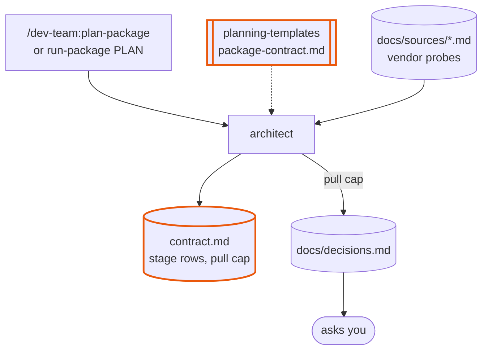
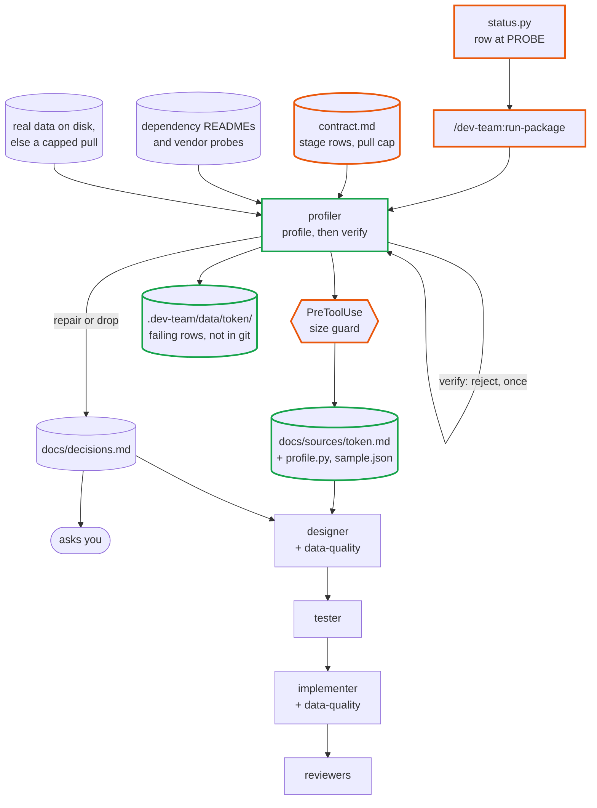
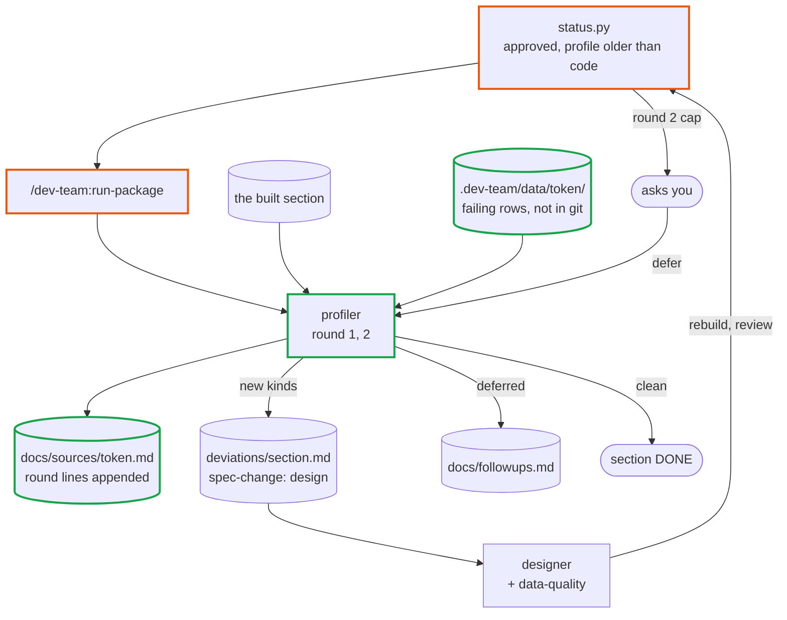
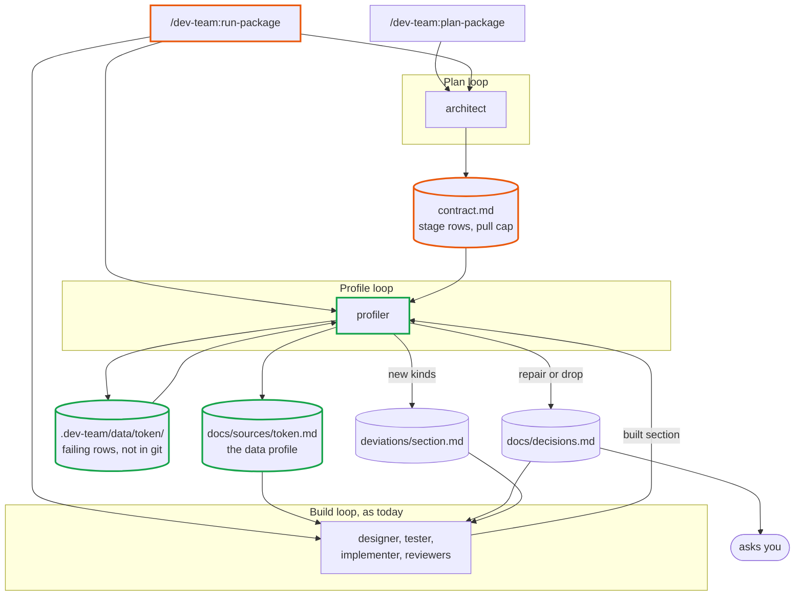

# dev-team 2.7-data-loop — design

Approved 2026-10-03. Mode: change. Branch `dev-team-2.7-data-loop`.

Written by `design-plugin` from the discussion, and approved in two gates: the charts, then
this writeup. `plan-phases` reads it, in a chat that has seen nothing else, to write the phase
notes and their evals. `run-phase` reads it for the why. Anything decided in the discussion and
not written here is lost. Line numbers cite `main` at `2dfadc3` (dev-team 2.6.0).

## The idea

After 2.7, a section whose job is to clean, validate, reconcile or audit data is designed from
a profile of the real data it will receive. The architect marks those sections in the package
contract. Once the sections feeding a marked section have shipped, a new agent, the profiler,
runs checks over all the real data, sets the good rows aside, sorts the failing rows into
kinds, and proposes a treatment for each kind. The user decides every treatment that changes or
removes data. The section is then designed, tested and built with one handler and one test per
kind. After it is built the profiler runs again on the section's own output, and anything still
unexplained reopens the section, for at most two rounds before it asks the user.

What is wrong today. The loop is design, then test, then build, and every step after the probe
follows the design. Nothing looks at real data in bulk:

- A PROBE step runs only for a section whose row names an external `source`
  (`skills/run-package/SKILL.md:100-105`). A cleaning section reads a sibling's output, so it is
  never probed.
- An `api` probe keeps a few responses capped at 200 KB each (`agents/researcher.md:186-187`).
  A `dataset` probe computes per-column statistics and writes no rows
  (`agents/researcher.md:244-260`). Neither sorts failing rows into kinds or looks across rows.
- In the `quant` repo's `data` package the `prices` section's clean predicate was carried over
  from the legacy `price_cleaning` skill. The built package records every rejected row with a
  reason (`prices_quarantine`) and persists audit findings, and no agent ever read either back.

A second requirement came with the request: this is for data-heavy sections only, and packages
with none must not pay for it. No existing agent file gains a line. The method lives in files
that load only when a marked section runs (**What must not break** holds the budget).

## Workflows

All three are parts of `/dev-team:plan-package` and `/dev-team:run-package`. In the charts an
orange border is a changed component and a green one is new.

### Mark the data stages

`/dev-team:plan-package <pkg>` or run-package's PLAN → a package contract whose data-heavy
sections are marked.

- **Unit:** one architect run on one package contract. For each section whose job is to clean,
  validate, reconcile or audit data its dependencies produce, it writes three things: `stage:<token>`
  in the row's `source` cell; `dev-team:data-quality` in its `builds with` cell, beside any
  project skills; and one line under **Package conventions**,
  `` `stage:<token>` — <what the data is>; lands at <path>; pull cap <n> <unit>, D<n> ``.
  The token is one lowercase word (`project-structure` §4) and names the data, not the section
  (`rawbars`, not `prices`).
- **Strengthened by:** the marks sit in the Sections table, where the user sees and edits them.
  The pull cap is a `D<n>` with a recommendation and an assumption, so the user approves vendor
  spend and an unanswered one does not block. `status.py --run-gate` fails a `stage:` row whose
  `depends on` is empty, because nothing would produce its data.

| Input | Supplied by |
|---|---|
| Which sections handle data | file: the contract's **Purpose** capabilities, from the brief |
| When a section counts as data-heavy | file: `package-contract.md`'s `source` paragraph (changed) |
| The pull cap | file: the vendor probe docs' **Cost and time of a full pull** and **Rate limits and quotas**; then the user, through the `D<n>` |

### Profile before design

A marked section whose dependencies are all DONE → its profile, the user's treatment decisions,
then the normal DESIGN, TEST, IMPLEMENT and REVIEW.

- **Unit:** one profiler run, `Mode: profile`, on one stage for one section, round 0. It reads
  the contract row, the shipped dependency READMEs, the dependencies' vendor probe docs and the
  project skills in the row's `builds with`. It writes a re-runnable program,
  `docs/sources/<token>.profile.py`, whose checks run as queries over all the data. The program
  counts the rows that pass and writes only the failing rows, tagged with the checks they fail,
  to `.dev-team/data/<token>/`. The profiler groups the failing rows, examines each group with
  its neighbouring rows and any second source, and writes one **kind** per group to
  `docs/sources/<token>.md`: an id `K<n>`, a name, the check that isolates it, a count over a
  denominator, a proposed treatment (`repair`, `drop`, `quarantine` or `flag`), and up to five
  example rows in `docs/sources/<token>.sample.json`.
- **Strengthened by:**
  - Structure. Every kind carries an executable check, so its count is reproduced by re-running
    the program. Every check names what it judges against. Failing rows in no kind are counted
    under **Unexplained** and never hidden.
  - An evaluator. A second profiler run, `Mode: verify`, in its own context, draws for each new
    kind a seeded sample of rows the check flags and rows it passes, and rejects a check that
    catches good rows or misses bad ones. A rejection goes back to a `Mode: profile` run once,
    with the rejected kinds as `Revise:`. A kind rejected a second time is marked `unverified`
    and its rows count as unexplained.
  - The user. The verify run raises one decision stub per verified kind whose proposed
    treatment is `repair` or `drop`, with the proposal as `Recommendation:` and no assumption,
    so the section is BLOCKED until the user answers. `quarantine` and `flag` raise nothing.
  - The next workflow. The built section is run against the same checks, which tests whether
    the kinds were right.
- **Never:** write to the project's real data store; exceed the pull cap; edit a file under a
  package; commit more than five example rows per kind; write a column that looks personal
  unredacted (the researcher's rule, `agents/researcher.md:254-260`, restated in the profiler).

| Input | Supplied by |
|---|---|
| Which stage, and the pull cap | file: the contract's Sections row and **Package conventions** line |
| How to read or pull the data | file: the dependency READMEs' **Entry points and interfaces** |
| What a valid row is | file: the contract's shapes; the vendor probes' **Observed schema**; the row's project skills, each rule treated as a kind to confirm or rule out |
| Whether a run is due, its mode and round | script: `status.py`, printed whole by `status.py --profile <pkg>/<section>` |
| Treatments that change or remove data | the user, through `docs/decisions.md` |

The build loop reads the profile through fields it already has, which is why no agent file
changes:

- **Delivery.** The profile is a probe doc at `docs/sources/<token>.md`, so `status.py --fields`
  and `--inputs` already list it under `Source probes:` (`status.py:2935`).
- **Designer.** It invokes `dev-team:data-quality` because the row's `builds with` is its
  `Skills to invoke:` field (`run-package/SKILL.md:134`, `agents/designer.md:202`). The kinds
  sit under the heading **Quirks**, and `agents/designer.md:130` already requires every line
  under **Quirks** to become handled behavior.
- **Tester.** It already copies `<source>.sample.json` into `tests/fixtures/`
  (`agents/tester.md:142`) and writes every case the design's **Tests** names. The design names
  one per kind.
- **Implementer.** It invokes every skill the design's **Skills used** lists
  (`agents/implementer.md:362-367`); the designer lists `data-quality` there.
- **Reviewers.** Conformance checks the code against the design's kinds table as it checks any
  design.

### Profile the built section

A marked section its reviewers have approved → DONE only when a profile round over its own
output finds nothing unexplained.

- **Unit:** one profiler run, `Mode: profile`, round `n` ≥ 1, on one built section. It points
  the section at a store under `.dev-team/data/<token>/work/` through the section's documented
  settings, runs the section's entry point over the stored input, and re-runs every check on
  what the section accepted and on what it rejected. It examines only what is new: accepted rows
  that fail a check, and rejected rows that match no decided kind. It appends a `### Round <n>`
  block and a round line to the profile: the round, the date, the commit profiled, and a
  verdict.
- **Strengthened by:**
  - The checks are the same program as round 0, so the result does not rest on an agent's
    memory of it. The previous round's counts are the baseline every count is printed beside.
  - New kinds are verified by a `Mode: verify` run exactly as in round 0. A round with no new
    kind and nothing unexplained needs no verify run: the profile run writes `clean` itself.
  - New findings reopen the section through the existing path. The verify run writes one
    `spec-change:design` entry to `docs/packages/<pkg>/deviations/<section>.md` with the kinds
    and counts as `Found:`, and `status.py` puts the row at DESIGN (rule 4, `status.py:1333`).
    A new `repair` or `drop` kind also gets its decision stub, so the row is BLOCKED first.
  - A cap. When round 2 or later closes `new kinds`, the row is BLOCKED with evidence
    `profile r<n> new kinds (cap)` while that round's spec-change entry is open. The driver
    asks: *one more round* or *defer*. *One more round* grants the designer its run. *Defer*
    runs the profiler with `Mode: defer`, which appends the open kinds to `docs/followups.md`,
    resolves its own spec-change entry, and appends a `deferred` round line.
- **Never:** claim `clean` while **Unexplained** is above zero, a kind is `unverified`, or an
  accepted row fails a check; run the section against the project's real store.

| Input | Supplied by |
|---|---|
| The kinds and their decided treatments | file: the profile, and `docs/decisions.md` |
| The previous round's counts (the baseline) | file: the profile's `### Round <n-1>` block; `.dev-team/data/<token>/rounds/` |
| Where the section can be pointed | file: the section's shipped README, **Entry points and interfaces** and its settings |
| Whether a round is due | script: `status.py`, from the newest round line's commit against the section's code |
| At the cap, one more round or defer | the user, asked by the driver |

## How they fit together

| File | Written by | Read by | Fields read | Stale when |
|---|---|---|---|---|
| `docs/packages/<pkg>/contract.md` Sections row and **Package conventions** line | architect | `status.py`, profiler, driver (through `status.py`) | `source` cell `stage:<token>`; `builds with`; where the data lands; the pull cap | a change file edits the row |
| `docs/sources/<token>.md` | profiler | designer, tester, implementer, reviewers, `status.py`, later profiler rounds | **Observed schema**, **Checks**, **Quirks** (the kinds), **Unexplained**, the round lines under `## <pkg>/<section>` | the section's code is newer than the newest round line's commit; a dependency's code is newer than round 0's |
| `docs/sources/<token>.sample.json` | profiler | tester (copies to `tests/fixtures/`), implementer | per kind id: up to five failing rows; `accepted`: five passing rows | a kind is added |
| `docs/sources/<token>.profile.py` | profiler | later profiler rounds | the checks, by id | a kind's check is revised |
| `.dev-team/data/<token>/` | the profile program | later profiler rounds, the verify run | pulled input, failing rows per round, per-round counts | never; a missing folder is rebuilt by re-running the program |
| `docs/decisions.md` | the user through the driver; stubs from the section's inbox | designer, `status.py` | each kind's decided treatment | — |
| `docs/packages/<pkg>/deviations/<section>.md` | profiler (verify run) | `status.py`, designer | the `spec-change:design` entry's `Found:` | resolved by the designer, or by the profiler on defer |

## Components

| Name | Kind | Role | Reads | Writes | Used by | Origin |
|---|---|---|---|---|---|---|
| `profiler` (new) | agent | Profiles one data stage for one section, one round, in `Mode: profile`, `verify` or `defer`. Runs the repo's shipped code; never edits it. Tools: Read, Write, Edit, Glob, Grep, Bash, Skill. `model: inherit`, `memory: project`. | contract, dependency READMEs, vendor probes, the row's project skills, real data, the local folder | the profile, its program and example rows; the local folder; decision stubs; a spec-change entry; `docs/followups.md` on defer | profile before design, profile the built section | composed |
| `data-quality` (new) | knowledge skill, `user-invocable: false` | How a section is designed and built from a profile (see **Outputs**). Invoked by the designer through `Skills to invoke:` and by the implementer through the design's **Skills used**. | — | — | both profile workflows | composed |
| `planning-templates/references/data-profile.md` (new) | knowledge skill reference | The profile's headings, in order, and what goes under each. | — | — | both profile workflows | composed |
| `planning-templates/references/package-contract.md` | knowledge skill reference | The `source` paragraph (`:24-32`) gains the kind `stage`: when to mark a section, the `builds with` entry, the **Package conventions** line. | — | — | mark | asked |
| `planning-templates/SKILL.md` | knowledge skill | One table row for the new reference. | — | — | all | composed |
| `planning-templates/references/decisions-inbox.md`, `deviations-entry.md` | knowledge skill references | The profiler is a writer: a stub's `Raised by:` may be `K<n>` of a profile; a spec-change entry's `Raised by:` may be the profiler. | — | — | both profile workflows | composed |
| `status.py` | script | `stage:` sources in rule 3 (PROBE) before design and after approval; `--profile <pkg>/<section>` prints the profiler's spawn block; the round cap under rule 1 (BLOCKED); `--run-gate` fails a `stage:` row with no dependency and an example-rows file over 200 KB. | contract, profile, section code, ledger | stdout | all | composed |
| `run-package` | workflow skill | At PROBE a `stage:` source spawns `dev-team:profiler` with `status.py --profile`'s output verbatim; one **Asking** bullet for the cap; `profiler <n>` in the summary's agent runs. | `status.py` | — | both profile workflows | composed |
| `hooks/guard_writes.py` | hook (PreToolUse) | A row for `dev-team:profiler`: `docs/sources/**`, `.dev-team/data/**`, the ledgers, the inboxes, `docs/followups.md`. Refuses a Write or Edit of `docs/sources/*.sample.json` whose content is over 200 KB, for any guarded role. | — | — | both profile workflows | composed; the size guard suggested and accepted |
| `contracts.yml` | config | Heading claims for the profile (owner `data-profile.md`; readers the profiler, `data-quality`, `status.py`); the round-line format; the line budgets under **What must not break** where a claim type allows. | — | — | all | composed |
| `README.md`, `site/site.yml`, `VERSIONING.md`, `CHANGELOG.md`, `hooks/hooks.json` description | docs and config | The new agent and skill listed where `dev-team/CLAUDE.md` requires; the profiler's `inherit` recorded. | — | — | — | composed |
| `architect`, `designer`, `tester`, `implementer`, `reviewer`, `researcher`, `curator`, `documenter` | agents | Unchanged, zero lines. | as today | as today | all | asked |

## Outputs

### `docs/sources/<token>.md` — the data profile

- Sections, in order, from `data-profile.md`. Title line
  `# Source probe — <token> — stage — <date>`, then the three-line preamble the source probe
  uses.
  1. **Access** — `Location:`; `on disk`, `pulled (<n> of cap <m> <unit>)` or `missing`;
     format, size, file count.
  2. **Provenance** — the dependency entry points that produced the data, each with its
     section's commit, and the vendor probe docs it rests on.
  3. **Shape** — rows × columns per table or file kind; the whole data or a seeded sample with
     its seed and n.
  4. **Observed schema** — the source probe's dataset table.
  5. **Duplicates and keys**.
  6. **Checks** — table: `C<n>` | rule | judged against | rows failing | of.
  7. **Quirks** — the kinds, one line each: `K<n> <name>` — the checks that isolate it, count of
     denominator, what it is in one clause, proposed treatment, `D<n>` or `no decision needed`,
     `verified` or `unverified`. The heading is **Quirks** so `agents/designer.md:130` applies
     unchanged.
  8. **Unexplained** — failing rows in no kind, of all failing rows, and the largest remaining
     groups, one line each.
  9. **Expected and not found** — each rule of the row's project skills that matched no row.
  10. **Rounds** — one `### Round <n>` block appended per round: per check, the count on
      accepted and on rejected output beside the previous round's.
  11. **Cost and time of a full pass**.
  12. **Sections served** — `## <pkg>/<section>`: the purpose, then the round lines,
      `Round <n> — <date> — commit <sha> — <verdict>`, appended. Round 0's commit reads
      `none`. Verdicts: `pending verify`; `revise: K<a>, K<b>`; `kinds: <k> (<d> to decide)`
      (round 0 closed); `new kinds: K<a>, …`; `clean`; `deferred`.
- Cites: every kind cites its checks by id; every check cites what it judges against, by the
  document and heading (a contract shape, a vendor probe's **Observed schema**, a project
  skill's rule) or by the comparison (the calendar, neighbouring rows of the same key, a second
  source); every count has its denominator; every round line has the commit it profiled.
- Never claims: a kind without a check; a count from a sample presented as the whole; `clean`
  while anything is unexplained or unverified; a treatment as decided when its `D<n>` is open;
  that a rule was checked when the data needed for it was not on disk (it goes under
  **Expected and not found** as `not checkable: <why>`).
- Append-only after round 0 closes: every line present when the design was written stays byte
  for byte, because `status.py`'s `_probe_newer` (`status.py:1140`) sends a section back to
  DESIGN for a reworded line and ignores added ones. Later rounds add lines: new kinds under
  **Quirks**, a `### Round <n>` block, round lines. A section is reopened only by the
  spec-change entry.
- Stale when: the section's code is newer than the newest round line's commit (a round is
  due); for round 0, never by itself. Re-profiling by hand after a vendor refresh is
  `/dev-team:run-package <pkg> <section> --step PROBE`.

### `docs/sources/<token>.sample.json`

- Sections: one key per kind id holding up to five failing rows as the stage holds them, and
  `accepted` holding five rows that pass every check.
- Cites: each row carries the key columns that locate it in the data.
- Never holds: more than five rows per kind; a column that looks personal, unredacted; a file
  over 200 KB. The profiler writes it with the Write tool, so the size guard sees it.
- Stale when: a kind is added (the profiler appends its rows).

### `skills/data-quality/SKILL.md`

- Sections: reading a profile; the design's kinds table; treatments; the reject record; the
  default for unclassified rows; tests; what the README says.
- Rules it carries:
  - The design has one row per kind: `K<n>`, the rule in the design's own words, the handler,
    the treatment, the `D<n>` that decided it.
  - A treatment is `repair` or `drop` only where its `D<n>` is `decided`. An undecided kind is
    quarantined.
  - Every rejected or altered row is kept with its kind id as the reason. Nothing is rewritten
    silently.
  - A failing row that matches no kind is quarantined as `unclassified`, so a built section
    sorts every row into accepted, a decided kind, or unclassified.
  - The design's **Tests** names one case per kind, on that kind's rows in
    `<token>.sample.json`, and one case that the `accepted` rows stay accepted.
  - The design's **Skills used** lists `data-quality`.
- Under 80 lines. It names the profile's headings, so `contracts.yml` claims them.

### The `stage` lines of `docs/packages/<pkg>/contract.md`

- Sections: the row's `source` cell holds `stage:<token>`; `builds with` holds
  `dev-team:data-quality`; **Package conventions** holds the one line given under **Mark the
  data stages**.
- Never: a `stage:` row with no `depends on`; a pull cap with no `D<n>`.
- Stale when: a change file edits the row.

### `status.py --profile <pkg>/<section>`

- Prints, per `stage:` source of the row that needs a run, the profiler's spawn block, whole:
  `Mode:` (`profile`, `verify` or `defer`), `Section:`, `Stage:`, `Round:`, `Revise:`,
  `Commit:` (the section's code commit at round 1 and later, else `none`), `Contract:`,
  `Repo contract:`, `Dependency READMEs:`, `Source probes:` (the dependencies' vendor probes),
  `Skills to invoke:` (the row's project skills), `Data:` (the **Package conventions** line),
  `Profile:`, `Store:`, `Run:`. Its docstring is the one list of the fields, as `--inputs` is
  for the implementer (`run-package/SKILL.md:164-169`).

## Cost

| Workflow | Cold run reads | Warm run reads | Horizon |
|---|---|---|---|
| Mark the data stages | the architect's PLAN reads, unchanged, plus the vendor probes' cost headings for the cap | change files only | once per package |
| Profile before design | per marked section: one `profile` run and one `verify` run, two more on a rejection. The program scans all the data on disk as queries; the agent reads failing-row groups only, largest first, at most 25 kinds a round, the rest counted as unexplained. A pull happens only when the data is not on disk, up to the cap. | — | once per marked section; typically 1 to 3 marked sections in a data package |
| Profile the built section | per round: one `profile` run that re-runs the program and reads only new failing groups; one `verify` run only when there are new kinds | a round with nothing new is one run and no judgment | 1 round when clean; 2 before the cap asks |
| The build loop | unchanged, plus `data-quality` (under 80 lines) for the designer and implementer of marked sections | — | per marked section |

A dataset too large to scan as queries falls back to a seeded sample, with the seed and n in
**Shape**; every count then says so.

## Decisions taken

| Decision | Chosen | Alternatives | Why | Origin |
|---|---|---|---|---|
| When the data is looked at | both: before the section is designed and again on its built output, one method | before only; after only | the rules must come from the data, and only the built code shows what the rules missed | asked |
| Already-built packages | new packages only | run on a shipped package through change files | the user's call; `quant`'s `data` package is not a target | asked |
| Who decides a treatment | the user decides `repair` and `drop`; `quarantine` and `flag` go ahead | the user decides every kind; the agent decides | anything that changes or removes data needs a yes; thirty kinds must not be thirty questions | asked |
| How a section is marked | the architect proposes at PLAN, in the Sections table | the user marks by hand; every section that reads data | visible and editable, and sections that only pass data through are left alone | asked |
| Where the data comes from | on disk first, else a pull through the shipped dependency entry points, up to a cap in the contract | the user downloads; the agent always pulls | no vendor spend when the data is there, and bounded spend when it is not | asked |
| How much is read | all of it, as queries; a seeded sample only when it cannot be scanned | a fixed sample; a range per package | a rare kind is missed by a sample; good rows are only counted | asked |
| Real rows in git | up to five per kind, committed as fixtures; the full failing set in an ignored folder | nothing real; the full set | tests need real rows, and history must not grow without bound | asked |
| When the loop stops | nothing unexplained left; two rounds, then the user chooses one more or defer | a bad-row rate; one report-only round | a rate hides a small unexplained kind; a report nobody acts on is today's quarantine table | asked |
| A second look at each check | a `Mode: verify` run in its own context, one revision, then `unverified` | none | a check that is too broad removes good data on every run and nothing downstream sees it | suggested |
| A size guard on example rows | the write guard refuses a `*.sample.json` over 200 KB; the run gate checks it too | an instruction only | a row committed by mistake stays in history | suggested |
| Who profiles | a new agent, `profiler` | a third kind in the researcher | the researcher works in a scratch environment, never runs the repo's code and writes statistics only; the profiler must do the opposite, and its method would load on every vendor probe | composed |
| Where the after-build round sits | the PROBE step again, and the existing `spec-change:design` path to reopen | a new state; a review-style round | no new state for the driver or `status.py`'s readers, and no second way to reopen a section | composed |
| Where the profile lives | `docs/sources/<token>.md`, a probe doc of kind `stage` | under `docs/packages/<pkg>/` | the `Source probes:` field already delivers it to every agent, with no agent edit | composed |
| Where the kinds are written | under the heading **Quirks** | a new **Kinds** heading | `agents/designer.md:130` already binds the designer to every line under it | composed |
| Who raises the decisions and the spec-change | the verify run | the profile run | the user is never asked about a kind the evaluator then rejects | composed |
| Unexplained rows in the built section | quarantined as `unclassified` | accepted; rejected silently | nothing unexamined reaches the clean output, and the next round can find them | composed |
| After-build runs and the real store | the section is pointed at a store under `.dev-team/data/<token>/work/`; a section that cannot be pointed elsewhere returns `blocked` | run against the working store | a profile must not change the project's data | composed |
| The program's query engine | `uv run --with duckdb`, so the repo's `pyproject.toml` and `uv.lock` are untouched | add a dependency through `locked.py` | a profile is not part of the package | composed |
| An audit section | marked like any other, its stage the cleaning section's output | a separate audit mechanism | one method; the readiness rule already makes it wait for the cleaning section to be DONE | composed |
| A typed command to re-profile | none; `--step PROBE` does it | `/dev-team:profile-data` | the driver already runs one step by hand | composed |
| `.gitignore` | no change | add `.dev-team/data/` | the scaffold already ignores `.dev-team/` (`agents/implementer.md:263`); the charts page listed a `workspace-scaffold` change that reading showed is not needed | composed |
| Version | 2.7.0, minor | — | a new agent and skill, nothing breaking | composed |

## Platform facts

| Fact | Status | Source or expected answer |
|---|---|---|
| An agent with the `Skill` tool can invoke a plugin skill that sets `user-invocable: false` | verified | `plugin-anatomy` `references/skills.md` (the `user-invocable` row, [docs]); the researcher already invokes `git-workflow-and-versioning`, which sets it |
| A PreToolUse hook sees `agent_type` and a Write's `tool_input.content` | verified | `hooks/guard_writes.py` reads both today |
| A new plugin agent is spawned as `dev-team:profiler` after `/reload-plugins` | verified | `plugin-anatomy` `references/agents.md`; `run-package/SKILL.md:76-78` already handles an unregistered agent type |
| Plugin agents ignore `hooks`, `mcpServers`, `permissionMode` | verified | `plugin-anatomy` `SKILL.md`; the profiler sets none of them |
| `uv run --with duckdb python <script>` inside a uv workspace leaves `pyproject.toml` and `uv.lock` unchanged | assumed | expected: unchanged. Not a Claude Code fact, but the design depends on it, so it is checked in phase 0 with `git status` after one run |

## Build order

Bottom-up:

1. `data-profile.md`, the template every other piece names.
2. The `profiler` agent, `Mode: profile` round 0, with its `guard_writes.py` row.
3. `status.py`: `stage:` in rule 3 before design, and `--profile`. Then the `run-package` PROBE
   line that spawns from it.
4. `data-quality`, and the `package-contract.md` paragraph with the run-gate check, so the
   architect marks sections and the designer and implementer build from the profile.
5. After-build rounds: `status.py`'s second PROBE condition, the round lines, the
   `spec-change:design` entry, the two template references.
6. The cap: BLOCKED evidence, the **Asking** bullet, `Mode: defer`.
7. `Mode: verify` and the revision, which moves the decision stubs and the spec-change entry to
   the verify run.
8. The size guard in the hook and the run gate.
9. `contracts.yml`, README, site, `VERSIONING.md`, changelog.

The smallest slice that works end to end is steps 1 to 3 on a contract row marked by hand: a
section at PROBE gets a round-0 profile through `/dev-team:run-package <pkg> <section> --step
PROBE`, and the unchanged designer reads it as a source probe and handles every line under
**Quirks**.

## What must not break

- **A package with no `stage:` source.** `status.py <pkg>`, `--fields`, `--inputs` and
  `--run-gate` print byte for byte what 2.6.0 prints, and `run-package` spawns the same agents
  with the same prompts.
- **The line budget.** Lines added to files that load whether or not a section is marked:

  | File | Loaded | Lines added |
  |---|---|---|
  | all eight existing `agents/*.md` | every spawn of that role | 0 |
  | `skills/run-package/SKILL.md` | every run-package | at most 10 |
  | `planning-templates/references/package-contract.md` | every PLAN | at most 6 |
  | `planning-templates/SKILL.md` | when a template is looked up | 1 table row |
  | `decisions-inbox.md`, `deviations-entry.md` | when that document is written | at most 2 each |
  | the session's skill and agent listing | every session | 2 descriptions |

  A phase that needs more than this stops and says so; the answer is to move text into
  `profiler.md`, `data-quality` or `data-profile.md`.
- **The researcher's probes.** `api:` and `dataset:` sources go to `dev-team:researcher` with
  the same block; a bare token is still `api` (`status.py:1099-1105`); a dataset probe still
  writes statistics and never rows.
- **Headings other files parse.** **Observed schema**, **Quirks**, **Sections served** and its
  `## <pkg>/<section>` heading keep their spelling in the new template, because the designer,
  the tester, the reviewer and `status.py` find them by name.
- **The fixture path.** `<token>.sample.json` keeps the name the tester copies
  (`agents/tester.md:142`).
- **The decisions and spec-change machinery.** Stubs go through the section's inbox and
  `hooks/sync_decisions.py`; a spec-change entry is closed by `Status: resolved`, as 2.2 set.
  No agent writes `docs/decisions.md`.
- **Commands.** `--step PROBE` on an unmarked row still spawns a researcher per source.
- **`dev-team/CLAUDE.md`'s two-file rule.** The new skill is added to `README.md`'s Contents
  tree and knowledge-scope table; `check-contracts` fails otherwise.
- Nothing a user will notice breaks. A contract planned before 2.7 has no `stage:` row and runs
  as before.

## Non-goals

- **Packages already built.** A shipped package, `quant`'s `data` included, gets no profile
  unless it is planned again. Running the loop on a closed package through change files was
  offered and declined.
- **Changing the dataset probe.** The statistics-only rule for `dataset:` sources stays; the
  exception for example rows belongs to the profiler alone.
- **Repairing data.** The profiler proposes and the built section acts. The profiler never
  edits package code or the project's data.
- **A profile per kind in parallel.** One profiler reads every failing group of a stage,
  because kinds overlap and need one view; the cap of 25 kinds a round bounds it.
- **Monitoring production runs.** The loop profiles the data a section is built from, during
  the build. Watching a deployed pipeline is the package's own audit section's job.
- **A new typed command, a new `status.py` state, a new field on any existing agent.**
- **A model override for the profiler.** `inherit`, like every other agent.
