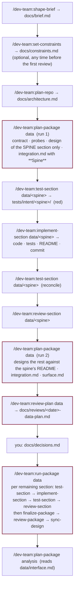

# dev-team 0.5 overhaul — overview

Branch: `dev-team-0.5-overhaul`. Target version: `0.5.0` (proposed to `bump-version`, which
decides and asks; nothing here bumps anything). Date: 2026-09-18.

This is the index of the design set. Each numbered note after this one is one work item,
implemented in the order listed under **Phases**, one commit per phase. Nothing in a later
phase is required by an earlier one, so the branch is mergeable at any phase boundary.

## Why

Two reviews of `dev-team` 0.4.0 (2026-09-18) agreed on the same structural gap: verification
exists only at the bottom of the system. The architect's contracts, the designers' designs and
the architect's own reconciliation are never checked by anything before an implementer forks;
the implementer writes the tests that grade its own code; the reviewer punishes correct
deviations because it carries no order of authority; a design doc that reality invalidated
stays wrong forever; git is absent, so "what changed since the last review" is a file mtime;
and the user types every one of ~13 commands per package.

The org analogy the plugin is built on is **governance → coordination → execution →
verification**, and 0.5 makes verification a column beside every layer rather than a floor
under the last one.

| Layer | Who / what, after 0.5 | New in 0.5 |
|---|---|---|
| Governance | you; `docs/brief.md`; `docs/decisions.md`; `docs/constraints.md`; the constraint skills; import-linter | `docs/constraints.md` and `/dev-team:set-constraints` (note 06) |
| Coordination | `architect` (repo, package, change, sync scopes); `curator` | spine-first package planning (07); `sync-design` (03) |
| Execution | `designer`, `implementer`, `tester`, `researcher`, `documenter` | `tester` agent and `/dev-team:test-section` (04); commit per section (02) |
| Verification | `reviewer` in **section**, **package** and **plan** modes; intent tests; `status.py` gates; `docs/constraints.md` checks | `/dev-team:review-plan` (05); reviewer order of authority and deviation rule (03); constraints axis (06) |
| Driver | you, or `/dev-team:run-package` | `/dev-team:run-package` (08) |

## What changes, at a glance

- Agents: 7 → 8 (`tester`). Every mention of "seven" becomes "eight": `README.md` §One-time
  setup item 2, `.claude-plugin/plugin.json` description, the root `marketplace.json` row.
- Workflow skills: 14 → 18: `+ test-section`, `+ review-plan`, `+ sync-design`,
  `+ set-constraints`, `+ run-package`; `status` unchanged in name, extended in behavior.
  (That is five new names; `run-package` is the only one that runs in your conversation and
  spawns agents itself.)
- Knowledge skills: 7 → 10: `+ test-driven-development`, `+ debugging-and-error-recovery`,
  `+ git-workflow-and-versioning`, all vendored from `addyosmani/agent-skills` (MIT) and
  adapted to Python (note 01). `set-constraints` carries the fourth vendored skill,
  `constraint-driven-development`, as its `references/`.
- `status.py`: reviewed-since-build becomes commit-based; gains a plan gate, a run gate and a
  constraints check.
- Every new skill lands in the three files the plugin's `CLAUDE.md` names
  (`reserved-skill-names`, README Contents tree, `site.yml`) in the same commit, and
  `check-contracts` is run before that commit.

## The new Contents tree

Additions are marked `+`; changed entries `~`. Everything unmarked is unchanged from 0.4.0.

```
dev-team/
├── agents/
│   ├── architect.md      ~ spine-first at package scope; sync-design in sync scope; commits its docs
│   ├── designer.md       ~ accepts `Sibling shipped:` in its delegation prompt
│   ├── implementer.md    ~ never edits tests/intent/; commit-per-section; plan-CRITICAL and default-branch blocking rules
│   ├── tester.md         + writes intent tests from the design; never opens the section's source
│   ├── reviewer.md       ~ order of authority; recorded-deviation severity rule; plan mode; constraints axis; commit-based diff
│   ├── documenter.md
│   ├── curator.md
│   └── researcher.md
├── skills/
│   ├── shape-brief/
│   ├── set-constraints/            + (inline)     interview → docs/constraints.md; references/ = the constraints template + vendored constraint-driven-development (phase 6)
│   ├── plan-repo/
│   ├── plan-package/               ~ spine-first by default; `--all` opts out
│   ├── review-plan/                + → reviewer   contract + designs + integration + surface, before any implementer forks
│   ├── plan-change/
│   ├── map-project/
│   ├── extract-legacy/
│   ├── probe-source/
│   ├── test-section/               + → tester     intent mode (before code) · reconcile mode (after code)
│   ├── implement-section/          ~ runs intent tests; commits; reads plan follow-ups
│   ├── review-section/             ~ reviews the diff since the last reviewed commit
│   ├── finalize-package/
│   ├── review-package/
│   ├── sync-plan/
│   ├── sync-design/                + → architect  folds README item 7 deviations into design/<section>.md **As shipped**
│   ├── finalize-project/
│   ├── run-package/                + (inline)     test → implement → test → review per section; finalize; review; sync-design; stops on gates
│   ├── status/                     ~ status.py: commit-based review freshness; --gate, --plan-gate, --run-gate; constraints rows
│   ├── project-structure/
│   ├── python-style-guide/
│   ├── planning-templates/         ~ references/integration.md gains item 0 **Spine**
│   ├── python-implementation/
│   ├── workspace-scaffold/
│   ├── security-review/
│   ├── test-driven-development/    + vendored (MIT), adapted to pytest; preloaded: tester, implementer
│   ├── debugging-and-error-recovery/ + vendored (MIT), adapted; invoked by implementer on a test it cannot make pass in two attempts
│   ├── git-workflow-and-versioning/  + vendored (MIT), adapted; §Project convention holds the one copy of the commit rules
│   └── reserved-skill-names/       ~ five workflow names, three knowledge names added
├── evals/                          ~ fixtures/two-package/ added; one log per eval in note 09
├── contracts.yml                   ~ new heading contracts (listed per note)
└── site/
    ├── notes/overhaul-0.5-*.md     + this design set
    ├── workflows/new-repo.md       ~ spine-first loop, run-package
    └── site.yml                    ~ workflow_skills_order gains the five new skills
```

## The new flow



Dark-red nodes can stop: the architect for decisions or access (as in 0.4), `review-plan` with
plan CRITICALs, and `run-package` on any gate. Every manual command in the loop still works on
its own exactly as before; `run-package` is a driver over them, not a replacement.

A package with fewer than three sections skips spine-first: run 1 designs everything, and the
flow is `plan-package` → `review-plan` → decisions → `run-package`.

## The `docs/` map — delta

| Path | Kind | Written by | Read by | Status |
|---|---|---|---|---|
| `docs/constraints.md` | canonical | `set-constraints`, you | reviewer (all modes), implementer step 8, `status.py`, tester | **new** |
| `docs/reviews/<date>-<pkg>-plan.md` | report | `review-plan` | architect on a `plan-package` re-run, `status.py` | **new** |
| `packages/<pkg>/tests/intent/<section>/` | shipped | tester only | implementer (runs, never edits), reviewer | **new** |
| `docs/packages/<pkg>/design/<section>.md` §**As shipped** | canonical | `sync-design` | reviewer, later `plan-change` | **new heading** |
| `docs/packages/<pkg>/integration.md` §**Spine** | plan-time | architect, `plan-package` run 1 | `plan-package` run 2, `run-package`, `status.py` | **new heading** |
| `docs/reviews/*.md` line `Commit:` | report | reviewer | `status.py`, next review | **new line** |
| `docs/followups.md` target `<pkg>/plan` | queue | `review-plan` | architect (`plan-package` re-run), implementer blocking rule, `status.py` | **new target** |
| `docs/followups.md` entries `— tester <date>` | queue | tester (reconcile mode) | implementer step 6 | **new source** |

## Order of authority — delta

Unchanged for what a section builds, with one insertion at the top for the reviewer's benefit:
`docs/constraints.md` binds every section and outranks everything below it for the checks it
names (it may only tighten `project-structure` §2, never loosen). The full list, highest
first: `docs/constraints.md` → `decisions.md` (decided, in scope) → the integration doc for
this run → `contract-delta.md` (change work) → the package contract → the repo contract → the
section's design, read together with its **As shipped** section when one exists.

The reviewer now carries this list verbatim (note 03). The implementer's copy gains the first
item.

## Phases and commits

One commit per phase on `dev-team-0.5-overhaul`. Each commit message begins
`dev-team 0.5 (phase N): <what>`. After every phase that touches an agent or skill:
`check-contracts`, then `build-site`, then the eval the note names, logged with `log-eval`
**before** the commit.

| Phase | Note | Commit contents | Depends on |
|---|---|---|---|
| 0 | 00, 09 | this design set under `site/notes/`; `evals/2026-09-18-platform-facts.md` (the two platform evals in note 09 §A, §B) | — |
| 1 | 01 | three vendored knowledge skills; LICENSE files; three-file rule; `contracts.yml` `names_listed` passes | 0 |
| 2 | 02 | commit-per-section: `git-workflow-and-versioning` §Project convention; implementer, tester-to-be, reviewer, architect commit steps; `status.py` commit-based freshness; reviewer `Commit:` line | 1 |
| 3 | 03 | reviewer order of authority + deviation rule; `sync-design` skill; architect sync scope extension; design **As shipped** heading | 2 |
| 4 | 04 | `tester` agent; `test-section` skill; implementer changes (intent tests, never-edit rule, step 6 tester follow-ups) | 2, 3 |
| 5 | 05 | `review-plan` skill; reviewer plan mode; architect re-plan step; implementer plan-CRITICAL blocking rule; `status.py --plan-gate` | 3 |
| 6 | 06 | `set-constraints` skill (body, `references/constraints-template.md`, vendored `references/constraint-driven-development.md`, LICENSE); reviewer constraints axis; implementer steps 1 and 8; `status.py` constraints rows | 1, 5 |
| 7 | 07 | spine-first: architect package scope; `plan-package` skill; designer `Sibling shipped:`; integration **Spine** heading | 5 |
| 8 | 08 | `run-package` skill; `status.py --run-gate`; per-skill `Invoked by run-package` paragraph | 4, 5, 6, 7 |
| 9 | 09 | end-to-end fixture run logged; `README.md`, `site/flow.md`, `site/workflows/new-repo.md`, `CHANGELOG.md` (unreleased section); bump proposed in chat | all |

Phases 3 and 4 can be developed in parallel worktrees; both touch `implementer.md`, so merge 3
first.

## Breaking changes to list in `CHANGELOG.md`

1. `/dev-team:plan-package` is spine-first by default on packages with three or more
   sections; `--all` restores 0.4 behavior. A 0.4 plan (every design present, `surface.md`
   present) is detected as complete and is not re-planned.
2. `/dev-team:implement-section` refuses to run on `main`/`master` and refuses a dirty tree
   (exemptions in note 02). Repos that were never committed need `git init` and a branch.
3. `status.py` "reviewed since build" is now "the newest review's `Commit:` is the newest
   commit touching the section". A 0.4 review file has no `Commit:` line and reads as stale,
   so every section reviewed under 0.4 shows `·` until reviewed once under 0.5.
4. The reviewer treats a deviation recorded under README item 7 as WARNING at most unless it
   breaks a contract, a decided `D<n>`, a shipped interface, or an intent test — a 0.4
   CRITICAL for the same thing is now a WARNING.
5. An open review-sourced follow-up addressed to `<pkg>/plan` blocks
   `/dev-team:implement-section` for every section of `<pkg>`.

## Non-goals

Parallel section implementation in worktrees (the shared-file merge problem is unchanged);
plugin-shipped hooks enforcing write scopes (undocumented whether plugin hooks fire inside
subagents — stays a settings-file recipe in the README); depending on the `agent-skills`
plugin at run time (cross-plugin `skills:` preloading is undocumented; content is vendored
instead); any change to `curator`, `researcher`, `documenter`, `extract-legacy`,
`probe-source`, `map-project`, `finalize-project`.
