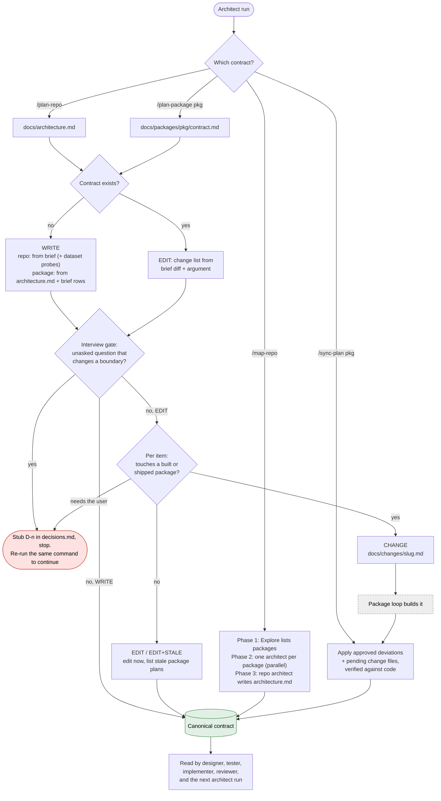
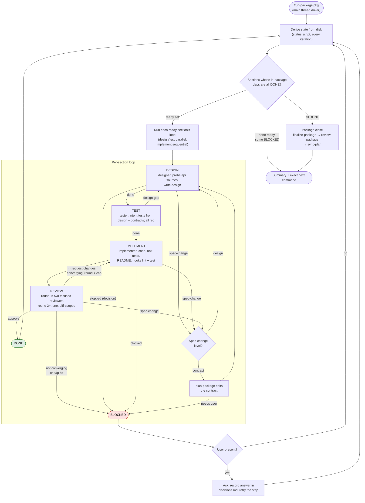

# dev-team remake — workflow notes

Status: discussion output, 2026-09-24. Seeds the remake of the `dev-team` plugin. The current
plugin is kept for its ideas only; downstream compatibility is not a goal.

Goal: fewer, shorter skills and agents. Every role answers one question. State is derived from
disk, never stored, so any run can be re-run a week later from a fresh thread.

---

## 1. Roles

| Role | One job | Writes |
|---|---|---|
| **architect** | Write and edit contracts | `docs/architecture.md`, `docs/packages/<pkg>/contract.md`, `docs/decisions.md` (stubs), `docs/history/` |
| **designer** | Design one section from its contract row | `docs/packages/<pkg>/design/<section>.md` |
| **researcher** | Probe one external source | `docs/sources/<source>.md` (+ sample / stats) |
| **tester** | Turn a design into intent tests | `tests/intent/<section>/` |
| **implementer** | Build one section to its design | section code, `tests/unit/<section>/`, section `README.md`, `docs/deviations.md` (entries) |
| **reviewer** | Judge conformance and correctness | `docs/reviews/`, `docs/followups.md` |

Removed from the old plugin: `surface.md`, `integration.md`, the spine concept, `plan-change`,
`sync-design`, `As shipped` sections, `map-project` as a separate architect mode (folded into
`map-repo`), and the architect spawning designers.

The rule that keeps the system honest: **canonical contracts describe code that exists**, with one
exception — a greenfield contract describes intended code until its sections ship. A contract is
never edited to describe unshipped code; a pending change file carries it until sync.

---

## 2. The architect

The architect writes and edits **contracts** and nothing else. It does not design sections, write
integration or surface documents, or spawn designers. It reads project skills
(`project-structure`, `planning-templates`) and the templates for each contract.

### 2.1 Contracts

| Contract | Path | Holds |
|---|---|---|
| Repo | `docs/architecture.md` | Goal, Packages table (with `covers`), dependency graph (import-linter block), boundary **shapes** per edge, shared conventions, external sources (env var / dataset location), toolchain, non-goals, open decision numbers |
| Package | `docs/packages/<pkg>/contract.md` | Sections table (responsibility, path, `Depends on`, `source`), section interfaces (shapes), pipelines, public surface (intent), Consumes table, shared work |

`surface.md` is gone: the package contract's *public surface (intent)* is the plan and
`interface.md` (written at finalize) is the truth. `integration.md` is gone: build order comes
from the Sections table's `Depends on`; shared work lives in the contract; open questions live in
`decisions.md`.

### 2.2 Skills

| Skill | Scope | Verb | Notes |
|---|---|---|---|
| `plan-repo` | repo | write / edit | Write from the brief when no contract exists. Edit when the brief changed (addition, correction) or a change is requested. `--fix "<notes>"` corrects the contract without touching the brief. |
| `plan-package <pkg>` | package | write / edit | Write from `architecture.md` + the brief rows it `covers`. Edit when the repo contract changed, a designer or implementer returned `spec-change`, or a change is requested. |
| `map-repo [scope]` | repo + packages | write from code | Adopt an existing repo. Phase 1: an Explore pass lists the packages. Phase 2: one architect per package, in parallel, each writing that package's contract from the code. Phase 3: one repo architect writes `architecture.md` from the package contracts plus the import graph. Re-run to reconcile drifted docs (treat every existing line as a claim to check). |
| `sync-plan <pkg>` | package + repo | sync | After sections ship. Applies approved entries in `docs/deviations.md` and pending change files to the contracts, verifying each against the code first. Closes the entries. |

Every architect run: survey → interview gate → write → commit → return. The interview gate stubs
unasked questions in `docs/decisions.md` and **stops**; re-running the same command is the
continue action.

### 2.3 Edit classification

When a contract exists and something changed, the architect builds a change list (brief diff +
argument) and classifies each item by whether it touches a **bound** package:

| Package state | Signal | Editable here? |
|---|---|---|
| unplanned | only a row in `architecture.md` | yes |
| planned | `contract.md`, no code | yes, then flag it stale |
| built | code, no `interface.md` | no — frozen by the code |
| shipped | `interface.md` exists | no — frozen by the code and its consumers |

| Outcome | Meaning |
|---|---|
| EDIT | edit the contract now |
| EDIT + STALE | edit now; list the planned packages that need `plan-package` again |
| CHANGE | write a pending change file `docs/changes/<slug>.md` (contract delta + downstream impact); code goes through the package loop; `sync-plan` applies it when shipped |
| DECIDE | stub a `D<n>` and stop — reversing an edge, a cycle, a convention bound packages already disagree on |

Always archive the old contract to `docs/history/<date>-<name>.md` before an edit. Never delete a
document; retire by reference.

Return: one table, one row per change item with its outcome, then the next command.

### 2.4 Probing

| Source kind | Who | When | Why |
|---|---|---|---|
| dataset | architect spawns a researcher | `plan-repo`, before the contract | target, size and valid splits decide what packages exist |
| api | designer spawns a researcher | `design-section`, before the design | a probe is only meaningful once the section's purpose (the actual call) is known |

The contract only *names* sources (Sections table `source` column; repo contract external
sources list). Probe findings live in `docs/sources/`. If a probe shows the source cannot
support the section, the designer returns `spec-change` and `plan-package` edits the contract.

---

## 3. The package loop — `run-package <pkg>`

Runs in the **main thread**. It spawns every agent itself with the Agent tool
(`subagent_type: "dev-team:<agent>"`, `run_in_background: false`) and tells each one to read its
procedure file and carry it out; it never chains through the Skill tool. Proven in the old
plugin's evals (`2026-09-18-platform-facts`, `2026-09-19-j-run-package-driver`).

Because it runs in the main thread it can **ask the user** when a section blocks, record the
answer in `decisions.md`, and retry — no stop-and-re-run for questions when someone is present.

### 3.1 State is derived, never stored

Every iteration a status script re-reads the disk and computes each section's state. No
`progress.md`. This is what makes a re-run from a fresh thread, after hand edits, or after a crash
behave identically.

| Section state | Evidence on disk |
|---|---|
| needs DESIGN | no `design/<section>.md` |
| needs TEST | design exists, no `tests/intent/<section>/` |
| needs IMPLEMENT | intent tests exist, no section README |
| needs REVIEW | no review at the current commit |
| FIX round *n* | latest review `request changes`; *n* = count of consecutive `request changes` reports since the last approval |
| DONE | latest review approves; no open review follow-ups |
| BLOCKED | open `D<n>` with no fallback assumption; an open `spec-change`; or a non-converging loop |

The only files holding state that cannot be derived from code: `docs/decisions.md`,
`docs/reviews/` (also the round counter), `docs/deviations.md`.

### 3.2 Order: build up the dependency graph

No spine. A section is **ready** when every section it `Depends on` inside the package is DONE
(reviewed and approved, not merely built), so its designer works from the READMEs of shipped
code. Everything ready runs; a finished section can make new ones ready. A BLOCKED section does
not stop the package — independent branches keep going, and the run stops only when nothing is
ready.

Parallelism: design and test steps of ready sections may run in parallel (separate paths). Run
implementers one at a time to avoid concurrent commits, or give each its own worktree
(`isolation: "worktree"`) and merge after. Start with the first.

### 3.3 Per-section loop

```
DESIGN → TEST → IMPLEMENT → REVIEW ─┬─ approve ──────────────→ DONE
                    ▲               ├─ request changes ──────→ IMPLEMENT (fix round)
                    │               ├─ spec-change ──────────→ designer / architect, then TEST regenerates
                    └───────────────┴─ not converging / cap ─→ BLOCKED (user chooses: one more round, or --defer)
```

| Step | Agent | Reads | Produces | Exits |
|---|---|---|---|---|
| DESIGN | designer | its contract row, `architecture.md`, dependency READMEs and upstream `interface.md`, probe docs, `decisions.md` | `design/<section>.md` (module plan, internal types, entry-point signatures, errors, test plan) | `done` · `stopped` (decision) · `spec-change` (contract is wrong) |
| TEST | tester | design + contracts only — **never the source** | `tests/intent/<section>/`; every test fails; docstring cites its design item | `done` · `design-gap` (a design item is untestable → back to DESIGN) |
| IMPLEMENT | implementer | design, contracts, dependency READMEs, intent tests | code, unit tests, README, `docs/deviations.md` entries | `done` · `blocked` · `spec-change` (with evidence) |
| REVIEW | reviewer | everything above + code | `docs/reviews/<date>-<pkg>-<section>[-n].md`; CRITICALs → `followups.md` | `approve` · `request changes` · `spec-change` |

The tester as a design gate: "cases the documents could not support" is not a footnote — it sends
the section back to the designer before any code exists. Cheapest review in the system.

### 3.4 Intent tests — who runs them and when

| When | Agent | Expected |
|---|---|---|
| after writing, before code | tester | all fail; a passing test is deleted |
| start and end of the build | implementer (step 0 and final step) | all pass or a `spec-change` is raised |
| review | reviewer (plus the package test command, lint, import-lint) | pass |
| package close | reviewer (`review-package`) | whole package suite passes |

Tests only change because the **design** changed, never because the code changed.
Chain: contract → design → intent tests → code. A test is regenerated only for the design items
an approved change touched (traced through the docstring citation).

### 3.5 Deviations and spec changes

The old plugin let the implementer deviate, record it in the README, and had the tester follow
the note — the implementer approved its own spec change, and a deviation that corrected a wrong
contract was still graded CRITICAL. Replace with:

| Kind | Example | Path |
|---|---|---|
| **internal deviation** | helper moved to another module, private name changed | implementer logs it in `docs/deviations.md` as `proposed`; reviewer approves or rejects at review; approved → design updated, tester regenerates the cited tests; `sync-plan` never sees these (nothing crosses a boundary) |
| **spec-change** | a boundary shape, a public name, a nullable column, an unimplementable design item | implementer (or designer, or reviewer) returns `spec-change` with evidence; driver routes: design-level → designer revises; contract-level → `plan-package` edits or asks the user; then TEST regenerates and IMPLEMENT resumes |

Deviations that do not change behaviour are WARNING at most. There is no CRITICAL for
"deviated from a wrong spec" — that case is `spec-change`, a normal exit, not a failure.

`docs/deviations.md` entry: section · contract/design clause · what changed · why · status
(`proposed | approved | rejected | synced`).

### 3.6 Reviewer rules that make the loop converge

The old loop did not converge because (a) a wrong contract left the implementer no correct move,
(b) each round's fresh reviewer re-sampled the whole section and found new things on untouched
code, (c) fixes were local while wrong facts were not.

1. **Mechanical checks leave the reviewer.** Hooks run them (see §4). Lint, format, failing
   tests, import-lint can no longer reach review.
2. **Round 1 is exhaustive.** A coverage table: one row per contract clause and design item —
   pass / fail / can't-tell with file:line. Two focused reviewers in parallel, round 1 only:
   A = conformance and seams (owns the table); B = correctness and security. The driver merges
   them into one report.
3. **Round 2+ freezes scope.** One reviewer. CRITICAL only for last round's unfixed findings or
   lines the fix touched (including callers and callees). Anything else on untouched code is a
   follow-up. The finding count can only go down.
4. **`spec-change` is a verdict.** If the code is right and the spec is wrong, the reviewer
   returns `spec-change`, not `request changes`, so the loop exits to the designer or architect.
5. **Cap: 3 rounds**, 2 when a prior finding is unfixed. Then BLOCKED; the user picks one more
   round or `--defer` (findings re-filed as ordinary follow-ups; a break or failing check cannot
   be deferred).

CRITICAL is a closed list: a break (contradicts a contract, a decided `D<n>`, or a consumed
shipped signature); a wrong result on the main path; a security finding; a silent or unreasoned
deviation. Everything else is WARNING or SUGGESTION.

The driver passes `Diff: <previous review sha>..HEAD` in the reviewer's prompt for rounds 2+.

### 3.7 Package close — to be designed

Once every section is DONE, in order:

1. **finalize-package** (implementer, surface mode) — build the top-level `__init__.py`,
   pipelines, CLI from the contract's *public surface (intent)* and the section READMEs; write
   `docs/packages/<pkg>/interface.md` (the surface **as shipped**, signatures copied from code).
2. **review-package** (reviewer) — `__all__` vs `interface.md` vs READMEs; import contracts;
   every repo-contract shape this package provides is realised; whole-package suite.
3. **sync-plan** (architect) — apply approved deviations and pending change files to the
   contracts, verifying against the code; recompute consumers of any changed name; close
   entries.

Both `finalize-package` and `review-package` are inherited from the old plugin and need
rework now that `surface.md` and `integration.md` no longer exist. Not yet discussed.

### 3.8 Stops and the summary

Every run ends with the same block: sections built / reviewed, agent run counts, commit range,
`stopped because` (when stopped), and one exact `next` command with every name filled in.
Blocked sections and their `D<n>` numbers are listed; answering is the user's.

---

## 4. Hooks (plugin `hooks/hooks.json`)

Plugin subagents ignore `hooks` frontmatter, so hooks live at plugin level and the script
exits early unless `agent_type` matches.

| Hook | Scope | Runs | Effect |
|---|---|---|---|
| `PostToolUse` on `Write\|Edit` | implementer, tester | `ruff format` + `ruff check --fix` on the edited file | exit 2 with what remains → the agent sees it as a system message and fixes it |
| `SubagentStop` | implementer | one-package test command, intent suite, `lint-imports`, type check | exit 2 → the agent cannot finish until they pass |

`SubagentStop` needs a loop guard: let the agent stop when its return is `blocked` or
`spec-change` (marker file), or after N attempts (counter file). No built-in guard is documented.

Sources: code.claude.com/docs/en/hooks — "Hooks from settings files, managed policy settings,
and plugins also run inside subagents"; "On `PostToolUse`, a hook that exits 2 doesn't block the
tool call … but Claude Code shows Claude the stderr as a system message"; "On `SubagentStop`,
exit 2 … prevents the subagent from stopping". code.claude.com/docs/en/sub-agents — "plugin
subagents don't support the `hooks`, `mcpServers`, or `permissionMode` frontmatter fields".

---

## 5. Platform facts relied on

| Fact | Source |
|---|---|
| A main-thread skill can spawn plugin agents with the Agent tool; only `dev-team:<agent>` resolves | eval `2026-09-18-platform-facts.md` |
| Two-level nesting works (driver → architect → designers); docs say 3 levels by default (`CLAUDE_CODE_MAX_SUBAGENT_SPAWN_DEPTH`) | eval J; code.claude.com/docs/en/sub-agents |
| `disable-model-invocation: true` skills cannot be chained via the Skill tool from an agent; spawn the agent and have it Read the procedure file | eval J (sync-design refusal) |
| `${CLAUDE_PLUGIN_ROOT}` is substituted in skill and agent bodies | eval `2026-09-18-platform-facts.md` |
| Docs list `AskUserQuestion` as available to subagents — conflicts with the old architect text; irrelevant now that the driver asks from the main thread | code.claude.com/docs/en/tools |

---

## 6. Open items for the next session

- `finalize-package` / `review-package` rework (§3.7).
- Exact `docs/deviations.md` and `docs/changes/<slug>.md` templates.
- Whether api probes run inside `design-section` (designer spawns a researcher) or as a driver
  step before it (shares a probe across sections, one less nesting level).
- Parallel implementers: sequential first; worktrees later if throughput matters.
- The status script: the state table in §3.1 is its spec.
- `map-repo` phase 1 on a monolith with no visible package structure: the repo pass must decide
  the split before package architects can run.
- Verify the `SubagentStop` loop guard behaviour empirically.

---

## 7. Charts

### 7.1 Architect — one agent, four uses



### 7.2 `run-package` — dependency-ordered loop


