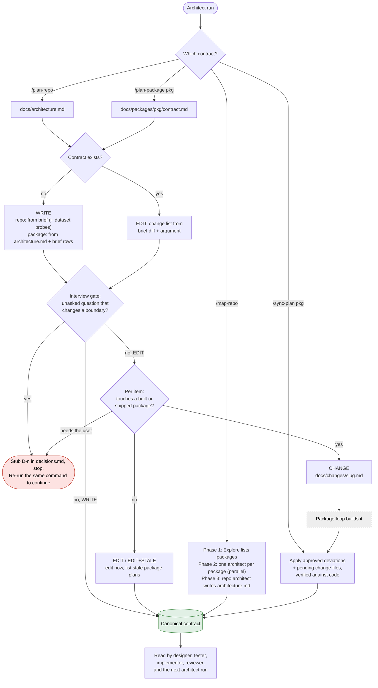
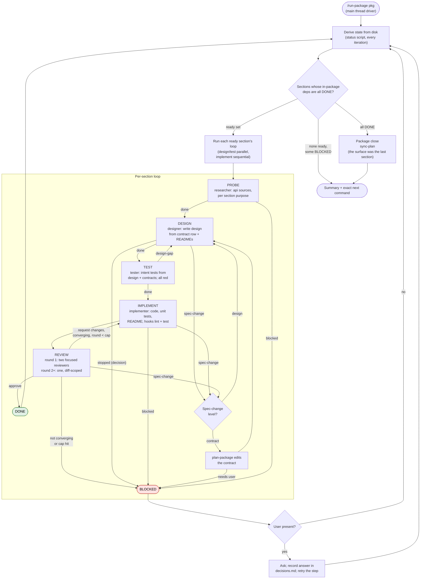

# dev-team remake — workflow notes

Status: discussion output, 2026-09-24; §2.5, §3.7, §3.9, §3.10 and §5 added 2026-09-26. Seeds the
remake of the `dev-team` plugin. The current plugin is kept for its ideas only; downstream
compatibility is not a goal. `shape-brief` is out of scope here: it is its own loop.

Goal: fewer, shorter skills and agents. Every role answers one question. State is derived from
disk, never stored, so any run can be re-run a week later from a fresh thread.

---

## 1. Roles

| Role | One job | Writes |
|---|---|---|
| **architect** | Write and edit contracts | `docs/architecture.md`, `docs/packages/<pkg>/contract.md`, `docs/decisions.md` (stubs), `docs/history/` |
| **designer** | Design one section from its contract row | `docs/packages/<pkg>/design/<section>.md` |
| **researcher** | Probe one external source | `docs/sources/<source>.md` (+ sample / stats) |
| **tester** | Turn a design into intent tests | `tests/intent/<section>/` |
| **implementer** | Build one section to its design | section code, `tests/unit/<section>/`, section `README.md` (for the `surface` section, `docs/packages/<pkg>/interface.md`), `docs/deviations.md` (entries) |
| **reviewer** | Judge conformance and correctness | `docs/reviews/`; `docs/followups.md` only for what no loop step will pick up (§3.9) |

Removed from the old plugin: `surface.md`, `integration.md`, `assessment.md` (§2.5), the spine
concept, `plan-change`, `sync-design`, `review-plan` (the tester is the design gate), `As shipped`
sections, `map-project` as a separate architect mode (folded into `map-repo`), the architect
spawning designers, `finalize-package` and `review-package` as skills (the surface is a section,
§3.7), the tester's reconcile mode, `followups.md` as a queue or a gate (§3.9), the reviewer's
axis 0 (hooks own it, §3.10), and `reserved-skill-names` (§5).

The rule that keeps the system honest: **canonical contracts describe code that exists**, with one
exception — a greenfield contract describes intended code until its sections ship. A contract is
never edited to describe unshipped code; a pending change file carries it until sync.

---

## 2. The architect

The architect writes and edits **contracts** and nothing else. It does not design sections, write
integration or surface documents, or spawn designers. It reads project skills
(`project-structure`, `planning-templates`) and the templates for each contract.

### 2.1 Contracts

| Contract | Path | Holds |
|---|---|---|
| Repo | `docs/architecture.md` | Goal, Packages table (with `covers`), dependency graph (import-linter block), boundary **shapes** per edge, shared conventions, external sources (env var / dataset location), toolchain, non-goals, open decision numbers |
| Package | `docs/packages/<pkg>/contract.md` | Sections table (responsibility, path, `Depends on`, `source`), section interfaces (shapes), pipelines, public surface (intent), Consumes table, shared work |

`surface.md` is gone: the package contract's *public surface (intent)* is the plan and
`interface.md` (written when the `surface` section ships, §3.7) is the truth. `integration.md` is gone: build order comes
from the Sections table's `Depends on`; shared work lives in the contract; open questions live in
`decisions.md`.

### 2.2 Skills

| Skill | Scope | Verb | Notes |
|---|---|---|---|
| `plan-repo` | repo | write / edit | Write from the brief when no contract exists. Edit when the brief changed (addition, correction) or a change is requested. `--fix "<notes>"` corrects the contract without touching the brief. |
| `plan-package <pkg>` | package | write / edit | Write from `architecture.md` + the brief rows it `covers`. Edit when the repo contract changed, a designer or implementer returned `spec-change`, or a change is requested. |
| `map-repo [scope]` | repo + packages | write from code | Adopt an existing repo. Phase 1: an Explore pass lists the packages. Phase 2: one architect per package, in parallel, each writing that package's contract from the code. Phase 3: one repo architect writes `architecture.md` from the package contracts plus the import graph. Re-run to reconcile drifted docs (treat every existing line as a claim to check). |
| `sync-plan <pkg>` | package + repo | sync | After sections ship. Applies approved entries in `docs/deviations.md` and pending change files to the contracts, verifying each against the code first. Closes the entries. |

Every architect run: survey → interview gate → write → commit → return. The interview gate stubs
unasked questions in `docs/decisions.md` and **stops**; re-running the same command is the
continue action.

### 2.3 Edit classification

When a contract exists and something changed, the architect builds a change list (brief diff +
argument) and classifies each item by whether it touches a **bound** package:

| Package state | Signal | Editable here? |
|---|---|---|
| unplanned | only a row in `architecture.md` | yes |
| planned | `contract.md`, no code | yes, then flag it stale |
| built | code, no `interface.md` | no — frozen by the code |
| shipped | `interface.md` exists | no — frozen by the code and its consumers |

| Outcome | Meaning |
|---|---|
| EDIT | edit the contract now |
| EDIT + STALE | edit now; list the planned packages that need `plan-package` again |
| CHANGE | write a pending change file `docs/changes/<slug>.md` (contract delta + downstream impact); code goes through the package loop; `sync-plan` applies it when shipped |
| DECIDE | stub a `D<n>` and stop — reversing an edge, a cycle, a convention bound packages already disagree on |

Always archive the old contract to `docs/history/<date>-<name>.md` before an edit. Never delete a
document; retire by reference.

Return: one table, one row per change item with its outcome, then the next command.

### 2.4 Probing

| Source kind | Who | When | Why |
|---|---|---|---|
| dataset | architect spawns a researcher | `plan-repo`, before the contract | target, size and valid splits decide what packages exist |
| api | the driver spawns a researcher | `run-package`, PROBE step before DESIGN, for every ready section whose `source` names an api (§3.3) | the purpose the probe needs is the contract row — responsibility plus section interface — which is all the designer would have had at that point too; and the main thread can ask the user for a missing credential, which a designer-spawned researcher cannot |

Decided 2026-09-26 (was open): the driver step, not the designer. It also drops a nesting
level (driver → researcher, not driver → designer → researcher), lets probes for the whole
ready set run in parallel, and derives cleanly from disk — *needs PROBE* is a state (§3.1).

One probe doc per source, repo-wide. When the doc exists but has no entry for this section's
purpose, the researcher **extends** it — reads what is there, probes only the call this section
needs, appends under `## <pkg>/<section>` — so the auth flow and limits are established once.
*Needs PROBE* is therefore per section: the doc lacks that section's heading.

The contract only *names* sources (Sections table `source` column; repo contract external
sources list). Probe findings live in `docs/sources/`. If a probe shows the source cannot
support the section, the designer returns `spec-change` and `plan-package` edits the contract.

### 2.5 `assessment.md` is gone

Three files, three replacements. None was a document anyone read after the run that wrote it;
each was a survey persisted so a stopped run could resume, and a re-run recomputes a survey.

| Old file | Was | Now |
|---|---|---|
| `docs/assessment.md` | `map-project`'s repo survey (the Explore pass, persisted for resume) | `map-repo` phase 1 hands the package list to phase 2 in the prompt; the package contracts and `architecture.md` are the persisted result, and on a re-run every existing line is a claim to check |
| `docs/packages/<pkg>/assessment.md` | the package survey in document mode | the package architect writes `contract.md` from the code directly (`map-repo` phase 2) |
| `docs/plans/<slug>/assessment.md` | `plan-change`'s downstream impact | the **Downstream impact** section of `docs/changes/<slug>.md` |

`shape-brief` read it to seed a brief for existing code; that seed is `architecture.md` now.

---

## 3. The package loop — `run-package <pkg>`

Runs in the **main thread**. It spawns every agent itself with the Agent tool
(`subagent_type: "dev-team:<agent>"`, `run_in_background: false`) and tells each one to read its
procedure file and carry it out; it never chains through the Skill tool. Proven in the old
plugin's evals (`2026-09-18-platform-facts`, `2026-09-19-j-run-package-driver`).

Because it runs in the main thread it can **ask the user** when a section blocks, record the
answer in `decisions.md`, and retry — no stop-and-re-run for questions when someone is present.

### 3.1 State is derived, never stored

Every iteration a status script re-reads the disk and computes each section's state. No
`progress.md`. This is what makes a re-run from a fresh thread, after hand edits, or after a crash
behave identically.

| Section state | Evidence on disk |
|---|---|
| needs PROBE | the row's `source` names an api and `docs/sources/<token>.md` has no `## <pkg>/<section>` entry |
| needs DESIGN | no `design/<section>.md` |
| needs TEST | design exists, no `tests/intent/<section>/` |
| needs IMPLEMENT | intent tests exist, no section README |
| needs REVIEW | no review at the current commit |
| FIX round *n* | latest review `request changes`; *n* = count of consecutive `request changes` reports since the last approval |
| DONE | latest review approves |
| BLOCKED | open `D<n>` with no fallback assumption; an open `spec-change`; or a non-converging loop |

The only files holding state that cannot be derived from code: `docs/decisions.md`,
`docs/reviews/` (also the round counter), `docs/deviations.md`, `docs/changes/`.

Two rules the derivation needs beyond existence checks:

1. **States are ordered by commit.** A design commit newer than the intent tests re-opens
   TEST; tests newer than the README re-open IMPLEMENT; code newer than the review re-opens
   REVIEW. So when `plan-package` edits a contract row and the designer revises a DONE
   section's design, the section walks back through the loop by itself — no flag, no queue.
2. **An open `docs/changes/<slug>.md` naming a section re-opens it** at DESIGN (a delta
   design), whatever the rest says. This is how a dependency that a later section found
   lacking gets its work (§3.9), and how a repo-level CHANGE reaches code.
3. **A probe doc newer than a design that consumes it re-opens that design.** The Sections
   table's `source` column says which sections; `probe-source` (§5.1) is the only way a probe
   doc gets newer than a shipped design. The designer diffs the new probe against its
   assumptions and either revises or returns `spec-change`.

### 3.2 Order: build up the dependency graph

No spine. A section is **ready** when every section it `Depends on` inside the package is DONE
(reviewed and approved, not merely built), so its designer works from the READMEs of shipped
code. Everything ready runs; a finished section can make new ones ready. A BLOCKED section does
not stop the package — independent branches keep going, and the run stops only when nothing is
ready.

Parallelism: probe, design and test steps of ready sections may run in parallel (separate paths). Run
implementers one at a time to avoid concurrent commits, or give each its own worktree
(`isolation: "worktree"`) and merge after. Start with the first.

### 3.3 Per-section loop

```
PROBE → DESIGN → TEST → IMPLEMENT → REVIEW ─┬─ approve ──────────────→ DONE
                    ▲               ├─ request changes ──────→ IMPLEMENT (fix round)
                    │               ├─ spec-change ──────────→ designer / architect, then TEST regenerates
                    └───────────────┴─ not converging / cap ─→ BLOCKED (user chooses: one more round, or --defer)
```

| Step | Agent | Reads | Produces | Exits |
|---|---|---|---|---|
| PROBE | researcher (api sources only; datasets were probed in `plan-repo`) | the contract row as the purpose, the existing probe doc if any, credentials from env | `docs/sources/<token>.md`, extended with a `## <pkg>/<section>` entry, plus sample and stats | `done` · `blocked` (no credential, unreachable — the driver asks the user, then retries) |
| DESIGN | designer | its contract row, `architecture.md`, dependency READMEs and upstream `interface.md`, probe docs, `decisions.md` | `design/<section>.md` (module plan, internal types, entry-point signatures, errors, test plan) | `done` · `stopped` (decision) · `spec-change` (contract is wrong) |
| TEST | tester | design + contracts only — **never the source** | `tests/intent/<section>/`; every test fails; docstring cites its design item | `done` · `design-gap` (a design item is untestable → back to DESIGN) |
| IMPLEMENT | implementer | design, contracts, dependency READMEs, intent tests | code, unit tests, README, `docs/deviations.md` entries | `done` · `blocked` · `spec-change` (with evidence) |
| REVIEW | reviewer | everything above + code | `docs/reviews/<date>-<pkg>-<section>[-n].md` — the report is the fix round's queue; WARNINGs outside the diff → `followups.md` (§3.9) | `approve` · `request changes` · `spec-change` |

The tester as a design gate: "cases the documents could not support" is not a footnote — it sends
the section back to the designer before any code exists. Cheapest review in the system.

### 3.4 Intent tests — who runs them and when

| When | Agent | Expected |
|---|---|---|
| after writing, before code | tester | all fail; a passing test is deleted |
| start and end of the build | implementer (step 0 and final step) | all pass or a `spec-change` is raised |
| review | reviewer (plus the package test command, lint, import-lint) | pass |
| the `surface` section's review | reviewer | whole package suite passes |

Tests only change because the **design** changed, never because the code changed.
Chain: contract → design → intent tests → code. A test is regenerated only for the design items
an approved change touched (traced through the docstring citation).

### 3.5 Deviations and spec changes

The old plugin let the implementer deviate, record it in the README, and had the tester follow
the note — the implementer approved its own spec change, and a deviation that corrected a wrong
contract was still graded CRITICAL. Replace with:

| Kind | Example | Path |
|---|---|---|
| **internal deviation** | helper moved to another module, private name changed | implementer logs it in `docs/deviations.md` as `proposed`; reviewer approves or rejects at review; approved → design updated, tester regenerates the cited tests; `sync-plan` never sees these (nothing crosses a boundary) |
| **spec-change** | a boundary shape, a public name, a nullable column, an unimplementable design item | implementer (or designer, or reviewer) returns `spec-change` with evidence; driver routes by level: **test** — the test contradicts a design that is right → the tester regenerates the cited tests, nothing else moves; **design** → designer revises; **contract** → `plan-package` edits or asks the user; then TEST regenerates and IMPLEMENT resumes |

Deviations that do not change behaviour are WARNING at most. There is no CRITICAL for
"deviated from a wrong spec" — that case is `spec-change`, a normal exit, not a failure.

`docs/deviations.md` entry: section · contract/design clause · what changed · why · status
(`proposed | approved | rejected | synced`).

### 3.6 Reviewer rules that make the loop converge

The old loop did not converge because (a) a wrong contract left the implementer no correct move,
(b) each round's fresh reviewer re-sampled the whole section and found new things on untouched
code, (c) fixes were local while wrong facts were not.

1. **Mechanical checks leave the reviewer.** Hooks run them (see §4). Lint, format, failing
   tests, import-lint can no longer reach review.
2. **Round 1 is exhaustive.** A coverage table: one row per contract clause and design item —
   pass / fail / can't-tell with file:line. Two focused reviewers in parallel, round 1 only:
   A = conformance and seams (owns the table); B = correctness and security. The driver merges
   them into one report.
3. **Round 2+ freezes scope.** One reviewer. CRITICAL only for last round's unfixed findings or
   lines the fix touched (including callers and callees). Anything else on untouched code is a
   follow-up. The finding count can only go down.
4. **`spec-change` is a verdict.** If the code is right and the spec is wrong, the reviewer
   returns `spec-change`, not `request changes`, so the loop exits to the designer or architect.
5. **Cap: 3 rounds**, 2 when a prior finding is unfixed. Then BLOCKED; the user picks one more
   round or `--defer` (findings re-filed as ordinary follow-ups; a break or failing check cannot
   be deferred).

CRITICAL is a closed list: a break (contradicts a contract, a decided `D<n>`, or a consumed
shipped signature); a wrong result on the main path; a security finding; a silent or unreasoned
deviation. Everything else is WARNING or SUGGESTION.

The driver passes `Diff: <previous review sha>..HEAD` in the reviewer's prompt for rounds 2+.

### 3.7 Package close — the surface is a section

`finalize-package` and `review-package` are not reworked; they are dropped. Every package
contract's Sections table ends with a row named `surface`: path = the package top level
(`__init__.py`, `pipelines/`, `cli.py`), `Depends on` = every other section, responsibility =
contract §4 Pipelines and §5 Public surface (intent). It runs the ordinary loop. Because a
section is ready only when its dependencies are DONE, the surface is designed last, from the
shipped READMEs — which is what the old `surface.md`, planned before any code existed, could
never be. The plan-time surface and the shipped surface stop being two documents.

| Step | What differs for `surface` |
|---|---|
| DESIGN | Same template. Entry points = the public names (contract §5 reconciled against the READMEs), the pipeline signatures (§4), the CLI commands with their arguments; the module plan is fixed by `project-structure` (`__init__.py`, `pipelines/`, `cli.py`); the test plan is one end-to-end test per pipeline and one invocation test per command. A name §5 expects that no README provides → `spec-change` (the contract or that section is wrong), never a follow-up. |
| TEST | Same. The tester writes the end-to-end and invocation tests red, from the design — the tests surface mode used to write for itself after the code, now written before it. |
| IMPLEMENT | Same, plus what surface mode did: the lazy `__init__.py` with `__all__`; the `forbidden` and intra-package `layers` import contracts, derived from the Sections table's `Depends on` (was `surface.md` §5); `[project.scripts]`; `docs/api/<pkg>.md` and its nav entry; the ledger sweep. Its README is `docs/packages/<pkg>/interface.md`, the template the implementer already holds (public names, pipelines, CLI, configuration, shapes provided, deviations, consumers). A public name that differs from §5 is a `docs/deviations.md` entry against §5. |
| REVIEW | Same two-reviewer round 1. Reviewer A's coverage table adds the package rows: `__all__` = `interface.md` = READMEs; every repo-contract shape this package provides is realised; `lint-imports` passes with all four contracts present; `import <pkg>` loads no section module (`-X importtime`); the whole package suite. |

Then `sync-plan <pkg>`: approved deviations and pending change files into the contracts,
verified against the code, consumers of any changed name recomputed, entries closed. Package
close is one architect run, not three skills.

**Shipped** (§2.3) = the `surface` section is DONE: `interface.md` exists *and* its latest
review approves. Not `interface.md` alone — it exists from the surface's first build.

### 3.8 Stops and the summary

Every run ends with the same block: sections built / reviewed, agent run counts, commit range,
`stopped because` (when stopped), and one exact `next` command with every name filled in.
Blocked sections and their `D<n>` numbers are listed; answering is the user's.

### 3.9 `docs/followups.md` — a backlog, not a queue

The old file was two things at once. A **queue** the loop gated on — review CRITICALs,
intent-tree findings, plan findings, counted by `status.py`, blocking finalize — and a
**backlog** nobody gated on — cross-section wishes, deferred WARNINGs, defects seen while
mapping. Every queue use has a home in the new loop, and `deviations.md` covers exactly one
of the ten:

| Old use | Written by | Now |
|---|---|---|
| review CRITICALs, `— review <date>` (the fix queue) | reviewer | the review report *is* the queue: the fix round reads `docs/reviews/<latest>`; the next reviewer classifies each as fixed / unfixed (§3.6). Nothing is written twice. |
| `<pkg>/<section>/intent` — a wrong intent test | reviewer | `spec-change` at **test** level (§3.5): the test contradicts a design that is right → TEST regenerates the cited tests |
| `intent test … fails — tester <date>` (reconcile) | tester | gone with reconcile mode: the implementer passes every intent test or raises `spec-change` |
| `<pkg>/plan` — plan review CRITICALs | reviewer | gone with `review-plan`: the tester's `design-gap` is the plan gate |
| `<pkg>/surface` — a README drifts from `surface.md` | implementer | **`deviations.md`**: a public name that differs from contract §5 |
| `surface.md expects <name>, not found` | finalize-package | `spec-change` from the surface designer (§3.7) |
| `re-run probe-source — design assumed X, observed Y` | implementer | `spec-change` at design level with the observation as evidence; the probe precedes the design (§2.4), so this is rare |
| `<what is needed> — needed by <me>` (a DONE dependency lacks something) | implementer | `spec-change` at contract level: `plan-package` classifies it (§2.3) — EDIT while the dependency is only planned, CHANGE once built — and the change file re-opens the dependency (§3.1) |
| consumers to adapt after a synced rename | sync-plan | the architect's edit classification: a CHANGE per shipped consumer, STALE per planned one |
| out-of-diff WARNINGs on a re-review; `--defer`ed findings; defects seen by `map-repo`; **Measured** values worth a note | reviewer, architect | **stay in `followups.md`** — the backlog |

So the file survives with one meaning: **work no loop step will pick up**. Append-only, one
line per item with a `<pkg>/<section>` target and a date; ticked by whoever does it; never
counted by the status script, never a gate, never addressed *to* a step. A fix round reads
the entries for its section and may take them; the documenter lists what is open under Known
gaps; the user reads it to decide what to schedule next. Nothing else reads it.

### 3.10 `set-constraints` stays — `constraints.md` is the hook's spec

§4 moves every mechanical check out of the reviewer and into hooks. A hook needs a list of
commands with thresholds and scopes, and `docs/constraints.md` already is that list: **Floor**
and **Enforced** rows (command, threshold, `<pkg>` scope), **Guarded** (a diff grep),
**Exceptions** (the only pardon). The skill's value goes up, not down. The `SubagentStop`
hook runs the Floor and Enforced rows with `<pkg>` substituted and greps the run's diff for
Guarded items; `status.py --gate` and CI run the same rows. With no `constraints.md` the
hook runs the Toolchain commands from `architecture.md` and nothing else.

What changes around it:

- The reviewer's axis 0 is deleted. A failing row cannot reach review. The reviewer still
  reports **Measured** values under SUGGESTION and honours **Exceptions** when a Guarded hit
  is in front of it, but it runs nothing.
- The implementer's "run every row" step is deleted; the hook runs them when it tries to stop.
- The tester keeps its one rule: size the intent suite to contribute to the coverage floor,
  never pad to reach it.
- `workspace-scaffold` keeps: the dev dependencies and CI commands come from the rows.
- The skill itself keeps its shape — main thread, detect before you ask, four questions with
  defaults, tighten never loosen — and drops "after shape-brief": it runs any time before the
  first build, and once the hook exists, before the first hook run.

---

## 4. Hooks (plugin `hooks/hooks.json`)

Plugin subagents ignore `hooks` frontmatter, so hooks live at plugin level and the script
exits early unless `agent_type` matches.

| Hook | Scope | Runs | Effect |
|---|---|---|---|
| `PostToolUse` on `Write\|Edit` | implementer, tester | `ruff format` + `ruff check --fix` on the edited file | exit 2 with what remains → the agent sees it as a system message and fixes it |
| `SubagentStop` | implementer | the `constraints.md` **Floor** and **Enforced** rows with `<pkg>` substituted, plus the intent suite and a **Guarded** grep of the run's diff (§3.10); without `constraints.md`, the Toolchain commands | exit 2 → the agent cannot finish until they pass |

`SubagentStop` needs a loop guard: let the agent stop when its return is `blocked` or
`spec-change` (marker file), or after N attempts (counter file). No built-in guard is documented.

Sources: code.claude.com/docs/en/hooks — "Hooks from settings files, managed policy settings,
and plugins also run inside subagents"; "On `PostToolUse`, a hook that exits 2 doesn't block the
tool call … but Claude Code shows Claude the stderr as a system message"; "On `SubagentStop`,
exit 2 … prevents the subagent from stopping". code.claude.com/docs/en/sub-agents — "plugin
subagents don't support the `hooks`, `mcpServers`, or `permissionMode` frontmatter fields".

---

## 5. Knowledge skills under the new system

Routing stays by role, through each agent's `skills:` frontmatter (preloaded) or a named
Skill-tool call at one step (invoked). What moves is what the hooks and the derived state
make redundant.

| Skill | Preloaded | Invoked | Change |
|---|---|---|---|
| `project-structure` | architect, designer, tester, implementer, reviewer | — | none. §2's hard limits are already in `pyproject-lint-config.toml`, so the `PostToolUse` hook enforces them and the reviewer stops measuring them. |
| `python-style-guide` | implementer, tester, reviewer | — | none; its `__init__.py` pattern is now the `surface` section's. |
| `planning-templates` | — | architect (every write), researcher (source probe) | drop `surface.md` and `integration.md`; `contract-delta.md` becomes `change.md` (`docs/changes/<slug>.md`: contract delta + downstream impact); add `deviations.md` — three writers (implementer, reviewer, `sync-plan`), so the shared skill holds it, not an agent. |
| `workspace-scaffold` | — | architect (`plan-repo` Toolchain), implementer (first section of a repo or package; the `surface` section for the import contracts) | §3 contracts 2–3 derive from the Sections table's `Depends on`, not `surface.md` §5; §CI runs the `constraints.md` rows, the same list the hook runs. |
| `python-implementation` | — | implementer (a split, a `configs.py`) | none. |
| `security-review` | — | implementer (its triggers); **reviewer B only** in round 1 | routing: A (conformance and seams) never invokes it; the round-2+ single reviewer invokes it only when the diff hits a trigger. |
| `test-driven-development` | tester, implementer | — | none in routing. The tester uses RED only, which argues for preloading a short reference rather than the whole file — measure the token cost before trimming. |
| `debugging-and-error-recovery` | — | implementer, after two failed fix attempts | none. The `SubagentStop` loop guard's attempt counter is the same count, so the hook's exit-2 message can name the skill. |
| `git-workflow-and-versioning` | implementer | every other committing agent, at commit | shrink to §Project convention and preload it into every agent that commits. **Branch** and **Baseline** leave the skill: `status.py --run-gate` already checks both, the driver runs it once, and a procedure run by hand runs the same line. The baseline's hand-edited exemptions become `decisions.md`, `constraints.md` and `followups.md` (the user ticks the backlog by hand); `brief.md` only while `shape-brief` exists. The message table is regenerated for the new skill set; the reviewer commits its report only. |
| `reserved-skill-names` | — | architect, `extract-legacy` | **dropped.** Installed plugin skills live under the plugin cache, never under the project's `.claude/skills/`, so the architect's `ls -d .claude/skills/*/` never sees one; the only thing the list guarded against is a project skill *named* like a plugin skill, and `ls ${CLAUDE_PLUGIN_ROOT}/skills` derives that list at run time (§6: the variable resolves in agent bodies). The three-file rule in `CLAUDE.md` and the `names_listed` contract go with it. Verify with one eval that a colliding project skill is reported, not skipped. |

### 5.1 The commands outside the loop

Four skills are not in the §1 role table because they are not steps of the loop. Decided
2026-09-26:

| Skill | Decision | One use | What changes |
|---|---|---|---|
| `extract-legacy` (curator, researchers in extract mode) | **keep, out of scope** | its own system: an old repo in, project skills under `.claude/skills/` out. The architect discovers those skills and assigns them to sections exactly as before. | nothing here; it drops the `reserved-skill-names` check like everyone else (§5) |
| `status` | **keep** | the user's view of §3.1 — the same script the driver runs, so there is one state derivation. | rewritten to §3.1's spec: per-section state, the ready set, `shipped` = surface DONE, the exact `next` command computed here rather than by the driver; `--rounds` and `--run-gate` stay; `--gate` and `--plan-gate` go with finalize and `review-plan`; it stops counting `followups.md`. The skill text shrinks to "run it, say what the next command is". |
| `probe-source` (researcher, direct) | **keep** | the world outside changed — an API changed, a dataset was refreshed. Nothing on disk can see that event, so the user has to type it. | adding a source after planning is no longer a use: a `plan-package` edit of the `source` column makes the designer probe it. A re-probe re-opens the sections it touches — §3.1 rule 3. |
| `finalize-project` (documenter) | **keep** | the human-facing layer: package READMEs, the root README, `docs/index.md`, assembled from `interface.md`, section READMEs, the contracts and the ledger — none of which is written for a person who has not read the plugin. | **Known gaps** is the status script's repo-wide output plus only what the script cannot know (a command a document names that does not exist, two sections with conflicting env defaults); the documenter stops re-deriving state. Drop `docs/plans/synced.md`, the `assessment` inputs, and the API-page fallback: `docs/api/<pkg>.md` is the `surface` section's, and a missing one is a gap, not something to write. |

---

## 6. Platform facts relied on

| Fact | Source |
|---|---|
| A main-thread skill can spawn plugin agents with the Agent tool; only `dev-team:<agent>` resolves | eval `2026-09-18-platform-facts.md` |
| Two-level nesting works (driver → architect → designers); docs say 3 levels by default (`CLAUDE_CODE_MAX_SUBAGENT_SPAWN_DEPTH`) | eval J; code.claude.com/docs/en/sub-agents |
| `disable-model-invocation: true` skills cannot be chained via the Skill tool from an agent; spawn the agent and have it Read the procedure file | eval J (sync-design refusal) |
| `${CLAUDE_PLUGIN_ROOT}` is substituted in skill and agent bodies | eval `2026-09-18-platform-facts.md` |
| Docs list `AskUserQuestion` as available to subagents — conflicts with the old architect text; irrelevant now that the driver asks from the main thread | code.claude.com/docs/en/tools |

---

## 7. Open items for the next session

- **This file is not what `plan-phases` reads.** It reads `site/notes/<slug>-design.md`, written
  by `design-plugin` on a `dev-team-<slug>` branch in a worktree, with the design template's
  sections: components table (new / changed / removed), per-workflow captions (unit,
  strengthened by, inputs from), every file with its writer and readers, fan-out arithmetic,
  the baseline each judgment is measured against, platform facts, cost, build order, non-goals,
  what must not break. So the next step is `design-plugin <slug>` from `dev-team/`, seeded with
  this file; the discussion is done, so expect one round for the gaps above and the two gates.
- Exact `docs/deviations.md` and `docs/changes/<slug>.md` templates (in `planning-templates`).
- Parallel implementers: sequential first; worktrees later if throughput matters.
- The status script: §3.1 is its spec, including the three re-open rules, the `surface` row,
  the ready set, the computed `next` command, and *shipped* = surface DONE (§3.7, §5.1). It
  stops counting `followups.md` (§3.9).
- The `SubagentStop` hook reads `constraints.md` (§3.10); verify its loop guard empirically.
- `map-repo` phase 1 on a monolith with no visible package structure: the repo pass must decide
  the split before package architects can run.
- `finalize-project`'s trimmed procedure and the exact split between what the status script
  reports and what the documenter adds to **Known gaps** (§5.1).
- One eval: `ls ${CLAUDE_PLUGIN_ROOT}/skills` from an agent body, and a colliding project
  skill name reported (§5).

---

## 8. Charts

### 8.1 Architect — one agent, four uses


```mermaid
flowchart TD
    START(["Architect run"]) --> LVL{"Which contract?"}
    LVL -->|"/plan-repo"| REPO["docs/architecture.md"]
    LVL -->|"/plan-package pkg"| PKG["docs/packages/pkg/contract.md"]
    LVL -->|"/map-repo"| MAP["Phase 1: Explore lists packages<br/>Phase 2: one architect per package (parallel)<br/>Phase 3: repo architect writes architecture.md"]
    LVL -->|"/sync-plan pkg"| SYNC["Apply approved deviations<br/>+ pending change files,<br/>verified against code"]

    REPO --> VERB{"Contract exists?"}
    PKG --> VERB
    VERB -->|"no"| WRITE["WRITE<br/>repo: from brief (+ dataset probes)<br/>package: from architecture.md + brief rows"]
    VERB -->|"yes"| LIST["EDIT: change list from<br/>brief diff + argument"]

    WRITE --> GATE{"Interview gate:<br/>unasked question that<br/>changes a boundary?"}
    LIST --> GATE
    GATE -->|"yes"| STOP(["Stub D-n in decisions.md, stop.<br/>Re-run the same command to continue"])
    GATE -->|"no, WRITE"| CANON[("Canonical contract")]
    GATE -->|"no, EDIT"| EACH{"Per item:<br/>touches a built or<br/>shipped package?"}
    EACH -->|"no"| DIRECT["EDIT / EDIT+STALE<br/>edit now, list stale package plans"]
    EACH -->|"yes"| DELTA["CHANGE<br/>docs/changes/slug.md"]
    EACH -->|"needs the user"| STOP
    DIRECT --> CANON
    DELTA --> LOOP["Package loop builds it"]
    LOOP --> SYNC
    MAP --> CANON
    SYNC --> CANON
    CANON --> NEXT["Read by designer, tester,<br/>implementer, reviewer,<br/>and the next architect run"]

    classDef stop fill:#fde2e1,stroke:#c0392b,color:#000
    classDef canon fill:#e1f0e5,stroke:#2e7d32,color:#000
    classDef out fill:#eeeeee,stroke:#888,color:#000,stroke-dasharray:4 3
    class STOP stop
    class CANON canon
    class LOOP out
```

### 8.2 `run-package` — dependency-ordered loop


```mermaid
flowchart TD
    START(["/run-package pkg<br/>(main thread driver)"]) --> STATE["Derive state from disk<br/>(status script, every iteration)"]
    STATE --> READY{"Sections whose in-package<br/>deps are all DONE?"}
    READY -->|"all DONE"| CLOSE["Package close<br/>sync-plan<br/>(the surface was the last section)"]
    READY -->|"none ready,<br/>some BLOCKED"| SUMMARY
    READY -->|"ready set"| FAN["Run each ready section's loop<br/>(design/test parallel,<br/>implement sequential)"]

    subgraph LOOP["Per-section loop"]
        P["PROBE<br/>researcher: api sources,<br/>per section purpose"]
        D["DESIGN<br/>designer: write design<br/>from contract row + READMEs"]
        T["TEST<br/>tester: intent tests from<br/>design + contracts; all red"]
        I["IMPLEMENT<br/>implementer: code, unit tests,<br/>README; hooks lint + test"]
        R["REVIEW<br/>round 1: two focused reviewers<br/>round 2+: one, diff-scoped"]
        D -->|"done"| T
        T -->|"done"| I
        T -->|"design-gap"| D
        I -->|"done"| R
        R -->|"request changes,<br/>converging, round < cap"| I
        R -->|"approve"| DONE(["DONE"])
        R -->|"not converging<br/>or cap hit"| BLK(["BLOCKED"])
        D -->|"stopped (decision)"| BLK
        I -->|"blocked"| BLK
        D -->|"spec-change"| SC
        I -->|"spec-change"| SC
        R -->|"spec-change"| SC
        SC{"Spec-change<br/>level?"} -->|"design"| D
        SC -->|"contract"| ARCH["plan-package edits<br/>the contract"]
        ARCH --> D
        ARCH -->|"needs user"| BLK
    end

    FAN --> P
    P -->|"done"| D
    P -->|"blocked"| BLK
    DONE --> STATE
    BLK --> ASK{"User present?"}
    ASK -->|"yes"| Q["Ask; record answer in<br/>decisions.md; retry the step"]
    Q --> STATE
    ASK -->|"no"| STATE
    CLOSE --> SUMMARY(["Summary + exact next command"])

    classDef stop fill:#fde2e1,stroke:#c0392b,color:#000
    classDef ok fill:#e1f0e5,stroke:#2e7d32,color:#000
    class BLK stop
    class DONE ok
```
