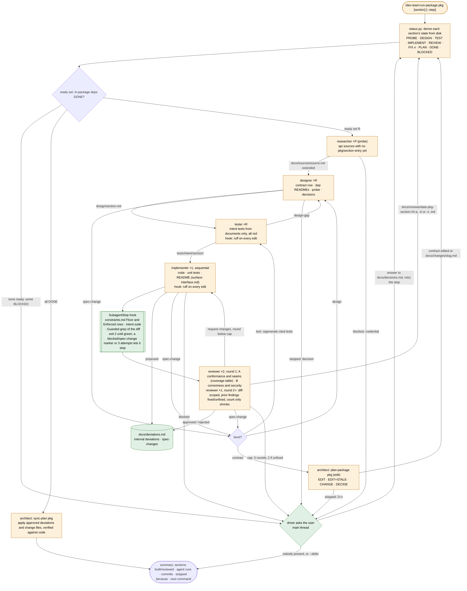
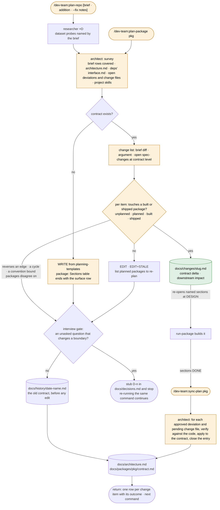
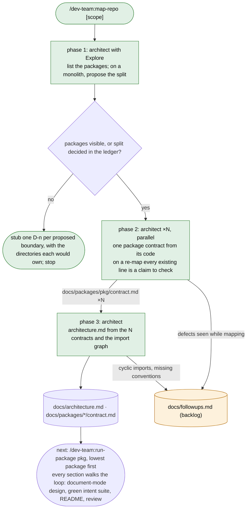
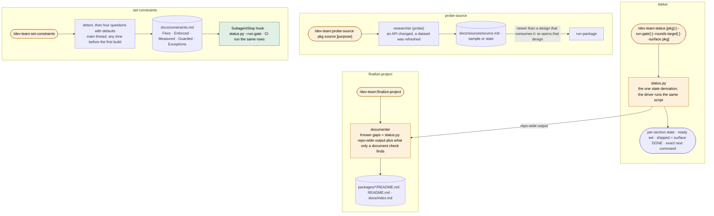
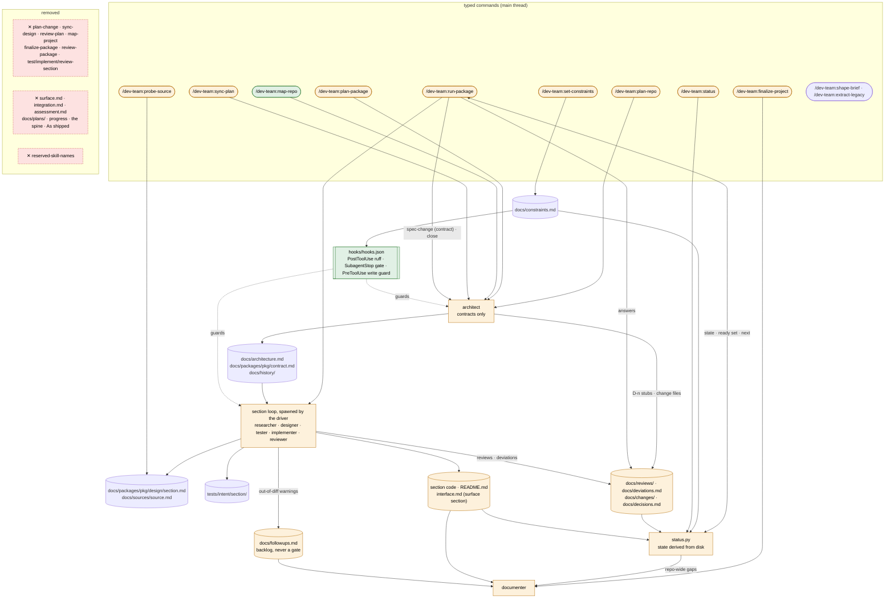

# dev-team remake — design

Approved 2026-09-26. Mode: change. Branch `dev-team-remake`.

Written by `design-plugin` from the discussion, and approved in two gates: the charts, then
this writeup. `plan-phases` reads it, in a chat that has seen nothing else, to write the phase
notes and their evals. `run-phase` reads it for the why. Anything decided in the discussion and
not written here is lost.

The discussion itself is `site/notes/remake-00-workflow.md` (the seed). Where this file and
the seed disagree, this file wins; the seed is kept as the record of how the decisions were
reached.

## The idea

Six roles, each answering one question: the architect writes and edits contracts; the
designer designs one section from its contract row; the researcher probes one external
source; the tester turns a design into red intent tests; the implementer builds one section to
its design; the reviewer judges conformance and correctness. One driver, `run-package`, runs
in the user's conversation and spawns every agent itself, in dependency order, over a ready set
it recomputes from disk every iteration. There is no progress file, no spine, no surface or
integration document: the package's public surface is an ordinary `surface` section that
depends on every other section, so it is designed last from shipped READMEs and its README is
`interface.md`. Mechanical checks leave the reviewer and move into plugin hooks: `ruff` after
every edit, a `SubagentStop` gate that runs `docs/constraints.md`'s rows and the intent suite
before an implementer may finish, and a `PreToolUse` guard on where each role may write. A
wrong contract is no longer a failure the implementer is graded on: `spec-change` is a normal
exit that routes to the tester, the designer or the architect. The result can be re-run a
week later from a fresh thread, after hand edits or a crash, and behave identically, because
every state it acts on is derived from files.

What is wrong today, from evals J, K, O and P and the 0.6 review: the loop did not converge
(a wrong contract left the implementer no correct move; each round's fresh reviewer
re-sampled the whole section; fixes were local while wrong facts were not); `run-package`
carried a plan that was stale the moment the spine shipped, and needed five typed skills and
an `integration.md` to know what to do next; `docs/followups.md` was a queue and a backlog at
once and gated finalize on both; three assessment files, `surface.md`, `integration.md` and
`As shipped` sections were all documents nobody read after the run that wrote them; and the
mechanical half of every review (lint, format, tests, import-lint, constraint rows) cost a
reviewer run to discover. After this change: one derived state, one loop, hooks for what must
happen every time, a closed CRITICAL list, a capped and shrinking review, and canonical
contracts that always describe code that exists.

## Workflows

### run-package

`/dev-team:run-package <pkg> [<section>] [--step PROBE|DESIGN|TEST|IMPLEMENT|REVIEW]` → every
ready section walked to DONE, the `surface` section last, then `sync-plan`; a summary block
ending in one exact next command.

- **Unit:** one step of one section. An agent instance reads the section's contract row plus
  one upstream document and writes one file: `docs/packages/<pkg>/design/<section>.md`;
  `tests/intent/<section>/`; the section's code and `README.md` (for the `surface` section,
  `docs/packages/<pkg>/interface.md`); or `docs/reviews/<date>-<pkg>-<section>-r<n>-<a, b or s>.md`.
  The driver branches on each return's first line only (`Result: done | blocked | stopped |
  spec-change | design-gap`) and relays the rest of the return to the next agent only for
  `design-gap` (to the designer) and `spec-change` (to the tester, designer or architect).
- **Strengthened by:** the tester as design gate: `design-gap` sends a section back to the
  designer before any code exists, the cheapest review in the system. Intent tests written
  from documents and never the source. Hooks running every mechanical check, so no lint,
  format, failing test, import violation or constraint row can reach review. Two focused
  reviewers in round 1, A owning a coverage table with one row per contract clause and design
  item (pass / fail / can't-tell, with `file:line`). Round 2+ frozen to the diff since the
  previous review (`Diff: <sha>..HEAD` in the prompt), CRITICAL only for last round's unfixed
  findings or lines the fix touched, so the finding count can only fall. A cap of 3 rounds,
  2 when a prior finding is unfixed; then BLOCKED and the user chooses one more round or
  `--defer`. `spec-change` as a verdict, not a failure. CRITICAL as a closed list: a break
  (contract, decided `D<n>`, consumed shipped signature), a wrong result on the main path, a
  security finding, a silent or unreasoned deviation. Never-claim rules: the tester never
  asserts what no document says; the reviewer never runs a command; the implementer never
  edits `tests/intent/`, a contract, or a design.

| Input | Supplied by |
|---|---|
| Which sections to run, and at which step | file: `status.py`, computed from disk every iteration |
| What to build | file: the section's row in `docs/packages/<pkg>/contract.md` (architect); `docs/packages/<pkg>/design/<section>.md` (designer) |
| What to judge against | file: the design, the contracts, `docs/sources/<source>.md`, the READMEs of the sections in `Depends on` |
| Whether an api source needs probing | file: `docs/sources/<token>.md` lacks a `## <pkg>/<section>` heading |
| Credentials for a probe | the user: environment variables or a root `.env`; on `blocked`, the driver asks and retries |
| Decisions | file: `docs/decisions.md`, stubbed by the architect or designer; answered by the user in the file, or through the driver's question |
| The quality bar the stop hook enforces | file: `docs/constraints.md` (`set-constraints`), else the Toolchain rows of `docs/architecture.md` |
| The diff a round-2+ reviewer is scoped to | file: the `Commit:` line of the previous round's report, read by the driver |
| Whether to keep going after the cap | the user: one more round, or `--defer` |

### The architect: plan-repo, plan-package, sync-plan

`/dev-team:plan-repo [brief | addition | --fix "<notes>"]`, `/dev-team:plan-package <pkg>`,
`/dev-team:sync-plan <pkg>` → a written or edited contract (or contracts brought up to the
shipped code), archived first, and a return with one row per change item and the next command.

- **Unit:** one contract per run: `docs/architecture.md` at repo scope,
  `docs/packages/<pkg>/contract.md` at package scope. On an edit, one change item, classified
  against the package state table (unplanned / planned / built / shipped) into EDIT,
  EDIT+STALE, CHANGE or DECIDE. On `sync-plan`, one approved `docs/deviations.md` entry or one
  pending `docs/changes/<slug>.md`, verified against the code before it is applied.
- **Strengthened by:** template headings from `planning-templates`, which every downstream
  reader parses; the interview gate, which stops rather than guesses at a boundary, with the
  ledger tag `Raised by: /dev-team:<skill> <arg> (interview)` so no question is asked twice; the
  rule that a canonical contract describes code that exists, so anything touching a bound
  package becomes a change file instead of an edit; the archive to `docs/history/` before
  every edit; `sync-plan` applying nothing it did not verify against the code. Never-claim: a
  contract never carries a future-tense claim outside a greenfield package; the architect never
  writes a signature at repo scope (shapes only) and never edits a designer's document.

| Input | Supplied by |
|---|---|
| The brief | the user: `docs/brief.md` via `shape-brief`, or the argument |
| The repo contract a package is planned under | file: `docs/architecture.md` (plan-repo) |
| Shipped surfaces of dependencies | file: `docs/packages/<dep>/interface.md` (the implementer, via that package's `surface` section); its `contract.md` marked provisional when unshipped |
| Dataset facts that shape the decomposition | loop: researcher, dataset probes at repo scope only |
| What changed | file: brief diff against `docs/history/brief-contracted.md`; the argument; open `spec-change:contract` entries in `docs/deviations.md` |
| Package state for edit classification | file: `contract.md` exists → planned; section code exists → built; `interface.md` exists and the surface's latest review approves → shipped |
| Which project skills exist | file: `.claude/skills/*/` minus `ls ${CLAUDE_PLUGIN_ROOT}/skills` |
| Decisions | file: `docs/decisions.md` |

### map-repo

`/dev-team:map-repo [scope]` → one package contract per package and the repo contract, all
describing the code as it is; defects filed to the backlog.

- **Unit:** phase 2: one package's contract from its code, one `dev-team:architect` instance
  per package, N in one message. Phase 3: the repo contract from the N contracts plus the
  import graph. Phase 1's package list travels in the phase-2 prompts, not in a file; on a
  re-run it is recomputed. Phase 1 and phase 3 are the same forked architect run; phase 2 is
  its fan-out (nesting depth 2, within the limit).
- **Strengthened by:** the interview gate on the split, so package names (which become
  directory names and shell arguments) are never invented silently; every existing contract
  line treated as a claim to check against the code, with each correction reported as *stale
  doc corrected* or *code looks wrong, filed*; the same templates as a greenfield contract, so
  nothing downstream can tell an adopted package from a planned one.

| Input | Supplied by |
|---|---|
| The package list | loop: phase 1's Explore pass; or the user's answers to the split stubs in `docs/decisions.md` |
| The code | the repo |
| The import graph | file: `lint-imports` output when configured, else a read-only grep of imports |
| Existing contracts to check | file: `docs/architecture.md`, `docs/packages/*/contract.md` (a re-map) |
| Scope hint | the user: the argument |

### The commands outside the loop

`/dev-team:status`, `/dev-team:probe-source`, `/dev-team:finalize-project`,
`/dev-team:set-constraints` → each composes files that already exist and answers one
question. `shape-brief` and `extract-legacy` are unchanged and not drawn.

- **Unit:** `status`: one section's state row, computed by the script. `probe-source`: one
  source, probed for one section's purpose, appended under `## <pkg>/<section>`.
  `finalize-project`: one package README from its `interface.md`, section READMEs and
  contract. `set-constraints`: one `docs/constraints.md`, written or revised with the user.
- **Strengthened by:** one state derivation shared by the driver, the status command, the
  stop hook and the documenter, so four readers cannot disagree; the probe doc's `observed` /
  `documented` labels per heading; the documenter never reading source to learn what the
  system does, only to confirm a claimed path exists; constraints that tighten and never
  loosen, with **Guarded** catching an agent lowering the bar.

| Input | Supplied by |
|---|---|
| `status`: everything it derives from | file: contracts, designs, intent trees, READMEs, `docs/reviews/`, `docs/deviations.md`, `docs/changes/`, `docs/decisions.md`, `docs/constraints.md`, git |
| `probe-source`: the purpose | the user's argument; else the contract row whose `source` names the token |
| `probe-source`: the credential | the user: environment or `.env` |
| `finalize-project`: the repo-wide gap list | file: `status.py --repo` output |
| `finalize-project`: the shipped documents | file: `interface.md` and section READMEs (the loop), contracts (the architect), `docs/decisions.md`, `docs/followups.md` |
| `set-constraints`: defaults | file: root `pyproject.toml` tool tables, the Toolchain section; the existing file in revision mode |
| `set-constraints`: the bar | the user: four answers |

## How they fit together

| File | Written by | Read by | Fields read | Stale when |
|---|---|---|---|---|
| `docs/architecture.md` | architect (plan-repo, map-repo phase 3, sync-plan) | every agent; `status.py` (Packages table: name, path) | Packages table (`package`, `path`, `depends on`, `covers`), Dependency graph, Boundaries shapes, Shared conventions (external sources: env var, location), Toolchain, Open decisions | the brief changed (diff against `docs/history/brief-contracted.md`); a `docs/changes/<slug>.md` at repo level is open; a package shipped with a deviation against a repo shape |
| `docs/packages/<pkg>/contract.md` | architect (plan-package, map-repo phase 2, sync-plan) | `status.py` (Sections table), designer, tester, implementer, reviewer, documenter | Sections table (`section`, `responsibility`, `path`, `builds with`, `depends on`, `source`), Section interfaces, Pipelines, Public surface (intent), Consumes | `docs/architecture.md` changed after it; an open `spec-change:contract` entry names it; an open change file names one of its sections |
| `docs/packages/<pkg>/design/<section>.md` | designer | tester, implementer, reviewer A, `status.py` (mtime and commit) | the eleven template headings, in particular **Interfaces**, **Module plan**, **Workflow / pipeline**, **Error handling and logging**, **Tests**, **Open questions**, **Contract deviations** | its contract row changed; a probe doc it cites is newer; an open change file names the section; a `design-gap` or `spec-change:design` is open |
| `docs/sources/<source>.md` (+ `.sample.json` / `.stats.json`, probe or profile script) | researcher | designer, implementer, reviewer, architect (dataset: **Supported tasks**, **Splitting**), `status.py` (heading present, mtime) | **Access**, per-section `## <pkg>/<section>` entries, **Observed schema**, **Quirks**, and the dataset task-fit headings | the world changed (`probe-source` re-run); a new section names the source and has no entry yet |
| `tests/intent/<section>/` | tester | implementer (runs), reviewer (runs), stop hook (runs), `status.py` (exists, commit) | test docstrings `Design §<n> <item>` | the design is newer than the tree |
| section `README.md` (the `surface` section's is `docs/packages/<pkg>/interface.md`) | implementer | designer and implementer of dependents, reviewer, documenter, architect (sync-plan, edit classification), `status.py` (exists, commit) | the seven README headings, above all **Entry points and interfaces** and **Implementation notes**; `interface.md`'s **Public names**, **Pipelines**, **CLI commands**, **Configuration**, **Shapes provided**, **Deviations**, **Consumers (computed)** | code is newer than it (a fix round rewrites it) |
| `docs/reviews/<date>-<pkg>-<section>-r<n>-<a, b or s>.md` | reviewer | `status.py` (round, verdict, `Commit:`), the fix-round implementer (the queue), the next reviewer (fixed / unfixed), documenter (none) | `Scope:`, `Commit:`, `Verdict:`, `Round:`, `Focus:`, `Convergence:`; **CRITICAL**, **WARNING**, **SUGGESTION**, **Coverage** (A only), **Carried** | code newer than its `Commit:` |
| `docs/deviations.md` | implementer (proposed, spec-change), designer (spec-change), reviewer (approved / rejected, spec-change), architect (synced, resolved) | reviewer, `status.py` (open spec-changes re-open a step), architect (sync-plan, edit classification), tester (approved entries name the cited tests to regenerate) | per entry: section, kind, clause, said, did / found, why, status | never stale; entries close by status |
| `docs/changes/<slug>.md` | architect (plan-repo or plan-package CHANGE outcome) | `status.py` (re-opens named sections at DESIGN), designer (delta mode), implementer, reviewer, architect (sync-plan applies and closes) | **Change goal**, **Affected sections**, **Contract changes** (Added / Changed / Removed per contract), **Downstream impact**, `Status:` | its sections are DONE and `sync-plan` has not run |
| `docs/decisions.md` | architect and designer (stubs), user or driver (`Decision:`, `Status:`), implementer (`Applied:`) | every agent, `status.py` (BLOCKED: open with no assumption), documenter | `## D<n> — <question>`, `Scope:`, `Raised by:`, `Recommendation:`, `Assumption if unanswered:`, `Decision:`, `Status:`, `Applied:` | never stale; entries are retired by `Status: superseded` |
| `docs/constraints.md` | `set-constraints` (with the user) | stop hook, `status.py --run-gate`, CI (`workspace-scaffold`), reviewer (Measured values, Exceptions), tester (coverage row) | **Floor**, **Enforced**, **Measured**, **Guarded**, **Exceptions** tables (`command`, `scope`, `threshold`) | the user changes the bar |
| `docs/followups.md` | reviewer (out-of-diff WARNINGs, `--defer`), architect (map-repo defects, Measured notes) | the fix-round implementer (may take entries for its section), documenter (Known gaps), the user | one line per item: `- [ ] <pkg>/<section>: <what> — <who> <date>` | never counted; ticked by whoever does the work |
| `docs/history/<date>-<name>.md` | architect, before every contract edit | the user | a verbatim copy | never |

## Components

| Name | Kind | Change | Role | Reads | Writes | Used by | Origin |
|---|---|---|---|---|---|---|---|
| `architect` | agent | changed | Writes and edits contracts. Survey, interview gate, write or classify, archive, commit. Never designs, never spawns designers. Spawns researchers (datasets, plan-repo) and architects (map-repo phase 2). | brief, `architecture.md`, deps' `interface.md`, `deviations.md`, `changes/`, `decisions.md`, code (map-repo, sync-plan), `.claude/skills/` minus the plugin's own | `architecture.md`, `packages/<pkg>/contract.md`, `decisions.md` stubs, `history/`, `changes/<slug>.md`, `followups.md` (map-repo) | plan-repo, plan-package, map-repo, sync-plan, run-package (spec-change:contract, close) | asked |
| `designer` | agent | changed | Designs one section from its contract row. Modes `new` (no code at the path), `document` (code, no design), `delta` (an open change file names the section). Exits `done`, `stopped`, `spec-change`. Spawned by the driver. | contract row, `architecture.md`, dependency READMEs, upstream `interface.md`, probe docs, `decisions.md`, the tester's design-gap reasons, an open change file | `design/<section>.md`; `deviations.md` (a spec-change entry); `decisions.md` stubs | run-package | asked |
| `researcher` | agent | changed | Probe mode: one source for one section's purpose; extends an existing doc under `## <pkg>/<section>`. Extract mode unchanged. | contract row, existing probe doc, env credentials, vendor docs | `docs/sources/<source>.md`, sample or stats, probe script | run-package (PROBE), plan-repo (datasets), probe-source, extract-legacy | asked |
| `tester` | agent | changed | Turns a design into intent tests: red by construction when the section path has no code, expected green on adopted code. Exits `done` or `design-gap`. Reconcile mode removed; regenerates only the tests an approved deviation or `spec-change:test` cites. | design, contracts, probe docs, dependency READMEs, `decisions.md`, `constraints.md` coverage row, `deviations.md` approved entries; never the source | `tests/intent/<section>/`, fixtures | run-package | asked |
| `implementer` | agent | changed | Builds one section to its design; the `surface` section is the old surface mode. Runs the intent suite at start and end. Logs internal deviations as `proposed`; raises `spec-change` with evidence. No constraints step, no branch or baseline check: the hooks and the run gate own them. Writes the stop-hook marker on `blocked` or `spec-change`. | design, contracts, dependency READMEs, intent tests, probe docs, `decisions.md`, the latest review round, backlog entries for its section, `deviations.md` | section code, `tests/unit/<section>/`, README (surface: `interface.md`, the API page under `docs/api/`, import contracts, `[project.scripts]`), `deviations.md`, `decisions.md` `Applied:`, scaffold files, `.dev-team/stop` marker | run-package | asked |
| `reviewer` | agent | changed | Judges conformance and correctness. `Focus: conformance, correctness or full`. Round 1: A owns the coverage table and the seams, B owns correctness and security; round 2+: one `full` reviewer, diff-scoped. Approves or rejects `proposed` deviations. Verdicts `approve`, `request changes`, `spec-change`. Runs no command; reports Measured values from the hook's output; honours Exceptions. Axis 0 and the followups queue removed. | everything the implementer read, the code, the diff since the previous round, the previous round's reports, the stop hook's last output | `docs/reviews/<date>-<pkg>-<section>-r<n>-<a, b or s>.md`, `deviations.md` status, `followups.md` (out-of-diff WARNINGs, `--defer`) | run-package | asked |
| `documenter` | agent | changed | Human-facing docs from shipped documents. Known gaps = `status.py --repo` output plus what only a document check finds (a claimed command that does not exist, two sections with conflicting env defaults). Drops `synced.md`, assessment inputs, the API-page fallback. | `interface.md`, section READMEs, contracts, `decisions.md`, backlog, `status.py --repo` | `packages/*/README.md`, root `README.md`, `docs/index.md` | finalize-project | asked |
| `curator` | agent | unchanged | Legacy inventory and researcher coordination. | old repo, `docs/brief.md` | `docs/legacy/inventory.md` | extract-legacy | asked (kept, out of scope) |
| `run-package` | workflow skill, main thread | changed | The driver. `<pkg> [<section>] [--step]`. Derives state every iteration, runs the ready set, spawns every agent itself as `dev-team:<agent>` with `run_in_background: false`, parallel spawns in one message, asks the user on a block, records the answer, ends with the summary block. | `status.py` output; each return's first line; whole returns only to relay `design-gap` and `spec-change` | `docs/decisions.md` (`Decision:` and `Status:` from the user's answer); nothing else | the user | asked |
| `plan-repo` | forked skill → architect | changed | Write or edit the repo contract; `--fix "<notes>"` corrects without touching the brief. Dataset probes before the contract. | see architect | see architect | the user | asked |
| `plan-package` | forked skill → architect | changed | Write or edit one package contract. Always ends the Sections table with the `surface` row. Edit when the repo contract changed, a `spec-change:contract` is open, or a change is requested. | see architect | see architect | the user, run-package | asked |
| `map-repo` | forked skill → architect | new | Replaces `map-project` and the architect's document mode. Three phases; phase 2 is an architect fan-out; a monolith stops at the split. | code, existing contracts as claims | contracts, `decisions.md`, `followups.md` | the user | asked |
| `sync-plan` | forked skill → architect | changed | Package close: approved deviations and pending change files into the contracts, verified against the code; entries closed; consumers of a changed name recomputed and classified (CHANGE per shipped consumer, STALE per planned one). | `deviations.md`, `changes/`, code, `interface.md` | contracts, `deviations.md` (synced), `changes/` (closed) | the user, run-package (close) | asked |
| `status` | workflow skill | changed | Run the script, say the next command. `--gate` and `--plan-gate` go; `--run-gate`, `--rounds` stay; `--surface`, `--repo` added. | script output | nothing | the user | asked |
| `probe-source` | forked skill → researcher | changed | Re-probe after the world changed. Adding a source after planning is a `plan-package` edit, not this. | see researcher | see researcher | the user | asked |
| `finalize-project` | forked skill → documenter | changed | Human-facing layer; trimmed procedure. | see documenter | see documenter | the user | asked |
| `set-constraints` | workflow skill, main thread | changed | Same shape; drops "after shape-brief"; its file is now the hook's spec. | `pyproject.toml`, Toolchain, existing file | `docs/constraints.md` | the user | asked |
| `extract-legacy` | forked skill → curator | changed | Drops the reserved-skill-names check; a project skill named like a plugin skill is reported, not skipped. | see curator | see curator | the user | asked (kept, out of scope) |
| `shape-brief` | workflow skill, main thread | unchanged | Its own loop; out of scope. | | `docs/brief.md` | the user | asked (out of scope) |
| `hooks/hooks.json` + `hooks/format_on_edit.py` | hook: `PostToolUse` on `Write|Edit` | new | For `agent_type` `dev-team:implementer` and `dev-team:tester`, on `.py` files under a repo that has `docs/architecture.md`: `ruff format` then `ruff check --fix` on the edited file; exit 2 with what remains so the agent sees it. Exit 0 outside scope. | hook input (`agent_type`, `tool_input.file_path`, `cwd`) | the edited file | run-package | asked |
| `hooks/gate_on_stop.py` | hook: `SubagentStop`, matcher `^dev-team:implementer$` | new | Runs `constraints.md` Floor and Enforced rows with `<pkg>` substituted, the section's intent suite, a Guarded grep of the run's diff, and for the `surface` section `status.py --surface`; without `constraints.md`, the Toolchain commands. Exit 2 with the failures until they pass. Loop guard: `.dev-team/stop` marker (written by the implementer on `blocked` or `spec-change`, deleted by the hook) or an attempt counter per `agent_id` under `${CLAUDE_PLUGIN_DATA}` reaching 3 lets it stop; from attempt 2 the exit-2 text names `debugging-and-error-recovery`. | hook input, `docs/constraints.md`, `docs/architecture.md` Toolchain, `git diff`, the marker and counter files; imports `status.py`'s row parser | counter file under `${CLAUDE_PLUGIN_DATA}` | run-package | asked |
| `hooks/guard_writes.py` | hook: `PreToolUse` on `Write|Edit` | new | Per `agent_type` path allowlist: architect under `docs/` except `design/`, `reviews/`, `deviations.md`; designer to `docs/packages/<pkg>/design/`, `docs/deviations.md`, `docs/decisions.md`; researcher to `docs/sources/` and `.claude/skills/<name>/`; tester to `tests/intent/<section>/` and `tests/fixtures/`; reviewer to `docs/reviews/`, `docs/deviations.md`, `docs/followups.md`; documenter to the READMEs, `docs/index.md`; implementer everywhere but `docs/` except `deviations.md`, `decisions.md`, and its own package's `docs/api/` page and `interface.md`; nothing under `tests/intent/` for anyone but the tester. Exit 2 with the rule otherwise. Exit 0 outside a dev-team repo. | hook input | nothing | every workflow | suggested and accepted: the old README told users to add this hook themselves |
| `skills/status/scripts/status.py` | script | changed | The one state derivation: per-section state with the re-open rules, the ready set, rounds from report filenames, shipped = surface DONE, the computed next command, `--run-gate`, `--rounds`, `--surface <pkg>` (three-way agreement and lazy import), `--repo` (the documenter's gap list). Stops counting `followups.md`. Exposes its parsers for the hooks to import. | contracts, designs, intent trees, READMEs, `reviews/`, `deviations.md`, `changes/`, `decisions.md`, `constraints.md`, git | stdout | run-package, status, finalize-project, the stop hook | asked; `--surface` suggested and accepted |
| `planning-templates` | knowledge skill | changed | Repo contract, package contract (the `surface` row), `change.md` (was contract-delta, gains **Downstream impact** and `Status:`), `deviations.md` entry (new), review report (new: the reviewer's file shape, so `status.py` and the hooks parse a template they can be checked against), source probe. Drops `surface.md`, `integration.md`. | | | architect, researcher, reviewer, implementer and designer (deviations entry) | asked |
| `git-workflow-and-versioning` | knowledge skill | changed | Shrinks to §Project convention, preloaded into every committing agent. Branch and Baseline leave: `status.py --run-gate` checks them once per driver run. Message table regenerated for the new skill set; the reviewer commits its report only. | | | every committing agent | asked |
| `workspace-scaffold` | knowledge skill | changed | Import contracts 2 and 3 derive from the Sections table's `Depends on`; CI runs the `constraints.md` rows, the same list the hook runs. | | | architect (Toolchain), implementer (first section, `surface` section) | asked |
| `security-review` | knowledge skill | unchanged | Routing only: implementer on its triggers; reviewer B in round 1; the round-2+ reviewer when the diff hits a trigger. Reviewer A never. | | | implementer, reviewer | asked |
| `project-structure`, `python-style-guide`, `python-implementation`, `test-driven-development`, `debugging-and-error-recovery` | knowledge skills | unchanged | Preloaded or invoked as today; the `__init__.py` pattern is now the `surface` section's. | | | as today | asked |
| `pyproject-lint-config.toml` | config | unchanged | The hard limits the `PostToolUse` hook now enforces through `ruff`. | | | implementer scaffold, hook | asked |
| `contracts.yml`, `README.md`, `CLAUDE.md`, `VERSIONING.md`, `site/` | config | changed | Claims rewritten for the new headings and lists (see **What must not break**); the three-file rule becomes two files; five workflow pages rewritten; site rebuilt. | | | check-contracts, build-site | composed |
| `plan-change`, `sync-design`, `review-plan`, `map-project`, `finalize-package`, `review-package`, `test-section`, `implement-section`, `review-section` | workflow skills | removed | Their jobs are the loop's steps, the architect's edit classification, or gone with the spine and the plan review. | | | | asked |
| `reserved-skill-names` | knowledge skill | removed | Installed plugin skills never sit under the project's `.claude/skills/`; `ls ${CLAUDE_PLUGIN_ROOT}/skills` derives the list at run time. | | | | asked |

## Outputs

### `docs/packages/<pkg>/contract.md`

- Sections: **Purpose**, **Sections** (table: section, responsibility, path, owner doc, builds
  with, depends on, source; the last row is always `surface`, path = the package top level,
  `depends on` = every other section, responsibility = §4 Pipelines and §5 Public surface),
  **Section interfaces**, **Pipelines**, **Public surface (intent)**, **Consumes**, **Package
  conventions**, **Open decisions**.
- Cites: every shape by its name in `docs/architecture.md`; every brief capability by its name
  in the brief; every open decision by `D<n>`.
- Never claims: a signature for another package; a section with no path; a future-tense claim
  about a built or shipped package (that is a change file); a source not written as
  `<kind>:<token>`.
- Stale when: `docs/architecture.md` changed after it; an open `spec-change:contract` entry
  names it; an open change file names one of its sections.

### `docs/architecture.md`

- Sections: **Goal**, **Packages**, **Dependency graph**, **Boundaries**, **Shared conventions**
  (including external sources: env var per api, location per dataset, the one constraining
  line from a repo-scope dataset probe), **Toolchain**, **Non-goals**, **Open decisions**.
  Unchanged from the current template.
- Cites: the brief's capability names in `covers`; `docs/sources/<token>.md` for a probed
  source; `D<n>` numbers only.
- Never claims: a signature (shapes only); a convention the repo does not have ("no
  convention" is written as such); a decision's content.
- Stale when: the brief differs from `docs/history/brief-contracted.md`; a repo-level change
  file is open.

### `docs/packages/<pkg>/design/<section>.md`

- Sections: the designer's eleven headings as today (**Purpose and scope**, **Inputs and
  outputs**, **Data model / internal contracts** with **Module plan**, **Workflow / pipeline**,
  **Interfaces**, **Error handling and logging**, **Tests**, **Pitfalls and risks**, **Skills
  used**, **Contract deviations**, **Open questions**), plus a first line `Mode: new |
  document | delta` and, for `delta`, `Change: docs/changes/<slug>.md`. **As shipped** and
  **Revision** are gone; a revision rewrites the document.
- Cites: every consumed name by the README or `interface.md` it comes from; every probe doc by
  path; every open question as `OQ-<pkg>-<section>-<k>` with the assumption designed against;
  for the `surface` section, every public name by the README that provides it.
- Never claims: a shape or signature the contracts already give (it references them); an
  import from another package's internals; a fact about a probed source that the probe doc
  marks `documented` as if observed; for the `surface` section, a public name no README
  provides (that is `spec-change:contract`).
- Stale when: the contract row changed; a cited probe doc is newer; an open change file names
  the section; a `spec-change:design` is open.

### `docs/sources/<source>.md`

- Sections: as today's `planning-templates/references/source-probe.md`, plus one
  `## <pkg>/<section>` heading per consuming section, appended by the probe that served it,
  holding the endpoints or columns that section needs and nothing else.
- Cites: the purpose (the contract row) each section heading was probed for; `observed` /
  `documented` / `sandbox` on every endpoint row.
- Never claims: a credential value; a record from a dataset; an observation it did not make.
- Stale when: `probe-source` is re-run (the world changed). A new consuming section does not
  make it stale; it makes the section need PROBE.

### `tests/intent/<section>/`

- Sections: `conftest.py` (fixtures from the probe sample or stats, fakes built to shipped
  signatures), one `test_<interface>.py` per **Interfaces** row, `test_workflow.py` for the
  end-to-end path.
- Cites: every test's docstring is `Design §<n> <row or step>: <one line>`; a test asserting
  an open decision's assumption is `xfail(strict=False, reason="D<n> open — assumption: …")`.
- Never claims: anything the documents do not say (the case is not written and the return
  says so); a passing test on new code (deleted); a suppression comment.
- Stale when: the design is newer than the tree. Regenerated only for the design items an
  approved deviation or a `spec-change:test` cites.

### Section `README.md` and `docs/packages/<pkg>/interface.md`

- Sections: the implementer's seven README headings as today (**Purpose**, **Files**, **Entry
  points and interfaces**, **Pipeline / workflow**, **Configuration**, **Running and testing**,
  **Implementation notes**); `interface.md`'s seven as today (**Public names**, **Pipelines**,
  **CLI commands**, **Configuration**, **Shapes provided**, **Deviations**, **Consumers
  (computed)**).
- Cites: **Implementation notes** cites each `docs/deviations.md` entry by section and date
  rather than restating it; `Public: yes` cites the contract's **Public surface (intent)** row.
- Never claims: a deviation not in `docs/deviations.md`; a public name the contract's §5 does
  not name a consumer for (a difference is a deviation against §5).
- Stale when: code is newer than it.

### `docs/reviews/<date>-<pkg>-<section>-r<n>-<a, b or s>.md`

- Sections: header lines `Scope:`, `Commit:`, `Verdict: approve | request changes |
  spec-change`, `Round: <n>`, `Focus: conformance, correctness or full`, `Convergence: <k>
  prior unfixed, <m> new` (round 2+), `Diff: <sha>..HEAD` (round 2+); then **CRITICAL**,
  **WARNING**, **SUGGESTION** (Measured values here), **Coverage** (A and full only: one row
  per contract clause and design item, pass / fail / can't-tell, `file:line`), **Carried**
  (round 2+), **Spec-change** (level, evidence) when that is the verdict.
- Cites: `file:line` for every finding; the clause or design item each coverage row judges;
  the previous round's finding each fixed / unfixed line refers to.
- Never claims: a CRITICAL outside the closed list; on round 2+, a CRITICAL on code the fix did
  not touch that last round did not raise; a mechanical failure (the hook owns those); a fix.
- Stale when: code is newer than `Commit:`. A round is the set of reports sharing `-r<n>`; its
  verdict is the worst of the set.

### `docs/deviations.md`

- Sections: one `## <pkg>/<section> — <date> — <kind>` entry per item, `kind` one of
  `deviation`, `spec-change:test`, `spec-change:design`, `spec-change:contract`; fields
  `Clause:` (the contract row or design item), `Said:`, `Did:` (deviation) or `Found:`
  (spec-change, the evidence), `Why:`, `Status:` (`proposed | approved | rejected | synced`
  for a deviation; `open | resolved` for a spec-change), `Raised by:` (role and run trailer),
  `Resolved by:` (commit or run). Append-only; status lines are the only edits.
- Cites: the clause by heading and row; the evidence by `file:line` or probe doc heading.
- Never claims: a deviation without a reason (the reviewer grades that CRITICAL); a boundary
  shape, public name or nullable column as an internal deviation (those are `spec-change`).
- Stale when: never. `status.py` reads open spec-changes as re-open evidence and `sync-plan`
  closes what it applied.

### `docs/changes/<slug>.md`

- Sections: **Change goal**, **Affected sections** (qualified names, including consumers this
  change adapts), **Contract changes** (per contract: **Repo contract**, **Package contract:
  <pkg>**, **Interface: <pkg>**; Added / Changed / Removed within each), **Downstream impact**
  (consumer, shipped or planned, names affected, what breaks), `Status: open | synced`.
- Cites: every altered shipped name with its old and new signature; every consumer from the
  grep `sync-plan` and the architect share.
- Never claims: a change to a canonical contract (it is applied by `sync-plan`, never here).
- Stale when: its sections are DONE and `sync-plan` has not applied it. It is history once
  `Status: synced`.

### `docs/decisions.md`

- Sections: as today. `Raised by:` tags are `/dev-team:plan-repo (interview)`,
  `/dev-team:plan-package <pkg> (interview)`, `/dev-team:map-repo (interview)`,
  `OQ-<pkg>-<section>-<k>`, or `/dev-team:run-package <pkg> (driver)` when the driver stubbed a
  question a designer or implementer returned.
- Cites: the designer's `OQ` tag or the interview.
- Never claims: `Status: decided` written by an agent (only the user, or the driver relaying
  the user's answer).
- Stale when: never; retired by `superseded`.

### `docs/followups.md`

- Sections: none; one line per item, `- [ ] <pkg>/<section>: <what> — <who> <date>`,
  append-only, ticked by whoever does the work.
- Cites: the report or run that noted it.
- Never claims: a review CRITICAL (the report is the queue); a wrong intent test (that is
  `spec-change:test`); a dependency gap (that is `spec-change:contract`); anything a loop step
  will pick up.
- Stale when: never counted, never a gate.

### `status.py` output

- Sections: per package, one row per section: `section · state · evidence · ready · round ·
  open spec-change · last commit`; then `shipped: yes | no (surface <state>)`; then `next:
  <exact command>`. `--run-gate` prints `run gate: PASS | FAIL` with reasons (branch,
  baseline, contract exists). `--rounds <pkg>/<section>` prints the round count. `--surface
  <pkg>` prints the three-way diff and the lazy-import result. `--repo` prints the repo-wide
  gap list the documenter copies into **Known gaps**.
- Cites: the file or commit each state was derived from.
- Never claims: a state from a stored file; a count from `docs/followups.md`.
- Stale when: any run ends (it is recomputed on every call).

## Cost

Fixed cost per spawn, from eval L (2026-09-19): implementer ~54k tokens, tester ~40k,
reviewer and architect ~38k, designer ~26k, before any work. This design lowers the tester's
and reviewer's (the TDD skill trimmed to RED for the tester; axis 0 and the followups queue
gone from the reviewer) and the implementer's (no constraints step, no branch or baseline
check); `plan-phases` measures the new fixed cost in its first eval.

| Workflow | Cold run reads | Warm run reads | Horizon |
|---|---|---|---|
| run-package, one section | PROBE (api only): 1 researcher, the contract row and the vendor docs. DESIGN: 1 designer, the contract, `architecture.md`, dependency READMEs, probe doc. TEST: 1 tester, the design and contracts. IMPLEMENT: 1 implementer, the design, contracts, READMEs, intent tests, latest review round. REVIEW round 1: 2 reviewers, everything above plus the code. Each further round: 1 reviewer, the diff and the previous round; 1 implementer, the report | one `status.py` call per iteration; a DONE section is never re-read; a re-opened section costs only the steps from its re-open point | one package per run; the ready set is as wide as the dependency graph allows (probes, designs, tests parallel; implementers sequential); review rounds capped at 3 |
| run-package, close | 1 architect (sync-plan): `deviations.md`, `changes/`, `interface.md`, the code paths each entry names | nothing when no entry is open | one package |
| plan-repo | 1 architect: the brief, project skills, `workspace-scaffold`; D researchers for the brief's datasets | the brief diff against the snapshot and the change list only; probe docs dated today skipped | one repo |
| plan-package | 1 architect: `architecture.md`, the brief rows covered, deps' `interface.md`, open deviations and change files | the change list only | one package |
| map-repo | phase 1: 1 architect with Explore over the repo; phase 2: N architects, one package's code each; phase 3: 1 architect, N contracts and the import graph | every existing line re-checked (a re-map is a cold run by design) | one repo; N ≤ the concurrency limit, batched above it |
| status | the contracts, ledgers, READMEs, git; the intent suite is not run (the hook and the reviewer run it) | same | one repo or one package |
| probe-source | 1 researcher, one source, one purpose | the existing doc plus the one new call | one source |
| finalize-project | 1 documenter: `status.py --repo`, every `interface.md` and README, the contracts, the ledger, the backlog | same | one repo |
| set-constraints | main thread: `pyproject.toml`, the Toolchain, the existing file | same | one file |

## Decisions taken

| Decision | Chosen | Alternatives | Why | Origin |
|---|---|---|---|---|
| Roles | six agents, each answering one question; the curator kept as is | keep eight roles with modes; merge tester into reviewer | a role with modes drifts into two roles sharing a file; the tester's vantage point (documents, never source) is what catches a section that works but does something else | asked (seed §1) |
| State | derived from disk by `status.py` every iteration; the four ledgers are the only non-derivable state | a progress file; the driver's own counters | a stored state is wrong after a hand edit or a crash; derived state makes a re-run from a fresh thread identical | asked (seed §3.1) |
| Section states | PROBE, DESIGN, TEST, IMPLEMENT, REVIEW, FIX n, PLAN, DONE, BLOCKED; three re-open rules (design newer than tests, tests newer than README, code newer than review; open change file → DESIGN; probe newer than design → DESIGN) | flags written by the step that changed something | ordering by commit needs no writer to remember to set a flag | asked (seed §3.1); PLAN composed |
| Open `spec-change` on disk | an entry in `docs/deviations.md` with `kind: spec-change:<level>`; `status.py` re-opens the section at the level's step (`test` → TEST, `design` → DESIGN, `contract` → PLAN, which spawns `plan-package`) | a separate `docs/spec-changes.md`; BLOCKED for every open spec-change | one ledger for "the document and the code disagree" whichever way it resolves; BLOCKED is reserved for what needs the user | composed |
| Order | build up the dependency graph; a section is ready when its in-package `Depends on` are DONE; no spine | spine-first; integration doc's dependency order | the graph is already in the contract; a DONE dependency means its README exists, so the designer reads shipped code | asked (seed §3.2) |
| Parallelism | probes, designs and tests of ready sections in one message; implementers one at a time | worktree isolation per implementer | concurrent commits and shared files (`pyproject.toml`, `deviations.md`) are a merge problem worth solving only when throughput demands it | asked (seed §3.2, §7) |
| The surface | an ordinary `surface` section, last row of every Sections table, depending on every other section; its README is `interface.md`; shipped = surface DONE | `finalize-package` and `review-package` as skills; `surface.md` planned up front | a surface designed before any code exists could never describe what shipped; a section walks the same loop and gets the same review | asked (seed §3.7) |
| Deviations and spec-changes | internal deviation → `proposed` in `docs/deviations.md`, reviewer approves or rejects, approved → design updated and cited tests regenerated; boundary or public change → `spec-change` with evidence, routed by level | the implementer records deviations in its README and the tester follows them | the implementer was approving its own spec change, and a correct deviation from a wrong contract was graded CRITICAL | asked (seed §3.5) |
| Reviewer convergence | mechanical checks leave the reviewer; round 1 exhaustive with two focused reviewers and a coverage table; round 2+ frozen to the diff; `spec-change` is a verdict; cap 3 rounds, 2 when a prior finding is unfixed; CRITICAL a closed list | one reviewer every round; no cap | the loop did not converge because each fresh reviewer re-sampled the whole section and a wrong contract left no correct move | asked (seed §3.6) |
| Two round-1 reports | each reviewer writes its own report, `-r1-a.md` and `-r1-b.md`; `status.py` reads the pair as one round, verdict = worst; the fix round reads both | B first then A merges; the driver merges | keeps the parallelism and the driver's no-write rule; nothing is written twice | asked (this discussion) |
| Report naming | `docs/reviews/<date>-<pkg>-<section>-r<n>-<a, b or s>.md`; the reviewer takes `n` from `status.py --rounds` | date plus a collision suffix as today | rounds are literal in filenames, so a pair is unambiguous and same-day rounds need no `-2` | composed |
| Hooks | plugin `hooks/hooks.json`: `PostToolUse` ruff for implementer and tester; `SubagentStop` gate for the implementer running `constraints.md` rows, the intent suite and the Guarded grep; `PreToolUse` write guard per role | instructions in agent bodies; agent-frontmatter hooks | a hook is deterministic; plugin agents ignore frontmatter hooks; every mechanical failure that reached review cost a reviewer run | asked (seed §4); write guard suggested and accepted |
| Stop-hook loop guard | a marker file `.dev-team/stop` the implementer writes on `blocked` or `spec-change` (deleted by the hook), or an attempt counter per `agent_id` under `${CLAUDE_PLUGIN_DATA}` reaching 3; the exit-2 text names `debugging-and-error-recovery` from attempt 2 | `stop_hook_active` alone (one retry); no guard | a gate with no exit strands an agent that has a legitimate reason to stop; the counter is the same count the debugging skill's trigger uses | composed; the mechanism is a phase-0 eval |
| `constraints.md` | stays the spec: the hook, `status.py --run-gate` and CI run the same Floor and Enforced rows; the reviewer runs nothing, reports Measured, honours Exceptions | drop `set-constraints`; the reviewer keeps axis 0 | the file already is the list a hook needs; its value rises when a machine runs it | asked (seed §3.10) |
| Probing | api sources probed by the driver's PROBE step per ready section, one doc per source extended under `## <pkg>/<section>`; datasets probed by `plan-repo` | the designer spawns the researcher; the architect probes every source at plan time | the contract row is the purpose either way; the main thread can ask for a missing credential; one less nesting level; probes for the ready set run in parallel | asked (seed §2.4) |
| Architect edits | change list classified per item by the touched package's state: EDIT, EDIT+STALE, CHANGE (a change file), DECIDE (stop); archive first; never delete a document | edit in place; `plan-change` as a separate skill | a canonical contract must describe code that exists; the change file carries the delta until `sync-plan` | asked (seed §2.3) |
| `map-repo` | replaces `map-project` and document mode: Explore lists packages; one architect per package writes its contract from code; one repo architect writes `architecture.md` from the contracts and the import graph; a re-map treats every existing line as a claim | the package contracts written by `plan-package` in document mode, one run each | one command adopts a repo; the package fan-out is what the old design deferred to N typed runs | asked (seed §2.2) |
| `map-repo` on a monolith | phase 1 proposes the split as one `D<n>` per boundary (with the directories each would own) and stops; the re-run continues on answers or assumptions | one package with path `.`; split by top-level directory | package names become directory names and shell arguments; the interview gate is how every other architect question is asked | asked (this discussion) |
| Adopted code in the loop | designer `document` mode when code exists and no design; the tester expects the suite green on adopted code and files a red test as `spec-change:design`; the implementer adds README and unit tests and passes the suite | a separate adoption path | one loop; the surface of an adopted package ships the same way | composed |
| `assessment.md` | gone, all three: phase 1 hands the list in prompts; the package architect writes the contract from code; downstream impact is a change file section | keep as resume points | a survey persisted for resume is recomputed by a re-run; nobody read them afterwards | asked (seed §2.5) |
| `followups.md` | a backlog: work no loop step will pick up; append-only, never counted, never a gate; the fix round may take entries for its section; the documenter lists it under Known gaps | keep as queue plus backlog | every queue use has a home (the report, `spec-change`, `deviations.md`); a file with two meanings gated on both | asked (seed §3.9) |
| Per-step procedures | live in the agent bodies; no per-step typed skills; `run-package <pkg> [<section>] [--step]` runs one section or one step by hand | thin forked step skills; full step skills as procedure files | one copy of every procedure; with derived state the only thing a step needs is the section name; the fewest files | asked (this discussion) |
| The driver and returns | branches on each return's first line; relays the whole return only for `design-gap` and `spec-change`; on a fresh re-run a `design-gap` is re-found by the tester | the tester writes a gaps file | a gap file is one more piece of state; the tester re-finding it costs one tester run and keeps the state derivable | composed |
| The driver writes | `docs/decisions.md` only: the user's answer as `Decision:` and `Status: decided` | the driver writes nothing; the user edits the file | the point of the main thread is that someone is present to answer; a re-run after the answer would otherwise be needed | composed (seed §3 implies it) |
| `sync-plan` | the package close, spawned by the driver when every section is DONE; also typeable; consumers of a changed name recomputed and classified | `sync-design` plus `sync-plan` | one architect run closes a package; **As shipped** sections had no reader once the design was the tester's source | asked (seed §3.7, §2.2) |
| `status` | kept; rewritten to the state spec; `--gate` and `--plan-gate` go; `--surface` and `--repo` added | drop the typed command | it is the user's view of the same derivation the driver runs | asked (seed §5.1); `--surface` suggested and accepted |
| `probe-source` | kept, for the world changing; a re-probe re-opens the designs that consume it | drop | nothing on disk sees an API change; the user has to type it | asked (seed §5.1) |
| `finalize-project` | kept; Known gaps = `status.py --repo` plus document-only checks; drops `synced.md`, assessment inputs, the API-page fallback | drop | the human-facing layer has no other writer | asked (seed §5.1) |
| `extract-legacy`, `shape-brief` | kept out of scope; `extract-legacy` drops the reserved-names check | rework | their own loops | asked (seed §5.1, header) |
| `reserved-skill-names` | dropped; `ls ${CLAUDE_PLUGIN_ROOT}/skills` derives the list; a colliding project skill is reported | keep the list | the list guarded against a case that cannot happen (a plugin skill under `.claude/skills/`); one eval verifies the derivation | asked (seed §5) |
| Knowledge skill routing | as the seed's §5 table: `git-workflow-and-versioning` shrinks to §Project convention and is preloaded into every committing agent; `security-review` to implementer and reviewer B; `planning-templates` gains `change.md`, `deviations.md` and the review report, loses `surface.md` and `integration.md` | leave routing as today | what hooks and derived state make redundant leaves the prompts | asked (seed §5) |
| Hook scope | exit 0 unless `agent_type` matches and `cwd` has `docs/architecture.md` | fire everywhere | plugin hooks run in every session the plugin is enabled in | composed (plugin-anatomy `hooks.md`) |
| Hook scripts share the parser | the hooks import `status.py`'s table and constraints parsers via `sys.path` on `${CLAUDE_PLUGIN_ROOT}`, substituted in `hooks.json` | copy the parser | one parser for the rows every runner runs | composed |
| Version | breaking; `bump-version` decides the number | | downstream compatibility is not a goal (seed header) | asked |
| Parallel commits | every agent commits its own files; `git-workflow-and-versioning` §Project convention gains a rule: on `.git/index.lock`, wait two seconds and retry, up to ten times; the driver stays write-free | the driver commits each parallel batch; serialize the spawns | parallel designers, testers, probes and the two round-1 reviewers each end in a commit, and concurrent commits collide on the index; a retry keeps the one-commit-per-run rule and the driver's no-write rule | planning |
| `--defer` | a `run-package` flag, and the driver's second choice at a review cap. Without it the driver asks (one more round, or defer); with it, or on the answer *defer*, the driver spawns the reviewer with `Focus: defer`, which writes `docs/reviews/<date>-<pkg>-<section>-r<n+1>-s.md` with `Verdict: approve` and a **Deferred** heading, appends each standing CRITICAL to `docs/followups.md` as `- [ ] <pkg>/<section>: <finding> — deferred <date>, see <report>`, and the section is DONE. Every other BLOCKED (a decision, a credential, an implementer `blocked`) still asks, or ends in the summary when nobody can answer | `--defer` only suppresses the questions; a deferring review typed as `run-package <pkg> <section> --step REVIEW --defer` | the reviewer is the one writer of reports and of the backlog's review lines, so deferring stays inside its file; the driver still writes nothing but the ledger | planning |
| A `proposed` deviation and the stop gate | the gate tolerates a failing intent test only when its docstring's `Design §<n> <item>` matches the `Clause:` of a `proposed` or `approved` entry for this section in `docs/deviations.md`; every other failure exits 2. Once an entry is `approved`, the driver spawns the tester to regenerate the tests that cite its clause — before the next fix round when there is one, right after DONE otherwise. A regeneration commit (`<pkg>/<section>: regenerate <k> intent tests`) re-opens nothing: `status.py` skips commits whose summary matches `regenerate .* intent tests` in the tests-newer-than-README rule. The design document itself is not rewritten for an approved deviation; the ledger entry is the record, and the design is rewritten only when the section re-enters DESIGN | a `.dev-team/stop` marker with reason `deviation`; the three-attempt counter alone | a deviation is a normal outcome, not an escape hatch: the gate keeps verifying everything the deviation does not name, and the regenerated tests cite the entry so the record stays derivable | planning |
| `design-gap` cap | two tester→designer round-trips per run; a third `design-gap` is BLOCKED: the driver shows the tester's reasons, asks, records the answer as a `D<n>` stub in `docs/decisions.md` (`Raised by: /dev-team:run-package <pkg> (driver)`), and the section re-enters DESIGN | one round-trip; no cap | mirrors the review cap; a design the tester cannot test twice is a question for the user, not a third designer | planning |

## Platform facts

| Fact | Status | Source or expected answer |
|---|---|---|
| A main-thread skill spawns plugin agents with the Agent tool; only `dev-team:<agent>` resolves | verified | `evals/2026-09-18-platform-facts.md` (A2, A3) |
| `${CLAUDE_PLUGIN_ROOT}` is substituted in skill and agent bodies | verified | `evals/2026-09-18-platform-facts.md` (B1, B2) |
| A forked agent's fan-out in one message returns as that message's results when every call is `run_in_background: false` | verified | `evals/2026-09-18-d2-foreground-fanout.md` |
| Two-level nesting (driver → architect → architects or researchers) is within the three-layer limit | verified | eval J; plugin-anatomy `agents.md` [docs] |
| A `disable-model-invocation: true` skill cannot be chained through the Skill tool from an agent | verified | eval J (sync-design refusal); moot now that procedures are agent bodies |
| Subagents never get `AskUserQuestion`; the main thread does | verified | plugin-anatomy `agents.md` [docs] |
| Plugin hooks (`hooks/hooks.json`) run inside subagents; plugin agents ignore frontmatter `hooks` | verified | plugin-anatomy `hooks.md`, `agents.md` [docs] |
| Hook input inside a subagent carries `agent_id` and `agent_type`; `SubagentStop` matchers match on agent type | verified | plugin-anatomy `hooks.md` [docs] |
| `PostToolUse` exit 2 does not block the call but shows the stderr to the model as a system message | verified | code.claude.com/docs/en/hooks (quoted in the seed §4); plugin-anatomy `hooks.md` lists `PostToolUse` as non-blocking |
| `SubagentStop` exit 2 prevents the subagent from stopping and its stderr reaches the subagent | assumed | docs (seed §4 quote). Expected: yes. Phase-0 eval: a stub implementer under a hook that exits 2 once, then 0; the transcript shows a second turn after the stderr |
| The loop guard works: a marker file lets the stop through; a counter under `${CLAUDE_PLUGIN_DATA}` keyed by `agent_id` persists across the same agent's stop attempts; `stop_hook_active` in the input says whether this stop is already a retry | assumed | Expected: marker and counter yes; `stop_hook_active` present per docs for `Stop` and `SubagentStop` [unconfirmed in plugin-anatomy]. Phase-0 eval together with the row above |
| `${CLAUDE_PLUGIN_ROOT}` and `${CLAUDE_PLUGIN_DATA}` are substituted in `hooks.json` `command` and `args` and exported to the hook process | verified | plugin-anatomy `hooks.md` [docs] |
| Main-thread parallel Agent calls in one message run concurrently and all return as that message's results | assumed | Expected: yes, the same rule as inside a fork. Phase-0 eval: the driver spawns two designers in one message; both designs exist before its next tool call |
| `ls ${CLAUDE_PLUGIN_ROOT}/skills` from an agent body lists the plugin's skills, and a project skill with a colliding name is reported | assumed | Expected: yes (substitution proven; the listing is a plain `ls`). Eval per seed §5 |
| The default subagent concurrency is 20 | unconfirmed | plugin-anatomy `agents.md`; `map-repo` phase 2 batches above it and says so |
| Two subagents committing concurrently in one repo collide on `.git/index.lock`, and a retry loop of up to ten two-second waits lands both commits | assumed | Expected: yes (git's index lock is exclusive and short-lived). Phase-0 eval: two `dev-team:` agents spawned in one message each commit one file under the retry rule; `git log` shows both commits, one per agent, no lost file. Added by `plan-phases` with the *Parallel commits* decision |

## Build order

Bottom-up, by what reads what:

1. **The state derivation and the templates.** `status.py` rewritten to the state spec (states,
   re-open rules, ready set, rounds from filenames, shipped = surface DONE, `next`,
   `--run-gate`, `--rounds`, `--surface`, `--repo`), with its parsers importable.
   `planning-templates`: the package contract's `surface` row, `change.md`, the `deviations.md`
   entry, the review report shape; `surface.md` and `integration.md` deleted. Mechanical
   evals over fixture trees.
2. **The hooks.** `hooks/hooks.json`, `format_on_edit.py`, `gate_on_stop.py`,
   `guard_writes.py`; the phase-0 platform evals for `SubagentStop` and the loop guard come
   before anything depends on the gate.
3. **The loop agents.** designer (modes, `spec-change`), tester (`design-gap`, adopted code,
   regenerate cited tests, no reconcile), implementer (`surface` as a section, `deviations.md`,
   marker file, no constraints or baseline step), reviewer (`Focus:`, coverage table, round
   2+ scope, `spec-change` verdict, no axis 0, no queue), researcher (per-section entries).
   `git-workflow-and-versioning` shrunk and preloaded.
4. **The architect and its four skills.** Edit classification, change files, `sync-plan`,
   `plan-repo`, `plan-package`; then `map-repo`.
5. **The driver.** `run-package` over the ready set, the ask-the-user step, `--step` and the
   summary block.
6. **The commands outside the loop.** `status`, `probe-source`, `finalize-project` and the
   documenter, `set-constraints` wording, `extract-legacy` without reserved names.
7. **The bundle.** Removed skills deleted; `contracts.yml`, `README.md`, `CLAUDE.md`,
   `VERSIONING.md`, the five `site/workflows/` pages rewritten; `build-site`;
   `check-contracts`; an end-to-end eval on the two-package fixture from eval K.

The smallest slice that works end to end: `status.py` with the state table and `next`, the
two mechanical hooks, `plan-package` writing a one-section contract plus its `surface` row, and
`run-package` walking that section DESIGN → TEST → IMPLEMENT → REVIEW (one round, two
reviewers) to DONE, then the `surface` section, then `sync-plan` with nothing to apply.

## What must not break

Headings and lines other files parse, all kept as they are today unless named in **Outputs**:

- The section README's seven headings and `interface.md`'s seven (documenter, reviewer,
  designer, architect).
- The design template's eleven headings and **Module plan** (tester, reviewer A).
- The probe doc's headings for both kinds (designer, implementer, reviewer, architect).
- `docs/constraints.md`'s **Floor**, **Enforced**, **Measured**, **Guarded**, **Exceptions**
  and their `command` / `scope` columns (the hook, `status.py`, CI, reviewer, tester).
- The decisions ledger's fields and `## D<n> — ` heading; `Status:` vocabulary.
- The package contract's Sections table columns (`section`, `path`, `depends on`, `source`)
  and the repo contract's Packages table (`package`, `path`).
- Every agent's return begins `Result: <value>`; the reviewer's second line is `Verdict:`.
  The vocabulary gains `spec-change` and `design-gap`.
- Commit messages: `<scope>: 
`, one trailer `Dev-Team-Run: <skill> <argument>`, one
  commit per run, staging by explicit path. The Baseline exemptions (`docs/decisions.md`,
  `docs/brief.md`, `docs/constraints.md`, `.claude/agent-memory/`) stay, checked once by
  `status.py --run-gate`. Agents still refuse `main` and `master`, now through the run gate.
- `contracts.yml`: every current claim is re-pointed or deleted with the file it guarded.
  Deleted: the `As shipped`, integration and surface heading claims; the
  reserved-skill-names `names_listed` claim; the `run-package spawns by prefixed name`
  pattern survives; the plan-loop exit claim is rewritten against the reviewer's round rule;
  the `docs/api/` attribution claim is rewritten so the `surface` section, not
  `finalize-package`, is the writer. Added: the review report headings (owner
  `planning-templates`), the `deviations.md` entry fields (owner `planning-templates`, readers
  implementer, designer, reviewer, tester, `status.py` as a mechanical eval), the state
  vocabulary (owner `status.py`'s docstring, reader `run-package`), the hook matchers name
  agents that exist.

Commands users already type and keep: `/dev-team:plan-repo`, `/dev-team:plan-package`,
`/dev-team:run-package` (gains optional `<section>` and `--step`), `/dev-team:sync-plan`,
`/dev-team:status` (loses `--gate`, `--plan-gate`), `/dev-team:probe-source`,
`/dev-team:finalize-project`, `/dev-team:set-constraints`, `/dev-team:extract-legacy`,
`/dev-team:shape-brief`.

Breaking changes a user will notice, and what to do:

| Change | What to do |
|---|---|
| `/dev-team:map-project` is `/dev-team:map-repo` | type the new name; it also adopts packages, so no per-package document-mode runs follow |
| `plan-change`, `sync-design`, `review-plan`, `finalize-package`, `review-package`, `test-section`, `implement-section`, `review-section` are gone | a change to shipped code is `plan-package <pkg>` (or `plan-repo`), which writes a change file, then `run-package <pkg>`; one step by hand is `run-package <pkg> <section> --step <STEP>`; the plan review is the tester's `design-gap`; the surface is the `surface` section |
| `surface.md`, `integration.md`, `assessment.md`, `docs/plans/`, **As shipped** sections are not read | a repo mid-flight under 0.6 is migrated by `/dev-team:map-repo`, which treats the existing contracts as claims; the old files stay on disk as history and are not deleted by the plugin |
| review CRITICALs are not in `docs/followups.md`; the file is never counted | the report is the queue; old review entries can be ticked or left |
| `docs/reviews/` filenames carry `-r<n>-<a, b or s>` | old reports are read as round 1 single reports |
| every implementer stop runs the constraints rows | a repo whose rows fail today blocks on its first build; `set-constraints` to lower the bar is the user's call, or fix the code |
| the version is a breaking bump | `bump-version` decides the number; the CHANGELOG entry lists this table |

## Non-goals

- **Parallel implementers.** Sequential first; `isolation: worktree` per implementer and the
  merge of shared files is a later change, when throughput demands it (seed §7).
- **Reworking `shape-brief` or `extract-legacy`.** Their own loops; only the reserved-names
  check leaves `extract-legacy`.
- **Compatibility with 0.6 repos.** `map-repo` migrates; nothing reads the old files.
- **A merged round-1 report.** Two reports, one round; considered (B then A, or the driver
  merging) and declined to keep the parallelism and the driver's no-write rule.
- **Per-step typed skills.** Considered as thin forked skills and declined; `run-package
  <pkg> <section> --step` is the manual path.
- **The reviewer running any command.** Every mechanical check is the hook's or the run
  gate's; a reviewer that runs tests re-samples what a machine already decided.
- **`--gate` and `--plan-gate`.** Gone with finalize-package and review-plan; the run gate
  and the state table are the checks.
- **A `docs/spec-changes.md`.** Considered; spec-changes live in `docs/deviations.md` with a
  `kind`.
- **A tester gaps file.** Considered; a `design-gap` is relayed in-run and re-found on a
  re-run.
- **Languages beyond Python.** As today.
