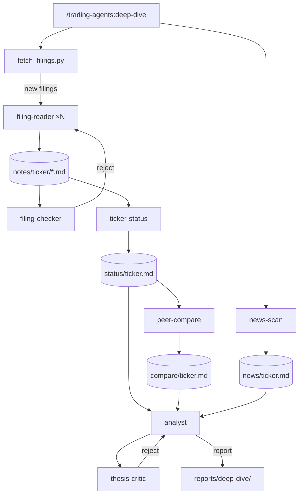
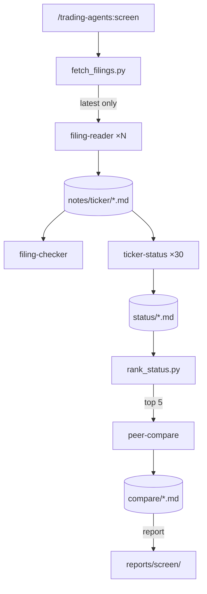
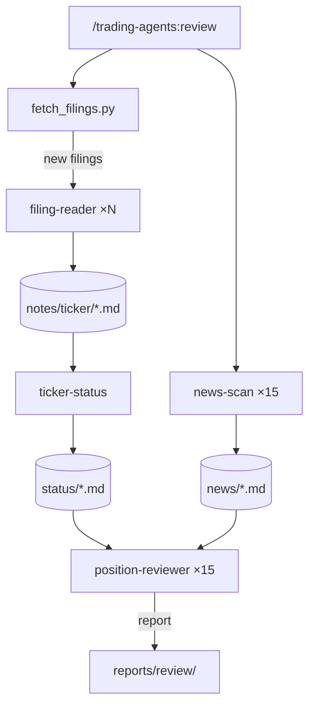
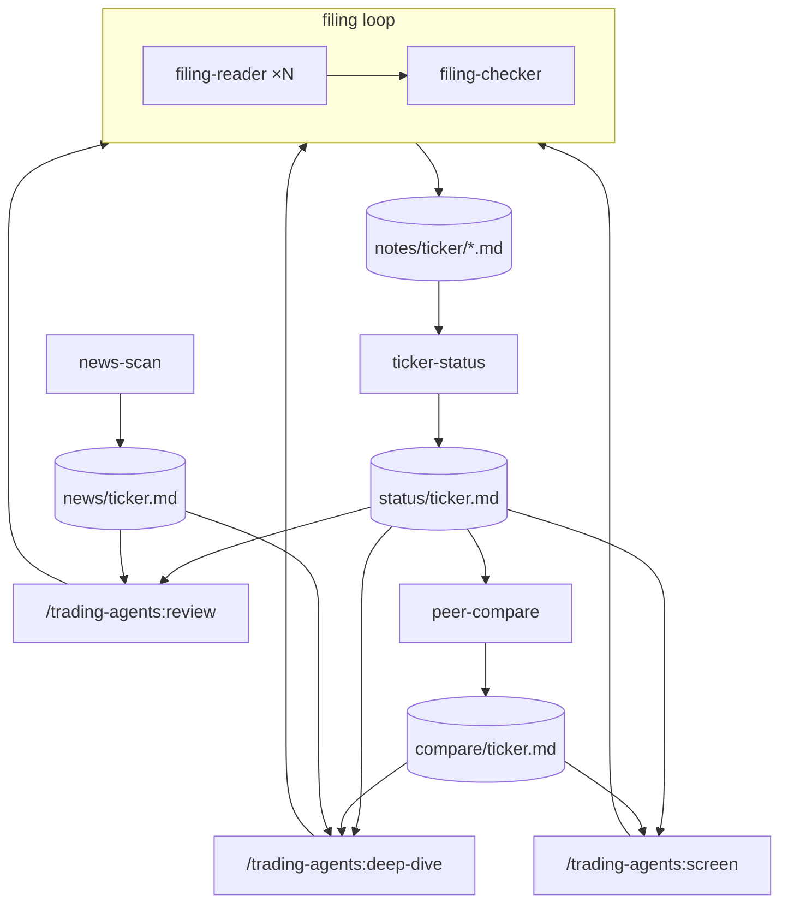

# trading-agents 0.1 — design

Approved 2026-09-26. Mode: new. Branch `trading-agents-0.1`.

Written by `design-plugin` from the discussion, and approved in two gates: the charts, then
this writeup. `plan-phases` reads it, in a chat that has seen nothing else, to write the phase
notes and their evals. `run-phase` reads it for the why. Anything decided in the discussion and
not written here is lost.

<!-- Eval fixture for plan-phases (evals/sets/plan-phases.json). Hand-written to the
     templates/phases/design.md shape; not a real plugin's design. -->

## The idea

A personal research desk for one investor. Today they read SEC filings and news by hand and
keep notes in a doc. After this, every filing they care about is read once, carefully, into a
checked note; each ticker has a current status built from those notes and compared against its
sector peers; and three typed workflows (a deep dive on one ticker, a screen of the watchlist,
a review of the portfolio) compose those files instead of reading from scratch. It researches
and recommends only. It never places orders.

## Workflows

### Deep dive

`/trading-agents:deep-dive <ticker>` → an investment thesis for one ticker.

- **Unit:** one filing (a 10-K, 10-Q or 8-K). One `filing-reader` instance reads it and writes
  `notes/<ticker>/<accession>.md`: the metrics reported, guidance given or changed, risk
  factors added or removed, and one claim per material statement, each with the section and
  the quoted figure it came from.
- **Strengthened by:** `filing-checker`, a separate agent that re-reads the filing and
  verifies every figure and quote in the note. A rejection goes back to the reader with the
  checker's list, one revision round at most, after which the note is marked `unresolved: <n
  claims>` and the status layer excludes the unresolved claims.

| Input | Supplied by |
|---|---|
| Which ticker | the user: argument |
| Which filings | script: `fetch_filings.py` lists every 10-K, 10-Q and 8-K from EDGAR within the horizon (**Cost**) that has no note yet |
| Peer set for the comparison | file: `data/peers.yml` (user-edited overrides), else the watchlist tickers sharing the ticker's SIC code |
| Current news | loop: `news-scan`, run fresh on every deep dive |

### Screen

`/trading-agents:screen` → a shortlist of watchlist tickers worth a deep dive.

- **Unit:** one filing, as in the deep dive; the screen reads only filings newer than each
  status file.
- **Strengthened by:** the same `filing-checker`; the ranking is a script over status fields,
  so it has no judgment to check.

| Input | Supplied by |
|---|---|
| Which tickers | file: `data/watchlist.yml` (user-edited, ~30 tickers) |
| Screen criteria | file: `data/screen.yml` (user-edited: revenue growth, margin trend, guidance direction) |
| Which tickers get a peer comparison | script: `rank_status.py`, the top 5 |

### Review

`/trading-agents:review` → flags on current positions.

- **Unit:** one position. One `position-reviewer` instance reads the ticker's status file, its
  news file and the position's cost basis, and writes whether the original reason for holding
  still stands.
- **Strengthened by:** structure. Every flag must name the status or news line that triggered
  it, and a position with no triggering line is reported as `no change`, never flagged on
  price alone.

| Input | Supplied by |
|---|---|
| Which positions | file: `data/positions.yml` (user-edited, ~15 positions, with cost basis and the reason held) |
| Each ticker's state | file: `status/<ticker>.md` |
| Current news | loop: `news-scan` |

## How they fit together

| File | Written by | Read by | Fields read | Stale when |
|---|---|---|---|---|
| `notes/<ticker>/<accession>.md` | `filing-reader`, checked by `filing-checker` | `ticker-status` | claims with section and quote; `checked: yes/unresolved` | never; a filing does not change |
| `status/<ticker>.md` | `ticker-status` | deep dive, screen, review, `peer-compare` | `built_from` accessions, revenue and margin trend, guidance direction, open risks | a filing newer than its newest `built_from` |
| `compare/<ticker>.md` | `peer-compare` | deep dive, screen | peer set, the ticker's rank on each metric, `built_from` status dates | any status in its peer set is rebuilt |
| `news/<ticker>.md` | `news-scan` | deep dive, review | dated items with source URL, `scanned_at` | older than 24 hours |

## Components

| Name | Kind | Role | Reads | Writes | Used by | Origin |
|---|---|---|---|---|---|---|
| `deep-dive` | workflow skill | runs every loop for one ticker, then the analyst | the user's ticker | `reports/deep-dive/<ticker>-<date>.md` | deep dive | asked |
| `screen` | workflow skill | refreshes statuses across the watchlist, ranks, compares the top 5 | `data/watchlist.yml`, `data/screen.yml` | `reports/screen/<date>.md` | screen | asked |
| `review` | workflow skill | refreshes statuses and news for every position, fans out reviewers | `data/positions.yml` | `reports/review/<date>.md` | review | asked |
| `filing-reader` | agent | reads one filing into a claims note | one filing | `notes/<ticker>/<accession>.md` | all three | composed |
| `filing-checker` | agent | verifies a note's figures against the filing | the note, the filing | the note's `checked` field | all three | composed |
| `ticker-status` | agent | synthesizes a ticker's notes into its current state | `notes/<ticker>/*.md`, the latest transcript | `status/<ticker>.md` | all three | composed |
| `peer-compare` | agent | ranks a ticker against its peers' statuses | `status/*.md` for the peer set | `compare/<ticker>.md` | deep dive, screen | composed |
| `news-scan` | agent | collects current news for one ticker | WebSearch, WebFetch | `news/<ticker>.md` | deep dive, review | composed |
| `analyst` | agent | writes the thesis from status, comparison and news | `status/`, `compare/`, `news/` for one ticker | the deep-dive report | deep dive | asked |
| `position-reviewer` | agent | decides whether one position's reason for holding stands | status, news, the position row | its section of the review report | review | composed |
| `thesis-critic` | agent | checks a thesis against its cited files | the deep-dive draft and the files it cites | accept or a rejection list | deep dive | suggested: a thesis nobody checks can cite a claim its sources do not support |
| `fetch_filings.py` | script | lists EDGAR filings in the horizon without a note | EDGAR index | a JSON list | all three | composed |
| `rank_status.py` | script | ranks statuses by the screen criteria | `status/*.md`, `data/screen.yml` | a ranked list | screen | composed |
| `filing-reading` | knowledge skill | how a professional reads each filing type | — | — | preloaded by `filing-reader`, `filing-checker` | composed |

## Outputs

### `notes/<ticker>/<accession>.md`

- Sections: Filing (type, period, accession, URL) · Metrics · Guidance · Risk factors changed ·
  Claims · Checked.
- Cites: every metric and claim names the filing section and quotes the figure.
- Never claims: anything the filing does not state; no forecast of its own.
- Stale when: never.

### `status/<ticker>.md`

- Sections: Built from · Trend (revenue, margins, cash flow over the horizon) · Guidance ·
  Open risks · What changed since the last status.
- Cites: every line names the note (accession) it rests on; unresolved claims are excluded.
- Never claims: a valuation or a price target.
- Stale when: a filing newer than its newest `built_from` exists.

### `compare/<ticker>.md`

- Sections: Peer set and how it was chosen · Rank per metric · Where it leads · Where it lags.
- Cites: each peer's status file and its date.
- Never claims: a peer comparison built from status files more than one filing apart in period.
- Stale when: any peer's status is rebuilt.

### `reports/deep-dive/<ticker>-<date>.md`

- Sections: Thesis · Evidence · Relative position · Risks · What would change the view.
- Cites: every statement cites a status, compare or news file line.
- Never claims: a price target as fact, or a recommendation to trade a specific size.
- Stale when: it is dated, and never updated in place.

## Cost

| Workflow | Cold run reads | Warm run reads | Horizon |
|---|---|---|---|
| Deep dive | every 10-K, 10-Q and 8-K for one ticker in the horizon (~12 filings), peers' statuses, news | filings since the last status (usually 0–1), news | the last 8 quarterly filings and the latest 10-K |
| Screen | the latest 10-Q or 10-K for each of ~30 tickers (30 filings), 5 peer comparisons | filings since each status (0–5 across the list) | the latest filing per ticker |
| Review | filings since each position's status, news for ~15 tickers | news for ~15 tickers | since the last status |

## Decisions taken

| Decision | Chosen | Alternatives | Why | Origin |
|---|---|---|---|---|
| Data source | EDGAR via WebFetch, no paid API | a paid data API | the user has no paid data access | asked |
| Output location | markdown in the repo, one report per run | a single rolling doc | durable, diffable history | asked |
| Screen depth | rank on status files, compare only the top 5 | compare all 30 | peer comparison is the expensive step; the screen's question is a shortlist | asked |
| Peer set | watchlist tickers sharing the SIC code, overridden by `data/peers.yml` | a fixed sector ETF's holdings | no paid data; the user knows their sector | asked |
| Checker revision cap | one round, then `unresolved` | retry until clean | a filing that cannot be verified twice is a reading problem, not a retry problem | asked |
| Thesis critic | included | none | accepted at the charts gate | suggested |

## Platform facts

| Fact | Status | Source or expected answer |
|---|---|---|
| A workflow skill can spawn 15 or more general-purpose or plugin agents in one message and collect every result | assumed | expected: yes; if not, `review` and `screen` batch in groups of 10 |
| An agent's `skills:` frontmatter preloads a plugin knowledge skill into its context | verified | Claude Code docs, subagents: `skills` field |
| WebFetch can read an EDGAR filing index and a filing document without a custom User-Agent | assumed | expected: yes; if not, `fetch_filings.py` does the fetching with a declared User-Agent |

## Build order

1. `fetch_filings.py`, `filing-reading`, `filing-reader` and its note format, since everything reads the
   notes.
2. `filing-checker`, with the reader it checks.
3. `ticker-status` and `status/<ticker>.md`.
4. `peer-compare`; `news-scan`, independent of 3–4.
5. The workflows: `deep-dive` needs 1–4 and `analyst`; `screen` needs 1–4 and `rank_status.py`;
   `review` needs 1–3, `news-scan` and `position-reviewer`.
6. `thesis-critic`, suggested and accepted; nothing depends on it.

Smallest end-to-end slice: `fetch_filings.py`, `filing-reader`, `filing-checker`, `ticker-status`,
and a `deep-dive` that stops at the status file, with no comparison, news or thesis yet.

## Non-goals

- Placing orders, or any brokerage access.
- Asset classes other than equities.
- Paid data sources.
- Price targets or position sizing.
