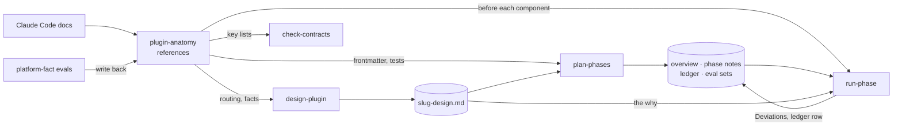
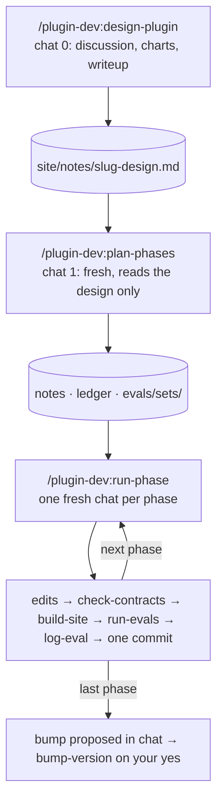

# The flow

How work moves through plugin-dev, which file is the truth for what, and where you are
asked. The workflow pages walk through each path step by step; this page is the map.

## Where truth comes from

Every question a chat can have about a plugin has one file that answers it. When two files
disagree, the one higher in its row wins, and the lower one is fixed.

| Question | The truth | Below it, and what happens when they disagree |
|---|---|---|
| How does a plugin component behave? | the Claude Code docs, then `plugin-anatomy`'s references, which record each fact as `[docs]`, `[proven: evals/…]` or `[unconfirmed]` | every other skill cites `plugin-anatomy` instead of restating a fact. When the docs change or an eval settles a fact, `plugin-anatomy` is corrected and nothing else needs editing |
| What is being built, and why? | the approved design, `site/notes/<slug>-design.md` | the overview and phase notes turn it into files and steps. A phase that cannot follow its note records a Deviation; it never edits the design. A gap `plan-phases` finds is answered by you and written into the design |
| What does this phase do? | its phase note | the note names every file the phase may touch; anything else is a *noticed* line in the ledger |
| Where does the plan stand? | the ledger, `site/notes/<slug>-progress.md` | the next chat starts from the ledger, never from a summary of the last chat |
| Do two files still agree? | the plugin's `contracts.yml`, run by `check-contracts` | a `FAIL` is fixed in the file, not by relaxing the claim |
| What frontmatter keys exist? | the `frontmatter-keys` blocks in `plugin-anatomy` | `check-contracts`' `frontmatter` check reads them, so a key the platform adds is added there, with its source |
| Does it work? | a committed eval set in `evals/sets/`, run by `run-evals`, and its log in `evals/` | the workspace is scratch and never committed; the log is the record, a clean pass exactly like a failure |
| What version is installed? | `plugin.json`, its marketplace row, the CHANGELOG line and the tag, together | `bump-version` moves all four at once or none |

## The loop

A change too big for one chat, or a new plugin, runs as a sequence of chats, each starting
from files rather than from the chat before it.

Around every edit, in every path, the automatic skills run on their own:
`check-contracts` and `build-site` after any agent or skill edit, `run-evals` when a change
calls for evals, and `log-eval` for every test run before its result is reported.
`plugin-anatomy` loads whenever a component is being designed, written or reviewed. A small
change is the same loop with the design and planning chats left out; see
[A small change](workflows/small-change.md).

## The hand-offs

| From | Writes | Read by |
|---|---|---|
| `design-plugin` | `site/notes/<slug>-design.md`, on a new branch | `plan-phases`; `run-phase`, for the why |
| `plan-phases` | `<slug>-00-overview.md`, one note per phase, `<slug>-progress.md` | `run-phase` |
| `plan-phases`' eval writers (one per target) | `evals/sets/<target>.json` and its harness sheets | `run-evals` |
| `run-phase` | the phase's edits, the ledger row, any Deviations | the next `run-phase` chat |
| `run-evals` | `evals/workspace/<target>/iteration-N/` (not committed) | you, in the viewer; then `log-eval` |
| `log-eval` | `evals/<date>-<subject>.md` and its index row | anyone asking the same question later |
| a `platform-fact` eval | the fact's entry in `plugin-anatomy`, citing the log | the next design |
| `bump-version` | `plugin.json`, the marketplace row, `CHANGELOG.md`, the tag | whoever installs the plugin |

## Where you are asked

Nothing that commits, publishes, or decides for you happens without a stop:

1. `design-plugin` waits twice: for the charts, then for the writeup. Nothing is written in
   the repo before the second yes.
2. `plan-phases` asks about any decision the design did not take, then waits for your yes to
   the phase split.
3. `run-evals` stops on every behavioral run until you have reviewed the viewer.
4. `run-phase` asks before committing a phase whose pass bar was still missed after one fix.
5. `bump-version` proposes a level in chat and does nothing until you say yes.
