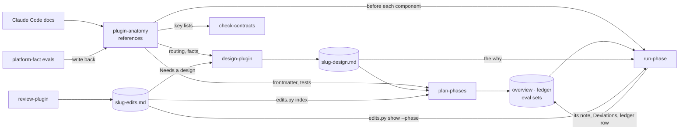
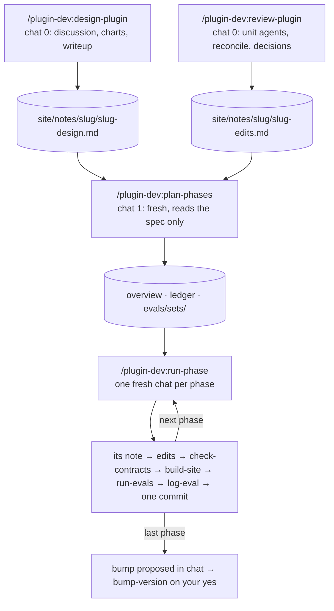

# The flow

How work moves through plugin-dev, which file is the truth for what, and where you are
asked. The workflow pages walk through each path step by step; this page is the map.

## Where truth comes from

Every question a chat can have about a plugin has one file that answers it. When two files
disagree, the one higher in its row wins, and the lower one is fixed.

| Question | The truth | Below it, and what happens when they disagree |
|---|---|---|
| How does a plugin component behave? | the Claude Code docs, then `plugin-anatomy`'s references, which record each fact as `[docs]`, `[proven: evals/…]` or `[unconfirmed]` | every other skill cites `plugin-anatomy` instead of restating a fact. When the docs change or an eval settles a fact, `plugin-anatomy` is corrected and nothing else needs editing |
| What is being built, and why? | the approved spec: the design, `site/notes/<slug>/<slug>-design.md`, for a change that starts from an idea; the edit list, `site/notes/<slug>/<slug>-edits.md`, for one that starts from a review | the overview turns it into phases, and each phase's note into files and steps. A phase that cannot follow its note records a Deviation; it never edits the spec. A gap `plan-phases` finds is answered by you and written into the spec |
| What crosses phases? | the overview, `site/notes/<slug>/<slug>-00-overview.md` | each phase's scope, what it must not touch, the headings one phase writes and another reads, and every eval row. A note may not rename what the overview names |
| What does this phase do? | its phase note, written by `run-phase` when the phase starts | the note names every file the phase may touch; anything else is a *noticed* line in the ledger |
| Where does the plan stand? | the ledger, `site/notes/<slug>/<slug>-progress.md` | the next chat starts from the ledger, never from a summary of the last chat |
| Do two files still agree? | the plugin's `contracts.yml`, run by `check-contracts` | a `FAIL` is fixed in the file, not by relaxing the claim |
| What frontmatter keys exist? | the `frontmatter-keys` blocks in `plugin-anatomy` | `check-contracts`' `frontmatter` check reads them, so a key the platform adds is added there, with its source |
| Does it work? | a committed eval set in `evals/sets/`, run by `run-evals`, and its log in `evals/` | the workspace is scratch and never committed; the log is the record, a clean pass exactly like a failure |
| What version is installed? | `plugin.json`, its marketplace row, the CHANGELOG line and the tag, together | `bump-version` moves all four at once or none |

```mermaid
flowchart LR
  docs["Claude Code docs"] --> PA["plugin-anatomy<br/>references"]
  PF["platform-fact evals"] -- "write back" --> PA
  PA -- "routing, facts" --> DP["design-plugin"]
  PA -- "frontmatter, tests" --> PP["plan-phases"]
  PA -- "before each component" --> RP["run-phase"]
  PA -- "key lists" --> CC["check-contracts"]
  DP --> D[("slug-design.md")]
  RV["review-plugin"] --> EL[("slug-edits.md")]
  EL -- "Needs a design" --> DP
  D --> PP
  EL -- "edits.py index" --> PP
  PP --> N[("overview · ledger<br/>eval sets")]
  N --> RP
  D -- "the why" --> RP
  EL -- "edits.py show --phase" --> RP
  RP -- "its note, Deviations, ledger row" --> N
```

## The loop

A change too big for one chat, or a new plugin, runs as a sequence of chats, each starting
from files rather than from the chat before it. It starts from a design when it adds
something, and from a review when it fixes what is wrong across the bundle.

```mermaid
flowchart TD
  A["/plugin-dev:design-plugin<br/>chat 0: discussion, charts, writeup"] --> D[("site/notes/slug/slug-design.md")]
  R["/plugin-dev:review-plugin<br/>chat 0: unit agents, reconcile, decisions"] --> L[("site/notes/slug/slug-edits.md")]
  D --> B["/plugin-dev:plan-phases<br/>chat 1: fresh, reads the spec only"]
  L --> B
  B --> N[("overview · ledger · evals/sets/")]
  N --> C["/plugin-dev:run-phase<br/>one fresh chat per phase"]
  C --> Q["its note → edits → check-contracts → build-site → run-evals → log-eval → one commit"]
  Q -->|next phase| C
  Q -->|last phase| V["bump proposed in chat → bump-version on your yes"]
```

Around every edit, in every path, the automatic skills run on their own:
`check-contracts` and `build-site` after any agent or skill edit, `run-evals` when a change
calls for evals, and `log-eval` for every test run before its result is reported.
`plugin-anatomy` loads whenever a component is being designed, written or reviewed. A small
change is the same loop with the design and planning chats left out; see
[A small change](workflows/small-change.md).

## The hand-offs

| From | Writes | Read by |
|---|---|---|
| `design-plugin` | `site/notes/<slug>/<slug>-design.md`, on a new branch | `plan-phases`; `run-phase`, for the why |
| `review-plugin` | on a new branch, in `site/notes/<slug>/`: `<slug>-review-plan.md`, `findings/<UNIT>.md` (one per unit agent), `<slug>-edits.md` (the reconcile agent) | `plan-phases` and `run-phase`, through `scripts/edits.py`; `design-plugin`, for its **Needs a design** items |
| `plan-phases` | beside the spec in `site/notes/<slug>/`: `<slug>-00-overview.md`, `<slug>-progress.md` | `run-phase` |
| `run-phase` | its phase's note, `<slug>-NN-<name>.md`, written when the phase starts | the record of what was planned beside what was done |
| `plan-phases`' eval writers (one per target) | `evals/sets/<target>.json` and its harness sheets | `run-evals` |
| `run-phase` | the phase's edits, the ledger row, any Deviations | the next `run-phase` chat |
| `run-evals` | `evals/workspace/<target>/iteration-N/` (not committed) | you, in the viewer; then `log-eval` |
| `log-eval` | `evals/<date>-<subject>.md` and its index row | anyone asking the same question later |
| a `platform-fact` eval | the fact's entry in `plugin-anatomy`, citing the log | the next design |
| `bump-version` | `plugin.json`, the marketplace row, `CHANGELOG.md`, the tag | whoever installs the plugin |

## Where you are asked

Nothing that commits, publishes, or decides for you happens without a stop:

1. `design-plugin` waits twice: for the charts, then for the writeup. Nothing is written in
   the repo before the second yes. `review-plugin` waits for the goal and the units before
   any agent runs, and asks the decisions its reconcile agent leaves open.
2. `plan-phases` asks about any decision the spec did not take, then waits for your yes to
   the phase split. `run-phase` asks a decision only when writing its note meets one the spec
   did not take.
3. `run-evals` stops on every behavioral run until you have reviewed the viewer.
4. `run-phase` asks before committing a phase whose pass bar was still missed after one fix.
5. `bump-version` proposes a level in chat and does nothing until you say yes.

## After a run: audit, fix, check the fix

Once a plugin's workflow has run in some project, a second loop starts from its transcripts
rather than from a design. `/plugin-dev:audit-run` holds the run against the plugin's files
and files each ERROR and WARN, and each `definition` NOTE, as an issue under the plugin's
committed `audits/issues/`, with an id that stays the same from one audit to the next, plus a
run report under `audits/runs/`. `/plugin-dev:fix-issues`, from any chat, plans one edit per
issue, waits for your yes, makes the edits on a worktree branch, runs the checks and evals,
and records in each issue a Fix attempt whose `Verify:` line says what a rerun's trace will
show if the fix held. You merge, bump, update the plugin and rerun the workflow; the next
`/plugin-dev:audit-run` of that rerun checks every fix that was in the code that ran and marks
each issue held, recurred, not exercised or not testable. The issue files are the hand-off
between those chats, written only through `scripts/issues.py`, and each issue's status is
derived from them, never stored. See [Checking a run, fixing it, and checking the
fix](workflows/audit-a-run.md).
