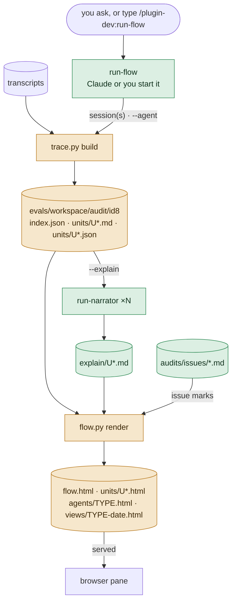
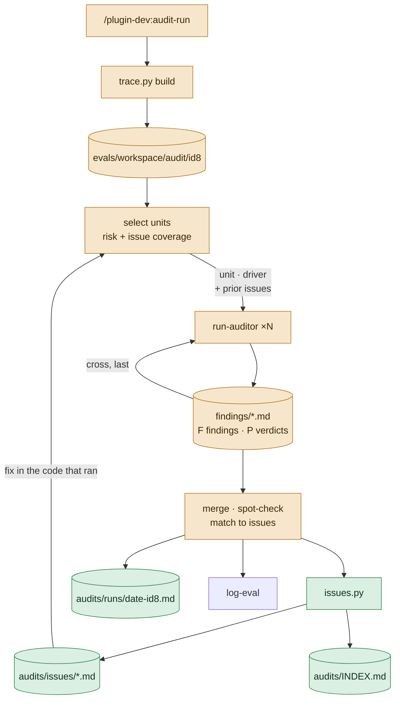
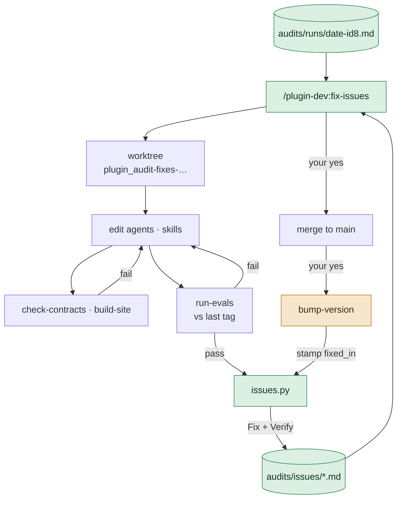
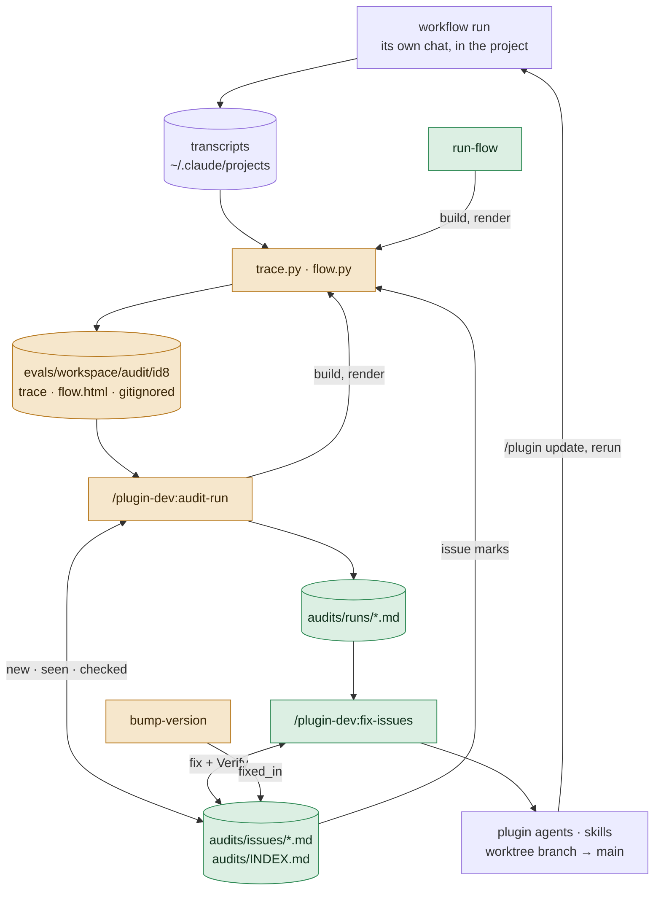

# plugin-dev 0.16-audit-ledger — design

Approved 2026-10-07. Mode: change. Branch `plugin-dev-0.16-audit-ledger`.

Written by `design-plugin` from the discussion, and approved in two gates: the charts, then
this writeup. `plan-phases` reads it, in a chat that has seen nothing else, to write the phase
notes and their evals. `run-phase` reads it for the why. Anything decided in the discussion and
not written here is lost.

## The idea

The user audits a real workflow run with `/plugin-dev:audit-run`, says yes to fixing what it
found, reruns the workflow, and audits the rerun to see whether the problems are gone. Nothing
carries context from one step to the next:

- **The report can't be found from another chat.** It is `evals/workspace/audit/<id8>/report.md`,
  gitignored, in whatever checkout ran the audit. A chat in another worktree cannot see it, and
  removing the worktree loses it. The committed `log-eval` entry carries only a summary table.
- **Findings get new numbers in every audit.** Every audit numbers them E1… afresh. dev-team's
  fix logs can only point back loosely ("E1 for U64/U76" in
  `dev-team/evals/2026-10-07-profiler-audit-fixes-96a768ee.md`).
- **The rerun audit is never told what was fixed.** It checks the rerun from scratch, so the
  best it can say is what `dev-team/evals/2026-10-07-audit-run-package-ca48b249.md` said: "The
  2.9.0 fixes for the 96a768ee findings held where they were exercised." That is not a check of
  each fix.
- **Seeing what one agent did means reading a clipped markdown trace by hand.** Tool output is
  cut to its last 400 characters (`trace.py` `LIMITS`), and the boxes on `flow.html` are not
  clickable. Nothing lists every run of one agent type, such as the four profiler runs in
  ca48b249 (U01 profile, U04 verify, U06 revise K2, U08 verify), or follows one agent type
  across several chats.

After this change:

- **A standalone `run-flow` skill** draws any run. Claude can start it, or the user can type
  it. Every agent on the chart opens to exactly what it did: the prompt it was sent, every
  step with full input and output, each Write's content and each Edit's old → new text,
  commits, and what it handed back. Optionally a plain-English account sits on top, each line
  linked to its steps.
- **An agent view.** `--agent profiler` lists every run of that type in order, across one chat
  or several.
- **A committed issue ledger.** Every audit writes its findings as issues in the audited
  plugin (`<plugin>/audits/`), one file each, with an id that stays the same across audits.
- **Fixes from any chat.** Any chat can type `/plugin-dev:fix-issues` to fix issues in a
  worktree and record, in each issue, what changed and how a rerun will show it.
- **Rerun audits check prior fixes.** The next audit of a rerun loads the fixed issues and
  reports each one as held, recurred, not exercised, or not testable on the version that ran.
  The rerun's chart marks the same results on its boxes.

## Workflows

### See a run

The user asks ("what did the profiler do in that chat?") or types
`/plugin-dev:run-flow <chat> [--agent <type>] [--sessions a,b | --branch <glob>] [--explain]`
→ a page served in the browser pane: the run's chart with clickable agents, or one agent
type's runs listed in order.

- **Unit:** one spawned agent's transcript. The trace step writes:
  - `units/U<nn>.md`: clipped, in its current format, and what auditors read.
  - `units/U<nn>.json`: full step data.
  - `units/U<nn>.html`, from the JSON:
    - a header: type, description, spawner, model, start, duration, tool calls, errors, hook
      blocks, skills invoked;
    - the prompt;
    - every step, with full input and full output collapsed until clicked;
    - each Write's full content and each Edit's old → new text;
    - every commit, with its message and files;
    - what the agent handed back;
    - with `--explain`, the narration at the top.

  The agent view `agents/<type>.html` (`views/<type>-<date>.html` across sessions) has one row
  per run of that type, in time order, each row linking to its unit page. The columns are:
  - session;
  - unit;
  - the mode (the prompt's `Mode:` line, when there is one);
  - lane or section;
  - round;
  - start and duration;
  - tool calls and errors;
  - files written;
  - commits;
  - the first line of the return.
- **Strengthened by:**
  - **It is a script.** Nothing is judged or guessed.
  - **Step ids stay stable across rebuilds** (`D<n>`, `U<nn>.S<n>`, as today), so a link in an
    issue or a report always points at the same step.
  - **Full output, straight from the transcript.** The pages never show the clipped copy.
  - **The narration is checked mechanically.** `flow.py` drops any narration line that cites a
    step the unit does not have. It marks the narration out of date when the unit's step count
    has changed since it was written.
  - **No evaluator for the narration.** It is a reading aid, and the steps it cites are one
    click away.

| Input | Supplied by |
|---|---|
| Which session(s) | the user: title words, id, `latest`, `--sessions a,b`, or `--branch <glob>` matched against each session's `gitBranch`; else `trace.py find` and an `AskUserQuestion` |
| Which plugin | file: `.claude-plugin/plugin.json` in the working directory; at the marketplace root, the user names it (`--plugin dev-team`) |
| Which agent type to list | the user: `--agent` |
| Whether to narrate | the user: `--explain` (Claude passes it when the user asks for an explanation) |
| Issue marks | file: `<plugin>/audits/issues/*.md`, Found in and Checks lines for this session |

### Audit a run, and check prior fixes

`/plugin-dev:audit-run <chat> [--units …] [--full]`, with the same arguments as today → a
committed run report, new or updated issue files, the issue index, a short `log-eval` entry,
and the summary in chat.

- **Unit:** one unit's or driver segment's trace, plus its definition at the version that ran,
  plus the prior issues whose `applies_to` matches it. Writes `findings/<U<nn> | seg-<n> | cross>.md`:
  - **F findings**, exactly as today;
  - **a new `## Prior issues` section:** one line per prior issue given, `P · <ID> · held |
    recurred | not exercised · <step id or —> — <evidence quoted short, or why it was not
    exercised>`.

  A prior issue that recurred gets its P line only, never also an F finding, so it is not
  counted twice.
- **Strengthened by:**
  - **Evidence on both sides**, as today: a step id and a `file:line`.
  - **The skill spot-checks** every ERROR, as today, and every `held` and `recurred` verdict
    at its step. A verdict whose step does not show it is dropped to `not exercised` and listed
    under **Dropped on spot-check**.
  - **Not exercised is never counted as held.**
  - **Was the fix in the code that ran?** Asked per issue:
    - when the run's `plugin_root` is a git checkout, by `git merge-base --is-ancestor <fix
      commit> <that checkout's HEAD>`;
    - otherwise by comparing the run's version with the fix's `fixed_in`.

    A fix not in the code that ran is reported as **not testable** and given to no auditor. A
    stale plugin cache can therefore never produce a false pass.
  - **Matching to existing issues.** `issues.py` proposes matches between new findings and
    existing issues by rule file, fault and the quoted rule text, since line numbers drift
    between versions. The skill decides each match and records it.

| Input | Supplied by |
|---|---|
| Which prior issues to check | file: `<plugin>/audits/issues/*.md`, latest Fix attempt with a commit, filtered by "fix in the code that ran" — written by fix-issues and bump-version |
| What each check looks for | file: the issue's `Verify:` line, written by fix-issues |
| Which units to audit | the user: `--units` (default `risk`), widened by `trace.py select --cover <applies_to list>` so at least one finished unit of each issue's agent type, and the segment of each issue's driver command, is audited |
| The version that ran | file: `index.json` (`version`, `plugin_root`, per-unit `definition`), written by trace.py |
| Rules to judge against | file: the definition at the version that ran, as today |

### Fix issues, from any chat

`/plugin-dev:fix-issues [<ID> … | run:<id8> | open | recurred]` (default `open`) → edits
committed on a worktree branch, each issue's Fix attempt recorded, then a proposed merge to
`main` and a proposed bump.

- **Unit:** one issue. It produces the edit that addresses the issue and a Fix attempt in its
  file:
  - the branch, commit and files changed;
  - the eval log that covers it;
  - **Verify:** which agent type or driver segment a rerun must exercise, what a trace shows
    when the fix held, and what it shows when the issue recurred.

  Or the issue is closed as `wontfix` with a reason.
- **Strengthened by:**
  - **Approval before editing.** The plan, one proposed edit per issue, is approved once with
    `AskUserQuestion` before any edit is made.
  - **Checks after editing.** `check-contracts`, `build-site`, and `run-evals` against the
    plugin's last tag for every eval set covering a touched agent or skill. Those graders run
    in their own contexts, so they act as the evaluator.
  - **Verify is required**, and must name something a trace shows: a return line, a tool
    call, or a write.
  - **fix-issues never sets an issue to verified.** Only an audit of a rerun can.
  - **An `agent` fault** is fixed by restating the rule where it applies, or by a guard where
    the plugin has one for that kind of action. Otherwise it is closed as `wontfix` with a
    reason, following run-auditor's rule that most repeated agent faults are definition
    faults.

| Input | Supplied by |
|---|---|
| Which issues | the user: ids, `run:<id8>`, `open`, `recurred` |
| What went wrong, with evidence | file: the issue file and the run report it links, written by audit-run |
| Whether the rule is still there | file: the plugin's working tree at the worktree's HEAD, grepped for `rule_quote` |
| Approval of the plan, the merge | the user: `AskUserQuestion` in the main thread |

## How they fit together

The loop closes at the issue files. Each section of an issue file has one writer, and status
is derived from them by `issues.py`, never stored. So a fix on a worktree branch and an audit
on `main` that touch the same issue edit different sections, and the merge almost never
conflicts.

| File | Written by | Read by | Fields read | Stale when |
|---|---|---|---|---|
| `<plugin>/evals/workspace/audit/<id8>/` (`index.json`, `units/U*.md`, `units/U*.json`, `driver/`, `run.md`) | trace.py, from run-flow or audit-run | flow.py, audit-run, run-auditor, run-narrator | `index.json`: units, `type`, `version`, `plugin_root`, `definition`, `branch`, `finished`; unit files whole | the session's transcripts grew. A rebuild appends without renumbering |
| `<plugin>/evals/workspace/audit/<id8>/explain/U*.md` | run-narrator | flow.py | the step count it was written from; the lines and their step ids | the unit's step count changed |
| `<plugin>/audits/issues/<ID>.md` | audit-run via issues.py (frontmatter, Finding, Found in, Checks); fix-issues via issues.py (Fix); bump-version via issues.py (`fixed_in`) | audit-run, fix-issues, flow.py, issues.py | `applies_to`, `rule_file`, `rule_quote`, `fault`; the latest Fix attempt's `commit`, `fixed_in`, `Verify`; Checks and Found in lines | never: it is a record. Its derived status changes with each write |
| `<plugin>/audits/INDEX.md` | issues.py, after every write | the user, fix-issues (for `open`, `recurred`) | the table | any issue file changed. `issues.py check` fails when it does not match |
| `<plugin>/audits/runs/<date>-<id8>.md` | audit-run | fix-issues, the user | the findings with their issue ids, evidence and rules | never: a dated record |

## Components

| Name | Kind | Role | Reads | Writes | Used by | Origin |
|---|---|---|---|---|---|---|
| `run-flow` (new) | workflow skill, model-invocable | Resolves the session(s), runs the trace build and render, spawns run-narrator for `--explain`, serves the workspace and opens the page | transcripts, `plugin.json` | the workspace (gitignored) | See | asked |
| `trace.py` (changed; moves to `skills/run-flow/scripts/`) | script | Adds `units/U*.json` with full step data, `--sessions`, `--branch`, `select --cover`; the `.md` unit files keep their format | transcripts | the workspace | See, Audit | asked |
| `flow.py` (changed; moves with trace.py) | script | Adds clickable boxes, unit pages, the agent view, the multi-session view, narration, and issue marks | the workspace, `audits/issues/` | html pages in the workspace | See, Audit | asked |
| `run-narrator` (new) | agent, `model: claude-sonnet-5-5`, tools Read, Write | With `--explain`, writes 5–10 plain lines per finished unit on what it did, each citing its step ids; it never judges compliance | one unit's `.md` trace (its `.json` for a step's full output) | `explain/U<nn>.md` | See | suggested: 81 raw steps are slow to read |
| `audit-run` (changed) | workflow skill, typed | Runs the trace scripts from run-flow's directory; selects units with issue coverage; decides per issue whether the fix ran; passes prior issues; matches findings to issues; writes the run report and issues; commits `audits/`; writes a short log; tells the user to type fix-issues | the workspace, issues, definitions | `audits/runs/`, `audits/issues/` and `INDEX.md` (via issues.py), the eval log | Audit | asked |
| `run-auditor` (changed) | agent, `model: inherit` | New input `Prior issues:`; checks each issue's Verify; writes P lines; its return line gains the prior counts | one trace, its definition, the prior-issue lines it was given | its findings file | Audit | composed |
| `issues.py` (new; `scripts/`) | script, standard library only | Commands: `new`, `candidates`, `seen`, `check-result`, `fix`, `wontfix`, `stamp`, `list`, `status`, `index`, `check` | `audits/issues/` | `audits/issues/`, `audits/INDEX.md` | Audit, Fix, bump | composed |
| `templates/audits/issue.md`, `templates/audits/run-report.md` (new) | config (templates) | The one list of each file's headings; the report template moves here from `audit-run` §5 | — | — | Audit, Fix | composed |
| `fix-issues` (new) | workflow skill, typed | Selects issues; plans and gets approval; edits in a worktree; runs the checks and evals; records Fix attempts; commits; proposes the merge and the bump | issues, run reports, plugin files | plugin files, Fix attempts (via issues.py), an eval log | Fix | asked |
| `bump-version` (changed) | workflow skill, asks first | In the bump commit, also runs `issues.py stamp` on the plugin's fixed, unreleased issues; a no-op where there is no `audits/` | `audits/issues/` | `fixed_in` (via issues.py) | Fix | composed |
| `contracts.yml` (changed) | config | The issue and report templates' headings against audit-run, fix-issues and bump-version; the P-line verdict words against run-auditor and audit-run; the README and `site.yml` lists pick up the new skills | — | — | all | composed |
| `log-eval`, `check-contracts`, `build-site`, `run-evals` | skills, unchanged | Used as they are | — | — | Audit, Fix | composed |
| seed of `dev-team/audits/` (one-time) | a step in one phase, not a shipped component | Creates dev-team's first issues from the ca48b249 audit | `dev-team/evals/2026-10-07-audit-run-package-ca48b249.md`, `dev-team/evals/workspace/audit/ca48b249/report.md` | `dev-team/audits/` | Audit, Fix | suggested: so the first rerun has fixes to check |

## Outputs

### `<plugin>/audits/issues/<ID>.md`

- Sections, in order (from `templates/audits/issue.md`):
  - **Frontmatter**, flat `key: value` lines only, so `issues.py` parses it with no
    dependency: `id`, `plugin`, `title`, `fault` (`agent | driver | definition`), `severity`
    (`ERROR | WARN | NOTE`), `check` (inputs, procedure, scope, hooks, claims, shape, or a
    cross check), `applies_to` (comma-separated: `agent:<type>`, `driver:<command>`, `cross`),
    `rule_file`, `rule_line`, `rule_quote`, `found_version`, `found_session`, `found_date`.
  - **`## Finding`**: one or two sentences, what happened against what should have.
  - **`## Found in`**: one line per sighting: `<date> · <id8> · <version> · <unit> ·
    <step> — "<evidence, one short quote>" · <report path> <finding id>`.
  - **`## Fix`**: one `### Attempt <n>` per attempt, holding `status: fixed | wontfix`,
    `reason` (wontfix only), `branch`, `commit`, `files`, `evals`, `fixed_in` (blank until
    bump-version stamps it) and `Verify: watch <applies_to>; held when …; recurred when …`.
  - **`## Checks`**: one line per rerun audit that considered it: `<date> · <id8> ·
    <version> · attempt <n> · held | recurred | not exercised | not testable · <unit> ·
    <step> — "<evidence>"`.
- **Writers:** each section has one writer. audit-run writes the frontmatter, Finding,
  Found in and Checks; fix-issues writes Fix attempts; bump-version writes only `fixed_in`.
  All writes go through `issues.py`.
- **Status:** derived by `issues.py status`, never stored:
  - `wontfix`: the latest attempt says so;
  - `open`: no attempt;
  - `fixed`: the latest attempt has a commit and no `fixed_in`;
  - `released`: `fixed_in` is set and no Check on that attempt says held or recurred;
  - `verified`: the latest Check on the latest attempt is `held`;
  - `recurred`: it is `recurred`. This counts as open for `fix-issues open`.
- **Ids:** `<PREFIX>-<nnn>`. The prefix is the initials of the plugin name's hyphen-separated
  parts, upper-cased (`dev-team` → `DT`, `plugin-dev` → `PD`); a one-word name takes its first
  two letters. `issues.py new` takes the highest id in this checkout plus one. `issues.py
  check` fails on a duplicate id.
- **Cites:** every Found in and Checks line has a session, a step id and a quote. Every Fix
  attempt has a commit.
- **Never claims:**
  - a status. Status is derived;
  - a Check of `held` without a step id;
  - more than one short quote of project content per line. Issue files are committed, and the
    trace is not.
- **Stale when:** never. Its derived status changes with each write.

### `<plugin>/audits/runs/<date>-<id8>.md`

- Sections: the current report from `audit-run` §5, moved to `templates/audits/run-report.md`,
  with these changes:
  - each finding heading carries its issue id and whether the issue is new or seen before
    (`### E1 · DT-031 (new) · definition · …`);
  - **Totals** adds `issues: <n> new, <n> seen again · prior: <n> held, <n> recurred, <n> not
    exercised, <n> not testable`;
  - a new **`## Prior issues`** section after Notes: `| Issue | Title | Attempt | Verdict |
    Unit · step | Evidence |`;
  - **Flow chart** names the local `flow.html` path and says it is rebuilt with `run-flow
    <id8>`.
- Cites: as today, a step id and a `file:line` per finding, plus the issue id.
- Never claims: a fix held that no audited unit exercised; a verdict on an issue whose fix was
  not in the code that ran.
- Stale when: never. It is a dated record.

### `<plugin>/audits/INDEX.md`

- Sections: a generated header line saying not to edit it by hand, then one table: `| Id |
  Title | Fault | Severity | Status | Found | Seen | Fixed in | Last check |`. Rows are
  ordered recurred, open, fixed, released, then verified and wontfix.
- Cites: each id links to its file.
- Never claims: anything not derived from the issue files.
- Stale when: any issue file changes. `issues.py check` compares it with a fresh render, and
  fails when they differ.

### `findings/<…>.md` (run-auditor, workspace)

- Sections: as today, plus `## Prior issues` after the last F finding. It is present only when
  the input carried prior issues, with one `P` line per issue given and in the order given.
- Never claims: `held` from the absence of a failure. The step that exercised the behavior is
  cited.
- Return: `Findings: <n> ERROR, <n> WARN, <n> NOTE · prior <h> held, <r> recurred, <x> not
  exercised — <path>`. The `· prior …` part appears only when prior issues were given.

### `units/U<nn>.html` and `agents/<type>.html` (workspace)

- Sections: as in **See a run** above.
- Cites: every row and step shows its step id.
- Never claims: anything that is not in the transcript. A clipped `.md` is never the source of
  a page.
- Stale when: the transcripts grew. run-flow rebuilds on every call.

### `explain/U<nn>.md` (run-narrator, workspace)

- Sections: a header line `U<nn> · <type> · steps 1–<n>`, then 5–10 lines, each starting with
  its step range (`S2–S7 ·`). The lines are in step order and cover the whole unit.
- Cites: a step range on every line.
- Never claims:
  - whether a step followed its definition. That is run-auditor's job;
  - a result or count the cited steps do not show;
  - anything about steps past `<n>`.
- Stale when: the unit's step count is no longer `<n>`.

## Cost

| Workflow | Cold run reads | Warm run reads | Horizon |
|---|---|---|---|
| See a run | `trace.py` over the session's transcripts: seconds and no model tokens, apart from the summary lines (~1k tokens in the main thread). With `--explain`, one Sonnet run-narrator per finished unit at ~20–60k tokens each (a 12-unit run ≈ 0.3–0.7M); ask first above 12 units | a rebuild appends only. Narration runs only for units with no explain file or a changed step count | one session by default; more only with `--sessions` or `--branch` |
| Audit a run | as today: 100–200k tokens per run-auditor, at most 12 units plus their segments plus cross, asking first beyond 12. Prior issues add the units needed for coverage (within the same cap of 12; ask beyond) and a few lines per auditor's prompt | `--units new`, as today. Prior issues are checked once per session; a re-pass skips issues with a Check for this session | every fixed issue whose fix is in the code that ran |
| Fix issues | the issue files and run reports for the selected issues, the definitions they cite, then edits in the main thread, `check-contracts`, `build-site`, and `run-evals` for each covering set (Sonnet 5.5 executors, graders and comparators, per `VERSIONING.md`) | only the selected issues | the selection the user names; `open` by default |

## Decisions taken

| Decision | Chosen | Alternatives | Why | Origin |
|---|---|---|---|---|
| Ledger location | `<plugin>/audits/` (`issues/`, `runs/`, `INDEX.md`), committed | `<plugin>/evals/audits/` | easy for a fixing chat to find; separate from eval logs and sets | asked |
| Which findings become issues | every ERROR and WARN except `platform`, plus `definition` NOTEs. Other NOTEs stay in the run report | ERROR + WARN only; everything | definition NOTEs are where most fixes land; `platform` faults are nothing the plugin can fix | asked |
| How run-flow starts | model-invocable (no `disable-model-invocation`), description scoped "only inside a plugin's own subdirectory or the marketplace repo that holds it" | typed only | it only reads transcripts and writes gitignored files; "what did the profiler do?" should just work | asked |
| How far fix-issues goes | commits on its worktree branch, then asks to merge to `main`; `bump-version` asks for itself | merge on green, ask only to bump | no merge the user did not approve | asked |
| Issue file layout | one file per issue; each section has one writer; status derived, never stored | one ledger file; a stored status field | parallel chats in worktrees would conflict on one file and on a status line every writer edits | composed |
| Issue ids | `<PREFIX>-<nnn>` from the plugin name's initials, next number in the checkout; `check` fails on duplicates | per-audit ids (`ca48b249-E3`); random ids | short, stable, easy to say in chat. Audits commit on `main` in the main checkout, so collisions need two audits committing on different branches | composed |
| Matching findings to issues | `issues.py candidates` lists issues with the same rule file and fault, with `rule_quote`; audit-run decides and records | match by `file:line`; a new issue per finding | line numbers drift between versions; the quoted rule text does not | composed |
| Was the fix in the code that ran | git ancestry of the fix commit when `plugin_root` is a git checkout; else run version ≥ `fixed_in`; an unreleased fix is not testable | version comparison only | catches both a stale cache and a run from a dev checkout | composed |
| A recurrence | a P line only, plus a Checks line and a Found in line on the issue; no F finding | an F finding as well | it would be counted twice | composed |
| What audit-run commits | the `audits/` files, in one commit in the checkout it runs in (`<plugin> audits: <id8> — <n> new, <n> seen, <n> checked`), then `log-eval`'s own commit | everything through `log-eval` | `log-eval` commits its own entry and index row; the ledger is a separate record | composed |
| The audit's eval log | still one per audit (root `CLAUDE.md`), now short: Tested against, What was tested, Method, the issue ids by outcome, Verdict, and a link to `audits/runs/<date>-<id8>.md` | the full table, as today | the run report is now committed, so the table would be stated twice | composed |
| Where the scripts live | `trace.py` and `flow.py` move to `skills/run-flow/scripts/`; audit-run runs them as `${CLAUDE_PLUGIN_ROOT}/skills/run-flow/scripts/trace.py`; `issues.py` goes in the plugin's `scripts/` beside `contract_sweep.py` | keep them in audit-run; everything in `scripts/` | run-flow owns the trace; `issues.py` is shared by three skills | composed |
| Clipped vs full trace | `units/U*.md` stays clipped and in its current format for auditors; full step data goes in `units/U*.json` for the pages and the narrator | full output in the `.md` | an auditor reads a whole unit file; full output would blow its context | composed |
| Workspace path | unchanged: `<plugin>/evals/workspace/audit/<id8>/`; cross-session views in `…/audit/views/` | rename to `runs/` | existing traces are reused, and nothing that reads them changes | composed |
| Where run-flow runs | a plugin's subdirectory, or the marketplace root with `--plugin <name>` | anywhere, writing to `${CLAUDE_PLUGIN_DATA}` | matches plugin-dev's description rule (plugin `CLAUDE.md`, "Skill descriptions") | composed |
| How fix-issues gets approval | one `AskUserQuestion` approving the plan (one proposed edit per issue) before any edit; a separate yes for the merge | approve each edit | one yes for the edits is what the user does today ("saying yes to fixing it") | composed |
| Agent faults in fix-issues | restate the rule where it applies, or guard it where the plugin has a guard for that kind of action, or close it as wontfix with a reason | leave agent faults out of fix-issues | run-auditor already says most repeated agent faults are definition faults | composed |
| run-narrator | an agent on `claude-sonnet-5-5`, recorded in `VERSIONING.md`; opt-in `--explain` | no narration; `inherit` | a cheap reading aid over many units. A full id, because an alias moves (`plugin-anatomy` `references/agents.md`) | suggested |
| Seed the ledger | one time, from ca48b249 only: its 13 ERRORs, 2 WARNs and the definition findings its log lists as still at HEAD, as `open` issues in `dev-team/audits/` | import every past audit; no seed | ca48b249 audited 2.9.0, which already holds the earlier audits' fixes; its findings are the ones the next fix and rerun are about | suggested |
| Issue marks on the chart | each audited box shows the issue ids checked there (held or recurred) and the ids first found there | none | a rerun's chart answers "did the fixes hold" at a glance | suggested |
| Release | 0.16.0, minor: new skills and an agent, additive changes to audit-run, run-auditor and bump-version | — | nothing an existing caller depends on breaks (see What must not break) | composed |
| Several sessions without an agent type | `--sessions` and `--branch` require `--agent`; without it run-flow prints one line saying so and builds nothing | build every session's chart and link them from an index page; default to the busiest agent type | the agent view is the only cross-session page this design draws; an index page would be a page the charts do not show | planning |
| What the seed commits | the 27 issues, `INDEX.md`, and `dev-team/audits/runs/2026-10-07-ca48b249.md`: the gitignored report re-headed with the issue ids | issues and `INDEX.md` only, with Found in lines pointing at the committed eval log | every Found in line ends with a report path, and the seed's should point at a committed file, as every later audit's will | planning |

## Platform facts

| Fact | Status | Source or expected answer |
|---|---|---|
| A skill with `disable-model-invocation: true` can be started only by a person, so audit-run cannot start fix-issues. It tells the user what to type | verified | `plugin-anatomy` `references/skills.md` (Frontmatter, "Typed only") [docs]. Also seen in this design's own session: the Skill tool refused `plugin-dev:design-plugin` |
| A skill reaches another skill's files as `${CLAUDE_PLUGIN_ROOT}/skills/<other>/…` | verified | `references/skills.md`, layout notes [docs] |
| `${CLAUDE_PLUGIN_ROOT}` is substituted in a skill's body when it loads | verified | `references/skills.md`, substitutions [docs] |
| Agents and forked skills cannot use `AskUserQuestion`, so every approval sits in audit-run and fix-issues, in the main thread | verified | `references/skills.md`, forked skills [docs: sub-agents, "Available tools"] |
| An agent's `model:` takes a full model id | verified | `references/agents.md`, `model` row [docs] |
| Every transcript record carries `gitBranch`, which `--branch` matches against | verified | `skills/audit-run/scripts/trace.py:296` reads it today, and every `index.json` has `branch` |
| run-flow's description triggers on "what did the profiler do in that chat" inside a plugin directory, and does not fire on unrelated requests in an unrelated repo | assumed | expected: it triggers in the plugin directory and not elsewhere. A phase-0 `trigger` eval; write the rate back to `references/skills.md` if it says anything new about scoped descriptions |

## Build order

What depends on what, bottom-up:

1. `trace.py` and `flow.py` move to `skills/run-flow/scripts/`. `trace.py` gains
   `units/U*.json`, `--sessions`, `--branch` and `select --cover`. `flow.py` gains unit pages
   and the agent view. Every path that names the old location is updated in the same step:
   `audit-run`, `run-auditor`, the README, `site/workflows/audit-a-run.md`,
   `evals/sets/audit-run.json` and `evals/fixtures/audit-run/make_session.py`.
2. `run-flow`'s `SKILL.md`, on top of 1. `audit-run` §2 now runs the scripts from there.
3. `templates/audits/issue.md` and `run-report.md`; `scripts/issues.py`.
4. `audit-run` writes the run report and issues and commits `audits/`. The short log entry.
   Needs 3.
5. The seed of `dev-team/audits/` from ca48b249. Needs 3 and 4's formats.
6. `fix-issues`, and `bump-version`'s stamp. Needs 3.
7. The prior-issues loop: `run-auditor`'s input and P lines; `audit-run`'s coverage
   selection, fix-ran test, spot-check of verdicts and **Prior issues** section. Needs 3, 4
   and a Fix attempt to check (from 6, or hand-written).
8. Issue marks in `flow.py`. Needs 1 and 3.
9. `run-narrator` and `--explain`. Needs 1 and 2.
10. `contracts.yml` entries, the README skills table, `site/site.yml` (fix-issues, typed),
    `site/workflows/audit-a-run.md` (fix and re-check), `VERSIONING.md` (run-narrator's model),
    and the CHANGELOG at the bump.

**The smallest slice that works end to end:** steps 1–2. `/plugin-dev:run-flow ca48b249
--agent profiler` opens a page listing U01, U04, U06 and U08, each one click from its full
record.

**The smallest slice of the ledger loop:** steps 3, 4 and 7, with a Fix attempt written by
hand. One audit creates issues, and a second audit of a run that carries the fix reports each
one held, recurred or not exercised.

## What must not break

- **`/plugin-dev:audit-run`'s arguments** (session words, id, `latest`, `--units
  risk|all|new|seg:N|U..`, `--full`), and its asking before more than 12 units.
- **The workspace layout and the unit trace format** that run-auditor reads: `run.md`,
  `index.json`, `driver/seg-<n>.md`, `units/U<nn>.md`, `units/U<nn>.system.md`, `findings/`.
  Step ids stay stable across rebuilds.
- **run-auditor's findings file and return line**, which audit-run parses. Both change only by
  addition: the `## Prior issues` section and the `· prior …` part of the return appear only
  when prior issues were given. `Prior issues: none` is the default, so an audit with no
  ledger runs exactly as today.
- **The `AUDIT_RUN_PROJECTS` environment variable**, which the evals use. It keeps its name.
- **The eval set `evals/sets/audit-run.json`** names `skills/audit-run/scripts/trace.py` in
  three prompts. Those are updated in build step 1, and the set must still pass.
- **One `log-eval` entry per audit** (root `CLAUDE.md`). Existing audit logs are not changed.
- **`bump-version` for a plugin with no `audits/`** behaves exactly as today.
- **`check-contracts`:** the README's **The skills** table gains `run-flow` and `fix-issues`,
  and `site/site.yml`'s `workflow_skills_order` gains `fix-issues` (typed) in the same commit
  that adds each skill. The "no unprefixed plugin command" pattern means every example
  command is written `/plugin-dev:…`.
- **Noticeable to users:**
  - Anyone running `trace.py` by hand from the old path must use
    `skills/run-flow/scripts/trace.py`. The README and the workflow page say so.
  - Audits now make one more commit, `audits/`, in the checkout they run in.

## Non-goals

- **No hook that announces open issues.** A SessionStart hook would fire in every session
  plugin-dev is enabled in, which is every session.
- **No rerun of the workflow.** Neither fix-issues nor audit-run reruns it, as today. The
  user reruns it, and the trace is the evidence.
- **Judging the project the run built** stays out of scope, as today.
- **run-flow outside a plugin directory or the marketplace root** (say, from the project's own
  chat) is not supported, per plugin-dev's description rule.
- **Earlier audits are not imported** beyond ca48b249. Their findings were fixed in 2.9.0, or
  show again in ca48b249.
- **No shared, live issue dashboard** (an Artifact with a database). The committed files and
  `INDEX.md` are the record.
- **Declined suggestion: `--units issues`**, a cheap mode that audits only the units the prior
  issues need. It was considered and declined. Coverage is added to the normal selection
  instead.
