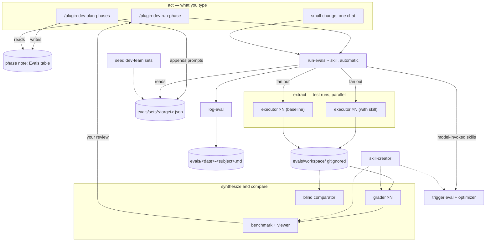

# plugin-dev 0.9-evals — overview

Branch: `plugin-dev-0.9-evals`. Release at the end: `0.9.0` — proposed to `bump-version` in
the last phase. Nothing here bumps or tags anything. Date: 2026-09-19.

This is the index of the design set. Each numbered note after this one is one phase, done
in the order listed under **Phases**, one chat and one commit each, by
`/plugin-dev:run-phase 0.9-evals` from `plugin-dev/`. Nothing in a later phase is required by
an earlier one, so the branch is mergeable at any phase boundary.

Approved proposal: <https://claude.ai/artifact/YQwMFXbbK2WNc6N2i9owkq> (both suggestions
accepted; the proposal's "4b" and "6" are phases 5 and 6 here, and the release is phase 7 so
its end-to-end rerun covers them).

## Why

Every phase note has to "run its evals", and `run-phase` says every eval is "run and recorded
with `log-eval`" — but nothing in plugin-dev says what an eval *is* or how to run one, so
each chat improvises. The 0.8.0 work on `plan-phases` showed what a working loop looks like
(`evals/2026-09-19-plan-phases-compose-layers.md`): test prompts with scripted answers, the
new version and a baseline run side by side, assertions graded with evidence by
skill-creator's grader, a benchmark, the viewer for human review, then `log-eval`. It was
done by hand, three times, and hit gotchas skill-creator does not cover: its default
workspace sits under `skills/` (breaking `check-contracts` and `build-site`), interactive
skills need a scripted-answers harness, its viewer needs `eval_metadata.json` at two levels,
and typed skills never trigger by description. This change makes that loop a skill
(`run-evals`), gives every skill and agent a committed eval set that outlives the plan that
created it, makes `plan-phases` specify each phase's evals against it, and makes `run-phase`
run them and stop for review.

## Decisions taken

| Decision | Chosen | Alternatives | Why | Origin |
|---|---|---|---|---|
| Integration with skill-creator | Depend on it — its grader, benchmark, viewer and trigger scripts — with an inline fallback when it cannot be found | Vendor its agents and scripts into plugin-dev | It is maintained upstream; a copy drifts. plugin-dev owns *what* to test and *where results live* | asked |
| Review gate | Every phase that ran a behavioral eval stops for the user's review of the viewer before committing | Stop only on failure; never stop | The fixes that mattered in 0.8.0 came from looking at outputs, not from pass rates | asked |
| How this is built | Planned with `plan-phases`, run with `run-phase` | One direct change | Touches five skills and two templates; also exercises the 0.8.0 composing step | asked |
| Where eval sets live | Per target: `evals/sets/<target>.json`, committed | One set per plan (`evals/<slug>/…`) | A skill's tests outlive the plan that created it; every later change reruns them as regression | asked |
| Descriptions | Measure the trigger rate *and* optimize with skill-creator's `run_loop`, applying the best description | Measure only | User's call. Guard: the plugin's own scoping rules become should-not-trigger queries, so optimizing cannot widen a description | asked |
| Scope | A new shared, automatic skill `run-evals` used by every workflow | A reference inside `run-phase` only | Small one-chat changes need the same loop; `plan-phases` needs the same list of eval kinds | asked |
| Workspace | `evals/workspace/` inside the plugin, gitignored | The session scratchpad | Phases span chats; the baseline snapshot and the previous iteration must survive to the next one | composed |
| Old-format notes | `run-phase` still runs a note with no `## Evals` section, by its Steps line | Migrating in-flight plans | `dev-team`'s 0.5 overhaul is mid-run on the old format | composed |
| Blind comparator | Accepted — phase 5 | — | Assertions often cannot separate two good versions of a changed skill | suggested |
| Seed dev-team's sets | Accepted — phase 6 | — | Gives the only other plugin regression sets for its next change | suggested |

## What changes, at a glance

- Agents: none (plugin-dev has none). Test runs, graders and comparators are
  general-purpose subagents given skill-creator's agent files as their prompt.
- Workflow skills (typed): `~ plan-phases`, `~ run-phase`.
- Automatic skills: `+ run-evals`, `~ log-eval`.
- References: `+ run-evals/references/eval-kinds.md`, `+ run-evals/references/skill-creator.md`,
  `+ plan-phases/references/example-phase.md`.
- Scripts: `+ run-evals/scripts/eval_workspace.py`.
- Templates: `~ templates/phases/phase.md`, `~ templates/.gitignore`.
- Eval data: `+ evals/sets/` (committed), `+ evals/workspace/` (gitignored),
  `+ evals/fixtures/toy-plugin/`.
- `contracts.yml`: one `headings` claim per phase 1 and 3 (below).
- Every new skill lands in README's **The skills** table in the same commit
  (`check-contracts` enforces it); `run-evals` is automatic, so it is not in `site/site.yml`.

## The contents tree

Additions `+`; changed `~`; unmarked is unchanged.

```
plugin-dev/
├── .gitignore                         ~ + evals/workspace/
├── contracts.yml                      ~ + eval-kinds headings claims (phases 1, 3)
├── evals/
│   ├── sets/                          + committed eval sets, one per target
│   │   ├── plan-phases.json           + seeded in phase 0 from the 0.8.0 eval
│   │   ├── files/plan-phases/         + scripted-answer sheets for it
│   │   ├── run-phase.json             + phase 4
│   │   └── <skill>.trigger.json       + phase 2, one per model-invoked skill
│   ├── fixtures/toy-plugin/           + phase 4: a two-phase plan run-phase is tested on
│   └── workspace/                     + gitignored; iterations live here
├── skills/
│   ├── run-evals/                     + automatic — the eval loop
│   │   ├── SKILL.md
│   │   ├── references/eval-kinds.md
│   │   ├── references/skill-creator.md
│   │   └── scripts/eval_workspace.py
│   ├── plan-phases/SKILL.md           ~ phase-note structure, Evals table, eval budget
│   ├── plan-phases/references/example-phase.md   + a worked phase note
│   ├── run-phase/SKILL.md             ~ runs run-evals; review gate; old-format compat
│   └── log-eval/SKILL.md              ~ Set / Iteration / Baseline / Pass rate / Trigger rate
├── templates/
│   ├── .gitignore                     ~ + evals/workspace/
│   └── phases/phase.md                ~ Steps' eval line becomes an Evals section
├── site/workflows/*.md                ~ phase 7
├── README.md                          ~ skills row (phase 1), Workflows (phase 7)
└── CLAUDE.md                          ~ phase 7: run-evals is shared
dev-team/evals/sets/                   + phase 6
dev-team/.gitignore                    ~ phase 6: + evals/workspace/
```

## The flow



1. `plan-phases` writes each phase note's `## Evals` table and, in its phase-0 commit, the
   prompts and expectations of every behavioral eval into `evals/sets/<target>.json`.
2. `run-phase` reads the note; at the Evals step it invokes `run-evals` once per target.
3. `run-evals`: mechanical checks → load check → for behavioral evals, `eval_workspace.py
   init` makes `evals/workspace/<target>/iteration-N/`, snapshots the baseline, and the
   with-target and baseline executors run in parallel, each writing `outputs/` and
   `transcript.md` → one grader per run → `aggregate_benchmark` → the viewer. **Stops** for
   the user's review. → trigger evals and the optimizer for model-invoked skills →
   `log-eval`.
4. `run-phase` fixes and reruns once if the bar is missed, records a Deviation if it is still
   missed, commits, and fills the ledger row.

## Files other files parse

| Path or heading | Written by | Read by | Status |
|---|---|---|---|
| `run-evals/references/eval-kinds.md` — `N. **<kind>** —` lines for `mechanical`, `load`, `behavioral`, `trigger`, `platform-fact` | phase 1 | `run-evals/SKILL.md` (phase 1), `plan-phases/SKILL.md` and `templates/phases/phase.md` (phase 3) | new — `headings` claims in phases 1 and 3 |
| `evals/sets/<target>.json` — `target`, `target_path`, `evals[]` with `id`, `name`, `kind`, `baseline`, `harness`, `prompt`, `expected_output`, `files`, `expectations`, `added_in` | `plan-phases` (phase-0 commits), run-phase | `eval_workspace.py`, `run-evals` | new — schema in `run-evals/SKILL.md` **The set**; `eval_workspace.py validate` enforces it |
| `evals/sets/<target>.trigger.json` — skill-creator's `[{query, should_trigger}]` | phase 2 | skill-creator `run_eval.py` / `run_loop.py` | new |
| workspace `iteration-N/eval-<id>-<name>/<config>/run-1/{outputs/,transcript.md,grading.json,timing.json}` and `eval_metadata.json` at eval and config level | `eval_workspace.py`, executors, graders | skill-creator `aggregate_benchmark.py`, `generate_review.py` | new — the layout skill-creator's scripts expect |
| phase note `## Evals` table columns `ID`, `Kind`, `Target`, `Baseline`, `Set evals`, `Pass bar` | `plan-phases` | `run-phase` | new (phase 3 template, phase 4 reader) |
| `log-eval` entry header fields `**Set:**`, `**Iteration:**`, `**Baseline:**`, `**Pass rate:**`, `**Trigger rate:**` | `log-eval` template (phase 4) | the reader of the log; `run-phase` ledger Eval log(s) cell | new fields |

## Phases

One commit per phase. Commit messages begin `plugin-dev 0.9-evals (phase N): <what>`. After
every phase that touches a skill: this plugin's `CLAUDE.md` rules, `check-contracts`,
`build-site`, then the phase's evals logged with `log-eval`, then the commit. From phase 2 on,
behavioral evals run through `run-evals` itself.

| Phase | Note | Commit contents | Depends on |
|---|---|---|---|
| 0 | 00 | this design set; `evals/sets/plan-phases.json` and its answer sheets; platform-fact evals E0.1–E0.5 are run by phase 1's chat first | — |
| 1 | 01 | `run-evals` (SKILL.md, eval-kinds.md, skill-creator.md, eval_workspace.py); `.gitignore` in plugin-dev and the template; README row; `contracts.yml` claim | 0 |
| 2 | 02 | trigger kind + guarded optimizer; `evals/sets/*.trigger.json` for the four automatic skills | 1 |
| 3 | 03 | `plan-phases` phase-note structure, `## Evals` table, eval budget, sets written in phase 0; `example-phase.md`; `templates/phases/phase.md`; `contracts.yml` claim | 1 |
| 4 | 04 | `run-phase` runs `run-evals`, review gate, fix-and-rerun once, old-format compat; `log-eval` fields; `evals/fixtures/toy-plugin/`; `evals/sets/run-phase.json` | 1, 3 |
| 5 | 05 | blind comparator mode in `run-evals` (suggested; nothing core reads it) | 1 |
| 6 | 06 | `dev-team/evals/sets/` seeded from its four eval logs; `dev-team/.gitignore` (suggested) | 1 |
| 7 | 07 | end-to-end: every set rerun; README Workflows, `site/workflows/` ×3, `CLAUDE.md`, `CHANGELOG.md`; 0.9.0 proposed in chat | all |

Nothing pairs: 1, 3 and 4 each carry a behavioral eval of ~0.8M tokens, 2 runs the optimizer,
and 5 and 6 are each one concept. 2, 3, 5 and 6 are independent of each other and may run
in any order after 1; 4 needs 3.

## Breaking changes to list in `CHANGELOG.md`

1. `run-phase` now stops before committing when the phase ran a behavioral eval, until the
   user has reviewed the viewer. Mechanical-only phases commit as before.
2. `run-evals`' trigger optimizer may rewrite the `description:` of a skill the model invokes
   itself; each rewrite is logged with the trigger rate before and after.
3. Plugins get a gitignored `evals/workspace/`; new plugins get it from the template.
4. `templates/phases/phase.md` gains a `## Evals` section; notes written before 0.9 still run.

## Non-goals

- **Vendoring skill-creator.** Its agents and scripts are used where they are found; if it
  cannot be found, `run-evals` grades inline and says so in the log.
- **CI.** Evals run in a chat, not on push.
- **Migrating in-flight plans** to the new note format; compatibility handles them.
- **Multi-run variance.** One run per configuration unless a note asks for more.
- **Packaging skills** as `.skill` files (skill-creator's `package_skill.py`).
- **Evaluating agents through their registered name.** A plugin agent is tested by giving a
  general-purpose subagent its prompt file; where that proxy is not faithful enough (tools,
  `skills:` preloads), the eval says so in its log.
