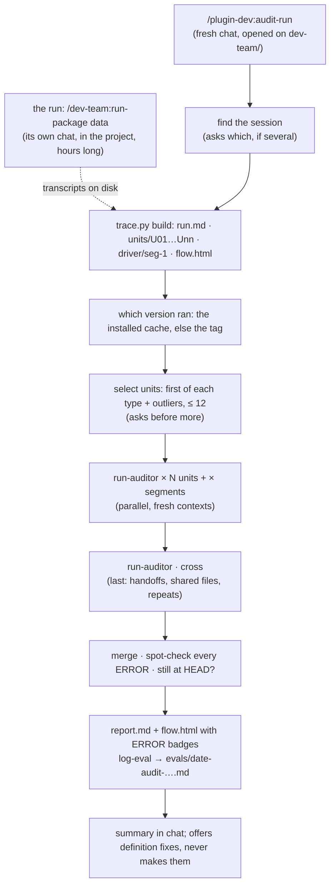

# Checking a run

A workflow ran, for minutes or for hours, in some project's chat, and reported success. This
page is how you find out whether it did what the plugin's files say it does. Did each agent
get the right inputs? Did it follow its procedure, write only where it may, and hand back
claims that its own tool calls back up? Did the driver act on each return the way its skill
says?

It takes one skill, `/plugin-dev:audit-run`, typed in a fresh chat opened on the plugin, not
the project. It reads the run from Claude Code's transcripts on disk, so the chat that ran
the workflow can be closed, still open, or still running.



## Worked example: an 8-hour `run-package`

Yesterday you typed `/dev-team:run-package data` in a chat on `~/PycharmProjects/quant`. It
ran for 8 hours and spawned about 60 agents: researchers, designers, testers, implementers
and reviewers across eight sections, some of them twice. The summary says every section is
DONE. You want to know whether to believe it, and whether dev-team itself misbehaved
anywhere.

**1. Have the skill installed.** `/agents` should list `plugin-dev:run-auditor`. If it does
not, update plugin-dev from the `/plugin` menu (`audit-run` arrived in 0.12.0), then
`/reload-plugins`.

**2. Open a new chat on the plugin**, meaning the `dev-team/` folder in `cott-plugins`, not
the repo root and not `quant`. The skill reads the plugin's name from
`.claude-plugin/plugin.json` in the chat's folder, and that is also where it writes the
report and the eval log. Don't use the 8-hour chat itself: its folder is the project, and its
context is already full of the run.

**3. Type the command, naming the chat by its title.** Use the words you see in the app's
sidebar:

```
/plugin-dev:audit-run architecture migration
```

Any words from the title work, in any case. If exactly one dev-team chat matches, that is the
one. If several match, or you type no words at all, it lists the candidates and asks. Each
candidate takes two lines, with the title in quotes:

```
5976c083-2a42-4a6a-815c-bb773869bd41  "Project architecture migration"
    ~/PycharmProjects/quant · 2026-09-28 12:09 → 09-29 09:50 (21h40m) · 110 agents · commands: run-package
    fork of 1493ed56: its history up to 09-29 06:59 is a copy of that chat's
1493ed56-5636-4a51-8a71-1c3377579975  "Project architecture migration"
    ~/PycharmProjects/quant · 2026-09-28 12:09 → 09-29 06:59 (18h50m) · 105 agents · commands: run-package
e861e636-bb4b-404e-a8e8-90c012ea38dd  "Project architecture migration"
    ~/PycharmProjects/quant · 2026-09-28 11:26 → 11:41 (0h14m) · 0 agents · commands: run-package
```

To tell same-named chats apart:
- **The span and its length:** your 8-hour run is the one that lasted hours, not the 14-minute
  false start.
- **The agent count:** a `run-package` that did real work spawned dozens of agents.
- **`fork of …`:** forking or resuming a chat makes a new session, with a copy of the
  history up to that point, under the same title. The fork is the one to pick when the work
  went on after the split. Its trace still finds every agent spawned before the fork: those
  transcripts stay with the original session, and the trace looks there.
- **`still active`:** the session wrote to disk in the last two minutes.

The long ID at the start of each entry is Claude Code's session ID. It is also the name of
the transcript file, `~/.claude/projects/<project folder>/<id>.jsonl`. Pass it, or its first
8 characters, when titles don't settle it: `/plugin-dev:audit-run 5976c083`. `latest` means
the most recent chat that used dev-team anywhere. Headless eval runs in temp folders never
appear in the sidebar, so they are left out of the list.

**4. Look at the chart first.** The trace step writes `flow.html` into
`dev-team/evals/workspace/audit/<id8>/`, and the skill offers to open it. Time runs down the
page:
- **Rows:** each row is a wave, the agents started in one message. A shaded row ran in
  parallel.
- **Columns:** each column is one section's whole history: how many runs it took and how many
  review rounds.
- **Reviews:** each review box is coloured by its verdict.
- **Bands:** a band marks each time the driver stopped to ask you.

On an 8-hour run this is usually the fastest answer to "where did the time go": a section with
three review rounds and a redesign stands out at a glance.

**5. Decide what to audit.** The skill proposes a selection and says why for each unit: the
first agent of each type, plus every one that stands out from its type. That means an unusual
return, no commit where the others committed, a commit that cannot be tied to its own files,
or many hook blocks or errors. The selection is capped at 12. For an 8-hour run, accept it
first. Auditing all ~60 costs about as much as the run did, and the skill asks before it
spawns more than 12. To aim instead, re-type with one of these:

| You want | Type |
|---|---|
| the default risk sample | `/plugin-dev:audit-run <id>` (or `--units risk`) |
| specific agents you saw in the chart | `/plugin-dev:audit-run <id> --units U14,U27,U43` |
| everything one typed command did | `/plugin-dev:audit-run <id> --units seg:2` |
| everything | `/plugin-dev:audit-run <id> --units all` |
| more of each tool output in the trace | add `--full` |

**6. Wait.** The auditors run in parallel. A dozen take several minutes. Each auditor
reads a whole agent's trace, so plan on 100–200k tokens per auditor, which is 1–2M for a
dozen. The cross pass runs after them.

**7. Read the answer.** The chat gets:
- one line with the totals;
- each ERROR, with the trace step it happened at and the plugin `file:line` it breaks;
- the counts of WARN and NOTE findings;
- the paths to `report.md` and the re-rendered `flow.html`, where each audited box now carries
  its ERROR count or a ✓.

The same findings are logged under `dev-team/evals/` by `log-eval`, and that log is the part
that gets committed.

**8. Act on it.** Each finding names who has to change:

| Fault | Meaning | What you do |
|---|---|---|
| `definition` | dev-team's own files are wrong, contradict each other, or are silent where an agent had to guess | Fix the plugin. The skill offers the edits and marks each finding `still at HEAD` or `changed since <version>`. A fix is a [small change](small-change.md), or a [phased one](phased-change.md) if it spans several agents |
| `agent` | the rule was clear and the agent broke it | Usually nothing to fix in the run. Three or more alike are merged by the cross pass into one `definition` finding: a rule that is easy to break needs stating again where it applies |
| `driver` | the typed skill sent a wrong input or acted wrongly on a return | Fix the skill, like a definition fault |
| `platform` | the harness, a tool or the network | Nothing in the plugin |

The project the run built is not judged. A section that the audit shows was let through a red
gate, or approved by a reviewer that skipped a check, still needs your own look in that
project's repo.

## A run that is still going

Open the audit chat while the workflow runs in its own chat, and type:

```
/plugin-dev:audit-run <id> --units new
```

Each pass rebuilds the trace from what is on disk. It audits only the agents that have
finished since the last pass, and skips agents still running. It audits the driver's segment
only once that segment is over, and the cross pass only once the whole run is. To keep
watching without retyping, `/loop 20m /plugin-dev:audit-run <id> --units new`. Step ids never
renumber between passes, so findings from earlier passes stay valid.

## The skill and the agent

There are two pieces, and you only ever type one of them.

| | `/plugin-dev:audit-run` (skill) | `run-auditor` (agent) |
|---|---|---|
| **Started by** | you, typed. It never starts itself | only the skill. Never typed, never spawned by hand |
| **Runs in** | your chat, the main thread | its own fresh context, one per piece of the run |
| **Can ask you** | yes: which session, and whether to audit more than 12 units | never. Claude Code gives subagents no way to ask |
| **Sees** | the whole run: `run.md`, `index.json`, `flow.html`, every findings file | one piece of the run: one agent's trace, or one driver segment, or (in `cross` mode) the run table plus the others' findings. It also sees the one plugin file that defined that piece, at the version that ran |
| **Does** | finds the session, builds the trace with `trace.py`, settles which version ran, selects units, spawns the auditors in parallel and the cross pass last, merges, spot-checks every ERROR against the trace and the plugin, checks each definition fault against HEAD, writes `report.md`, logs with `log-eval`, and tells you | checks inputs, procedure, write scope, hooks and errors, claims against tool calls, and the return's shape. Writes one findings file with a step id and a `file:line` for every finding. Returns one line |
| **Writes** | `report.md`, the eval log, and a `.gitignore` line if one is missing | its findings file, nothing else |

The split is deliberate:
- **Why so many agents.** An 8-hour run is millions of tokens of transcript. No single
  context can read it and still judge well, so each auditor gets one agent's trace and nothing
  else, and they run side by side.
- **Why fresh contexts.** An auditor that has not read the other units cannot be primed by
  them. It judges this agent against this agent's rules.
- **Why the skill judges again.** The skill is the only piece that sees every finding at once.
  That makes it the only piece that can merge repeats into one systemic finding, or drop an
  ERROR whose evidence does not hold.
- **Why the skill runs in your chat.** It is the piece that has to ask you things, and a
  subagent cannot.

## Where things go

| Thing | Path | Committed |
|---|---|---|
| The trace, the chart, the findings, the report | `<plugin>/evals/workspace/audit/<id8>/` (`run.md`, `index.json`, `units/`, `driver/`, `flow.html`, `findings/`, `report.md`) | never. It holds the project's file contents |
| The eval log, with the ERROR and WARN table | `<plugin>/evals/<date>-audit-<command>-<id8>.md` + a row in `evals/README.md` | yes, by `log-eval` |
| The transcripts it read | `~/.claude/projects/<project>/<session>.jsonl` and `<session>/subagents/` | Claude Code's, never touched |
