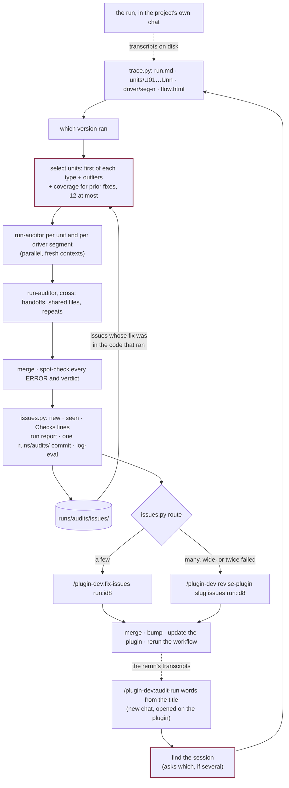

# Checking a run, and checking the fix

A workflow ran in some project's chat, for minutes or for hours, and reported success. This
is how you find out whether it did what the plugin's files say. Did each agent get the right
inputs, follow its procedure, write only where it may, and hand back claims its own tool
calls back up? Did the driver act on each return the way its skill says? And after a fix and
a rerun, did the fix hold?

`/plugin-dev:audit-run` checks a run and files what it finds as issues.
`/plugin-dev:run-flow` draws any run, with every agent one click from its full record. Both
read Claude Code's transcripts on disk, so the chat that ran the workflow can be closed,
open, or still running. The fixing is [a change from facts](revise-from-facts.md).



## Auditing a run

1. **Open a new chat on the plugin** (`dev-team/`, not the project and not the repo root).
   The skill reads the plugin's name from that folder and writes the issues, the report and
   the eval log there. Not the chat that ran the workflow: its folder is the project and its
   context is full of the run.
2. **Type the command with words from the chat's title**, as the sidebar shows it:
   `/plugin-dev:audit-run architecture migration`. One match is used. Several, or no words,
   and it lists the candidates and asks:

   ```
   5976c083-2a42-4a6a-815c-bb773869bd41  "Project architecture migration"
       ~/PycharmProjects/quant · 2026-09-28 12:09 → 09-29 09:50 (21h40m) · 110 agents · commands: run-package
       fork of 1493ed56: its history up to 09-29 06:59 is a copy of that chat's
   e861e636-bb4b-404e-a8e8-90c012ea38dd  "Project architecture migration"
       ~/PycharmProjects/quant · 2026-09-28 11:26 → 11:41 (0h14m) · 0 agents · commands: run-package
   ```

   Tell same-named chats apart by span and agent count. A fork is the one to pick when the
   work went on after the split; its trace still finds the agents spawned before it. The id,
   or its first 8 characters, works in place of words, and `latest` is the most recent chat
   that used the plugin.
3. **Look at the chart first.** `/plugin-dev:run-flow <id8>` opens `flow.html`. Each row is
   a wave of agents started in one message, each column one section's whole history, each
   review coloured by its verdict, and a band marks each time the driver stopped to ask.
   On a long run it is the fastest answer to where the time went.
4. **Accept the selection, or aim it.** It proposes the first agent of each type plus every
   outlier (an unusual return, no commit where the others committed, many hook blocks),
   capped at 12, and asks before more. Auditing every agent of a long run costs about what
   the run did.

   | You want | Add |
   |---|---|
   | specific agents from the chart | `--units U14,U27,U43` |
   | everything one typed command did | `--units seg:2` |
   | everything | `--units all` |
   | only agents finished since the last pass, on a run still going | `--units new` (with `/loop 20m` to keep watching) |
   | more of each tool output in the trace | `--full` |

5. **Wait.** Auditors run in parallel, 100–200k tokens each, then the cross pass.
6. **Read the answer**: the totals; each ERROR with its trace step and the plugin
   `file:line` it breaks; the WARN and NOTE counts with their issue ids; the run report's
   path; and which skill takes the issues, as `issues.py route` says.

## What a finding becomes

Every ERROR and WARN, and every `definition` NOTE, is an issue: one file under
`runs/audits/issues/` with an id such as `DT-031`. A finding that breaks the same quoted
rule as an existing issue is that issue seen again, so an id stays the same from one audit
to the next however far the rule's line has drifted. Each names who has to change:

| Fault | Meaning | What you do |
|---|---|---|
| `definition` | The plugin's files are wrong, contradict each other, or are silent where an agent had to guess | Fix the plugin. The report marks each `still at HEAD` or `changed since <version>` |
| `driver` | The typed skill sent a wrong input or acted wrongly on a return | Fix the skill, like a definition fault |
| `agent` | The rule was clear and the agent broke it | Often nothing. Three or more alike are merged into one `definition` finding: a rule that is easy to break needs stating where it applies, or a hook |
| `platform` | The harness, a tool or the network | Nothing in the plugin |

The project the run built is not judged. A section the audit shows was let through a red
gate still needs your own look in that project's repo.

## Fixing

`issues.py route` says which skill takes the issues, and `audit-run` prints the command:
`/plugin-dev:fix-issues run:<id8>` for a few, `/plugin-dev:revise-plugin <slug> issues
run:<id8>` for many. Both are on [Changing a plugin from facts](revise-from-facts.md), and
both end by recording in each issue a `Verify:` line that says what a rerun's trace will
show. Neither can say a fix worked.

## Auditing the rerun

Update the plugin where the workflow runs, run the workflow again in its own chat, and audit
that chat the same way. Besides new findings, the audit checks every issue whose fix could
have run:

- **Was the fix in the code that ran?** The fix commit must be an ancestor of the run's
  plugin checkout, or the run's version at least the fix's `fixed_in`. A stale cache can
  never pass a fix.
- **Coverage.** The selection widens to at least one finished agent of each type the issues
  name, within the same cap.
- **Verdicts.** Each auditor gets the issues that apply to its piece, with their `Verify:`
  lines, and writes one verdict per issue citing a step. Each is spot-checked at that step.

| Verdict | Meaning |
|---|---|
| held | A step shows the `held when` half of the `Verify:` line. The issue is `verified`, and `settled` once it has held in three sessions and not been found since. A settled issue is no longer handed to auditors |
| recurred | A step shows the `recurred when` half. The issue is open again, counted once, as a recurrence |
| not exercised | No audited agent reached the behavior. Never counted as held |
| not testable | The fix was not in the code that ran. Update the plugin and rerun |

## Seeing what an agent did

Without auditing anything, ask "what did the profiler do in that chat?", or type
`/plugin-dev:run-flow <id8> --agent profiler`. It lists every run of that agent type in time
order (mode, section, round, duration, tool calls, errors, files, commits, the first line
returned), and each row opens that run's page: the prompt it was sent, every step with full
input and output, each Write and Edit, its commits, and what it handed back. `--sessions
a,b` or `--branch <glob>` spans several chats. `--explain` adds a short plain account at the
top of each agent's page. It judges nothing.

## Who does what

| Piece | Started by | Runs in | Does | Writes |
|---|---|---|---|---|
| `audit-run` (skill) | you, typed | your chat | Finds the session, builds the trace, settles the version, selects units, spawns the auditors and the cross pass, merges, spot-checks, matches findings to issues, files and commits | Issues and `INDEX.md` through `issues.py`, the run report, one `runs/audits/` commit, the eval log |
| `run-auditor` (agent) | `audit-run` only | a fresh context per piece | Judges one agent's trace, one driver segment, or the run across agents, against the plugin file at the version that ran, and each prior issue's `Verify:` line | Its findings file |
| `run-flow` (skill) | you, typed or asked | your chat | Builds the trace, renders the chart and every agent's page, serves them | The workspace only; commits nothing |
| `run-narrator` (agent) | `run-flow --explain` | a fresh context per agent, Sonnet 5.5 | Five to ten plain lines on what one agent did, each citing its steps | `explain/U<nn>.md` |

An auditor reads one piece and nothing else because a long run is millions of tokens of
transcript, and an auditor that has not read the other units cannot be primed by them. The
skill judges again because it alone sees every finding at once: only it can merge repeats
into one systemic finding or drop an ERROR whose evidence does not hold.

## Where things go

| Thing | Path | Committed |
|---|---|---|
| The workspace: trace, chart, every agent's record and page, findings | `<plugin>/runs/<project>/<command> <title>/<id8>/` | never: it holds the project's file contents |
| The run report | `<plugin>/runs/audits/reports/<date>-<id8>.md` | yes, by `audit-run` |
| The issues and their index | `<plugin>/runs/audits/issues/<ID>.md`, `runs/audits/INDEX.md` | yes: by `audit-run`, by each fix, by the bump |
| The eval log | `<plugin>/evals/<date>-audit-<command>-<id8>.md` and its index row | yes, by `log-eval` |
| The transcripts | `~/.claude/projects/<project>/<session>.jsonl` and `<session>/subagents/` | Claude Code's, never touched |
