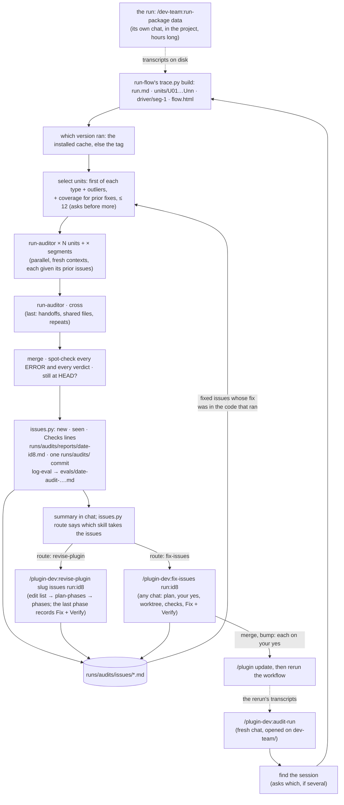

# Checking a run, fixing it, and checking the fix

A workflow ran, for minutes or for hours, in some project's chat, and reported success. This
page is how you find out whether it did what the plugin's files say it does. Did each agent
get the right inputs? Did it follow its procedure, write only where it may, and hand back
claims that its own tool calls back up? Did the driver act on each return the way its skill
says? And once you have fixed what it found and run the workflow again, did each fix hold?

Three skills, each typed or asked for in a fresh chat opened on the plugin, not the project.
`/plugin-dev:audit-run` checks a run and files what it finds as issues in the plugin's
committed `runs/audits/`. `/plugin-dev:fix-issues` fixes those issues from any chat. The next
`/plugin-dev:audit-run`, of a rerun, checks each fix. `/plugin-dev:run-flow` draws any run, with
every agent one click from its full record. All of them read the run from Claude Code's
transcripts on disk, so the chat that ran the workflow can be closed, still open, or still
running.



## Worked example: an 8-hour `run-package`

Yesterday you typed `/dev-team:run-package data` in a chat on `~/PycharmProjects/quant`. It
ran for 8 hours and spawned about 60 agents: researchers, designers, testers, implementers
and reviewers across eight sections, some of them twice. The summary says every section is
DONE. You want to know whether to believe it, and whether dev-team itself misbehaved
anywhere.

**1. Have the skill installed.** `/agents` should list `plugin-dev:run-auditor`. If it does
not, update plugin-dev from the `/plugin` menu (`audit-run` arrived in 0.12.0; the issue
ledger, `fix-issues` and `run-flow` in 0.16.0), then `/reload-plugins`.

**2. Open a new chat on the plugin**, meaning the `dev-team/` folder in `cott-plugins`, not
the repo root and not `quant`. The skill reads the plugin's name from
`.claude-plugin/plugin.json` in the chat's folder, and that is also where it writes the
issues, the run report and the eval log. Don't use the 8-hour chat itself: its folder is the project, and its
context is already full of the run.

**3. Type the command, naming the chat by its title.** Use the words you see in the app's
sidebar:

```
/plugin-dev:audit-run architecture migration
```

Any words from the title work, in any case. If exactly one dev-team chat matches, that is the
one. If several match, or you type no words at all, it lists the candidates and asks. Each
candidate takes two lines, with the title in quotes:

```
5976c083-2a42-4a6a-815c-bb773869bd41  "Project architecture migration"
    ~/PycharmProjects/quant · 2026-09-28 12:09 → 09-29 09:50 (21h40m) · 110 agents · commands: run-package
    fork of 1493ed56: its history up to 09-29 06:59 is a copy of that chat's
1493ed56-5636-4a51-8a71-1c3377579975  "Project architecture migration"
    ~/PycharmProjects/quant · 2026-09-28 12:09 → 09-29 06:59 (18h50m) · 105 agents · commands: run-package
e861e636-bb4b-404e-a8e8-90c012ea38dd  "Project architecture migration"
    ~/PycharmProjects/quant · 2026-09-28 11:26 → 11:41 (0h14m) · 0 agents · commands: run-package
```

To tell same-named chats apart:
- **The span and its length:** your 8-hour run is the one that lasted hours, not the 14-minute
  false start.
- **The agent count:** a `run-package` that did real work spawned dozens of agents.
- **`fork of …`:** forking or resuming a chat makes a new session, with a copy of the
  history up to that point, under the same title. The fork is the one to pick when the work
  went on after the split. Its trace still finds every agent spawned before the fork: those
  transcripts stay with the original session, and the trace looks there.
- **`still active`:** the session wrote to disk in the last two minutes.

The long ID at the start of each entry is Claude Code's session ID. It is also the name of
the transcript file, `~/.claude/projects/<project folder>/<id>.jsonl`. Pass it, or its first
8 characters, when titles don't settle it: `/plugin-dev:audit-run 5976c083`. `latest` means
the most recent chat that used dev-team anywhere. Headless eval runs in temp folders never
appear in the sidebar, so they are left out of the list.

**4. Look at the chart first.** The trace step writes `flow.html` into
`dev-team/runs/<project>/<command> <title>/<id8>/`, and `/plugin-dev:run-flow <id8>` opens it in the
browser pane, where every box opens that agent's page. Time runs down the page:
- **Rows:** each row is a wave, the agents started in one message. A shaded row ran in
  parallel.
- **Columns:** each column is one section's whole history: how many runs it took and how many
  review rounds.
- **Reviews:** each review box is coloured by its verdict.
- **Bands:** a band marks each time the driver stopped to ask you.

On an 8-hour run this is usually the fastest answer to "where did the time go": a section with
three review rounds and a redesign stands out at a glance.

**5. Decide what to audit.** The skill proposes a selection and says why for each unit: the
first agent of each type, plus every one that stands out from its type. That means an unusual
return, no commit where the others committed, a commit that cannot be tied to its own files,
or many hook blocks or errors. The selection is capped at 12. For an 8-hour run, accept it
first. Auditing all ~60 costs about as much as the run did, and the skill asks before it
spawns more than 12. To aim instead, re-type with one of these:

| You want | Type |
|---|---|
| the default risk sample | `/plugin-dev:audit-run <id>` (or `--units risk`) |
| specific agents you saw in the chart | `/plugin-dev:audit-run <id> --units U14,U27,U43` |
| everything one typed command did | `/plugin-dev:audit-run <id> --units seg:2` |
| everything | `/plugin-dev:audit-run <id> --units all` |
| more of each tool output in the trace | add `--full` |

**6. Wait.** The auditors run in parallel. A dozen take several minutes. Each auditor
reads a whole agent's trace, so plan on 100–200k tokens per auditor, which is 1–2M for a
dozen. The cross pass runs after them.

**7. Read the answer.** The chat gets:
- one line with the totals, the issue counts (new, seen again) and the prior counts (held,
  recurred, not exercised, not testable);
- each ERROR, with the trace step it happened at and the plugin `file:line` it breaks;
- the counts of WARN and NOTE findings, with their issue ids;
- the path to the run report, `dev-team/runs/audits/reports/<date>-<id8>.md`, and to the re-rendered
  `flow.html`, where each audited box now carries its ERROR count or a ✓ and the ids of the
  issues first found there;
- which skill takes what it found, as `issues.py route` says: `/plugin-dev:fix-issues
  run:<id8>` for a few issues, or `/plugin-dev:revise-plugin <slug> issues run:<id8>` when
  there are more than six, more than three across more than three roles, or one that
  recurred after two fixes.

Every ERROR and WARN, and every `definition` NOTE, is now an issue: one file under
`dev-team/runs/audits/issues/` with an id such as `DT-031`. A finding that breaks the same quoted
rule as an existing issue is that issue seen again, so the id stays the same from one audit to
the next, however far the rule's line number has drifted. The skill writes the issues, the
run report and `runs/audits/INDEX.md` through `scripts/issues.py` and commits `runs/audits/` in one
commit of its own, `dev-team audits: <id8> — <n> new, <n> seen, <n> checked`. The `log-eval`
entry under `dev-team/evals/` is short: the issue ids by outcome and a link to the report.

**8. Act on it.** Each finding names who has to change:

| Fault | Meaning | What you do |
|---|---|---|
| `definition` | dev-team's own files are wrong, contradict each other, or are silent where an agent had to guess | Fix the plugin with `/plugin-dev:fix-issues` (below). The report marks each finding `still at HEAD` or `changed since <version>`. A fix that spans several agents may be a [phased change](phased-change.md) instead |
| `agent` | the rule was clear and the agent broke it | Usually nothing to fix in the run. Three or more alike are merged by the cross pass into one `definition` finding: a rule that is easy to break needs stating again where it applies. `fix-issues` restates the rule where it applies, or closes the issue as `wontfix` with a reason |
| `driver` | the typed skill sent a wrong input or acted wrongly on a return | Fix the skill, like a definition fault |
| `platform` | the harness, a tool or the network | Nothing in the plugin |

The project the run built is not judged. A section that the audit shows was let through a red
gate, or approved by a reviewer that skipped a check, still needs your own look in that
project's repo.

## Fix what it found

Open a chat on the plugin, this one or any other, even days later, and type:

```
/plugin-dev:fix-issues run:ca48b249
```

`run:<id8>` takes the issues that audit found or saw again. With issue ids
(`/plugin-dev:fix-issues DT-004 DT-011`) it takes those; with nothing, or `open`, every open
issue and every one whose fix recurred; with `recurred`, only those. It shows them as a table.

Then it runs `issues.py route` on the selection. A selection the script gives to
`revise-plugin` is not planned here: `fix-issues` prints the reason and the command and
stops, because one chat planning one edit per issue is the wrong tool for thirty issues
across eight roles. Name a few ids to fix those here, or add `--here` to fix them all here
anyway.

1. **The plan, and your yes.** For each issue it reads the issue file, the run report's
   finding and the rule in the working tree (by its quoted text, since line numbers drift).
   Then it proposes one edit per issue: the file, the sentence or step that changes, and how it
   reads afterwards, or `wontfix` with the reason. It asks once. Nothing is edited before your
   yes.
2. **The worktree.** The edits go on a new branch, `dev-team-audit-fixes-<date>`, in its own
   worktree beside the repo, never in the checkout the chat started in.
3. **The checks.** The plugin's own rules, `check-contracts`, `build-site`, and `run-evals`
   against the plugin's last tag for every eval set that covers a file it touched. A failure
   goes back to the edits, inside the plan you approved.
4. **The Fix attempt.** It commits the edits, then records in each issue a Fix attempt: the
   branch, the commit, the files, the eval logs, and a `Verify:` line, such as
   `Verify: watch agent:profiler; held when the profile's Provenance names only pulls in this
   run's tool calls; recurred when it names a pull no tool call made`. Both halves name
   something a trace shows, because that line is exactly what the next audit checks. It
   commits the attempts in a second commit.
5. **The merge, then the bump, each on your yes.** It asks whether to merge the branch into
   `main`, and does so only when the main checkout is on `main` with a clean tree. Then it
   says a bump looks warranted, names the level, and stops. On your yes, `bump-version` makes
   the release and stamps `fixed_in` on each issue it carries.

`fix-issues` never marks an issue as working. An issue it fixed is `fixed`, then `released`
once the bump stamps it. Only an audit of a rerun can say it held.

## Audit the rerun

Update the plugin where the workflow runs (`/plugin` → update, then `/reload-plugins`), and run
the workflow again in its own chat. Then, in a chat on the plugin:

```
/plugin-dev:audit-run <words from the new chat's title>
```

It audits the rerun as above, and also checks every issue whose latest fix could have run:

- **Was the fix in the code that ran?** When the run's plugin root is a git checkout, the fix
  commit must be an ancestor of that checkout's HEAD. Otherwise the run's version must be at
  least the fix's `fixed_in`. A fix that was not in the code that ran is **not testable** and
  goes to no auditor. So a stale plugin cache, or a run on the version before the bump, can
  never pass a fix.
- **Coverage.** The selection widens to include at least one finished agent of each type the
  issues name, and the driver segment of each command they name, within the same cap of 12.
- **Each auditor** gets the issues that apply to its piece, with their `Verify:` lines, and
  writes one verdict line per issue, citing the step.
- **Each verdict is spot-checked** at its step. One whose step does not show it is dropped to
  not exercised and listed under **Dropped on spot-check**.

The run report gains a **Prior issues** table, one row per issue. An issue that held or
recurred also gets a Checks line; one that was not exercised or not testable gets only its
row in the report:

| Verdict | Meaning |
|---|---|
| held | an audited agent did the thing the fix is about, and the step shows the `held when` half of its `Verify:` line. The issue is now `verified`, and `settled` once it has held in three sessions and has not been found again since, after which audits stop handing it to auditors and `INDEX.md` shows it as one line |
| recurred | the step shows the `recurred when` half. The issue is open again, and `/plugin-dev:fix-issues recurred` takes it. It is counted once, as a recurrence, never also as a new finding |
| not exercised | no audited agent reached the behavior the fix is about, or nothing in this run is of the type it names. Never counted as held |
| not testable | the fix was not in the code that ran: the plugin cache was stale, or the fix was not yet released to the version that ran. Update the plugin and rerun |

`flow.html` shows the same on its boxes: each prior issue that held (✓) or recurred (✗) at
that agent.

## See what an agent did

Without auditing anything, ask "what did the profiler do in that chat?", or type:

```
/plugin-dev:run-flow ca48b249 --agent profiler
```

It opens a page in the browser pane listing every run of that agent type in time order, with
its mode, section, round, duration, tool calls, errors, files written, commits and the first
line it returned. Each row opens that run's page: the prompt it was sent, every step with its
full input and output, each Write's content and each Edit's old and new text, its commits and
what it handed back. With `--sessions a,b` or `--branch <glob>` the list spans several chats.
Without `--agent`, it opens the run's chart. Add `--explain` for a short plain account at the
top of each agent's page, written by the `run-narrator` agent, each line linked to the steps
it covers. It judges nothing; that is the audit's job.

## A run that is still going

Open the audit chat while the workflow runs in its own chat, and type:

```
/plugin-dev:audit-run <id> --units new
```

Each pass rebuilds the trace from what is on disk. It audits only the agents that have
finished since the last pass, and skips agents still running. It audits the driver's segment
only once that segment is over, and the cross pass only once the whole run is. To keep
watching without retyping, `/loop 20m /plugin-dev:audit-run <id> --units new`. Step ids never
renumber between passes, so findings from earlier passes stay valid.

## The skill and the agent

An audit has two pieces, and you only ever type one of them.

| | `/plugin-dev:audit-run` (skill) | `run-auditor` (agent) |
|---|---|---|
| **Started by** | you, typed. It never starts itself | only the skill. Never typed, never spawned by hand |
| **Runs in** | your chat, the main thread | its own fresh context, one per piece of the run |
| **Can ask you** | yes: which session, and whether to audit more than 12 units | never. Claude Code gives subagents no way to ask |
| **Sees** | the whole run: `run.md`, `index.json`, `flow.html`, every findings file, and the plugin's `runs/audits/` | one piece of the run: one agent's trace, or one driver segment, or (in `cross` mode) the run table plus the others' findings. It also sees the one plugin file that defined that piece, at the version that ran, and the prior issues that apply to it |
| **Does** | finds the session, builds the trace with `run-flow`'s `trace.py` (`skills/run-flow/scripts/`), settles which version ran, decides which prior fixes were in the code that ran, selects units with coverage for them, spawns the auditors in parallel and the cross pass last, merges, spot-checks every ERROR and every verdict against the trace and the plugin, checks each definition fault against HEAD, matches findings to existing issues, files the issues and the run report, commits `runs/audits/`, logs with `log-eval`, and tells you | checks inputs, procedure, write scope, hooks and errors, claims against tool calls, and the return's shape, and each prior issue's `Verify:` line. Writes one findings file with a step id and a `file:line` for every finding, and a step for every verdict. Returns one line |
| **Writes** | the issues and `runs/audits/INDEX.md` (through `issues.py`), the run report, the one `runs/audits/` commit, the eval log, and a `.gitignore` line if one is missing | its findings file, nothing else |

The split is deliberate:
- **Why so many agents.** An 8-hour run is millions of tokens of transcript. No single
  context can read it and still judge well, so each auditor gets one agent's trace and nothing
  else, and they run side by side.
- **Why fresh contexts.** An auditor that has not read the other units cannot be primed by
  them. It judges this agent against this agent's rules.
- **Why the skill judges again.** The skill is the only piece that sees every finding at once.
  That makes it the only piece that can merge repeats into one systemic finding, or drop an
  ERROR whose evidence does not hold.
- **Why the skill runs in your chat.** It is the piece that has to ask you things, and a
  subagent cannot.

Around it, three more pieces:

| | `/plugin-dev:fix-issues` (skill) | `/plugin-dev:run-flow` (skill) | `run-narrator` (agent) |
|---|---|---|---|
| **Started by** | you, typed. `audit-run` cannot start it, so it tells you what to type | you, typed, or Claude when you ask what a run or an agent did | only `run-flow`, with `--explain` |
| **Runs in** | your chat, the main thread | your chat, the main thread | its own fresh context, one per agent narrated, on Sonnet 5.5 |
| **Can ask you** | yes: the plan, the merge, and (by proposing it) the bump | which chat, when several match, and whether to narrate more than 12 agents | never |
| **Does** | selects issues, plans one edit per issue, edits on a worktree branch after your yes, runs the checks and evals, records a Fix attempt with a `Verify:` line in each issue | builds the trace, renders the chart, the agent pages and the agent view, serves them and opens the page | reads one agent's trace and writes five to ten plain lines on what it did, each citing its steps. Judges nothing |
| **Writes** | the plugin's files on its branch, the Fix attempts (through `issues.py`), the eval logs, two commits | the workspace only. Commits nothing | `explain/U<nn>.md` in the workspace, nothing else |

## Where things go

| Thing | Path | Committed |
|---|---|---|
| The workspace: the trace, the chart, every agent's full record and page, the agent views, the narration, the findings | `<plugin>/runs/<project>/<command> <title>/<id8>/` (`run.md`, `index.json`, `units/U*.md` for the auditors, `units/U*.json` and `units/U*.html` for the pages, `driver/`, `flow.html`, `agents/`, `explain/`, `findings/`), and `runs/views/` across chats; `/plugin-dev:run-flow <id8>` rebuilds and serves it | never. It holds the project's file contents |
| The run report | `<plugin>/runs/audits/reports/<date>-<id8>.md` | yes, by audit-run's own `runs/audits/` commit |
| The issues and their index | `<plugin>/runs/audits/issues/<ID>.md`, `<plugin>/runs/audits/INDEX.md`; Fix attempts by `fix-issues`, `fixed_in` by `bump-version` | yes: audit-run's commit, `fix-issues`' attempts commit, the bump commit |
| The eval log: the issue ids by outcome and a link to the run report | `<plugin>/evals/<date>-audit-<command>-<id8>.md` + a row in `evals/README.md` | yes, by `log-eval` |
| The transcripts it read | `~/.claude/projects/<project>/<session>.jsonl` and `<session>/subagents/` | Claude Code's, never touched |
