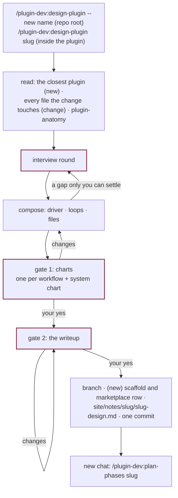

# Designing a plugin or a workflow

For a change that starts from an idea: a plugin that does not exist yet, or one workflow
added to a plugin or redrawn in it. A new plugin is its workflows, so the two are one path
with two modes. What should exist is worked out with you, one workflow at a time, each from
its driver down, and written up as a design that
[plan-phases and run-phase](plan-and-run-phases.md) build.

Not this page: a change across many of a plugin's agents and skills that starts from what is
known about it is [a change from facts](revise-from-facts.md). `design-plugin` says so itself
when it is typed for one, after reading and before asking anything.



## The two modes

| | **new** | **change** |
|---|---|---|
| Typed | at the repo root, `design-plugin --new <name>` | inside `<plugin>/`, `design-plugin <slug>` |
| Slug and branch | `0.1`, branch `<name>-0.1` | as given (usually the target version), branch `<plugin>-<slug>` |
| Reads first | the most similar plugin in the repo, end to end, for its conventions | every agent and skill the change could touch, the plugin's `CLAUDE.md` and `contracts.yml` |
| Charts mark | nothing: every component is new | `new`, `changed`, `removed` against the bundle as it is |
| On approval | `new-plugin` scaffolds the directory and the marketplace row, then the design is committed | the design is committed |

## What it works out, for each workflow

The interview is two to four rounds of two to four questions, each built on the last
answers, the recommended option first. Between rounds it composes. Every workflow takes the
shape `plugin-anatomy` gives one, and the design names each part:

| Part | The design says |
|---|---|
| **Driver** | The typed skill that drives the workflow in the main chat, and that it holds only what its script prints, what each agent returns and your answers |
| **Where the run stands** | The script and command that print the next step and each agent's slice, the ledger behind it (a file and its row, or derived from the work's own files), and the command that checks a step and writes its row |
| **Returns** | For every agent the driver spawns: its closed list of statuses, and what the driver does on each |
| **Held by** | The hook behind each step that must pass before its agent stops, and behind each write scope |
| **Unit** | The smallest piece a practitioner judges one at a time. One agent instance reads one, and writes one file with named fields |
| **Strengthened by** | What makes a unit's output trustworthy: required fields, an evaluator in its own context, a capped revision loop |
| **Inputs** | Everything a unit needs besides its source, each supplied by you, by a file, or by another loop, usually a cheaper, wider one |

Loops meet at files, and two workflows that need the same thing share the loop that makes
it. Each piece is then routed to a component by `plugin-anatomy`'s questions: a "must" is a
hook, a lookup or a check is a script, anything that needs you stays in the driver.
Components nobody asked for arrive as named suggestions you accept or reject one by one. A
platform fact the design leans on is checked against `plugin-anatomy`, then the docs; one
neither settles is written down as an assumption, and becomes a phase-0 eval.

## The two gates

1. **The charts.** One page: the idea restated, a system chart of where the loops meet, one
   flow chart per workflow drawn from its driver, the components table, the suggestions.
   A change you ask for is discussed and the same page republished.
2. **The writeup.** The charts plus what a planner who saw none of the discussion needs:
   what each output must say and never claim, what each workflow reads cold and warm, the
   decisions taken, the platform facts, the build order and its smallest end-to-end slice,
   what must not break (change only), and the non-goals.

Nothing exists in the repo before the second yes: no branch, no scaffold, no file.

## What it leaves

One commit on a new branch, in a worktree, and nothing pushed:

```
<plugin>/
├── .claude-plugin/plugin.json · CLAUDE.md · README.md · VERSIONING.md · CHANGELOG.md   new only, from templates/
├── evals/README.md · site/site.yml                                                      new only
└── site/notes/<slug>/<slug>-design.md                                                   both modes
```

plus, for a new plugin, its row in the root `marketplace.json`. Nothing under `agents/` or
`skills/`: that is phase 1's, built by a chat that has read the design and nothing of the
discussion. The next command is `/plugin-dev:plan-phases <slug>`, in a new chat, so that a
gap in the design shows up as a question and is not filled from memory.

## When no design is needed

- **A plugin of one or two skills.** `new-plugin` for the scaffold, write the skills,
  `build-site`, `check-contracts` once there is a `contracts.yml`, `run-evals` on anything
  behavioral, and `bump-version` proposes `0.1.0`.
- **One agent or skill edited in place.** Read its `plugin-anatomy` reference, edit,
  `check-contracts`, `build-site`, `run-evals` on its set when the edit changes what it does,
  one commit.
