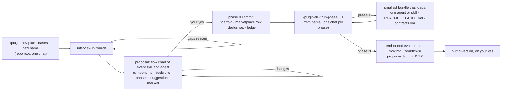

# A new plugin

Two paths, chosen by size. A plugin that will be one or two skills is scaffolded and
written in one chat. Anything with agents, or more than a couple of skills, is planned in
phases first, so that no chat has to hold the whole design and every phase leaves a
bundle that loads.

## Small: one chat

From the repo root:

1. `new-plugin` — the directory from `templates/`, `plugin.json` at `0.1.0`, the row in the
   root `marketplace.json`. It runs on its own when you say you are starting a plugin.
2. Write the skills. Each is a `SKILL.md` with a description that says *when*, and a body
   that says *how* — nothing the description already says.
3. `build-site`, then `check-contracts` once the plugin has a `contracts.yml` (the first
   claim is usually "the README names every skill").
4. An eval for anything behavioral — does the description trigger, does the skill do what
   it says on a real case — logged with `log-eval` before you report on it.
5. Commit. `bump-version` proposes tagging `0.1.0`; it tags and pushes on your yes.

## Larger: phases



**Chat 0 — `plan-phases --new <name>`.** It reads the closest existing plugin in the repo
so the new one follows the same shapes, then expands your idea in an interview: rounds of
two to four questions — purpose and users, the workflow and its hand-offs, data and
integrations, boundaries and risk — each built on the last answers. It proposes what you
did not ask for but the design needs (an agent nobody else covers, a safeguard a risky step
lacks), marked as suggestions. Before proposing, it composes the jobs from the work rather
than the commands: the unit a practitioner reads one at a time (a filing, a paper, a ticket)
gets an agent fanned out in parallel, an entity's status is synthesized once and read by
every job that needs it, the entity is compared with its peers, and the commands become
thin layers on top. Then it publishes the proposal as an Artifact page — the idea restated,
a rendered flow chart grouped by layer, the components with who uses each, what each output
must say, what each job costs on a first and a warm run, the decisions, the phase outline,
the non-goals — gives you the link in chat, and waits. You approve, ask for changes (it
re-shows the whole proposal), and accept or reject each suggestion. Nothing exists before
that yes. Then it invokes `new-plugin` for the scaffold, creates the branch `<name>-0.1`,
writes `site/notes/0.1-00-overview.md`, one note per phase, and `0.1-progress.md`, and
commits all of it as phase 0. It prints the line the next chat starts with.

**Chats 1…N — `run-phase 0.1`.** Each reads three files — the overview, the ledger, the
next note — and does that phase only. Phase 1 is deliberately the smallest thing that is a
working plugin: one agent or one skill, a README that describes only what exists, the
plugin's `CLAUDE.md`, and a `contracts.yml` with its first claim. Every later phase adds to
a bundle that already registers (`/reload-plugins`, `/agents`) and builds. A phase ends with
its evals logged, one commit, and the ledger row filled; the chat stops there.

**The last phase** runs the plugin end to end on its fixture, writes the docs
(`README.md`, `site/flow.md`, `site/workflows/`, the CHANGELOG), and proposes the first
tag. `bump-version` tags `0.1.0` — the version the scaffold already carries — on your yes.

## What phase 0 leaves behind

```
<name>/
├── .claude-plugin/plugin.json      0.1.0
├── CLAUDE.md · README.md · VERSIONING.md · CHANGELOG.md · .gitignore   from templates/
├── evals/README.md
└── site/
    ├── site.yml
    └── notes/
        ├── 0.1-00-overview.md
        ├── 0.1-01-<first phase>.md
        ├── …
        └── 0.1-progress.md
```

plus the new row in the root `marketplace.json`. Nothing under `agents/` or `skills/` yet:
that is phase 1's job, and the point of the split is that it is done by a chat that has
read the design and nothing else.
