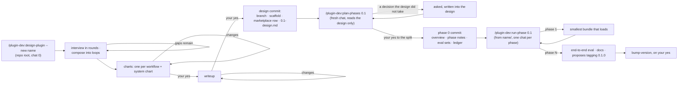

# A new plugin

Two paths, chosen by size. A plugin that will be one or two skills is scaffolded and
written in one chat. Anything with agents, or more than a couple of skills, is planned in
phases first, so that no chat has to hold the whole design and every phase leaves a
bundle that loads.

## Small: one chat

From the repo root:

1. `new-plugin` — the directory from `templates/`, `plugin.json` at `0.1.0`, the row in the
   root `marketplace.json`. It runs on its own when you say you are starting a plugin.
2. Write the skills. Each is a `SKILL.md` with a description that says *when*, and a body
   that says *how* — nothing the description already says.
3. `build-site`, then `check-contracts` once the plugin has a `contracts.yml` (the first
   claim is usually "the README names every skill").
4. An eval for anything behavioral — does the description trigger, does the skill do what
   it says on a real case. `run-evals` runs both kinds from `evals/sets/<skill>.json` and
   `evals/sets/<skill>.trigger.json`, and logs the result with `log-eval` before you report
   on it.
5. Commit. `bump-version` proposes tagging `0.1.0`; it tags and pushes on your yes.

## Larger: phases



**Chat 0 — `design-plugin --new <name>`.** It reads the closest existing plugin in the repo so
the new one follows the same shapes, then expands your idea in an interview: rounds of two to
four questions (purpose and users, the workflows and what a careful reading of one piece of
source looks like, data and integrations, boundaries and risk), each built on the last answers.
Between rounds it composes the jobs into loops, from the work rather than the commands. For
each workflow it finds the unit a practitioner handles one at a time, which gets an agent
fanned out in parallel. It asks what makes that unit's output trustworthy (usually an evaluator
in its own context). Then it traces every input the unit needs back to you, to a file, or to
another loop, often a cheaper, wider one that feeds the deep one. Loops meet at files, and
workflows that need the same thing share the loop that makes it.

It shows the result in two gates. First the charts: an Artifact page with one flow chart per
workflow, captioned with its unit, what strengthens it and where its inputs come from, plus a
system chart of how the loops connect, and the components table with suggestions marked. It
waits for your yes and redraws after any change you ask for. Then the writeup, which adds what
a planner needs: what each output must say, what each workflow costs cold and warm, the
decisions, the platform facts, the build order and the non-goals. Nothing exists in the repo
before the second yes. Then it creates the branch `<name>-0.1`, invokes `new-plugin` for the
scaffold, commits `site/notes/0.1-design.md`, and prints the line the next chat starts with.

**Chat 1 — `plan-phases 0.1`.** A fresh chat, on purpose: it reads the design and nothing of
the discussion, so anything the design failed to decide surfaces as a question instead of
being filled from memory. The answers go into the design's decisions. It shows the split into
phases as a table and waits for your yes. Then it writes
`site/notes/0.1-00-overview.md`, one note per phase each with its own **Evals** table, and
`0.1-progress.md`, and spawns one writer per behavioral target, in parallel, to write
`evals/sets/<target>.json`. It checks each set, then commits all of it as phase 0.

**Chats 2…N — `run-phase 0.1`.** Each reads three files — the overview, the ledger, the
next note — and does that phase only. Phase 1 is deliberately the smallest thing that is a
working plugin: one agent or one skill, a README that describes only what exists, the
plugin's `CLAUDE.md`, and a `contracts.yml` with its first claim. Every later phase adds to
a bundle that already registers (`/reload-plugins`, `/agents`) and builds — that load check
is one of the phase's evals, not an afterthought. A phase ends with its evals run through
`run-evals` from the sets phase 0 wrote and logged, one commit, and the ledger row filled;
the chat stops there.

**The last phase** runs the plugin end to end on its fixture, writes the docs
(`README.md`, `site/flow.md`, `site/workflows/`, the CHANGELOG), and proposes the first
tag. `bump-version` tags `0.1.0` — the version the scaffold already carries — on your yes.

## What the design and phase 0 leave behind

```
<name>/
├── .claude-plugin/plugin.json      0.1.0
├── CLAUDE.md · README.md · VERSIONING.md · CHANGELOG.md · .gitignore   from templates/
├── evals/README.md · evals/sets/<target>.json   the phases' behavioral evals
└── site/
    ├── site.yml
    └── notes/
        ├── 0.1-design.md
        ├── 0.1-00-overview.md
        ├── 0.1-01-<first phase>.md
        ├── …
        └── 0.1-progress.md
```

plus the new row in the root `marketplace.json`. Nothing under `agents/` or `skills/` yet:
that is phase 1's job, and the point of the split is that it is done by a chat that has
read the design and its phase note and nothing else.
