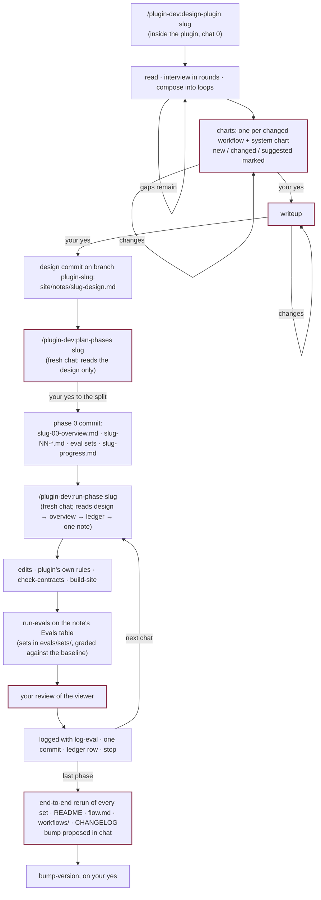

# A large change, in phases

A change that touches several agents or skills, or needs evals that would not fit in the
chat that makes the edits. The design is worked out once, in discussion, by a chat that reads
everything. The phases are planned by a second chat that reads only the design, and done by
chats that each read four files.

## Chat 0 — `design-plugin <slug>`

Run inside the plugin's directory. It reads every file the change touches (heading names and
rules are quoted from the files, not remembered) and `plugin-anatomy`'s routing guide. It
checks the platform facts the design depends on against `plugin-anatomy` first and the docs
second. A fact neither settles is written into the design as an assumption, and becomes a
phase-0 eval. It interviews you in rounds of two to four questions
(what is wrong today, scope, what must not break, the decisions that are yours), each with a
recommendation first and each round built on the last answers, and composes the changed
workflows into loops as it goes, routing each piece to a component: skill, agent, hook, MCP
server, script or config.

Then two gates. First, an Artifact page of charts: one per workflow the change touches, plus a
system chart showing where the loops meet, with new, changed and suggested components marked
and the components table below. Second, the writeup: the charts plus what every output must
say, the cost of each workflow, the decisions, the platform facts, the build order, what must
not break, and the non-goals. Each gate waits for your yes, and a requested change means
discussion and a republished page. Nothing is written before the second yes. Then it creates
the branch `<plugin>-<slug>` and commits `site/notes/<slug>-design.md`.

## Chat 1 — `plan-phases <slug>`

A fresh chat, reading the design, the files it names and the `plugin-anatomy` reference for
each kind of component it touches, and none of the discussion. It first
looks for decisions the design did not take, asks about them in one round, and writes the
answers into the design; if an answer would change a chart, it stops and says the design needs
reopening. Then it shows the phase split as a table and waits for your yes. Then it writes:

| File | Holds |
|---|---|
| `site/notes/<slug>-00-overview.md` | what changes; the contents tree with `+`/`~`; the files other files parse; the phases table with dependencies; breaking changes |
| `site/notes/<slug>-NN-<name>.md` | one per phase: purpose, decisions, files, the exact spec (frontmatter, headings, contract entries), steps, evals with pass conditions, done-when |
| `site/notes/<slug>-progress.md` | the ledger: one row per phase — status, commit, eval logs, notes for the next chat |
| `evals/sets/<target>.json` | one per behavioral target, written by one writer subagent each, in parallel, and checked before the commit |

and commits them as phase 0. The split obeys four rules: every phase is mergeable on its own;
every phase fits one chat; foundations first; every phase has an eval. The last phase is
always the end-to-end eval, the docs and the bump proposal.

## Chats 2…N — `run-phase <slug>`

Each chat opens with that line and nothing else. The skill confirms the branch and a clean
tree, reads the design, the overview, the ledger and the first note whose row is not
`done`, and does exactly that note: its edits (each component's `plugin-anatomy` reference
read first), the plugin's own rules for added or removed files,
`check-contracts`, `build-site`, then the note's **Evals** table — one row per eval, each
naming its kind, its target, the baseline to compare against, which evals of that target's
set in `evals/sets/` it runs, and the pass bar. Each row goes through `run-evals`, which
runs the target's set against the baseline, grades every expectation, and **stops** on a
behavioral row until you have looked at the viewer; a missed bar is fixed and rerun once,
and a bar still missed becomes a Deviation rather than a quiet pass. `log-eval` writes each
run up before any result is reported. Then one commit and the ledger row, then it stops.

A platform fact an eval settles is written back to `plugin-anatomy`: in the phase itself
when the plan is for plugin-dev, and as a *noticed* line in the ledger, done afterwards as a
small plugin-dev change, when it is for another plugin.

What the ledger row carries forward is everything the next chat cannot get from its own
note: a platform fact the eval resolved, a heading that turned out to be named differently,
a thing noticed but out of scope. Where the note could not be followed as written, the
chat appends a **Deviations** section to it in the same commit, so the notes stay a
true record rather than an intention.

A chat that runs out of context marks its row `in progress` with the uncommitted paths
listed and commits nothing of the phase; the next chat finishes it.

## The end

The last row is `done` and the last phase has proposed a bump in chat. `bump-version`
decides the level from the overview's breaking-changes list and the CHANGELOG's unreleased
section, and bumps, tags and pushes on your yes. The branch merges with one commit per
phase, each with its evals beside it.

## The reference run

`dev-team`'s `0.5-overhaul` is the first change planned and run in phases; its notes are
under `dev-team/site/notes/overhaul-0.5-*.md` and are the worked example of what phase notes
look like when the bar is "nothing left for the next chat to guess". It predates
`design-plugin`, so it has no design file and its overview carries the why. For the shape of a
design file, `evals/fixtures/trading-agents/site/notes/0.1-design.md` is a complete one,
written as a test fixture.
