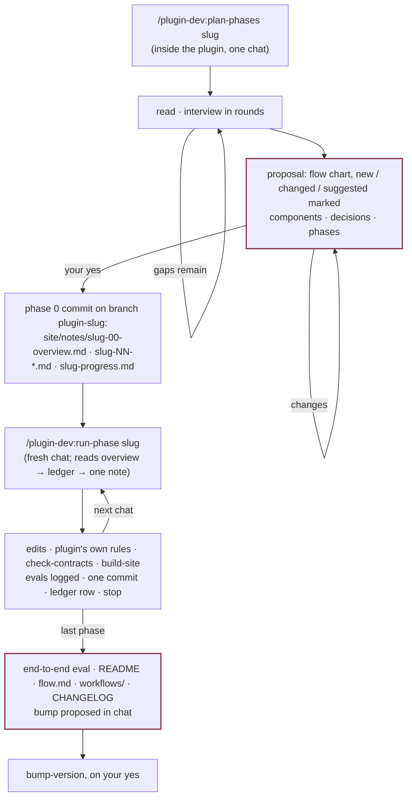

# A large change, in phases

A change that touches several agents or skills, or needs evals that would not fit in the
chat that makes the edits. The design is written once, up front, by a chat that reads
everything; the phases are done by chats that each read three files.

## Chat 0 — `plan-phases <slug>`

Run inside the plugin's directory. It reads every file the change touches — heading names
and rules are quoted from the files, not remembered — and checks the platform facts the
design depends on against the docs; a fact the docs do not settle becomes a phase-0 eval
rather than an assumption. It interviews you in rounds of two to four questions — what is
wrong today, scope, what must not break, the decisions that are yours — each with a
recommendation first and each round built on the last answers. Then it shows a proposal in
chat: the change restated, a mermaid flow chart of every skill and agent with new, changed
and suggested ones marked, a components table, the decisions, the phase outline, the
non-goals. It waits for your yes, re-showing the whole proposal after any change, and
nothing is written before it. Then it writes:

| File | Holds |
|---|---|
| `site/notes/<slug>-00-overview.md` | why; decisions taken; what changes; the contents tree with `+`/`~`; the flow after; the files other files parse; the phases table with dependencies; breaking changes; non-goals |
| `site/notes/<slug>-NN-<name>.md` | one per phase: purpose, decisions, files, the exact spec (frontmatter, headings, contract entries), steps, evals with pass conditions, done-when |
| `site/notes/<slug>-progress.md` | the ledger: one row per phase — status, commit, eval logs, notes for the next chat |

on a branch `<plugin>-<slug>`, committed as phase 0. The split obeys four rules: every
phase is mergeable on its own; every phase fits one chat; foundations first; every phase
has an eval. The last phase is always the end-to-end eval, the docs and the bump proposal.

## Chats 1…N — `run-phase <slug>`

Each chat opens with that line and nothing else. The skill confirms the branch and a clean
tree, reads the overview, the ledger and the first note whose row is not `done`, and does
exactly that note: its edits, the plugin's own rules for added or removed files,
`check-contracts`, `build-site`, the phase's evals logged with `log-eval` before any result
is reported, then one commit and the ledger row, then it stops.

What the ledger row carries forward is everything the next chat cannot get from its own
note: a platform fact the eval resolved, a heading that turned out to be named differently,
a thing noticed but out of scope. Where the note could not be followed as written, the
chat appends a **Deviations** section to it in the same commit, so the design set stays a
true record rather than an intention.

A chat that runs out of context marks its row `in progress` with the uncommitted paths
listed and commits nothing of the phase; the next chat finishes it.

## The end

The last row is `done` and the last phase has proposed a bump in chat. `bump-version`
decides the level from the overview's breaking-changes list and the CHANGELOG's unreleased
section, and bumps, tags and pushes on your yes. The branch merges with one commit per
phase, each with its evals beside it.

## The reference run

`dev-team`'s `0.5-overhaul` is the first change planned and run this way; its notes are
under `dev-team/site/notes/overhaul-0.5-*.md` and are the worked example of what a design
set looks like when the bar is "nothing left for the next chat to guess".
