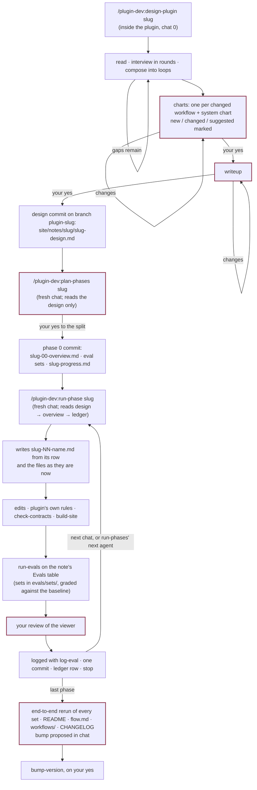

# A large change, in phases

A change that adds or redraws a workflow across several agents or skills, or needs evals
that would not fit in the chat that makes the edits. The design is worked out once, in
discussion, by a chat that reads everything. The phases are planned by a second chat that
reads only the design, and done by chats that each read three files and write their own
note. A change that fixes what is wrong across a whole plugin, rather than adding something,
starts from a review instead of a design: see [A review sweep](review-sweep.md). From
`plan-phases` on, the two are the same.

```mermaid
flowchart TD
  D["/plugin-dev:design-plugin slug<br/>(inside the plugin, chat 0)"] --> I["read · interview in rounds · compose into loops"]
  I -->|gaps remain| I
  I --> K["charts: one per changed workflow + system chart<br/>new / changed / suggested marked"]
  K -->|changes| K
  K -->|your yes| W["writeup"]
  W -->|changes| W
  W -->|your yes| G["design commit on branch plugin-slug:<br/>site/notes/slug/slug-design.md"]
  G --> P["/plugin-dev:plan-phases slug<br/>(fresh chat; reads the design only)"]
  P -->|your yes to the split| Z["phase 0 commit:<br/>slug-00-overview.md · eval sets · slug-progress.md"]
  Z --> R["/plugin-dev:run-phase slug<br/>(fresh chat; reads design → overview → ledger)"]
  R --> N["writes slug-NN-name.md from its row<br/>and the files as they are now"]
  N --> E["edits · plugin's own rules · check-contracts · build-site"]
  E --> X["run-evals on the note's Evals table<br/>(sets in evals/sets/, graded against the baseline)"]
  X --> Y["your review of the viewer"]
  Y --> C["logged with log-eval · one commit · ledger row · stop"]
  C -->|next chat, or run-phases' next agent| R
  C -->|last phase| B["end-to-end rerun of every set · README · flow.md · workflows/ · CHANGELOG<br/>bump proposed in chat"]
  B --> V["bump-version, on your yes"]
  classDef stop stroke:#8a2f4a,stroke-width:2px;
  class K,W,P,B,Y stop;
```

## Chat 0 — `design-plugin <slug>`

Run inside the plugin's directory. It reads every file the change touches (heading names and
rules are quoted from the files, not remembered) and `plugin-anatomy`'s routing guide. It
checks the platform facts the design depends on against `plugin-anatomy` first and the docs
second. A fact neither settles is written into the design as an assumption, and becomes a
phase-0 eval. It interviews you in rounds of two to four questions
(what is wrong today, scope, what must not break, the decisions that are yours), each with a
recommendation first and each round built on the last answers, and composes the changed
workflows into loops as it goes, routing each piece to a component: skill, agent, hook, MCP
server, script or config.

Then two gates. First, an Artifact page of charts: one per workflow the change touches, plus a
system chart showing where the loops meet, with new, changed and suggested components marked
and the components table below. Second, the writeup: the charts plus what every output must
say, the cost of each workflow, the decisions, the platform facts, the build order, what must
not break, and the non-goals. Each gate waits for your yes, and a requested change means
discussion and a republished page. Nothing is written before the second yes. Then it creates
the branch `<plugin>-<slug>` and commits `site/notes/<slug>/<slug>-design.md`.

## Chat 1 — `plan-phases <slug>`

A fresh chat, reading the design, the headings of the files other files parse and the
`plugin-anatomy` reference for each kind of component it touches, and none of the discussion.
It first
looks for decisions the design did not take, asks about them in one round, and writes the
answers into the design; if an answer would change a chart, it stops and says the design needs
reopening. Then it shows the phase split as a table and waits for your yes. Then it writes:

| File | Holds |
|---|---|
| `site/notes/<slug>/<slug>-00-overview.md` | what changes; the contents tree with `+`/`~`; the files other files parse, named exactly; the phases table: each phase's scope, what it must not touch, its dependencies; every phase's eval rows with pass conditions; breaking changes |
| `site/notes/<slug>/<slug>-progress.md` | the ledger: one row per phase — status, commit, eval logs, notes for the next chat |
| `evals/sets/<target>.json` | one per behavioral target, written by one writer subagent each, in parallel, and checked before the commit |

and commits them as phase 0. The split obeys four rules: every phase is mergeable on its own;
every phase fits one chat; foundations first; every phase has an eval. A phase runs its
mechanical checks and nothing else. A target's behavioral evals, new and existing, run once:
at the first checkpoint at or after the last phase that edits it, since a run made before a
later edit tests a file nobody ships. Checkpoints are the phases where targets finish, the
last phase always among them; the overview names them, and `scripts/phases.py plan-check`
fails a plan with a behavioral row anywhere else. The split is shown with its cost in
tokens before you approve it. The last phase is always the end-to-end eval, the last
checkpoint, the docs and the bump proposal.

It writes no phase note. A note names exact lines, and a note written now for a late phase
would cite lines the earlier phases move; one chat writing every note of a large plan also
runs out of room. What crosses phases (the headings one writes and another reads, each
phase's scope, every eval) is fixed in the overview now; the rest waits for the phase.

## Chats 2…N — `run-phase <slug>`

Each chat opens with that line and nothing else. The skill confirms the branch and a clean
tree, reads the design, the overview and the ledger, and finds the first row that is not
`done`. It writes that phase's note from the template (purpose, decisions, files, the exact
spec, steps, the overview's eval rows copied, done-when) against the files as they are now,
asking you only a decision the design did not take. A plan written before notes moved here
already has its notes, and then the chat reads its note instead. Then it does exactly that
note: its edits (each component's `plugin-anatomy` reference
read first), the plugin's own rules for added or removed files,
`check-contracts`, `build-site`, then the note's **Evals** table — one row per eval, each
naming its kind, its target, the baseline to compare against, which evals of that target's
set in `evals/sets/` it runs, and the pass bar. Each row goes through `run-evals`, whose
runner starts every executor and grader as a headless session and prints one report: the
pass counts, each failed expectation with its evidence and what the baseline did with it,
and the cost. The baseline of an eval runs once per ref and is reused by every later
iteration; a row with Baseline `working tree only` starts none. The
chat **stops** on a behavioral row until you have looked at the viewer; a missed bar is
fixed and the evals that missed are rerun once, and a bar still missed becomes a Deviation
rather than a quiet pass. A regression a checkpoint finds is fixed in the checkpoint's own
commit, which names the commit it corrects.

The chat reads the plan through `scripts/phases.py` and never opens the overview or the
ledger whole: `next` says which phase and whether anything stops it, `brief` prints that
phase's rows and notes, `checks` runs the phase's mechanical gate in one call
(`check-contracts`, `build-site` and the commands on the overview's `**Checks:**` line), and
`finish` checks the phase is whole, those checks passed on the tree it commits among the
rest, writes its ledger row and makes its commit. `run-phases` uses `next`, `check` and `status` the same way, so the chat
that keeps the phases going holds the script's lines, each agent's return and your answers. `log-eval` writes each
run up before any result is reported. Then one commit and the ledger row, then it stops.

A platform fact an eval settles is written back to `plugin-anatomy`: in the phase itself
when the plan is for plugin-dev, and as a *noticed* line in the ledger, done afterwards as a
small plugin-dev change, when it is for another plugin.

What the ledger row carries forward is everything the next chat cannot get from its own
note: a platform fact the eval resolved, a heading that turned out to be named differently,
a thing noticed but out of scope. Where the note could not be followed as written, the
chat appends a **Deviations** section to it in the same commit, so the notes stay a
true record rather than an intention.

A chat that runs out of context marks its row `in progress` with the uncommitted paths
listed and commits nothing of the phase; the next chat finishes it.

## Or all of them from one chat — `run-phases <slug>`

The same phases, without typing one chat per phase. `run-phases` stays in your chat and
does no phase work itself. For each row not `done` it starts one fresh agent, one at a time,
whose context is as clean as a new chat's: the design, the overview, the ledger and the note it writes.
The agent is a subagent that reads `run-phase`'s file and follows it, since a typed skill
cannot be invoked by an agent. Where subagents cannot spawn their own (a cloud session caps
`CLAUDE_CODE_MAX_SUBAGENT_SPAWN_DEPTH` at 1), the agent is instead a headless `claude -p`
session typed `/plugin-dev:run-phase <slug>`, with its own session id so it can be resumed.
The two modes are for the evals that still need a subagent (a blind comparison, an eval
that only means something inside one). Phase agents run on Sonnet 5.5 unless you pass
`--model inherit`: an agent re-reads its whole context every turn, and following an exact
note does not need the model that wrote the plan. A subagent cannot ask you anything, so where `run-phase` would stop for you (the
review of a behavioral row, a Deviation asking whether to commit, a question the plan does
not answer, the last phase's bump) the agent returns a short status form instead. Your chat
shows you what it found and resumes the same agent with your answer. After each `committed`
return it checks the commit summary, the clean tree and the `done` row before it spawns the
next phase. It stops at the end of the plan, at `--through N`, on `blocked` or
`in progress`, or when you say stop.

## The end

The last row is `done` and the last phase has proposed a bump in chat. `bump-version`
decides the level from the overview's breaking-changes list and the CHANGELOG's unreleased
section, and bumps, tags and pushes on your yes. The branch merges with one commit per
phase, each with its evals beside it.

## The reference run

plugin-dev's own `0.9-evals` plan, under `site/notes/0.9-evals-*.md` (flat: it predates the
folder per plan), is a complete set of
phase notes and a ledger as `run-phase` ran them, Deviations included: the worked example of
what phase notes look like when the bar is "nothing left for the next chat to guess". It
predates `design-plugin`, so it has no design file and its overview carries the why, and its
notes were written at planning time, before `run-phase` wrote them. For the
shape of a design file, `evals/fixtures/trading-agents/site/notes/0.1-design.md` is a complete
one, written as a test fixture.
