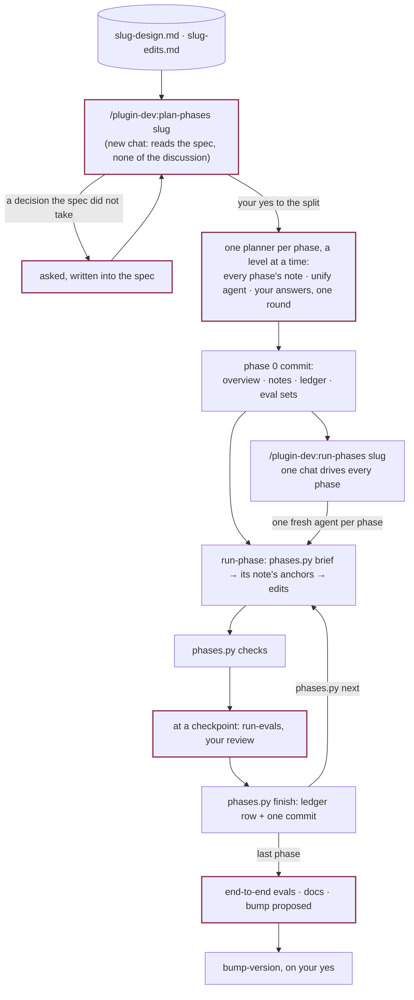

# Planning and running the phases

Both routes end in a spec committed on a branch: a design from
[an idea](design-a-workflow.md), an edit list from [facts](revise-from-facts.md), or both.
From there the path is one. `plan-phases` splits the spec into phases by dependency and by
file, writes every phase's note with one planner per phase, a level at a time, and `run-phase`
builds them one at a time from those notes. Every chat starts from files, never from the chat
before it, so no chat has to hold the whole change, and no phase plans itself.

## `plan-phases`: the split

A new chat, on purpose. It reads the spec and nothing behind it, so anything the spec failed
to decide surfaces as a question, and the answer is written into the spec.

| Spec | It reads | A phase owns |
|---|---|---|
| a design | the design, the headings of files other files parse, each component's `plugin-anatomy` reference | components and build-order lines |
| an edit list | `edits.py index`: one line per item; `edits.py split`: the proposed phases | items, by id; `edits.py coverage` refuses a plan that drops one, lands one twice, lands it before what it depends on, or gives one file region to two phases of a level |
| both | the list as above, and the design for its **Needs a design** items | items and the design's components |

The split is shown as a table, with its cost in tokens, for your yes. It obeys four rules:
every phase is mergeable on its own, every phase is one agent's work and the split is by
file, foundations come first, and every phase has an eval. `edits.py split` proposes it from
the items: their `depends:` make the levels, the items of a level that cite one region of a
file go in one phase, small clusters pack up to a cap, a cluster over the cap becomes a
sequence. Two phases of one level share no file region, so their notes can be written side
by side; the shared files (`contracts.yml`, the READMEs, `hooks.json`, the ones the overview's
`**Shared files:**` line adds) make no two phases one. For a new plugin, phase 1 is the
smallest bundle that loads: one loop and the thinnest workflow that uses it.

**Evals run at checkpoints.** A phase runs its mechanical checks and nothing else. A
target's behavioral evals run once, at the first checkpoint at or after the last phase that
edits it, since a run made before a later edit tests a file nobody ships. The last phase is
always a checkpoint, and `phases.py plan-check` fails a plan with a behavioral row anywhere
else.

Phase 0 is one commit:

| File | Holds |
|---|---|
| `site/notes/<slug>/<slug>-00-overview.md` | Each phase's scope and what it must not touch, the headings one phase writes and another reads, every phase's eval rows with pass bars, the checkpoints, breaking changes |
| `site/notes/<slug>/<slug>-NN-<name>.md` | One note per phase: its decisions, its files, the exact specification anchored on quoted text (never a line number), its steps, its eval rows, done-when. One planner agent per phase, a level at a time; a planner reads the notes of the earlier phases on its files |
| `site/notes/<slug>/<slug>-progress.md` | The ledger: one row per phase, with status, commit, eval logs, and notes for the next chat |
| `evals/sets/<target>.json` | Every behavioral eval's prompt and expectations, one writer agent per target, in parallel |

After the planners, `phases.py notes-check` holds every note to the template and to the
overview's eval rows, one unify agent makes the names agree where notes meet, and every
question the planners could not answer is asked in one round and written into the spec and
the notes. The phases then run with nothing left to plan.

## `run-phase`: one phase

`/plugin-dev:run-phase <slug>` and nothing else. The chat never opens the overview or the
ledger whole. `scripts/phases.py` reads them, and its exit codes are the answers:

| Command | Does |
|---|---|
| `next` | Checks the branch and the tree, and names the next phase. Exit 1: something stops it. Exit 3: the plan is done |
| `brief` | Prints what this phase's chat reads: its row, its eval rows, its ledger row, its note's path, the other phases on its files, and, for a plan with no notes, its items with the lines they cite as they stand now. Marks the phase begun |
| `checks` | The whole mechanical gate in one call: `check-contracts`, the plan's own check commands, and `build-site` at the last phase only |
| `finish` | Checks the phase is whole (its note, its logs, every eval row run, the checks passed on this tree), fills the ledger row, and makes the commit. Refuses otherwise |
| `check N`, `status`, `notes-check` | Phase N's commit is HEAD, the tree is clean, its row is `done`; one line per phase; every note there and whole |

In order: `brief`; read the note and find every anchor it quotes in the files as they are
now (`grep -nF`); make exactly the note's edits, reading each component's `plugin-anatomy`
reference first; `checks`; at a checkpoint, each eval row through `run-evals`, which stops
for your review of the viewer and logs with `log-eval`; `finish`; stop. A plan from before
notes were written with it has none: there the chat writes the phase's note first.

- A missed pass bar is fixed and rerun once. Still missed, it becomes a **Deviation** in the
  note and a question to you, never a quiet pass.
- The ledger row carries forward what the next chat cannot get from its own note: a platform
  fact an eval settled, a heading named differently than planned, a thing noticed but out of
  scope.
- A chat that runs out of room marks its row `in progress`, lists the uncommitted paths and
  commits nothing. The next chat finishes it.

## `run-phases`: every phase from one chat

The same phases without typing one chat each. It is a driver in the shape `plugin-anatomy`
gives every workflow, and the clearest example of one in this plugin:

| Part | Here |
|---|---|
| Driver | `run-phases`, in your chat. It holds `phases.py`'s lines, each agent's return and your answers. It does no phase work and opens none of the plan's files |
| Agent | One fresh agent per phase, one at a time, following `run-phase`'s file. On Sonnet 5.5 unless `--model inherit` |
| Script and ledger | `phases.py next`, `check` and `status`, over `<slug>-progress.md`; `finish` is the ledger's one writer |
| Hooks | A `Stop` gate that holds a chat whose phase was committed without `finish`; a guard that keeps eval executors started by the runner script, not one spawn each |
| Return form | `Status: committed \| review \| question \| proposal \| blocked \| in progress`, then the phase, its commit, its ledger row, what is for you, and the next phase |

On `committed` it runs `phases.py check` and goes on. On `review`, `question` or `proposal`
it shows you what the agent found, in full, and resumes the same agent with your answer; a
subagent cannot ask you itself. On `blocked` or `in progress` it stops. `--through N` stops
after phase N. Where a session lets subagents spawn nothing (a cloud session), each phase is
a headless `claude -p` session with its own id, resumed the same way.

Typed again in a new chat, it starts from `phases.py next` and picks up where the ledger
says.

## The end

The last phase reruns every set end to end, writes the docs (`README.md`, `site/flow.md` and the `flow:` block
of `site/site.yml`, `site/workflows/`, the CHANGELOG), and with an audit ledger records a Fix attempt for every
issue an edit-list item closed. It proposes the bump in chat (a new plugin's first tag is
`0.1.0`), and `bump-version` bumps, tags and pushes on your yes. The branch merges with one
commit per phase, each with its evals beside it.

Worked examples: plugin-dev's own `0.9-evals` plan under `site/notes/` is a complete set of
phase notes and a ledger, Deviations included. `evals/fixtures/trading-agents/site/notes/`
holds a complete design, written as a test fixture.
