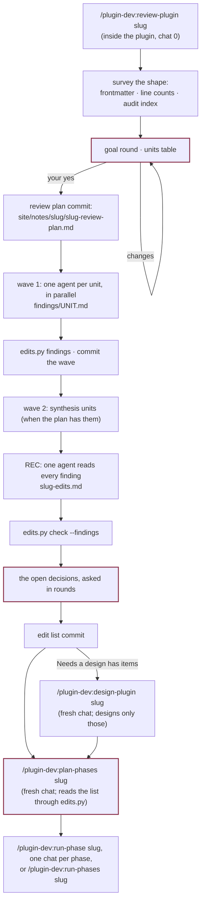

# A review sweep

A change that starts from evidence rather than an idea: audits that keep recurring, prompts
that contradict each other, rules prose does not hold, a context budget gone too far. Spread
across a plugin too big for one chat to read. Nothing new needs designing; what is needed is
every defect found, deduplicated and ordered, and a few decisions only you can take.

So the review is split the way the reading is: agents that each read one part of the plugin
whole and write findings, one agent that reconciles them into an edit list, and a chat that
orchestrates without reading any of it. The edit list is the spec. From `plan-phases` on, the
path is the same as [a large change](phased-change.md).

## Chat 0 — `review-plugin <slug>`

Run inside the plugin's directory. It creates the branch `<plugin>-<slug>` in a worktree,
then reads the plugin's shape and not its content: every agent's and skill's frontmatter,
line counts, `hooks.json`, `contracts.yml`, the audit index, the eval set names. One question
round settles the goal: what is wrong, which outcomes come first, what is out of scope.

From the shape it proposes the units: one per role (the agent, the skills it loads, the part
of the driver that spawns it, the hooks that act on it) or per set of scripts, each reading
about 4,000 lines whole at most, every file in someone's reads, twelve per wave at most, plus
synthesis units where a concern runs across roles. You approve the table, and it commits the
review plan, which carries the brief, the checks and the finding format every unit gets.

Then the waves. Each unit is a fresh agent that reads the plan's charge and its own row,
reads its files whole, and writes one findings file. `scripts/edits.py findings` checks every
file's shape, and a unit that fails is sent its failures once. REC, the last unit, reads
every finding and writes the edit list: items numbered so dependencies come first, each with
its files and lines, mechanism, edit, dependencies, the audit issues it closes, the evals to
rerun and, for a script, its fixture. `edits.py check --findings` refuses a list that drops a
finding without saying why.

Last, the decisions REC left open: the chat reads only the **Decisions taken** table and asks
them in rounds, recommended option first. An answer that adds a new workflow, agent loop or
shared file moves its items to **Needs a design**. Then one commit, and the next command.

The orchestrating chat never opens an agent file, a findings file, or the edit list whole.
What it knows of them is the units' returns and `edits.py`'s output, which is why it stays
small however big the plugin is.

## Chat 1 — `plan-phases <slug>`

The same skill as for a design, reading the edit list the way a large plan should be read:
`edits.py index` gives every item on one line, and the planner opens an item only when its
line cannot place it. It asks about any gap, shows the split with each phase's items, and
writes the overview, the eval sets and the ledger. `edits.py coverage` refuses an overview
that leaves an item out, lands one twice, or puts an item in a phase that does not depend on
the phase that lands what the item needs.

## Chats 2…N — `run-phase <slug>`

Each phase chat prints only its own items with `edits.py show --phase N`, finds each cited
line where it is now (earlier phases moved them), writes the phase's note, and does it. When
the plugin has an audit ledger, the last phase records a Fix attempt for every issue an item
closed, each naming the commit of the phase that landed it.

## Small fixes do not need this

A handful of issues an audit already filed go through `/plugin-dev:fix-issues` in one chat.
This path is for when finding the defects is itself too big for one chat.
