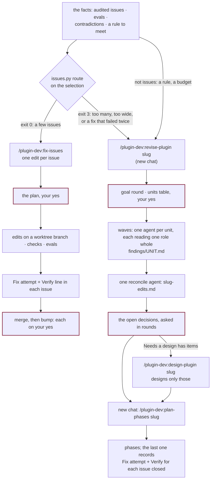

# Changing a plugin from facts

For a change that starts from something known about the plugin as it is: issues an audit
filed, eval results, prompts that contradict each other, a context budget gone too far, or a
rule every agent and skill must now meet. No workflow is being invented. The work is finding
every place the facts apply and landing the edits, agent by agent and skill by skill,
whatever workflow each belongs to.

It comes in two sizes, and a script says which. A few issues are planned and fixed in one
chat by `fix-issues`. Anything larger is read by a wave of agents and written up as an edit
list by `revise-plugin`, which [plan-phases and run-phase](plan-and-run-phases.md) land in
phases. A change that adds or redraws a workflow is [a design](design-a-workflow.md).

## Which size

`python3 scripts/issues.py route <selection>` prints one line and exits 0 or 3. `fix-issues`
runs it on its own selection, and `audit-run` runs it on what it just filed.

| The selection has | Goes to |
|---|---|
| up to six issues, in up to three roles (or up to three issues, in any number of roles) | `fix-issues` |
| more than six issues | `revise-plugin` |
| more than three issues that between them name more than three roles | `revise-plugin` |
| an issue that recurred after two fixes | `revise-plugin`: prose did not hold twice, so it needs a mechanism |

A role is an agent or a driver an issue's `applies_to` names. `fix-issues` given a selection
the script sends away prints the line and the command and stops, planning nothing. Name a
few ids to fix those in it, or add `--here` to fix them all in it anyway. Facts that are not
issues (a rule to meet, a budget) go straight to `revise-plugin`.

## Small: `fix-issues`

From any chat on the plugin: `/plugin-dev:fix-issues DT-004 DT-011`, `run:<id8>` for one
audit's issues, `open` (the default) or `recurred`.

1. **The plan, and your yes.** For each issue it reads the issue file, the run report's
   finding, and the rule in the working tree by its quoted text, since line numbers drift.
   It proposes one edit per issue (the file, the sentence that changes, how it reads after)
   or `wontfix` with the reason. A recurred issue's plan says why the last attempt did not
   hold. One question; nothing is edited before the yes.
2. **The worktree.** Branch `<plugin>-audit-fixes-<date>`, never the checkout the chat
   started in.
3. **The checks.** The plugin's own rules, `check-contracts`, `build-site`, and `run-evals`
   against the last tag for every set covering a file it touched.
4. **The Fix attempt.** One commit for the edits, then one that records in each issue the
   branch, commit, files, eval logs and a `Verify:` line.
5. **Merge, then bump**, each on its own yes. `bump-version` stamps `fixed_in`.

## Large: `revise-plugin`

Inside the plugin, in a new chat: `/plugin-dev:revise-plugin <slug> issues run:<id8>`, or
`<slug>` and the change in words. The chat orchestrates and reads no plugin file's body, so
it stays small however large the plugin is.

1. **Survey the shape**: every agent's and skill's frontmatter, line counts, `hooks.json`,
   `contracts.yml`, the audit index, the eval sets' names. Which role loads what.
2. **The goal**, one round: the facts the change starts from, which outcomes come first,
   what is out of scope. A goal that needs a workflow drawn from scratch is sent to
   `design-plugin` here, before any agent runs.
3. **The units**, shown as a table for your yes. A unit is one role's world (its agent, the
   skills it loads, the part of the driver that spawns it, the hooks that act on it) or one
   set of scripts: about 4,000 lines read whole at most, every file in someone's reads,
   twelve to a wave. Synthesis units follow where a concern runs across roles.
4. **The waves.** Each unit is a fresh agent that reads its files whole and writes one
   findings file. `edits.py findings` checks every file's shape; one wave, one commit.
5. **Reconcile.** One agent reads every finding and writes the edit list. `edits.py check
   --findings` refuses a list that drops a finding without saying why. With an audit
   ledger, every open, recurred and wontfix issue must also appear in the list's **Issues**
   section, with its item or why it is not addressed.
6. **The decisions** the findings could not settle, asked in rounds, the answer written into
   the list. Then one commit and the next command.

## The edit list

`site/notes/<slug>/<slug>-edits.md` is the spec, the way a design is for a change from an
idea. Every skill after this reads it through `scripts/edits.py`, never whole.

| Field of an item | Holds |
|---|---|
| `findings`, `files` | The finding ids behind it, and each `path:line` as reviewed; `edits.py show --located` carries the lines to the tree as it stands |
| `mechanism` | `prose`, `hook`, `script`, `contracts.yml` or `eval`: where the rule will live |
| `edit` | The one edit, as a fresh chat would make it |
| `depends`, `decide` | The items that must land first; the decision it waits on |
| `closes` | The audit issues it fixes |
| `evals`, `fixture` | The set and ids to rerun or write; for a script, input and expected output |

An item whose fix adds a new workflow, a new agent with its own loop, or a new file two
workflows meet at moves to **Needs a design**, and `design-plugin <slug>` designs just those
on the same branch. A hook, a script flag or a record file inside a loop that already exists
stays an edit. The section is usually empty.

## How a fix is proven

Both sizes end the same way. Each issue fixed gets a Fix attempt whose `Verify:` line names
what a rerun's trace will show: `watch agent:profiler; held when <a step shows this>;
recurred when <a step shows that>`. Neither skill marks an issue as working. An issue is
`fixed`, then `released` once a bump stamps it, and only
[an audit of a rerun](audit-a-run.md) can say it held.

## What is written where

| Thing | Path | By |
|---|---|---|
| Issues and their index | `runs/audits/issues/<ID>.md`, `runs/audits/INDEX.md` | `issues.py` only |
| The review plan, the findings | `site/notes/<slug>/<slug>-review-plan.md`, `findings/<UNIT>.md` | `revise-plugin`, its unit agents |
| The edit list | `site/notes/<slug>/<slug>-edits.md` | the reconcile agent; decisions by `revise-plugin` |
| The fixes | a worktree branch: `<plugin>-audit-fixes-<date>` or `<plugin>-<slug>` | `fix-issues`, or `run-phase` per phase |
